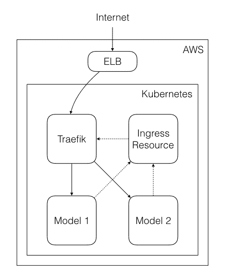
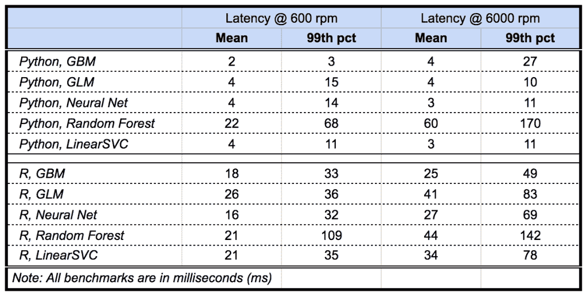

# 由 Kubernetes 支持的模型部署

> 原文：<https://www.dominodatalab.com/blog/model-deployment-kubernetes>

在本文中，我们将解释如何使用 Kubernetes 来支持数据科学家将预测模型部署为生产级 API。

## 背景

Domino 允许用户将 R 或 Python 模型作为 REST APIs 发布，因此他们可以轻松地将数据科学项目集成到现有的应用程序和业务流程中，而无需工程师或 devops 资源的参与。我们称这种 [**模式部署**](/blog/machine-learning-model-deployment) 。

我们从 2015 年就有这个功能了。第一个版本是一个更简单的特性，为 Domino 中托管的 R 和 Python 模型创建 API 端点，允许 web 服务使用它们。

这是一个在我们的许多小用户和初创用户中很受欢迎的功能，比如 8tracks，他们使用它将他们的预测模型与面向用户的应用程序集成在一起，而不需要从 R 或 Python 移植这些模型。

然而，这个版本重用了我们为在 Domino 中运行模型*而构建的基础设施的大部分。虽然一次运行可能持续几个小时，但一个 API 端点可能会启动并运行数周，如果不是*月*。此外，该基础设施并不支持[水平可伸缩性](https://www.dominodatalab.com/blog/horizontal-scaling-parallel-experimentation)，这使得确保每个 API 端点在负载下保持响应变得非常困难。*

随着越来越多的企业用户开始使用 Domino，对更健壮的模型部署功能的需求迅速增长。这时，我们抓住机会，用 Kubernetes 彻底重建了它。

## 使用 Kubernetes 重建模型部署

作为 Domino 2.0 发布的一部分，我们着手完全重新设计 API 端点功能，以更低的延迟支持大规模用例，同时还添加了更高级的功能，如 A/B 测试模型变体。

Kubernetes 是一个用于自动化部署、扩展和管理容器化应用的开源系统，这是一个自然的选择，因为它允许我们在共享基础设施上独立启动我们的每个模型，并根据需要单独扩展它们。

## 体系结构

模型由取自 Domino 项目的所有代码和数据组成，并结合了一个公开调用用户代码的 web 服务的工具。每个模型都被构建到 Docker 映像中，这确保了模型被打包在一起并被版本化。

一旦构建了模型版本，就可以使用 Kubernetes 部署和服务将其部署到 Kubernetes 上。该部署使我们能够确保负责运行模型的每个 Kubernetes 单元保持健康，旋转新单元以替换不健康的单元，并使我们能够轻松地扩展和缩减。服务是公开模型的东西。

使用**入口资源**将模型暴露在 **Kubernetes** 之外。这允许我们使用不同的路径访问同一个模型的不同版本。

然而，入口资源本身仅仅充当路由表。为了确保这些服务被公开，我们使用 **Traefik** 作为入口控制器。Traefik 是一个类似于 nginx 的反向代理，但是为 Kubernetes 提供第一方支持。这确保了对我们的入口资源的任何更新迅速得到反映。

最后，创建一个**弹性贷款平衡器** (ELB)来确保模型可以从内部网络外部访问。

这种架构的早期版本没有使用 Kubernetes 或 Traefik 内部的入口。相反，我们使用 Nginx 作为服务，通过配置映射提供动态加载的配置文件。这作为概念验证效果很好，但是有两个主要问题:

1.  我们所有的路由都依赖于一个单一的配置文件。
2.  配置更新和 Nginx 刷新之间的延迟非常慢，这让人感觉系统中什么都没发生。

入口资源允许我们让每个模型拥有自己的路由，而 Traefik 使用 Kubernetes 观察器(通知您集群发生的不同变化)能够在 Kubernetes 集群上发生相关事件时进行自我刷新。

我们遇到的另一个挑战是找到一种方法来保持 Kubernetes 和我们的数据库之间的模型信息同步和重复数据删除。

最初，我们将关于部署的元数据存储在数据库中。我们自己使用 Kubernetes Watchers 来保持这些信息是最新的，但是保持这些信息同步的逻辑是复杂的。

我们开始更自由地使用 Kubernetes 注释和标签，将大部分元数据转移到 Kubernetes 本身，这允许我们最终确保关于特定模型部署的所有信息都保存在一个地方。

为了避免过于频繁地调用 Kubernetes 来检索这些元数据，我们将这些数据保存在缓存中，并通过 Kubernetes watcher 进程进行更新。这个过程在 Kubernetes 上运行，以确保在 Domino 应用程序维护期间不会丢失来自 Kubernetes 的消息。

为了让用户了解模型的当前状态，我们构建了一个系统来异步监控我们的部署状态。这是由一组 Kubernetes 观察器提供的，它为我们提供了 Kubernetes 部署的状态转换的原始事件流。

最后，为了使这个流更持久(错过的消息将永远丢失)，我们使用 RabbitMQ 将其重定向到消息总线。我们还在内部使用 RabbitMQ 来支持我们的系统，在我们的模型部署特性中管理各种长时间运行的用户操作。

## 结果

与最初的 API 端点相比，新的模型部署架构允许我们以更快的速度执行模型，这使得它非常适合生产使用。我们用 R 和 Python 对流行的[机器学习模型](https://www.dominodatalab.com/blog/a-guide-to-machine-learning-models)进行了基准测试，发现<每分钟处理 6000 个请求的延迟为 50ms。

*(请注意，性能基于内部测试，并不代表性能保证。模型延迟取决于许多因素，如外部服务依赖性、网络拓扑和硬件配置。)*

使用 Kubernetes 还允许我们为部署的模型提供 A/B 测试和版本控制功能。例如，数据科学家可以控制在生产中使用哪个模型版本，这意味着他们可以测试同一模型的不同版本，并且只在某个版本准备就绪时才将其提升到生产中。

最后但同样重要的是，这种架构的另一个好处是增加了可靠性；因为这个特性与运行执行是分离的，所以部署的模型对 Domino 平台本身发生的问题更有弹性。

