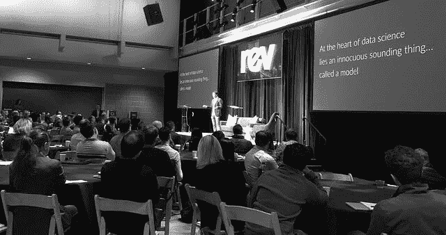
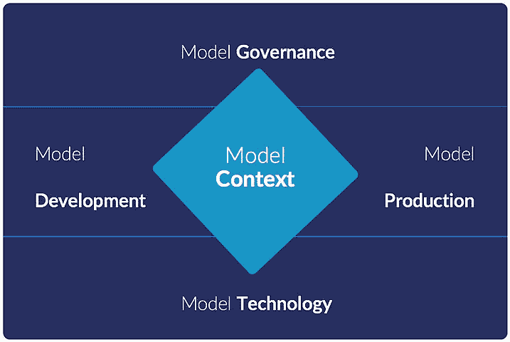

# 模型管理和模型驱动的商业时代

> 原文：<https://www.dominodatalab.com/blog/model-management-era-model-driven-business>

*在过去的几年里，我们看到了一个新的数据科学领导者群体的出现。*

无论属于哪个行业，我们都听到三个主题反复出现:1)公司正在认识到数据科学是一项竞争优势。2)人们担心他们的公司落后了，而其他公司在数据科学方面做得更好。3)数据科学家和数据科学领导者正在努力向高管解释为什么数据科学不同于其他类型的工作，以及这些差异对如何配备和组织数据科学团队的影响。

*我们最近在 [Rev](https://rev.dominodatalab.com/?utm_source=blog&utm_medium=post&utm_campaign=) 聚集了这个数据科学领袖社区。在那里，我们分享了我们对“模型管理”的愿景，这是一套允许公司从大规模数据科学中获得竞争优势的流程和技术。这篇文章是那次演讲的摘要，你可以在这里观看[。](https://dominodatalab.wistia.com/medias/fq0l4152sh)*

## 介绍

自从我们五年前创立 Domino 以来，我们已经与数百家投资数据科学的公司进行了交谈，了解了他们的成功和挑战。

在那段时间的不同点上，我们关注了数据科学家和数据科学团队面临的挑战的不同方面。

*   当我们在 2014 年首次推出 Domino 时，我们专注于自动化数据科学家必须做的许多“开发运营”工作，以加快他们的工作。
*   2015 年，我们拓宽了口径，以满足数据科学家跟踪和组织其研究的需求。
*   2016 年，我们增加了部署模型的功能，创建了一个统一的平台来支持从开发到部署的[数据科学生命周期](/blog/how-enterprise-mlops-works-throughout-the-data-science-lifecycle)。
*   2017 年，我们强调协作、可再现性和可重用性是数据科学团队有效扩展的基础。

在这个过程中的每一点上，我们都觉得有更重要的事情想要说，但我们不知道如何说。就像盲人描述大象不同部分的寓言一样，我们知道我们描述的是一部分，而不是全部。

所以大约一年前，我们后退了一步。我们与客户进行了长时间的讨论，以提炼和综合数据科学的不同之处，以及最有效应用数据科学的公司的不同之处。

## 数据科学家做什么？

当我们问自己:“数据科学家做什么？”时，我们有了重大的发现

除了对人工智能和机器学习的大肆宣传，数据科学的核心是一种叫做 ***模型*** 的东西。所谓“模型”，我指的是一种基于概率评估做出预测或建议或规定一些行动的算法。

模型可以自主地做出决定并采取行动，其速度和复杂程度是人类通常无法比拟的。这使得模型成为一种新型的数字生活。

*数据科学家做模型。*

如果你看看世界上最成功的公司，你会发现他们的商业核心模式推动了成功。

大家都熟悉的一个例子是网飞推荐模型。它提高了网飞的用户参与度、保留率和运营效率。2016 年，网飞表示他们的推荐模式是[每年价值超过$1B。](http://www.businessinsider.com/netflix-recommendation-engine-worth-1-billion-per-year-2016-6)

可口可乐使用一个模型来优化橙汁生产。Stitch Fix [利用模特](https://multithreaded.stitchfix.com/blog/)向顾客推荐服装。保险公司开始使用模型从事故照片中自动估算损失，减少对理赔人员的依赖。

## 模特神话

虽然从某种意义上来说是显而易见的，但认识到数据科学家制造模型是强大的，因为它解释了公司在有效利用数据科学方面面临的大多数挑战。

从根本上说，公司在数据科学上苦苦挣扎的原因都源于对模型与他们过去建立的其他类型资产有何不同的误解。

许多公司试图像开发和部署软件一样开发和部署模型。许多公司试图用技术装备数据科学家，就像他们装备业务分析师进行查询和构建商业智能仪表板一样。

很容易理解为什么公司会陷入这个陷阱:模型涉及代码和数据，因此很容易将它们误认为软件或数据资产。

我们称之为 ***模型神话*** :这是一种误解，因为模型涉及代码和数据，公司可以像传统上对待软件或数据资产一样对待它们。

模型在三个方面有着根本的不同:

1.  **用来开发它们的材料**不一样。它们涉及代码，但是它们使用了不同于软件工程的技术和工具。它们使用更多计算密集型算法，因此受益于可扩展计算和 GPU 等专用硬件。他们使用的数据远远多于软件项目。他们利用每天都在创新的充满活力的开源生态系统的软件包。因此，数据科学家需要极其敏捷的技术基础设施来加速研究。
2.  构建它们的过程是不同的。数据科学是研究，它是实验性的、反复的和探索性的。在得到有用的东西之前，你可能会尝试几十或几百个想法。因此，数据科学家需要允许快速探索和迭代的工具，以使他们富有成效并促进突破。
3.  模特们的**行为**是不同的。模型是概率性的。他们没有“正确”的答案——一旦他们生活在现实世界中，他们只有更好或更差的答案。虽然没有人需要“重新培训”软件，但模型可以随着周围世界的变化而变化。因此，组织需要不同的方法来审查、质量控制和监控它们。

## 模型管理

最有效地利用数据科学的公司——那些通过数据科学持续推动竞争优势的公司——是那些认识到模型不同并以不同方式对待它们的公司。

我们研究了这些公司对待模型的不同方式，并将其组织成一个框架，我们称之为 ***模型管理*** 。

从历史上看，“模型管理”狭义地指的是一旦模型在生产中运行，就对其进行监控的实践。我们指的是更广泛的东西。

Model Management 包含一组流程和技术，这些流程和技术使公司能够一致而安全地从大规模数据科学中获得竞争优势。

模型管理有五个部分:

1.  **模型开发**允许数据科学家快速开发模型、进行实验并推动突破性研究。
2.  **模型生产**是数据科学家的工作得以运作的方式。它如何从一个很酷的项目变成一个集成到业务流程中的活产品，从而影响真正的决策。
3.  **模型技术**包括计算基础设施和软件工具，为数据科学家提供开发和部署创新模型所需的灵活性。
4.  [**模型治理**](/blog/the-role-of-model-governance-in-machine-learning-and-artificial-intelligence) 是指公司如何掌握数据科学工作在其整个组织中的活动和影响，以了解项目、生产模型以及支持它们的底层基础架构的进展情况。
5.  **模型环境**是这些功能的核心。它是在构建或使用模型时产生的所有知识、见解和所有工件。这通常是公司最有价值的知识产权，找到、重用和构建知识产权的能力对于推动快速创新至关重要。

管理模型的每个方面都需要独特的流程和产品。当整合在一起时，它们为组织释放了数据科学的全部潜力。

## 计算机革命区分了赢家和输家

数据科学是计算的新时代。第一个时代是硬件，工程师做芯片和电路板。第二个时代是软件时代，工程师做应用。第三个时代，数据科学家做模型。

和过去的计算革命一样，数据科学时代有两件事是真实的:

1.  公司采用和有效应用新方法的能力将决定它们在未来几年的竞争力。正如“软件吃掉了世界”和“每个公司都需要成为软件公司”，如果每个公司想要保持竞争力，它们都需要成为数据科学公司。
2.  适用于前一个时代的方法、工具和流程将不适用于这个新时代。软件工程的兴起带来了新的方法、新的职称和新的工具——对开发、交付和管理硬件有效的东西对软件无效。数据科学也是如此:适用于软件的东西不适用于模型。

模型管理是公司将模型置于其业务核心所需的一系列过程和技术。这是必需的，因为模型不同于软件，所以它们需要新的方法来开发、交付和管理它们。通过采用模型管理，组织可以释放数据科学的全部潜力，成为模型驱动的企业。

要了解更多，请阅读我们的[模型管理指南](https://www.dominodatalab.com/resources/field-guide/machine-learning-model-management)或观看[主题演讲](https://dominodatalab.wistia.com/medias/fq0l4152sh)。