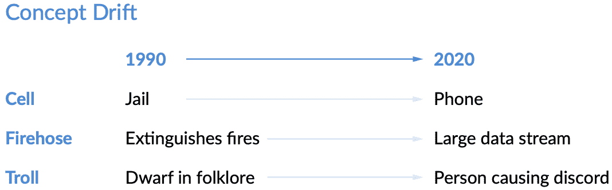
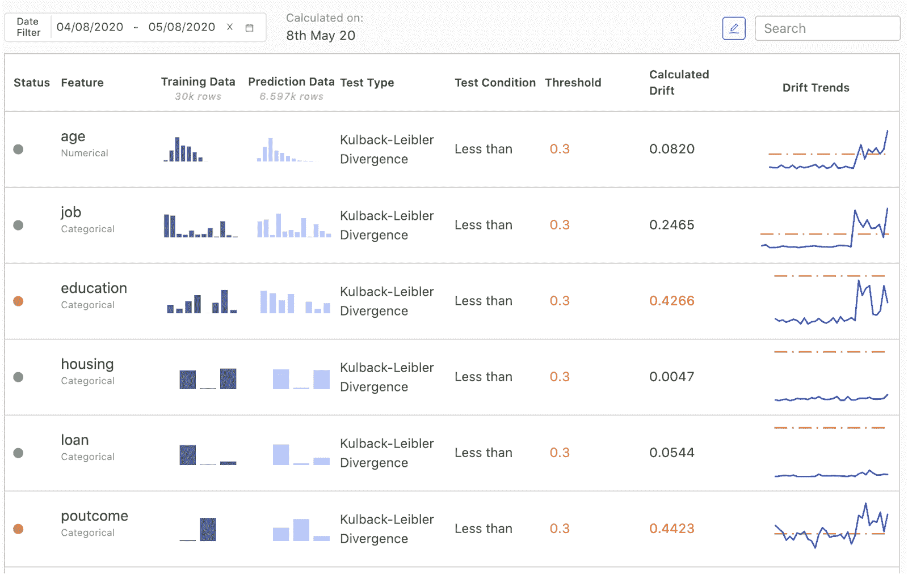

# 模型监控最佳实践

> 原文：<https://www.dominodatalab.com/blog/model-monitoring-best-practices-maintaining-data-science-at-scale>

## 通过模型监控大规模维护数据科学

*本文涵盖了模型漂移，如何识别退化的模型，以及在生产中监控模型的最佳实践。关于本文之外的其他见解和最佳实践，包括纠正模型漂移的步骤，请参见[模型监控最佳实践:大规模维护数据科学](https://www.dominodatalab.com/resources/model-monitoring-best-practices/)。”*

越来越多的决策和关键业务流程依赖于通过机器学习和其他统计技术生成的模型。(例如，索赔处理、欺诈检测和贷款审批)。这些模型本质上是概率性的，每个模型的行为都是从数据中学习的。

一旦进入生产环境，如果生产数据与用于定型模型的数据不一致，模型的行为可能会发生变化。换句话说，模型的行为是由它“训练”的世界图景决定的，但现实世界的数据可能会与它“学习”的图景有所不同这类似于你如何训练一只老鼠完美地通过一个迷宫；当老鼠被放入一个它以前没有见过的新迷宫中时，它的表现不会那么好。

模型通常依赖于跨越多个团队的数据管道和上游系统，这带来了额外的风险。这些上游系统中的变化或错误会改变流入模型的数据的性质，通常是以无声但重要的方式。

模型性能下降的现象称为“漂移”不管是什么原因，漂移的影响都可能是严重的，导致财务损失、客户体验下降，甚至更糟。

### 模型会随着时间而退化

模型会因为各种原因而退化:产品或政策的变化会影响客户的行为；敌对行动者可以调整他们的行为；数据管道可能会断裂；有时候世界只是在进化。最常见的原因属于数据漂移和概念漂移这两类。

**数据漂移:**当生产数据偏离模型的原始训练数据时，就会发生数据漂移。数据漂移可能因各种原因而发生，包括不断变化的业务环境、不断变化的用户行为和兴趣、对来自第三方来源的数据的修改、数据质量问题，甚至上游数据处理管道中的问题。例如，如果工业传感器的读数由于机械磨损而开始随时间变化，这将导致数据漂移。

**概念漂移:**即使输入数据的分布没有改变，当构成正确预测的预期随时间改变时，也会发生概念漂移。例如，去年(创建训练数据集时)被认为是有吸引力的潜在客户的贷款申请人可能不再被认为有吸引力，因为银行的战略或对未来宏观经济条件的展望发生了变化。同样，在 COVID 疫情期间，人们对产品类别的兴趣发生了变化，导致库存失败，因为许多零售预测模型继续根据 COVID 之前消费者兴趣的训练数据进行预测。

作为概念漂移的说明性示例，考虑三十年前创建的情感模型如何错误地对各种单词和短语的情感进行分类，因为我们说话的方式、我们使用的单词和我们开发的俚语随着时间不断变化:

为了使模型在这种情况下工作，有必要根据对其结果的预期来监控模型的性能，因为它们是通过最近的地面真实数据捕获的，而不是根据模型的旧训练数据集的过去预期。

### 识别模型退化的方法

鉴于模型降级的潜在重大负面影响(例如，考虑银行可能因降级的贷款违约模型而亏损的速度)，尽快检测模型漂移至关重要。这里有一些在过时的模型对您的业务造成严重影响之前检测模型退化的建议。

**检查模型预测:**检测模型退化的一种常见方法包括检查模型预测是否不再有效或准确。例如，一家大型保险公司发现，它发现的欺诈性索赔比过去少得多。一旦实际结果(即地面真实数据)可用，异常结果导致公司更仔细地审查准确性。

在输出端，许多模型产生某种分数或一组分数，它们通常代表一个概率估计。如果模型产生的分数分布发生意外变化，这意味着模型退化。这可能是由反映外部世界的一些变化的模型输入的变化，或者模型所依赖的系统的变化(例如，用于特征提取)引起的。在这两种情况下，观察分数分布的变化是识别问题的第一步。

在评估一个模型时，评估是否可以使用基础数据也很重要。尽管实时的基本事实反馈可能很好，但一些用例需要数月或数年的滞后时间来了解预测的基本事实，如果它们确实可用的话。例如，你可能不知道被预测会拖欠 30 年期抵押贷款的客户实际上是否会拖欠很多年。但是，如果使用地面真实数据不可行，您可以使用分布分析和上面概述的其他技术。

**检查(输入)数据漂移:**检测模型退化的最有效方法之一是监控呈现给模型的输入数据，以查看它们是否已经改变；这解决了数据漂移和数据流水线问题。有几种检查输入数据的有效方法，包括:

*   查看描述性统计数据、数据类型(例如，字符串、整数等。)、数据范围和数据稀疏性/缺失数据，然后将它们与原始训练数据进行比较。输入数据分布的剧烈变化可能会突出严重的模型退化。
*   定义度量来跟踪用于训练模型的数据与呈现给模型进行评分的数据之间的差异。如果差异超过阈值或显著漂移，这是模型漂移和退化的强烈指示。

请注意，有些特征比其他特征更重要(更具预测性)。发生少量漂移的重要特征可能是重新训练的原因，而预测能力低/无预测能力的特征可能会发生很大漂移，对整个模型的影响可以忽略不计。设置监控时，确定模型的最重要特征非常重要，因此您可以密切跟踪它们。

**检查概念漂移:**与数据漂移分布分析类似，您可以使用相同的方法分析概念漂移。通常，您会实时比较训练集的标签分布与生产数据的标签分布。您还可以检查 **a)** 输入值是否在允许的集合或范围内，以及 **b)** 集合内每个值的频率是否与您过去看到的一致。例如，对于“婚姻状况”的模型输入，您将检查输入是否在期望值范围内，如“单身”、“已婚”、“离婚”等。

### 监控模型的组织最佳实践

模型监控的方法在不同的公司之间差异很大——甚至在一个公司的数据科学部门内部也是如此！通常，数据科学领导者承担监控[模型漂移](/data-science-dictionary/model-drift)和模型健康状况的责任，因为他们的团队最终要对模型做出的预测的质量负责。然后，数据科学家花费大量时间分析生产中的模型，而不是进行新的研究。一些数据科学家为了减少手动工作，然后为每个模型开发特定的监控解决方案，导致分散、不一致、维护不佳和半生不熟的监控解决方案激增。

其他公司要求 IT 部门负责生产模型监控。这给已经不堪重负的 IT 部门增加了时间和教育负担。传统的 IT 工具和经验适用于监控基础架构、正常运行时间和延迟，并不能很好地转化为模型监控，后者更依赖于统计方法。

另一种方法要求在组织内部创建一个新的角色。ML 工程师既是数据科学家，又是软件工程师，需要精通 DevOps 和模型监控最佳实践，以减轻数据科学和 IT 团队的负担。随着生产模型数量的增长，公司需要雇佣和保留的 ML 工程师的数量也在增长。

 

### 用 Domino 进行模型监控

鉴于数据科学模型对您业务的重要性，您需要有一个生产监控系统。没有可观察性，维护端到端的模型生命周期是不可能的。你不希望被抓到不知道关键生产模型恶化超过可接受的水平。

[Domino Model Monitor (DMM)](/product/domino-model-monitor) 为所有生产模型的自动化模型监控和主动警报提供单一平台。有了这个模型运行状况控制面板，it 承担监控数据科学模型的大部分责任是合理的。DMM 可以向 IT 团队、数据科学家以及其他相关方发送警报，以便将模型退化识别集成到您的工作流程中。

DMM 检测并跟踪模型输入特征和输出预测中的数据漂移。如果您有模型的基本事实数据，DMM 可以接收这些数据，使用标准度量(如准确度、精确度等)来计算和跟踪模型的预测质量。

DMM 检查用于训练模型的预测数据与目标数据的特征是否有显著差异。DMM 还跟踪用于训练模型的数据与提供给模型进行评分的数据之间的差异。

通过设置计划检查、使用 API 接收数据以及在 DMM 中配置警报通知接收者，您可以在整个组织中以标准化的方式持续监控数百个模型。API 能够集成到现有的业务流程中，也是自动再培训的编程选项。DMM 使您的 IT 部门和数据科学家在模型监控方面更加高效和主动，而不需要过多的数据科学家时间。

### 结论

随着您的公司将更多的机器学习系统投入生产，有必要更新您的模型监控实践，以一致、高效的方式对模型健康和您的业务成功保持警惕。对 ML 车型进行监控[就像你对年度体检或定期换油的想法一样。模型监控是一项至关重要的操作任务，它允许您检查您的模型是否发挥了最佳性能。](https://blog.dominodatalab.com/a-guide-to-machine-learning-models)

除了为建立模型监控的最佳实践提供建议之外，模型监控最佳实践:大规模维护数据科学还就如何估计其影响、分析根本原因以及采取适当的纠正措施提供了建议。

[Twitter](/#twitter) [Facebook](/#facebook) [Gmail](/#google_gmail) [Share](https://www.addtoany.com/share#url=https%3A%2F%2Fwww.dominodatalab.com%2Fblog%2Fmodel-monitoring-best-practices-maintaining-data-science-at-scale%2F&title=Model%20Monitoring%20Best%20Practices)