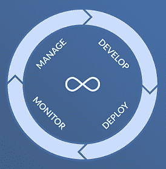

# 模型速度:加速模型驱动业务的关键

> 原文：<https://www.dominodatalab.com/blog/model-velocity>

大部分数据科学家都会告诉你，成功在于迭代开发模型，但是仅仅迭代开发是不够的。如果您的模型被部署了一次，并且再也没有接触过(或者，正如经常发生的，根本没有部署)，那么再多的迭代开发也不会驱动持续的业务成果。不仅你的模型在投入生产的那一刻就会退化，而且更多的时候，你只有在人们使用生产版本的时候才会发现你的模型真正的业务需求，也就是说，在 你的模型被部署之后的 *。当你迟早面临数据的系统性变化时——例如，由于疫情——无论开发过程中进行了多少次迭代，你都需要抛弃你的模型。*

### 模型速度对于模型值和体积是必须的

推动变革性影响的关键在于你在模型的整个生命周期中迭代的能力。你能多快、多有效地做到这一点是对你的模型速度的衡量，它如何随着时间的变化帮助你追踪你成为模型驱动的企业的进程。Model Velocity 捕捉您快速、重复且一致地遍历端到端模型开发*和*部署流程的能力——从数据工程、功能工程、算法选择、超参数调整、验证、部署到监控。它评估您实现新模型的能力，就像特性速度帮助开发团队评估他们交付新特性的能力一样。

您需要保持并加快您的模型速度，以抓住每一个利用新模型推动商业价值的机会，但同样重要的是，保持您的模型是最新的，以便它们反映当前的市场条件、客户偏好等。您需要不断调整您的模型，用额外的训练数据改进它们，并针对漂移对它们进行调整。您的模型速度跟踪您在数据科学生命周期中持续迭代的速度。综合起来，您的模型速度决定了您处理新的模型驱动项目的速度，您可以同时支持多少个项目，以及您如何有效地保持成功的结果。

### 测量您的模型和模型速度

每个数据科学团队都在努力衡量他们的效率、跟踪进展和自我基准测试。衡量模型性能(如精确度、召回率或 F1 分数)或由此产生的业务成果虽然极其重要，但只能提供对您能力的有限洞察。模型性能的下降很容易掩盖强大的功能，因为如果团队没有部署更新的模型，下降会更大。

测量完成的项目或部署的模型的数量也同样有问题。人们通常认为越多越好，但是如果你不维护这些模型，那么更多的模型就意味着更多的风险，这也可能表明你的团队过于分散，无法支持当前的投资组合，更不用说采取新的举措了。

度量模型速度为您提供了数据科学能力、成熟度和性能的更完整视图，因为它度量了进入这些模型的活动的成功。因此，它受外部因素(例如业务条件或 It 系统的变化)的影响更小，并且为您提供了一个更好的视图，不仅是您已部署项目的健康状况，而且是您需要为未来计划的容量、能力、时间和摩擦的前瞻性视图。

### 加速您的模型驱动型业务

今天有哪家公司不想更加模型驱动？挑战在于超越特定的项目和孤立的成功，扩展到可靠的、可重复的能力，以在整个组织中增长、维护和管理模型驱动的项目。前进的道路布满了减速带和坑洞，限制了你的模型速度，可能会完全阻碍你的模型驱动的野心。数据科学家往往最终无法获得足够的数据、工具过时、计算能力不足，并且将模型投入生产并长期维护的手动流程缓慢。加快您的模型速度需要企业级机器，以支持端到端生命周期的最新工具和基础架构来推动协作和自动化。

模型速度为我们提供了一种全面衡量模型生命周期的新方法——捕捉决定成功的人员(角色和技能)、流程(协作)和技术(集成平台)因素。模型速度是一个新概念——您需要根据您的需求调整确切的公式，它不能取代我们今天使用的大多数指标，但有了它，我们现在有了一个用于模型驱动的旅程的加速度计。

