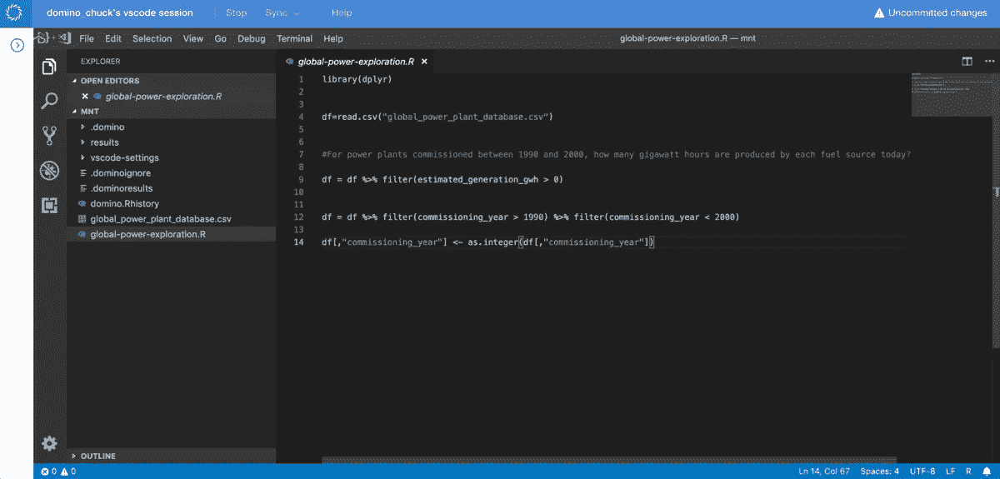

# Domino 开放数据科学平台的更大灵活性:现在支持 Visual Studio 代码

> 原文：<https://www.dominodatalab.com/blog/more-flexibility-with-dominos-open-data-science-platform-visual-studio-code-now-supported>

By Chuck Head, Director, Customer Onboarding, Domino on October 14, 2019 in [Product Updates](/blog/product-updates/)

支撑 Domino 的核心原则之一是对开放性和灵活性的坚定承诺。我们的数据科学平台旨在为数据科学家提供协作和迭代工作的灵活性，而无需担心如何访问他们构建最佳模型所需的工具或基础架构。这种灵活性一直是 Domino 用户采用率增长和我们产品路线图发展的驱动力。

考虑到这一点，并根据客户的反馈，我们很高兴地分享 Domino 平台最近的一项增强，它为数据科学家提供了更多的灵活性: **VS 代码现在作为标准环境中的一种新的工作空间类型受到支持。**

对于寻求真正的 Python IDE 来支持 Jupyter 笔记本中没有的工作流(如调试 Python 代码)的客户来说，VS 代码是一个很好的选择。(有趣的事实:“‘标准环境’和‘vs code’”是 6 月份 Domino 客户支持站点中的前 10 大搜索查询。)

## 欲了解更多信息

*   这里有一个循序渐进的指南告诉你如何今天就去看看。
*   如果您是 Domino 的新手，您可以[免费尝试一下数据科学平台](/trial/)。
*   你还想在多米诺里看到什么？在[product@dominodatalab.com](mailto:product@dominodatalab.com)ping 我们。

[Twitter](/#twitter) [Facebook](/#facebook) [Gmail](/#google_gmail) [Share](https://www.addtoany.com/share#url=https%3A%2F%2Fwww.dominodatalab.com%2Fblog%2Fmore-flexibility-with-dominos-open-data-science-platform-visual-studio-code-now-supported%2F&title=More%20Flexibility%20with%20Domino%27s%20Open%20Data%20Science%20Platform%3A%20Visual%20Studio%20Code%20Now%20Supported)