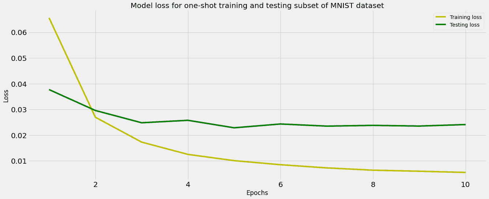

# 用 Python 进行 n 次射击和零次射击学习

> 原文：<https://www.dominodatalab.com/blog/n-shot-and-zero-shot-learning-with-python>

## 介绍

在之前的一篇帖子中，我们谈到了深度学习神经网络的进步如何使学习性能得到了显著改善，从而导致它们在计算机视觉等一些领域占据主导地位。我们还指出了一些阻碍复杂机器学习模型更广泛采用的障碍。在许多情况下，训练模型需要大型的带注释的数据集，这在某些领域(例如医学领域)中可能并不总是可用的。此外，在多类别分类中，类别不平衡带来了额外的挑战。此外，由于输入要素和要素分布的差异，在一个数据集上训练的模型在另一个数据集上可能表现不佳。最重要的是，最先进模型的[增长的计算需求](https://medium.com/towards-data-science/increasing-model-velocity-for-complex-models-by-leveraging-hybrid-pipelines-parallelization-and-3a0ca5e05049)经常阻止我们从头开始训练复杂的模型。为了避免这些问题，并利用神经网络的能力，一种简单的方法是利用日益流行的传递函数方法。该函数允许使用来自预训练模型的权重来构建新模型，该预训练模型已经在一个任务(例如，分类)和一个数据集(例如，作为最大的开源数据集之一的 ImageNet)上被训练过，并且允许在类似的任务和不可见的数据集上使用新模型。

迁移学习背后的直觉是，如果两个问题中的数据集包含相似的数据点，它们的特征表示也是相似的，因此从一个训练中获得的权重可以用于解决后续的相似问题，而不是使用随机权重和从头开始的模型训练。预训练模型可以更快地适应第二个任务，因为它们已经包含来自第一个任务的训练权重。我们已经[向](https://www.dominodatalab.com/blog/transfer-learning-in-python)展示了使用预先训练好的模型(通过[拥抱脸](https://huggingface.co/))来解决 NLP 问题。现在，让我们看看如何在缺乏例子或根本没有标记数据的情况下应用迁移学习。

## 什么是 N-shot 学习？

大型数据集的可用性，包括超过 1000 个类的 ImageNet，对 GPU 和云计算的访问，以及深度学习的进步，允许开发高度精确的模型来解决许多领域的问题。如前所述，这些模型可以通过迁移学习重复使用，以解决类似数据的问题。

迁移学习的主要要求是可获得大规模数据用于培训。这并不总是可能的，一些现实世界的问题受到数据稀缺的困扰。例如，大约有 369，000 种维管植物是已知的开花植物。其中之一是尸体百合，它是已知最大的花。这是一种罕见的植物，因此在给定的计算机视觉分类任务中，与更常见的开花植物相比，这种植物的图像要少得多。

迁移学习方法的变体旨在解决围绕数据可用性的这一关键问题，以及培训时间和高基础设施成本等其他挑战。这些变体中的一些旨在用少量的例子实现学习，试图模仿人类的过程。N-shot 学习(NSL)旨在使用训练集\(D_{train}\)建立模型，该训练集由输入\(x_i\)及其输出\(y _ I \)[1-3]组成。这种方法已经被用来解决各种问题，包括对象识别[1]，图像分类[4]和情感分类[5]。在分类任务中，该算法学习一个分类器\(h\)来预测相应\(x_i\)的标签\(y_i\)。通常，人们考虑的是 *N -way-K-shot* 分类，其中\(D_train\)包含来自\(N\)个类的\(I = KN\)个示例，每个类具有\(K\)个示例。*少量回归*估计一个回归函数\(h\)，仅给定从该函数中采样的几个输入-输出样本对，其中输出\(y_i\)是因变量\(y\)的观察值，而\(x_i\)是记录自变量\(x\)的观察值的输入。此外，NSL 已被用于[强化学习](https://www.dominodatalab.com/blog/introduction-to-reinforcement-learning-foundations)，只有有限的国家行动对轨迹，以确定最佳政策【6，7】。

一个镜头本质上是一个用于训练的例子，用\(N\)定义数据点的数量。NSL 主要有三种变体:*少射*、*单射*和*零射*。少量发射是最灵活的变体，具有用于训练的少量数据点，零发射是最受限制的，没有用于训练的数据点。我们将为零起点学习提供额外的背景和例子。

## 
什么是零投学习？

零触发学习是[迁移学习](https://www.dominodatalab.com/blog/guide-to-transfer-learning-for-deep-learning)的一种变体，在培训期间没有要学习的标记示例。这种方法使用附加信息来理解看不见的数据。在这种方法中，学习三个变量。它们是输入变量(x\)、输出变量(y\)和描述任务的附加随机变量(T\)。该模型因此被训练以学习\(P(y | x，T)\) [8]的条件概率分布。

在这里，我们将使用 Halder 等人(2020)提出的句子的任务感知表示(TARS)作为一种简单有效的方法，用于文本分类的少镜头甚至零镜头学习。这意味着您可以在没有很多训练示例的情况下对文本进行分类。该模型由 TARSClassifier 类[9]在 Flair 中实现。

下面我们将利用 TARS 进行零镜头分类和命名实体识别(NER)任务。在本教程中，我们将向您展示使用 TARS 的不同方式。我们将提供输入文本和标签，TARS 的 predict_zero_shot 方法将尝试将这些标签中的一个与文本进行匹配。

### 使用零触发学习进行文本分类

```py
# Loading pre-trained TARS model for English

tars: TARSClassifier = TARSClassifier.load('tars-base')

# the sentence for classification

sentence = Sentence("The 2020 United States presidential election was the 59th quadrennial presidential election, held on Tuesday, November 3, 2020")

classes = ["sports", "politics", "science", "art"]

# predict the class of the sentence

tars.predict_zero_shot(sentence, classes)

# Print sentence with predicted labels

print("\n",sentence)

```

输出打印 TARS 分类器识别的类别:

```py
Sentence: "The 2020 United States presidential election was the 59th quadrennial presidential election , held on Tuesday , November 3 , 2020" [− Tokens: 21 − Sentence-Labels: 'sports-politics-science-art': [politics (1.0)]”
```

### 使用零射击学习进行命名实体识别(NER)

```py
# 1\. Load zero-shot NER tagger

tars = TARSTagger.load('tars-ner')

# 2\. Prepare some test sentences

sentences = [

    Sentence("The Humboldt University of Berlin is situated near the Spree in Berlin, Germany"),

    Sentence("Bayern Munich played against Real Madrid"),

    Sentence("I flew with an Airbus A380 to Peru to pick up my Porsche Cayenne"),

    Sentence("Game of Thrones is my favorite series"),

]

# 3\. Define some classes of named entities such as "soccer teams", "TV shows" and "rivers"

labels = ["Soccer Team", "University", "Vehicle", "River", "City", "Country", "Person", "Movie", "TV Show"]

tars.add_and_switch_to_new_task('task 1', labels, label_type='ner')

# 4\. Predict for these classes and print results

for sentence in sentences:

    tars.predict(sentence)

    print(sentence.to_tagged_string("ner"))

```

下面打印的输出标识了与每个实体相关联的 NER，而没有对模型进行显式训练来标识它。例如，我们正在寻找实体类，如“电视节目”(权力的游戏)、“车辆”(空中客车 A380 和保时捷卡宴)、“足球队”(拜仁慕尼黑和皇家马德里)和“河流”(施普雷)

```py
The Humboldt <B-University> University <I-University> of <I-University> Berlin <E-University> is situated near the Spree <S-River> in Berlin <S-City> , Germany <S-Country>

Bayern <B-Soccer Team> Munich <E-Soccer Team> played against Real <B-Soccer Team> Madrid <E-Soccer Team>

I flew with an Airbus <B-Vehicle> A380 <E-Vehicle> to Peru <S-City> to pick up my Porsche <B-Vehicle> Cayenne <E-Vehicle>

Game <B-TV Show> of <I-TV Show> Thrones <E-TV Show> is my favorite series

```

## 什么是一次性学习？

术语“一次性”是由飞飞等人(2006)在一篇开创性的论文中创造的，该论文提出了一种用于对象分类的表征学习的贝叶斯框架的变体[1]。一次性学习允许从数据点的一个实例进行模型学习。这使得模型能够表现出与人类相似的学习行为。例如，一旦孩子观察到一个苹果的整体形状和颜色，他就能很容易地辨认出另一个苹果。在人类中，这可以通过一个或几个数据点来实现。这种能力非常有助于解决现实世界中的问题，在现实世界中，访问许多带标签的数据点并不总是可能的。

单次学习通常基于相似性、学习和数据来实现。在这个例子中，我们将使用基于相似性的连体网络(用于区分两个看不见的类)。连体神经网络是一类包含两个或更多相同子网的神经网络架构。*相同*在这里是指它们具有相同的配置，具有相同的参数和权重。两个子网络输出一个编码来计算两个输入之间的差异。same 网络的目标是使用相似性得分来分类两个输入是相同还是不同。

让我们使用 MNIST 数据集和 Keras 创建一个简单的一次性学习示例。

我们首先导入所有需要的 Python 模块，加载 MNIST 数据集，并对数据进行归一化和整形。

```py

import numpy as np

from keras.datasets import mnist

import matplotlib.pyplot as plt

from tensorflow.keras import layers, models

# import keras as ks

import tensorflow as tf

import pickle

from tensorflow.keras.layers import Activation

from tensorflow.keras.layers import Flatten

from tensorflow.keras.layers import Dense

from tensorflow.keras.layers import Reshape

from tensorflow.keras.layers import Input

from tensorflow.keras.models import Model

from tensorflow.keras.layers import Dot

from tensorflow.keras.layers import Lambda

from tensorflow.keras import backend as K

# import keras

import random

import tensorflow_addons as tfa

import matplotlib.pyplot as plt

from matplotlib.colors import ListedColormap

(X_train, Y_train), (X_test, Y_test) = mnist.load_data()

# We need to normalise the training and testing subsets

X_train = X_train.astype('float32')

X_train /= 255

X_train = X_train.reshape((len(X_train), np.prod(X_train.shape[1:])))

X_test = X_test.astype('float32')

X_test /= 255

X_test = X_test.reshape((len(X_test), np.prod(X_test.shape[1:])))

# Printing data shape

print("The shape of X_train and Y_train: {} and {} ".format(X_train.shape, Y_train.shape))

print("The shape of X_test and Y_test: {} and {} ".format(X_test.shape, Y_test.shape))

```

```py
The shape of X_train and Y_train: (60000, 784) and (60000,)

The shape of X_test and Y_test: (10000, 784) and (10000,)

```

接下来，我们需要创建图像对。由于暹罗网络有两个输入通道，我们必须将输入数据成对排列。正对将包含属于同一类的两个图像，负对将包含属于不同类的两个图像。

```py
class Pairs:

    def makePairs(self, x, y):

        num_classes = 10

        digit_indices = [np.where(y == i)[0] for i in range(num_classes)]

        pairs = list()

        labels = list()

        for idx1 in range(len(x)):

            x1 = x[idx1]

            label1 = y[idx1]

            idx2 = random.choice(digit_indices[label1])

            x2 = x[idx2]

            labels += list([1])

            pairs += [[x1, x2]]

            label2 = random.randint(0, num_classes-1)

            while label2 == label1:

                label2 = random.randint(0, num_classes-1)

            idx2 = random.choice(digit_indices[label2])

            x2 = x[idx2]

            labels += list([0])

            pairs += [[x1, x2]]

        return np.array(pairs), np.array(labels)

```

让我们组成一对。

```py
p = Pairs()

pairs_train, labels_train = p.makePairs(X_train, Y_train)

pairs_test, labels_test = p.makePairs(X_test, Y_test)

labels_train = labels_train.astype('float32')

labels_test = labels_test.astype('float32')

```

接下来，我们定义距离度量(我们使用欧几里德距离)、损失函数(对比损失)和用于计算模型准确度的函数。

```py
def euclideanDistance(v):

    x, y = v

    sum_square = K.sum(K.square(x - y), axis=1, keepdims=True)

    return K.sqrt(K.maximum(sum_square, K.epsilon()))

def eucl_dist_output_shape(shapes):

    shape1, shape2 = shapes

    return (shape1[0], 1)

def contrastive_loss(y_original, y_pred):

    sqaure_pred = K.square(y_pred)

    margin = 1

    margin_square = K.square(K.maximum(margin - y_pred, 0))

    return K.mean(y_original * sqaure_pred + (1 - y_original) * margin_square)

def compute_accuracy(y_original, y_pred):

    pred = y_pred.ravel() < 0.5 

    return np.mean(pred == y_original)

def accuracy(y_original, y_pred):

    return K.mean(K.equal(y_original, K.cast(y_pred < 0.5, y_original.dtype)))

```

我们现在可以继续构建和编译模型了。我们将使用(786)输入层，它对应于一个 28x28 像素的矩阵，然后是三个具有 ReLU 激活的全连接层，以及两个 L2 归一化层。我们将编译模型并打印其层和参数的摘要。

```py
input = Input(shape=(784,))

x = Flatten()(input)

x = Dense(64, activation='relu')(x)

x = Dense(128, activation='relu')(x)

x = Dense(256, activation='relu')(x)

x = Lambda(lambda  x: K.l2_normalize(x,axis=1))(x)

x = Lambda(lambda  x: K.l2_normalize(x,axis=1))(x)

dense = Model(input, x)

input1 = Input(shape=(784,))

input2 = Input(shape=(784,))

dense1 = dense(input1)

dense2 = dense(input2)

distance = Lambda(euclideanDistance, output_shape=eucl_dist_output_shape)([dense1, dense2])

model = Model([input1, input2], distance)

# Compiling and printing a summary of model architecture

model.compile(loss = contrastive_loss, optimizer="adam", metrics=[accuracy])

model.summary()

```

```py
Model: "functional_47"

__________________________________________________________________________________________________

Layer (type)                    Output Shape         Param #     Connected to                     

==================================================================================================

input_36 (InputLayer)           [(None, 784)]        0                                            

__________________________________________________________________________________________________

input_37 (InputLayer)           [(None, 784)]        0                                            

__________________________________________________________________________________________________

functional_45 (Functional)      (None, 256)          91584       input_36[0][0]                   

                                                                 input_37[0][0]                   

__________________________________________________________________________________________________

lambda_35 (Lambda)              (None, 1)            0           functional_45[0][0]              

                                                                 functional_45[1][0]              

==================================================================================================

Total params: 91,584

Trainable params: 91,584

Non-trainable params: 0
```

我们现在可以对网络进行 10 个时期的训练，并捕捉训练期间训练和测试损失的变化。

```py
# Prediction and printing accuracy

y_pred_te = model.predict([pairs_test[:, 0], pairs_test[:, 1]])

te_acc = compute_accuracy(labels_test, y_pred_te)

print("The accuracy obtained on testing subset: {}".format(te_acc*100))

```

```py
The accuracy obtained on testing subset: 97.13000000000001

```

我们还可以绘制两个损失随时间的变化曲线，并检查曲线是否有过度拟合的迹象。

```py
# Plotting training and testing loss

plt.figure(figsize=(20,8));

history_dict = history.history;

loss_values = history_dict['loss'];

val_loss_values = history_dict['val_loss'];

epochs = range(1, (len(history.history['val_accuracy']) + 1));

plt.plot(epochs, loss_values, 'y', label='Training loss');

plt.plot(epochs, val_loss_values, 'g', label='Testing loss');

plt.title('Model loss for one-shot training and testing subset of MNIST dataset');

plt.xlabel('Epochs');

plt.ylabel('Loss');

plt.legend();

```



## 结论

迁移学习及其变体(包括一次学习和零次学习)旨在解决一些基本障碍，如机器学习应用中面临的数据稀缺。从更少的数据中智能学习的能力使人工智能类似于人类学习，并为更广泛的采用铺平了道路。

## 参考

[1] L .飞飞、r .弗格斯和 p .佩罗娜，“对象类别的一次性学习”，《IEEE 模式分析和机器智能汇刊》，第 28 卷，第 4 期，第 594-611 页，2006 年。

[2]例如，Miller、N. E. Matsakis 和 P. A. Viola，“通过变换的共享密度从一个例子中学习”，IEEE 计算机视觉和模式识别会议论文集。CVPR 2000(目录。第 PR00662 号)，2000 年，第一卷:电气和电子工程师学会，第 464-471 页。

[3] C. M. Bishop 和 N. M. Nasrabadi，《模式识别和机器学习》(第 4 期)。斯普林格，2006 年。

[4] O. Vinyals，C. Blundell，T. Lillicrap，D. Wierstra，“一次学习的匹配网络”，神经信息处理系统进展，第 29 卷，2016 年。

[5] M. Yu 等，“基于多种度量的多元少镜头文本分类”，arXiv 预印本 arXiv:1805.07513，2018。

[6] A. Grover，M. Al-Shedivat，J. Gupta，y .布尔达和 H. Edwards，“多智能体系统中的学习策略表示”，载于 2018 年机器学习国际会议:PMLR，第 1802-1811 页。

[7] Y. Duan 等，“一次性模仿学习”，神经信息处理系统进展，第 30 卷，2017。

[8] I .古德费勒、y .本吉奥和 a .库维尔，《深度学习》。麻省理工学院出版社，2016 年。

[9] K. Halder，A. Akbik，J. Krapac 和 R. Vollgraf，“用于一般文本分类的句子的任务感知表示”，载于第 28 届计算语言学国际会议论文集，2020 年，第 3202-3213 页。