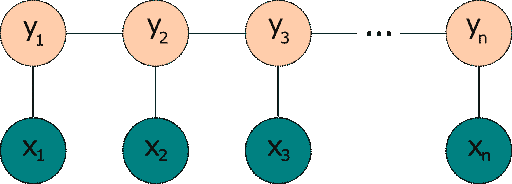
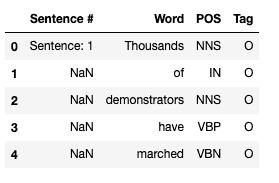
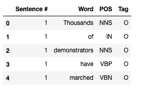
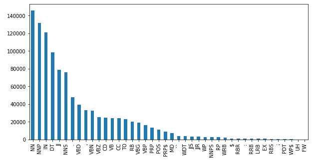
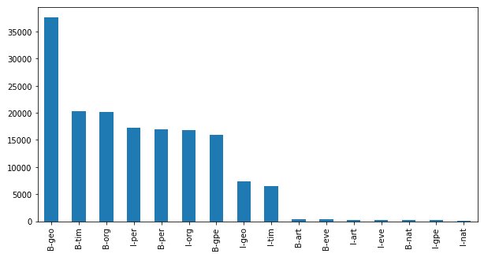
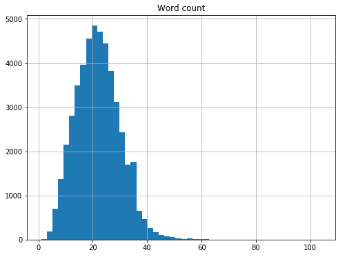
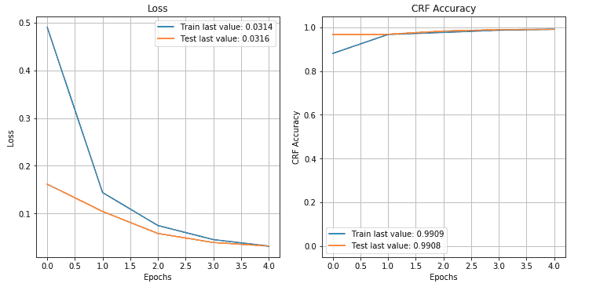

# 使用 BiLSTM-CRF 网络构建命名实体识别模型

> 原文：<https://www.dominodatalab.com/blog/named-entity-recognition-ner-challenges-and-model>

在这篇博文中，我们提出了命名实体识别问题，并展示了如何使用免费的带注释的语料库和 Keras 来拟合 BiLSTM-CRF 模型。该模型实现了相对较高的准确性，文章中的所有数据和代码都是免费提供的。

## 什么是命名实体识别？

命名实体识别(NER)是一个自然语言处理问题，它涉及命名实体(人、地点、组织等)的定位和分类。)在非结构化文本中提到。这个问题在许多处理机器翻译、信息检索、聊天机器人等用例的 NLP 应用程序中使用。

命名实体所属的类别是预定义的，通常包含位置、组织、工作类型、个人姓名、时间等条目。

呈现给 NER 系统的非结构化文本的例子可以是:

“乔·拜登总统首次总统海外之旅访问欧洲”

处理完输入后，NER 模型可能会输出如下内容:

【总统】[头衔]【拜登】[姓名]出访【欧洲】[地理]总统首次海外之行

从这个例子可以看出，NER 任务可以分解成两个独立的任务:

*   首先，我们需要建立每个实体的边界(例如，我们需要对输入进行标记)
*   其次，我们需要将每个实体分配给一个预定义的类

## 处理命名实体识别(NER)问题

NER 问题通常可以用两种不同的方法来处理:

*   **基于语法的技术** -这种方法涉及经验丰富的语言学家，他们手动定义实体识别的特定规则(例如，如果实体名称包含标记“John ”,则它是一个人，但如果它也包含标记“University ”,则它是一个组织)。这种手工制作的规则产生非常高的精度，但是它需要大量的工作来定义实体结构和捕获边界情况。另一个缺点是，保持这样一个基于语法的系统更新需要不断的人工干预，并且是一项费力的任务。
*   **基于统计模型的技术** -使用机器学习，我们可以精简和简化构建 NER 模型的过程，因为这种方法不需要预定义的详尽命名规则集。统计学习过程可以从训练数据集中自动提取所述规则。此外，保持 NER 模型的更新也可以以自动化的方式进行。基于统计模型的技术的缺点是，自动提取一组全面的规则需要大量带标签的训练数据。

## 如何建立统计命名实体识别(NER)模型

在这篇博文中，我们将重点关注构建一个统计 NER 模型，使用免费提供的[带注释的语料库进行命名实体识别](https://www.kaggle.com/abhinavwalia95/entity-annotated-corpus/)。该数据集基于 GMB ( [格罗宁根字义库](https://gmb.let.rug.nl/))语料库，并经过标记、注释和专门构建，以训练分类器来预测命名实体，如名称、位置等。数据集中使用的标签遵循 IOB 格式，我们将在下一节介绍这种格式。

### IOB 格式

内-外-始(IOB)是计算机语言学中标记实体的常见格式，尤其是在 NER 上下文中。该方案最初由 Ramshaw 和 Marcus (1995)提出，IOB 标签的含义如下:

*   I 前缀表示标签在组块内(即名词组、动词组等)。)
*   O 前缀表示该令牌不属于任何块
*   B 前缀指示该标签在一个组块的开始，该组块跟随另一个组块，在两个组块之间没有 O 标签

示例数据集中使用的实体标记如下:

| **标签** | **意为** | **例子** |
| 长狭潮道 | 地理 | 不列颠，英国 |
| （同 organic）有机 | 组织 | 国际原子能组织(International Atomic Energy Agency) |
| 每个 | 人 | 托马斯 |
| gpe | 地缘政治实体 | 巴基斯坦的 |
| 定时（timing 的缩写） | 时间 | 星期三 |
| 艺术 | 假象 | Pentastar |
| 前夕 | 事件 | 停战 |
| 精灵 | 自然现象 | H5N1 |

以下示例显示了 IOB 在类别标签上的应用:

| **令牌** | **标签** | **意为** |
| 乔治 | B-PER | 块的开始(B 标签)，分类为人 |
| 是 | O | 令牌不属于任何区块 |
| 旅行 | O | 令牌不属于任何区块 |
| 到 | O | 令牌不属于任何区块 |
| 英格兰 | I-GEO | 在块(I 标签)内部，分类为地理 |
| 在 | O | 令牌不属于任何区块 |
| 星期日 | I-TIM | 块内，分类为时间 |

### 通用报告格式模型

条件随机场(CRF)是一种非常适合处理 NER 问题的统计模型，因为它考虑了上下文。换句话说，当 CRF 模型进行预测时，它通过将预测建模为图形模型，将相邻样本的影响考虑在内。例如，线性链 CRF 是一种流行类型的 CRF 模型，其假设当前单词的标签仅依赖于前一个单词的标签(这有点类似于隐马尔可夫模型，尽管 CRF 的拓扑是无向图)。



Figure 1 : A simple linear-chain conditional random fields model. The model takes an input sequence x (words) and target sequence y (IOB tags)

线性链 CRF(图 1)的一个问题是，它们只能捕获向前方向的标签之间的依赖性。如果模型遇到类似“约翰霍普金斯大学”的实体，它可能会将霍普金斯令牌标记为名称，因为模型对下游出现的大学令牌“视而不见”。解决这个挑战的一个方法是在输入(字)和 CRF 之间引入一个双向 LSTM (BiLSTM)网络。双向 LSTM 由两个 LSTM 网络组成，一个正向接收输入，另一个反向接收输入。组合两个网络的输出产生了提供关于围绕每个单独令牌的样本的信息的上下文。BiLSTM 的输出然后被馈送到线性链 CRF，该线性链 CRF 可以使用这种改进的上下文来生成预测。CRF 和 BiLSTM 的这种组合通常被称为 BiLSTM-CRF 模型(Lample 等人，2016 年)，其架构如图 2 所示。

![The lowest layer contains the inputs x1, x2, ..., xn. They are connected to nodes l1,l2, ..., ln above with lateral connections in the right direction (this is the left context). Above is a corresponding set of nodes r1,r2,...,rn with lateral connections pointing from right to left (this is the right context). Both the r and l nodes feed to a layer above with nodes c1,c2,...,cn that captures both the right and left context. The c-nodes then feed to the y1,y2,...,yn outputs. The c and y nodes represent a CRF, and the l and r nodes are the two LSTMs.](img/4cb22624af242737d1fa0ba6bdfb608c.png)

Figure 2 - Architecture of a BiLSTM-CRF model

### 数据探索和准备

我们首先导入摄取、探索性数据分析和模型构建所需的所有库。

```py
import pickle
import operator
import re
import string
import pandas as pd
import numpy as np
import matplotlib.pyplot as plt

from plot_keras_history import plot_history
from sklearn.model_selection import train_test_split
from sklearn.metrics import multilabel_confusion_matrix
from keras_contrib.utils import save_load_utils

from keras import layers
from keras import optimizers

from keras.models import Model
from keras.models import Input

from keras_contrib.layers import CRF
from keras_contrib import losses
from keras_contrib import metrics
```

接下来，我们阅读并浏览注释数据集。

```py
data_df = pd.read_csv("dataset/ner_dataset.csv", encoding="iso-8859-1", header=0)
data_df.head()
```



这些属性的含义如下:

*   句子编号-句子 ID
*   单词-包含构成单个句子的所有单词
*   POS -每个单词的词性标签，如 [Penn Treebank 标签集](https://www.sketchengine.eu/penn-treebank-tagset/)中所定义
*   Tag -每个单词的 IOB 标签

查看数据，我们看到每个句子只给出一次句子 ID(使用块的第一个单词)，而“句子#”属性的其余值被设置为 NaN。我们将通过为所有剩余的单词重复 ID 来解决这个问题，这样我们就可以计算出有意义的统计数据。

```py
data_df = data_df.fillna(method="ffill")
data_df["Sentence #"] = data_df["Sentence #"].apply(lambda s: s[9:])
data_df["Sentence #"] = data_df["Sentence #"].astype("int32")
data_df.head()
```



现在我们来计算一些关于数据的统计。

```py
print("Total number of sentences in the dataset: {:,}".format(data_df["Sentence #"].nunique()))
print("Total words in the dataset: {:,}".format(data_df.shape[0]))
```

```py
Total number of sentences in the dataset: 47,959

Total words in the dataset: 1,048,575
```

```py
data_df["POS"].value_counts().plot(kind="bar", figsize=(10,5));
```



我们注意到语料库中的前 5 个词类是:

*   名词(如桌子)
*   NNP -专有名词(如约翰)
*   介词 in(如 IN，of，like)
*   DT 限定词
*   JJ -形容词(如绿色)

```py
data_df[data_df["Tag"]!="O"]["Tag"].value_counts().plot(kind="bar", figsize=(10,5))
```



根据上面的情节，我们了解到我们的许多句子都是以地理、时间、组织或人物开头的。

我们现在可以看看每个句子的单词分布。

```py
word_counts = data_df.groupby("Sentence #")["Word"].agg(["count"])
word_counts = word_counts.rename(columns={"count": "Word count"})
word_counts.hist(bins=50, figsize=(8,6));
```



我们看到数据集中的平均句子包含大约 21-22 个单词。

```py
MAX_SENTENCE = word_counts.max()[0]
print("Longest sentence in the corpus contains {} words.".format(MAX_SENTENCE))
```

```py
Longest sentence in the corpus contains 104 words.
```

```py
longest_sentence_id = word_counts[word_counts["Word count"]==MAX_SENTENCE].index[0]
print("ID of the longest sentence is {}.".format(longest_sentence_id))
```

```py
ID of the longest sentence is 22480.
```

```py
longest_sentence = data_df[data_df["Sentence #"]==longest_sentence_id]["Word"].str.cat(sep=' ')
print("The longest sentence in the corpus is:\n")
print(longest_sentence)
```

```py
The longest sentence in the corpus is: 
Fisheries in 2006 - 7 landed 1,26,976 metric tons , of which 82 % ( 1,04,586 tons ) was krill ( Euphausia superba ) and 9.5 % ( 12,027 tons ) Patagonian toothfish ( Dissostichus eleginoides - also known as Chilean sea bass ) , compared to 1,27,910 tons in 2005 - 6 of which 83 % ( 1,06,591 tons ) was krill and 9.7 % ( 12,396 tons ) Patagonian toothfish ( estimated fishing from the area covered by the Convention of the Conservation of Antarctic Marine Living Resources ( CCAMLR ) , which extends slightly beyond the Southern Ocean area ).
```

```py
all_words = list(set(data_df["Word"].values))
all_tags = list(set(data_df["Tag"].values))

print("Number of unique words: {}".format(data_df["Word"].nunique()))
print("Number of unique tags : {}".format(data_df["Tag"].nunique()))
```

```py
Number of unique words: 35178

Number of unique tags : 17
```

现在我们对数据稍微熟悉了一些，我们可以继续实现必要的特性工程。第一步是构建一个字典(word2index ),为语料库中的每个单词分配一个惟一的整数值。我们还构建了一个反向字典，将索引映射到单词(index2word)。

```py
word2index = {word: idx + 2 for idx, word in enumerate(all_words)}

word2index["--UNKNOWN_WORD--"]=0

word2index["--PADDING--"]=1

index2word = {idx: word for word, idx in word2index.items()}
```

让我们看看字典里的前 10 个词条。请注意，我们在开头包含了两个额外的条目——一个用于未知单词，一个用于填充。

```py
for k,v in sorted(word2index.items(), key=operator.itemgetter(1))[:10]:
    print(k,v)
```

```py
--UNKNOWN_WORD-- 0

--PADDING-- 1

truck 2

87.61 3

HAMSAT 4

gene 5

Notre 6

Samaraweera 7

Frattini 8

nine-member 9
```

让我们确认单词到索引和索引到单词的映射如预期的那样工作。

```py
test_word = "Scotland"

test_word_idx = word2index[test_word]
test_word_lookup = index2word[test_word_idx]

print("The index of the word {} is {}.".format(test_word, test_word_idx))
print("The word with index {} is {}.".format(test_word_idx, test_word_lookup))
```

```py
The index of the word Scotland is 15147.

The word with index 15147 is Scotland.
```

现在让我们为各种标签构建一个类似的字典。

```py
tag2index = {tag: idx + 1 for idx, tag in enumerate(all_tags)}
tag2index["--PADDING--"] = 0

index2tag = {idx: word for word, idx in tag2index.items()}
```

接下来，我们编写一个自定义函数，它将迭代每个句子，并形成一个由每个标记、标记代表的词性及其标签组成的元组。我们将这个函数应用于整个数据集，然后看看语料库中第一个句子的转换版本是什么样子。

```py
def to_tuples(data):
    iterator = zip(data["Word"].values.tolist(),
                   data["POS"].values.tolist(),
                   data["Tag"].values.tolist())
    return [(word, pos, tag) for word, pos, tag in iterator]

sentences = data_df.groupby("Sentence #").apply(to_tuples).tolist()

print(sentences[0])
```

```py
[('Thousands', 'NNS', 'O'),

 ('of', 'IN', 'O'),

 ('demonstrators', 'NNS', 'O'),

 ('have', 'VBP', 'O'),

 ('marched', 'VBN', 'O'),

 ('through', 'IN', 'O'),

 ('London', 'NNP', 'B-geo'),

 ('to', 'TO', 'O'),

 ('protest', 'VB', 'O'),

 ('the', 'DT', 'O'),

 ('war', 'NN', 'O'),

 ('in', 'IN', 'O'),

 ('Iraq', 'NNP', 'B-geo'),

 ('and', 'CC', 'O'),

 ('demand', 'VB', 'O'),

 ('the', 'DT', 'O'),

 ('withdrawal', 'NN', 'O'),

 ('of', 'IN', 'O'),

 ('British', 'JJ', 'B-gpe'),

 ('troops', 'NNS', 'O'),

 ('from', 'IN', 'O'),

 ('that', 'DT', 'O'),

 ('country', 'NN', 'O'),

 ('.', '.', 'O')]
```

我们使用这个转换后的数据集来提取模型的特征(X)和标签(y)。我们可以看到 X 和 y 中的第一个条目是什么样子的，在这两个条目中已经填充了单词和标签。我们可以丢弃该部分语音数据，因为该特定实现不需要它。

```py
X = [[word[0] for word in sentence] for sentence in sentences]
y = [[word[2] for word in sentence] for sentence in sentences]
print("X[0]:", X[0])
print("y[0]:", y[0])
```

```py
X[0]: ['Thousands', 'of', 'demonstrators', 'have', 'marched', 'through', 'London', 'to', 'protest', 'the', 'war', 'in', 'Iraq', 'and', 'demand', 'the', 'withdrawal', 'of', 'British', 'troops', 'from', 'that', 'country', '.']

y[0]: ['O', 'O', 'O', 'O', 'O', 'O', 'B-geo', 'O', 'O', 'O', 'O', 'O', 'B-geo', 'O', 'O', 'O', 'O', 'O', 'B-gpe', 'O', 'O', 'O', 'O', 'O']
```

我们还需要用字典中相应的索引替换每个单词。

```py
X = [[word2index[word] for word in sentence] for sentence in X]
y = [[tag2index[tag] for tag in sentence] for sentence in y]
print("X[0]:", X[0])
print("y[0]:", y[0])
```

```py
X[0]: [19995, 10613, 3166, 12456, 20212, 9200, 27, 24381, 28637, 2438, 4123, 7420, 34783, 18714, 14183, 2438, 26166, 10613, 29344, 1617, 10068, 12996, 26619, 14571]

y[0]: [17, 17, 17, 17, 17, 17, 4, 17, 17, 17, 17, 17, 4, 17, 17, 17, 17, 17, 13, 17, 17, 17, 17, 17]
```

我们看到数据集现在已经被索引了。我们还需要将每个句子填充到语料库中的最大句子长度，因为 LSTM 模型期望固定长度的输入。这就是字典中额外的"- PADDING -"键发挥作用的地方。

```py
X = [sentence + [word2index["--PADDING--"]] * (MAX_SENTENCE - len(sentence)) for sentence in X]
y = [sentence + [tag2index["--PADDING--"]] * (MAX_SENTENCE - len(sentence)) for sentence in y]
print("X[0]:", X[0])
print("y[0]:", y[0])
```

```py
X[0]: [19995, 10613, 3166, 12456, 20212, 9200, 27, 24381, 28637, 2438, 4123, 7420, 34783, 18714, 14183, 2438, 26166, 10613, 29344, 1617, 10068, 12996, 26619, 14571, 1, 1, 1, 1, 1, 1, 1, 1, 1, 1, 1, 1, 1, 1, 1, 1, 1, 1, 1, 1, 1, 1, 1, 1, 1, 1, 1, 1, 1, 1, 1, 1, 1, 1, 1, 1, 1, 1, 1, 1, 1, 1, 1, 1, 1, 1, 1, 1, 1, 1, 1, 1, 1, 1, 1, 1, 1, 1, 1, 1, 1, 1, 1, 1, 1, 1, 1, 1, 1, 1, 1, 1, 1, 1, 1, 1, 1, 1, 1, 1]

y[0]: [17, 17, 17, 17, 17, 17, 4, 17, 17, 17, 17, 17, 4, 17, 17, 17, 17, 17, 13, 17, 17, 17, 17, 17, 0, 0, 0, 0, 0, 0, 0, 0, 0, 0, 0, 0, 0, 0, 0, 0, 0, 0, 0, 0, 0, 0, 0, 0, 0, 0, 0, 0, 0, 0, 0, 0, 0, 0, 0, 0, 0, 0, 0, 0, 0, 0, 0, 0, 0, 0, 0, 0, 0, 0, 0, 0, 0, 0, 0, 0, 0, 0, 0, 0, 0, 0, 0, 0, 0, 0, 0, 0, 0, 0, 0, 0, 0, 0, 0, 0, 0, 0, 0, 0]
```

我们需要执行的最后一个转换是对标签进行一次性编码。：

```py
TAG_COUNT = len(tag2index)

y = [ np.eye(TAG_COUNT)[sentence] for sentence in y]

print("X[0]:", X[0])
print("y[0]:", y[0])
```

```py
X[0]: [19995, 10613, 3166, 12456, 20212, 9200, 27, 24381, 28637, 2438, 4123, 7420, 34783, 18714, 14183, 2438, 26166, 10613, 29344, 1617, 10068, 12996, 26619, 14571, 1, 1, 1, 1, 1, 1, 1, 1, 1, 1, 1, 1, 1, 1, 1, 1, 1, 1, 1, 1, 1, 1, 1, 1, 1, 1, 1, 1, 1, 1, 1, 1, 1, 1, 1, 1, 1, 1, 1, 1, 1, 1, 1, 1, 1, 1, 1, 1, 1, 1, 1, 1, 1, 1, 1, 1, 1, 1, 1, 1, 1, 1, 1, 1, 1, 1, 1, 1, 1, 1, 1, 1, 1, 1, 1, 1, 1, 1, 1, 1]

y[0]: [[0\. 0\. 0\. ... 0\. 0\. 1.]

 [0\. 0\. 0\. ... 0\. 0\. 1.]

 [0\. 0\. 0\. ... 0\. 0\. 1.]

 ...

 [1\. 0\. 0\. ... 0\. 0\. 0.]

 [1\. 0\. 0\. ... 0\. 0\. 0.]

 [1\. 0\. 0\. ... 0\. 0\. 0.]]
```

最后，我们将得到的数据集分成一个训练集和一个保留集，这样我们就可以测量分类器对未知数据的性能。

```py
X_train, X_test, y_train, y_test = train_test_split(X, y, test_size=0.1, random_state=1234)

print("Number of sentences in the training dataset: {}".format(len(X_train)))
print("Number of sentences in the test dataset : {}".format(len(X_test)))
```

```py
Number of sentences in the training dataset: 43163

Number of sentences in the test dataset    : 4796
```

我们还可以将所有内容转换成 NumPy 数组，因为这使得向模型提供数据变得更加简单。

```py
X_train = np.array(X_train)

X_test = np.array(X_test)

y_train = np.array(y_train)

y_test = np.array(y_test)
```

### 系统模型化

我们从计算最大单词长度开始。我们还设置了以下模型超参数:

*   稠密嵌入-稠密嵌入的维数
*   LSTM 输出空间的 LSTM 单位维数
*   LSTM_DROPOUT -为递归状态的线性变换而丢弃的 LSTM 单位的分数
*   DENSE_UNITS -每个时间片的完全连接单元的数量
*   BATCH_SIZE -训练批次中的样本数
*   MAX_EPOCHS -训练时期的最大数量

```py
WORD_COUNT = len(index2word)
DENSE_EMBEDDING = 50
LSTM_UNITS = 50
LSTM_DROPOUT = 0.1
DENSE_UNITS = 100
BATCH_SIZE = 256
MAX_EPOCHS = 5
```

我们从定义模型的架构开始。我们添加了一个输入层、一个嵌入层(将索引转换为密集矢量)、一个双向 LSTM 层和一个时间分布层(将密集输出层应用于每个时态切片)。然后，我们通过管道将其传输到 CRF 层，最后通过将其输入定义为输入层，将其输出定义为 CRF 层的输出来构建模型。

我们还设置了一个损失函数(对于线性链条件随机场，这只是负对数似然)，并指定“准确性”作为我们将监控的度量。优化器设置为 Adam(金玛和巴，2015)，学习率为 0.001。

```py
input_layer = layers.Input(shape=(MAX_SENTENCE,))

model = layers.Embedding(WORD_COUNT, DENSE_EMBEDDING, embeddings_initializer="uniform", input_length=MAX_SENTENCE)(input_layer)

model = layers.Bidirectional(layers.LSTM(LSTM_UNITS, recurrent_dropout=LSTM_DROPOUT, return_sequences=True))(model)

model = layers.TimeDistributed(layers.Dense(DENSE_UNITS, activation="relu"))(model)

crf_layer = CRF(units=TAG_COUNT)
output_layer = crf_layer(model)

ner_model = Model(input_layer, output_layer)

loss = losses.crf_loss
acc_metric = metrics.crf_accuracy
opt = optimizers.Adam(lr=0.001)

ner_model.compile(optimizer=opt, loss=loss, metrics=[acc_metric])

ner_model.summary()
```

```py
Model: "model_1"

_________________________________________________________________

Layer (type)                 Output Shape              Param #

=================================================================

input_1 (InputLayer)         (None, 104)               0

_________________________________________________________________

embedding_1 (Embedding)      (None, 104, 50)           1759000

_________________________________________________________________

bidirectional_1 (Bidirection (None, 104, 100)          40400

_________________________________________________________________

time_distributed_1 (TimeDist (None, 104, 100)          10100

_________________________________________________________________

crf_1 (CRF)                  (None, 104, 18)           2178

=================================================================

Total params: 1,811,678

Trainable params: 1,811,678

Non-trainable params: 0

_________________________________________________________________
```

```py
history = ner_model.fit(X_train, y_train, batch_size=BATCH_SIZE, epochs=MAX_EPOCHS, validation_split=0.1, verbose=2)
```

我们的模型有 180 万个参数，所以预计训练需要一段时间。

```py
Train on 38846 samples, validate on 4317 samples

Epoch 1/5

 - 117s - loss: 0.4906 - crf_accuracy: 0.8804 - val_loss: 0.1613 - val_crf_accuracy: 0.9666

Epoch 2/5

 - 115s - loss: 0.1438 - crf_accuracy: 0.9673 - val_loss: 0.1042 - val_crf_accuracy: 0.9679

Epoch 3/5

 - 115s - loss: 0.0746 - crf_accuracy: 0.9765 - val_loss: 0.0579 - val_crf_accuracy: 0.9825

Epoch 4/5

 - 115s - loss: 0.0451 - crf_accuracy: 0.9868 - val_loss: 0.0390 - val_crf_accuracy: 0.9889

Epoch 5/5

 - 115s - loss: 0.0314 - crf_accuracy: 0.9909 - val_loss: 0.0316 - val_crf_accuracy: 0.9908
```

### 评估和测试

我们可以从模型训练中检查损失和准确度图。它们看起来都可以接受，而且模型似乎没有过度拟合。模型训练肯定可以从一些超参数优化中受益，但这种类型的微调超出了本文的范围。

```py
plot_history(history.history)
```



我们还可以通过测量保留集的预测精度来测试模型的泛化能力。

```py
y_pred = ner_model.predict(X_test)

y_pred = np.argmax(y_pred, axis=2)

y_test = np.argmax(y_test, axis=2)

accuracy = (y_pred == y_test).mean()

print("Accuracy: {:.4f}/".format(accuracy))
```

```py
Accuracy: 0.9905
```

看起来这个模型做得很好，但是这有点误导。这是一个高度不平衡的数据集，因为在训练和测试数据中存在非常大量的 O 标签。在包括各种标签类别的样本之间存在进一步的不平衡。更好的检查是为每个标签构建混淆矩阵，并基于这些矩阵判断模型性能。我们可以构造一个简单的 Python 函数来帮助检查单个标签的混淆矩阵。我们使用两个随机选择的标签来让我们了解单个标签的混淆矩阵是什么样子的。

```py
def tag_conf_matrix(cm, tagid):
    tag_name = index2tag[tagid]
    print("Tag name: {}".format(tag_name))
    print(cm[tagid])
    tn, fp, fn, tp = cm[tagid].ravel()
    tag_acc = (tp + tn) / (tn + fp + fn + tp)
    print("Tag accuracy: {:.3f} \n".format(tag_acc))

matrix = multilabel_confusion_matrix(y_test.flatten(), y_pred.flatten())

tag_conf_matrix(matrix, 8)
tag_conf_matrix(matrix, 14)
```

```py
Tag name: B-per

[[496974    185]

 [   441   1184]]

Tag accuracy: 0.999
```

```py
Tag name: I-art
[[498750 0]
[ 34 0]]
Tag accuracy: 1.000
```

最后，我们通过构建一个样本句子并获得对检测到的实体的预测来运行一个手动测试。我们将所有单词标记、填充并转换成索引。然后我们调用模型并打印预测的标签。我们在测试中使用的句子是“奥巴马总统成为第一位访问广岛的在任美国总统”。

```py
sentence = "President Obama became the first sitting American president to visit Hiroshima"
```

```py
re_tok = re.compile(f"([{string.punctuation}“”¨«»®´·º½¾¿¡§£₤‘’])")
sentence = re_tok.sub(r"  ", sentence).split()

padded_sentence = sentence + [word2index["--PADDING--"]] * (MAX_SENTENCE - len(sentence))
padded_sentence = [word2index.get(w, 0) for w in padded_sentence]

pred = ner_model.predict(np.array([padded_sentence]))
pred = np.argmax(pred, axis=-1)

retval = ""
for w, p in zip(sentence, pred[0]):
    retval = retval + "{:15}: {:5}".format(w, index2tag[p])" + "\n"
print(retval)
```

```py
President      : B-per

Obama          : I-per

became         : O

the            : O

first          : O

sitting        : O

American       : B-gpe

president      : O

to             : O

visit          : O

Hiroshima      : B-geo
```

## 摘要

在这篇博文中，我们讨论了命名实体识别的用例及挑战，并使用 BiLSTM-CRF 模型给出了一个可能的解决方案。拟合的模型表现相当好，能够以相对较高的精度预测未知数据。

## 参考

Ramshaw 和 Marcus，使用基于转换的学习进行文本分块，1995 年， [arXiv:cmp-lg/9505040](https://arxiv.org/abs/cmp-lg/9505040) 。

Guillaume Lample，Miguel Ballesteros，Sandeep Subramanian，Kazuya Kawakami，克里斯·戴尔，命名实体识别的神经架构，2016 年，计算语言学协会北美分会 2016 年会议记录:人类语言技术，第 260-270 页，[https://www.aclweb.org/anthology/N16-1030/](https://www.aclweb.org/anthology/N16-1030/)

Diederik P. Kingma 和 Jimmy Ba，Adam:一种随机优化方法，第三届学习表示国际会议，圣地亚哥，2015，[https://arxiv.org/abs/1412.6980](https://arxiv.org/abs/1412.6980)