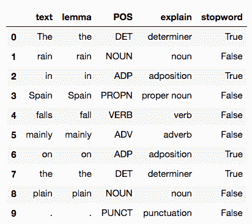
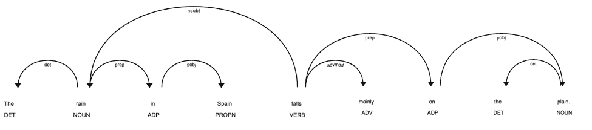
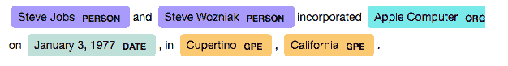
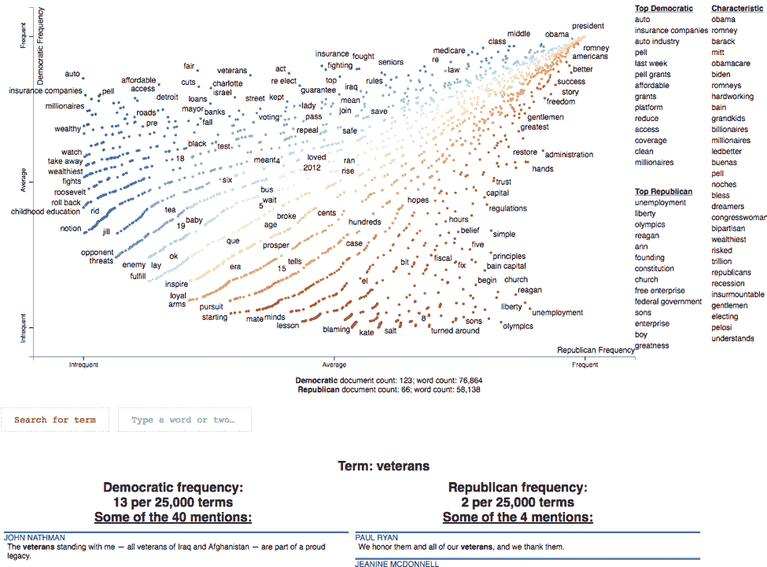

# 使用 spaCy 的 Python 自然语言处理:简介

> 原文：<https://www.dominodatalab.com/blog/natural-language-in-python-using-spacy>

*本文简要介绍了在 Python 中使用 spaCy 和相关库的自然语言。*

## 介绍

行业中的数据科学团队必须处理大量文本，这是机器学习中使用的四大类数据之一。通常，它是人类生成的文本，但并不总是如此。

想一想:企业的“操作系统”是如何工作的？通常，有合同(销售合同、工作协议、合伙关系)，有发票，有保险单，有法规和其他法律，等等。所有这些都表示为文本。

你可能会碰到几个缩略词:*自然语言处理* (NLP)，n *自然语言理解* (NLU)，*自然语言生成*(NLG)——大致分别讲“读文本”、“理解意思”、“写文本”。这些任务越来越多地重叠，很难对任何给定的功能进行分类。

## Spacy 是什么？

数据科学团队如何着手处理非结构化文本数据？团队经常求助于 Python 中的各种库来管理复杂的 NLP 任务。sPacy 是一个开源的 Python 库，它提供了进行高级自然语言处理分析和构建模型的能力，这些模型可以支持文档分析、聊天机器人功能和所有其他形式的文本分析。

*spaCy* 框架——以及范围广泛且不断增长的插件和其他集成——为广泛的自然语言任务提供了功能。它已经成为 Python 中用于行业用例的最广泛使用的自然语言库之一，并拥有相当大的社区——随着该领域的持续快速发展，对研究商业化的支持也在不断增加。

本文简要介绍了如何使用[](https://spacy.io/)*和相关库在 Python 中使用*自然语言*(有时称为“文本分析”)。*

 *## 入门指南

我们已经在 Domino 中配置了默认的计算环境，以包含本教程所需的所有包、库、模型和数据。查看 Domino 项目来运行代码。

[](https://cta-redirect.hubspot.com/cta/redirect/6816846/737c521e-1293-4380-8559-c309eeadb81e) 

如果您对 Domino 的计算环境如何工作感兴趣，请查看[支持页面](https://tickets.dominodatalab.com/hc/en-us/articles/360060724472-Environment-Management)。

现在让我们加载*空间*并运行一些代码:

```py
import spacy
nlp = spacy.load("en_core_web_sm")
```

那个`nlp`变量现在是你通向所有事物*空间*的大门，并且装载了英语的`en_core_web_sm`小模型。接下来，让我们通过自然语言解析器运行一个小“文档”:

```py
text = "The rain in Spain falls mainly on the plain."
doc = nlp(text)

for token in doc:
    print(token.text, token.lemma_, token.pos_, token.is_stop)
```

```py
The DET True
rain rain NOUN False
in in ADP True
Spain Spain PROPN False
falls fall VERB False
mainly mainly ADV False
on on ADP True
the DET True
plain plain NOUN False
. . PUNCT False
```

首先，我们从文本创建了一个 [doc](https://spacy.io/api/doc) ，它是一个文档及其所有注释的容器。然后我们遍历文档，看看*空间*解析了什么。

很好，但是信息太多，读起来有点困难。让我们将该句子的*空间*解析重新格式化为[熊猫](https://www.dominodatalab.com/blog/data-exploration-with-pandas-profiler-and-d-tale)数据帧:

```py
import pandas as pd
cols = ("text", "lemma", "POS", "explain", "stopword")
rows = []
for t in doc:
    row = [t.text, t.lemma_, t.pos_, spacy.explain(t.pos_), t.is_stop]
    rows.append(row)
df = pd.DataFrame(rows, columns=cols)
print(df)
```



可读性强多了！在这个简单的例子中，整个文档仅仅是一个简短的句子。对于句子中的每个单词，spaCy 已经创建了一个令牌，我们访问每个令牌中的字段来显示:

*   raw text
*   [词条](https://en.wikipedia.org/wiki/Lemma_(morphology))–单词的词根形式
*   [词性](https://en.wikipedia.org/wiki/Part_of_speech)
*   该单词是否为*停用词*的标志，即可以被过滤掉的常用单词

接下来，让我们使用 [displaCy](https://ines.io/blog/developing-displacy) 库来可视化该句子的解析树:

```py
from spacy import displacy
displacy.render(doc, style="dep")
```



这让我想起了小学时代吗？坦率地说，对于我们这些更多地来自计算语言学背景的人来说，这个图表激发了喜悦。

但是让我们先回顾一下。你如何处理多个句子？

*句子边界检测*(SBD)——也称为*句子分割*——基于内置/默认[句子分析器](https://spacy.io/api/sentencizer/)的特征有:

```py
text = "We were all out at the zoo one day, I was doing some acting, walking on the railing of the gorilla exhibit. I fell in.
Everyone screamed and Tommy jumped in  after me, forgetting that he had blueberries in  his front pocket. The gorillas just went wild."
doc = nlp(text)
for sent in doc.sents:
    print(">", sent)
```

```py
> We were all out at the zoo one day, I was doing some acting, walking on the railing of the gorilla exhibit.
> I fell in.
> Everyone screamed and Tommy jumped in after me, forgetting that he had blueberries in his front pocket.
> The gorillas just went wild.
```

当 *spaCy* 创建文档时，它使用了一个*非破坏性标记化的原则，*意味着标记、句子等。只是一个长数组的索引。换句话说，它们不会将文本流分割成小块。所以每个句子都是一个[跨度](https://spacy.io/api/span)，以*开始*和*结束*索引到文档数组中:

```py
for sent in doc.sents:
    print(">", sent.start, sent.end)
```

```py
> 0 25
> 25 29
> 29 48
> 48 54
```

我们可以对文档数组进行索引，以提取一个句子的标记:

```py
doc[48:54]
```

```py
The gorillas just went wild.
```

或者简单地索引到一个特定的标记，比如最后一句中的动词`went`:

```py
token = doc[51]
print(token.text, token.lemma_, token.pos_)
```

```py
went go VERB
```

此时，我们可以解析文档，将文档分割成句子，然后查看每个句子中标记的注释。这是一个好的开始。

## 获取文本

既然我们可以解析文本，那么我们从哪里获取文本呢？一个快速的来源是利用互联网。当然，当我们下载网页时，我们会得到 HTML，然后需要从中提取文本。美丽的汤是一种受欢迎的套餐。

首先，做一点家务:

```py
import sys
import warnings

warnings.filterwarnings("ignore")
```

在下面的函数`get_text()`中，我们将解析 HTML 以找到所有的`<p/>`标签，然后提取这些标签的文本:

```py
from bs4 import BeautifulSoup
import requests
import traceback

def get_text (url):
    buf = []
    try:
        soup = BeautifulSoup(requests.get(url).text, "html.parser")
        for p in soup.find_all("p"):
            buf.append(p.get_text())
        return "".join(buf)
    except:
        print(traceback.format_exc())
        sys.exit(-1)
```

现在让我们从网上获取一些文本。我们可以比较[开源倡议](https://opensource.org/licenses/)网站上托管的开源许可证:

```py
lic = {}
lic["mit"] = nlp(get_text("https://opensource.org/licenses/MIT"))
lic["asl"] = nlp(get_text("https://opensource.org/licenses/Apache-20"))
lic["bsd"] = nlp(get_text("https://opensource.org/licenses/BSD-3-Clause"))

for sent in lic["bsd"].sents:
    print(">", sent)
```

```py
> SPDX short identifier: BSD-3-Clause
> Note: This license has also been called the "New BSD License" or "Modified BSD License"
> See also the 2-clause BSD License.
…
```

自然语言工作的一个常见用例是比较文本。例如，使用这些开源许可证，我们可以下载它们的文本，解析，然后比较它们之间的[相似性](https://spacy.io/api/doc#similarity)度量:

```py
pairs = [
    ["mit", "asl"],
    ["asl", "bsd"],
    ["bsd", "mit"]]

for a, b in pairs:
    print(a, b, lic[a].similarity(lic[b]))
```

```py
mit asl 0.9482039305669306
asl bsd 0.9391555350757145
bsd mit 0.9895838089575453
```

这很有趣，因为 BSD 和 T2 麻省理工学院的执照看起来是最相似的文件。事实上，它们是密切相关的。

诚然，由于页脚中的 OSI 免责声明，每个文档中都包含了一些额外的文本，但这为比较许可证提供了一个合理的近似值。

## 自然语言理解

现在让我们深入了解一下 NLU 的一些*空间*特征。假设我们有一个文档解析，从纯语法的角度来看，我们可以提取[名词块](https://spacy.io/usage/linguistic-features#noun-chunks)，即每个名词短语:

```py
text = "Steve Jobs and Steve Wozniak incorporated Apple Computer on January 3, 1977, in Cupertino, California."
doc = nlp(text)

for chunk in doc.noun_chunks:
    print(chunk.text)
```

```py
Steve Jobs
Steve Wozniak
Apple Computer
January
Cupertino
California
```

还不错。句子中的名词短语通常提供更多的信息内容——作为一个简单的过滤器，用于将一个长文档简化为一个更“精炼”的表示。

我们可以进一步采用这种方法，并在文本中识别出[命名实体](https://spacy.io/usage/linguistic-features#named-entities)，即专有名词:

```py
for ent in doc.ents:
    print(ent.text, ent.label_)
```

```py
Steve Jobs PERSON
Steve Wozniak PERSON
Apple Computer ORG
January 3, 1977 DATE
Cupertino GPE
California GPE
```

*displaCy* 库提供了一种可视化命名实体的极好方法:

```py
displacy.render(doc, style="ent")
```



如果您正在使用[知识图](https://www.akbc.ws/2019/)应用程序和其他[链接数据](http://linkeddata.org/)，您的挑战是在文档中的命名实体和实体的其他相关信息之间构建链接，这被称为[实体链接](http://nlpprogress.com/english/entity_linking.html)。识别文档中的命名实体是这种特定人工智能工作的第一步。例如，根据上面的文本，可以将`Steve Wozniak`命名实体链接到 DBpedia 中的[查找。](http://dbpedia.org/page/Steve_Wozniak)

更一般地说，人们也可以将*词条*链接到描述其含义的资源。例如，在前面的部分中，我们分析了句子`The gorillas just went wild`，并且能够表明单词`went`的引理是动词`go`。在这一点上，我们可以使用一个名为 [WordNet](https://wordnet.princeton.edu/) 的古老项目，它提供了一个英语词汇数据库——换句话说，它是一个可计算的词库。

有一个针对 WordNet 的 *spaCy* 集成，叫做 [spacy-wordnet](https://github.com/recognai/spacy-wordnet) ，作者是自然语言和知识图谱工作专家。

然后我们将通过 NLTK 加载 WordNet 数据(这些事情会发生):

```py
import nltk
nltk.download("wordnet")
```

```py
[nltk_data] Downloading package wordnet to /home/ceteri/nltk_data...
[nltk_data] Package wordnet is already up-to-date!
```

```py
True
```

请注意，*空间*作为一个“管道”运行，并允许使用定制管道部件的方法。这对于支持数据科学工作中真正有趣的工作流集成非常有用。这里我们将添加来自 *spacy-wordnet* 项目的*wordnet 注释器*:

```py
from spacy_wordnet.wordnet_annotator import WordnetAnnotator
 print("before", nlp.pipe_names)
if "WordnetAnnotator" not in nlp.pipe_names:
    nlp.add_pipe(WordnetAnnotator(nlp.lang), after="tagger")

print("after", nlp.pipe_names)
```

```py
before ['tagger', 'parser', 'ner']
after ['tagger', 'WordnetAnnotator', 'parser', 'ner']
```

在英语中，有些词因有多种可能的含义而臭名昭著。例如，在 [WordNet](http://wordnetweb.princeton.edu/perl/webwn?s=star&sub=Search+WordNet&o2&o0=1&o8=1&o1=1&o7&o5&o9&o6&o3&o4&h) 搜索中点击搜索结果，找到与单词`withdraw`相关的意思。

现在让我们使用 *spaCy* 来自动执行查找:

```py
token = nlp("withdraw")[0]
token._.wordnet.synsets()
```

```py
[Synset('withdraw.v.01'),
Synset('retire.v.02'),
Synset('disengage.v.01'),
Synset('recall.v.07'),
Synset('swallow.v.05'),
Synset('seclude.v.01'),
Synset('adjourn.v.02')
Synset('bow_out.v.02'),
Synset('withdraw.v.09'),
Synset('retire.v.08'),
Synset('retreat.v.04'),
Synset('remove.v.01')]
```

```py
token._.wordnet.lemmas()
```

```py
[Lemma('withdraw.v.01.withdraw'),
Lemma('withdraw.v.01.retreat'),
Lemma('withdraw.v.01.pull_away'),
Lemma('withdraw.v.01.draw_back'),
Lemma('withdraw.v.01.recede'),
Lemma('withdraw.v.01.pull_back'),
Lemma('withdraw.v.01.retire'),
…
```

```py
token._.wordnet.wordnet_domains()
```

```py
["astronomy",
"school",
"telegraphy",
"industry",
"psychology",
"ethnology",
"ethnology",
"administration",
"school",
"finance",
"economy",
"exchange",
"banking",
"commerce",
"medicine",
"ethnology",
"university",
…

```

同样，如果你正在使用知识图表，那些来自 *WordNet* 的“词义”链接可以和图表算法一起使用，来帮助识别特定单词的意思。这也可以用来通过一种叫做*摘要*的技术为较大的文本部分开发摘要。这已经超出了本教程的范围，但是这是目前自然语言在业界的一个有趣的应用。

反过来说，如果你知道*先验*一个文档是关于一个特定领域或一组主题的，那么你可以限制从 *WordNet* 返回的意思。在下面的示例中，我们希望考虑金融和银行业中的 NLU 结果:

```py
domains = ["finance", "banking"]
sentence = nlp("I want to withdraw 5,000 euros.")

enriched_sent = []

for token in sentence:
    # get synsets within the desired domains
    synsets = token._.wordnet.wordnet_synsets_for_domain(domains)

    if synsets:
        lemmas_for_synset = []

        for s in synsets:
        # get synset variants and add to the enriched sentence
            lemmas_for_synset.extend(s.lemma_names())
            enriched_sent.append("({})".format("|".join(set(lemmas_for_synset))))
    else:
        enriched_sent.append(token.text)
print(" ".join(enriched_sent))
```

```py
I (require|want|need) to (draw_off|withdraw|draw|take_out) 5,000 euros .
```

这个例子看起来很简单，但是如果你使用`domains`列表，你会发现在没有合理约束的情况下，结果会有一种组合爆炸。想象一下，有一个包含数百万元素的知识图:您希望尽可能地限制搜索，以避免每个查询都需要花费数天/数周/数月/数年的时间来计算。

## 使用空间和散点图进行文本比较

有时候，当试图理解一个文本时遇到的问题——或者更好的是当试图理解一个*语料库*(一个包含许多相关文本的数据集)——变得如此复杂，以至于你需要首先将它可视化。这里有一个理解文本的交互式可视化:[散射文本](https://spacy.io/universe/project/scattertext)，是[杰森·凯斯勒](https://twitter.com/jasonkessler)天才的产物。

让我们来分析 2012 年美国总统选举期间的政党大会的文本数据。注意:这个单元可能需要几分钟来运行，但是所有这些数字运算的结果是值得等待的。

```py
import scattertext as st

if "merge_entities" not in nlp.pipe_names:
    nlp.add_pipe(nlp.create_pipe("merge_entities"))

if "merge_noun_chunks" not in nlp.pipe_names:
    nlp.add_pipe(nlp.create_pipe("merge_noun_chunks"))

convention_df = st.SampleCorpora.ConventionData2012.get_data()
corpus = st.CorpusFromPandas(convention_df, category_col="party", text_col="text", nlp=nlp).build()
```

准备好`corpus`之后，生成一个 HTML 格式的交互式可视化:

```py
html = st.produce_scattertext_explorer(corpus, category="democrat", 
                                       category_name="Democratic",
                                       not_category_name="Republican",
                                       width_in_pixels=1000,
                                       metadata=convention_df["speaker"])
```

现在我们将渲染 HTML——给它一两分钟来加载，这是值得等待的:

```py
from IPython.display import IFrame

file_name = "foo.html"

with open(file_name, "wb") as f:
    f.write(html.encode("utf-8"))

IFrame(src=file_name, width = 1200, height=700)
```



想象一下，如果您有过去三年中您组织中特定产品的客户支持文本。假设您的团队需要了解客户是如何谈论产品的？这个*散文本*库可能会派上用场！你可以根据 *NPS 得分*(一个客户评估指标)进行聚类(k=2)，然后用聚类中的前两个部分替换民主党/共和党维度。

## 摘要

五年前，如果你问关于自然语言的 Python 开源，许多从事数据科学的人的默认答案会是 [NLTK](https://www.nltk.org/) 。那个项目包括除了厨房水槽以外的所有东西，并且有相对学术性的组成部分。另一个流行的自然语言项目是斯坦福大学的 [CoreNLP](https://stanfordnlp.github.io/CoreNLP/) 。虽然 CoreNLP 很强大，但也很学术，尽管 CoreNLP 在与其他软件集成以供生产使用方面存在挑战。

几年前，世界上这个自然语言的角落开始发生变化。《太空》(*)的两位主要作者*、[马修·洪尼巴尔](https://twitter.com/honnibal)和[伊娜丝·蒙塔尼](https://twitter.com/_inesmontani)于 2015 年启动了该项目，该项目很快被业界采纳。他们专注于一种*固执己见的*方法(做需要做的事情，做好它，不多不少)，这种方法提供了到 Python 中数据科学工作流的简单、快速的集成，以及比替代方案更快的执行速度和更好的准确性。基于这些优先级， *spaCy* 成为了 *NLTK 的对立面。*自 2015 年以来， *spaCy* 一直专注于成为一个开源项目(即依靠其社区获得方向、集成等。)并且是商业级软件(不是学术研究)。也就是说， *spaCy* 已经迅速将 SOTA 的进步融入到机器学习中，有效地成为将研究转移到工业的渠道。

值得注意的是，随着谷歌开始赢得国际语言翻译比赛，自然语言的机器学习在 2000 年代中期得到了很大的推动。另一个巨大的变化发生在 2017-2018 年期间，在*深度学习的许多成功之后，*这些方法开始超越以前的机器学习模型。例如，看看艾伦·艾(Allen AI)的 [ELMo](https://arxiv.org/abs/1802.05365) 关于语言嵌入的工作，接着是谷歌的 [BERT，以及最近百度](https://ai.googleblog.com/2018/11/open-sourcing-bert-state-of-art-pre.html)的[ERNIE——换句话说，世界上的搜索引擎巨头给我们其他人提供了基于深度学习的开源嵌入式语言模型的芝麻街剧目，这是目前的艺术水平(SOTA)。说到这里，要跟踪自然语言的 SOTA，请留意代码为](https://medium.com/syncedreview/baidus-ernie-tops-google-s-bert-in-chinese-nlp-tasks-d6a42b49223d)的 [NLP-Progress](http://nlpprogress.com/) 和[论文。](https://paperswithcode.com/sota)

在深度学习技术脱颖而出之后，自然语言的用例在过去两年中发生了巨大的变化。大约在 2014 年，Python 中的自然语言教程可能会显示*字数*或*关键词搜索*或*情感检测*，而目标用例相对来说并不令人印象深刻。大约在 2019 年，我们正在讨论分析工业*供应链优化*中数以千计的供应商合同文档...或者为保险公司的投保人提供数亿份文档，或者关于财务披露的大量文档。更多的当代自然语言工作倾向于在 NLU 进行，通常是为了支持知识图表的构建，并且越来越多地在 NLG 进行，在那里大量相似的文档可以在人类尺度上进行总结。

spaCy Universe 是一个很好的地方，可以深入研究特定的用例，看看这个领域是如何发展的。从这个“宇宙”中选择的一些包括:

*   [黑石](https://spacy.io/universe/project/blackstone)–解析非结构化法律文本
*   [亲属](https://spacy.io/universe/project/kindred)–从生物医学文本中提取实体(如制药)
*   [末底改](https://spacy.io/universe/project/mordecai)–解析地理信息
*   [Prodigy](https://spacy.io/universe/project/prodigy)–用于标注数据集的人在回路注释
*   [Rasa NLU](https://spacy.io/universe/project/rasa)–聊天应用的 Rasa 集成

此外，还有几个超级新项目值得一提:

*   [spacy-py torch-transformers](https://explosion.ai/blog/spacy-pytorch-transformers)微调(即使用转移学习)芝麻街人物和朋友:伯特、GPT-2、XLNet 等。
*   [spaCy IRL 2019](https://irl.spacy.io/2019/) 会议–查看会议视频！

关于空间*，我们可以[做的事情太多了——希望这篇教程只是一个介绍。我们祝你在自然语言工作中一切顺利。](https://www.dominodatalab.com/blog/making-pyspark-work-spacy-overcoming-serialization-errors)**