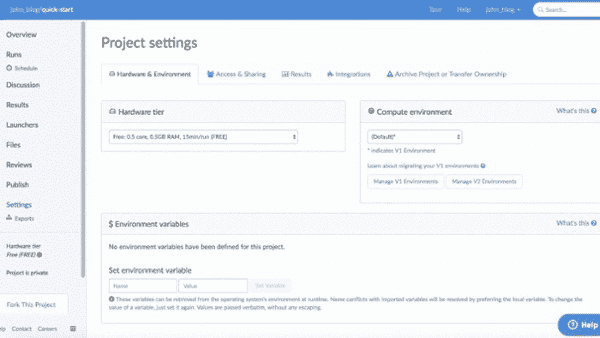
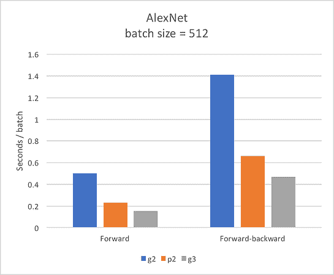
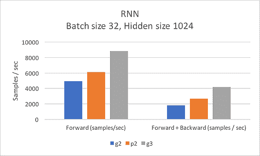

# AWS 中的新 G3 实例——机器学习值得吗？

> 原文：<https://www.dominodatalab.com/blog/new-g3-instances-in-aws-worth-it-for-ml>

我们对 AWS 的新 G3 实例进行了深度学习任务的基准测试，发现它们明显优于旧的 P2 实例。新的 G3 实例现在可以在 Domino 中使用了。

AWS 最近[宣布](https://aws.amazon.com/blogs/aws/new-next-generation-gpu-powered-ec2-instances-g3/)一个新的 GPU 驱动的 EC2 实例类型，G3。这些新的 G3 实例现在在 Domino 上可用，因此您可以使用它们来运行您的数据科学工作负载，只需一次点击和零设置。

## AWS 中基于 GPU 的 EC2 实例

根据 AWS 的说法， [G3](https://aws.amazon.com/blogs/aws/new-next-generation-gpu-powered-ec2-instances-g3/) 实例是为 3D 可视化等图形密集型应用而构建的，而 [P2](https://aws.amazon.com/ec2/instance-types/p2/) 实例是为机器学习和计算金融等通用 GPU 计算而构建的。我们想知道 G3 实例与 P2 实例相比表现如何。对于一些深度学习应用程序来说，价格更高的 G3 实例值得吗？我们将回顾 AWS 基于 GPU 的实例的规范，根据卷积神经网络和递归神经网络对实例进行基准测试，并查看性能与其成本的对比情况。

我们首先比较了支持 G3 实例和 P2 实例的 GPU 的规格。G3 实例由 NVIDIA Tesla M60 GPUs 提供支持。M60 GPUs 拥有比 k80 或 K520 GPUss 更新的架构，k80 或 K520 GPU 分别支持 AWS P2 和 G2 实例，因此您可以期待更好的性能。但是，神经网络中的 GPU 性能是许多因素的组合:

*   大量的 CUDA 内核将会增加计算的并行性。
*   当您训练神经网络时，GPU 上的大内存大小将让您拥有更大的批处理大小。
*   高内存带宽将允许您快速与 CPU 通信。如果你拥有世界上最高性能的 GPU，却不能将 GPU 上的信息快速传回 CPU，那么你最终将为每一批付出巨大的成本，并减缓训练过程。
*   时钟速度是一个 CUDA 内核每秒的计算次数，因此时钟速度越高越好。

下面是驱动 AWS 上不同 EC2 实例的 GPU 的规格。

| EC2 实例类型 | GPU 卡 | GPU 总数 | # CUDA 核心 | 存储容量 | 存储带宽 | 时钟速度 |
| --- | --- | --- | --- | --- | --- | --- |
| G2 Esports 电子竞技俱乐部 | NVIDIA GRID K520 | 2 个开普勒 | Three thousand and seventy-two | 8 GB 的 GDDR5 | 320 GB/秒 | 800 兆赫 |
| P2 | 英伟达特斯拉 K80 | 2 个开普勒 | Four thousand nine hundred and ninety-two | 24 GB 的 GDDR5 | 480 GB/秒 | 875 兆赫 |
| 自交第三代 | 英伟达特斯拉 M60 | 2 个麦克斯韦 | Four thousand and ninety-six | 16 GB 的 GDDR5 | 320 GB/秒 | 930 兆赫 |Table 1\. GPU specifications for GPU-powered EC2 instances on AWS.

我们使用已经在 Domino 中设置好的计算环境对新的 G3 实例进行了测试，并预装了 CUDA 驱动程序和 Tensorflow。我们通过改变硬件层来迭代使用 G3、P2 和 G2 实例，同时选择`GPU tools`计算环境来运行我们的代码。

## 卷积神经网络基准

我们使用 Tensorflow 中的 [AlexNet 基准来比较所有 3 个实例的性能。尽管 CUDA 内核数量更少，内存大小更小，内存带宽更小，但 G3 实例的性能仍然优于 P2 实例。](https://github.com/soumith/convnet-benchmarks)

新的 G3 实例在训练 AlexNet 方面显然更快，Alex net 是卷积神经网络的标准基准。在价格上值得吗？

我们研究了性能的相对提高和价格的相对提高，答案似乎是肯定的从长远来看，G3 实例值得更高的成本，特别是如果你要训练一些大型卷积神经网络。

| 实例类型 | 向前-向后 | AWS 小时价格 | 相对性能改进 | 相对成本增加 | 相对性能/相对成本 |
| --- | --- | --- | --- | --- | --- |
| G2 Esports 电子竞技俱乐部 | One point four one | $0.65 | one | one | one |
| P2 | Zero point six six | $0.90 | Two point one four | One point three eight | One point five four |
| 自交第三代 | Zero point four seven | $1.14 | Three point zero two | One point seven five | One point seven two |Table 2\. Relative performance and cost of GPU instances for AlexNet training

## 递归神经网络基准

我们还想看看 Tensorflow 中的递归神经网络，以及它们如何在 3 个可用的 GPU 实例中使用 [RNN，一个流行的基准](https://github.com/glample/rnn-benchmarks)来执行。

| 实例类型 | 向前+向后(每秒采样数) | AWS 小时价格 | 相对性能改进 | 相对成本增加 | 相对性能/相对成本 |
| --- | --- | --- | --- | --- | --- |
| G2 Esports 电子竞技俱乐部 | One thousand eight hundred and thirty-four | Zero point six five | one | one | one |
| P2 | Two thousand six hundred and seventy-five | Zero point nine | One point four six | One point three eight | One point zero five |
| 自交第三代 | Four thousand one hundred and seventy-seven | One point one four | Two point two eight | One point seven five | One point three |Table 3\. Relative performance and cost of GPU instances for RNN training

同样，G3 实例在训练 RNN 方面明显比 G2 和 P2 实例更快，所有新实例增加的成本是值得的…勉强。因此，根据 RNN 基准测试，如果你要运行一个大型的 RNN 模型，使用 G3 实例很可能会为你省下一大笔钱。