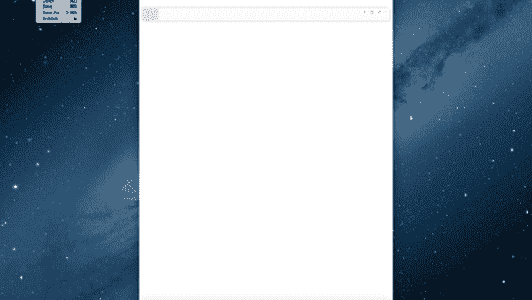
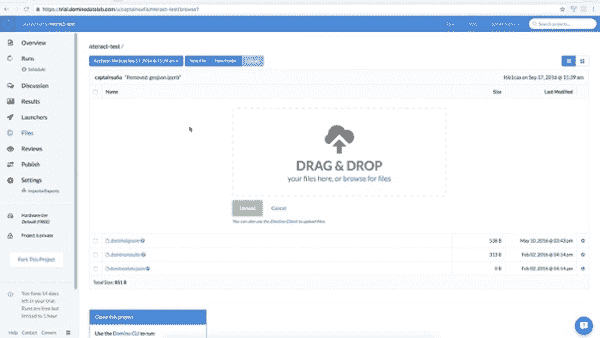

# nteract:一个开源的、基于桌面的交互式计算应用程序

> 原文：<https://www.dominodatalab.com/blog/nteract-an-open-source-desktop-based-interactive-computing-application>

今天，我们与 Plot.ly 的合作伙伴一起，宣布对开源项目[interact](https://github.com/nteract/nteract)的重大投资。nteract 是一个基于桌面的交互式计算应用程序。

在 Domino，我们是 Jupyter 笔记本项目的超级粉丝。我们广泛使用 Jupyter，从探索销售、营销和运营数据，到与团队分享分析和可视化。Domino 数据科学平台消除了部署笔记本服务器和管理多语言笔记本环境的复杂性。因此，我们的大量客户也在使用 Jupyter。

对于很多用例来说，Jupyter 并不理想。基于浏览器的客户机-服务器模型不容易创建利用本机桌面集成并支持脱机使用的丰富交互式计算应用程序。使用 nteract，您可以创建如下所示的文档，其中包含可执行代码、文本内容和图像，并传达计算叙事。与 Jupyter 不同，您的文档是独立的、跨平台的桌面应用程序，提供无缝的桌面体验和脱机使用。

由于易于使用，nteract 成为向业务用户和数据科学家、研究人员以及其他具有数据科学技术经验的人部署富数据应用程序的理想环境。

nteract 可以运行你现有的 Jupyter 笔记本，无需任何修改，并且支持多种 Jupyter 内核:Python、R、Julia 和 JavaScript。作为一个本地 Jupyter 笔记本，nteract 应用程序可以轻松地保存到 Domino、版本化、共享，并且如果需要，可以在云、VPC 或本地的高性能机器上运行。

这是 nteract 团队和社区贡献者旅程的开始。计划中的增强包括实时、多用户协作，以及连接到远程内核的能力(例如，使用 Domino 的可伸缩计算)。

感谢[凯尔](https://github.com/rgbkrk)、[萨菲娅](https://github.com/captainsafia)和团队为开发 nteract 付出的所有辛勤工作。我们期待着与您合作，在您已经开发的伟大平台上继续发展。

如果您想尝试、了解更多信息或参与项目，请访问 GitHub 上的[interact 项目。](https://github.com/nteract/nteract)