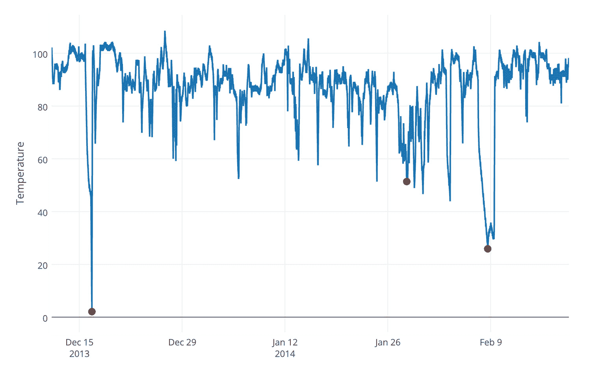
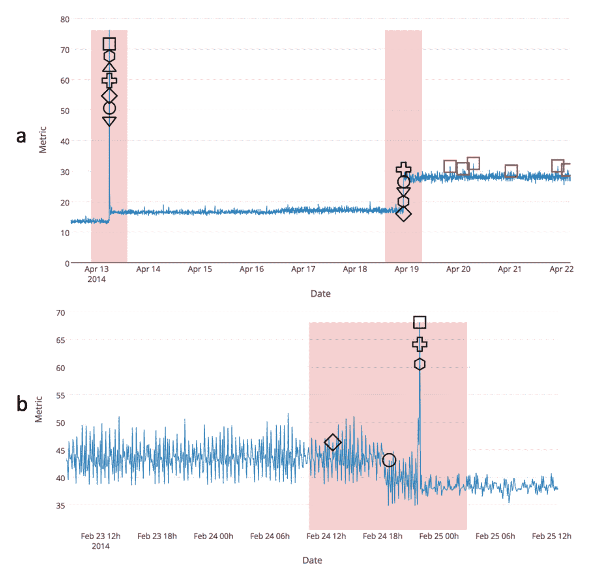
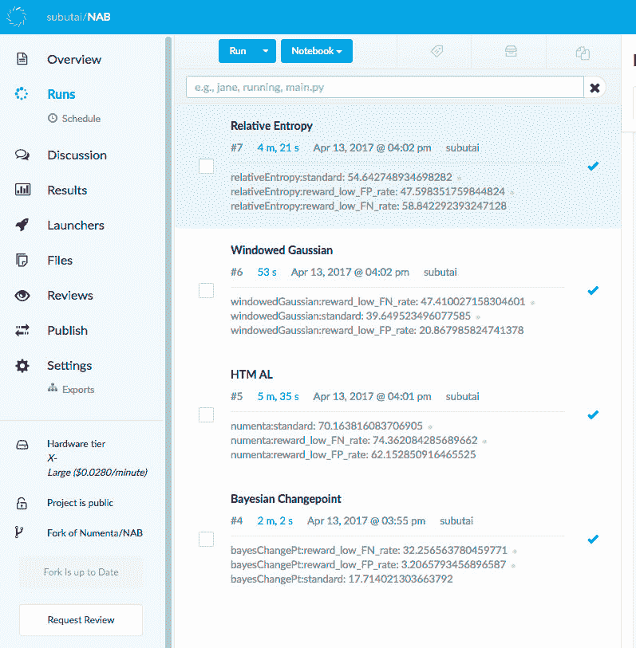

# Numenta 异常基准:流异常检测的基准

> 原文：<https://www.dominodatalab.com/blog/numenta-anomaly-benchmark>

随着传感器侵入我们的日常生活，我们看到流式时序数据的可用性呈指数级增长。在这些数据中发现异常或不寻常的行为可能非常有价值，但是可靠地做到这一点是非常困难的。文献中有几十种异常检测算法，但几乎不可能对它们进行流式评估，因为现有的基准侧重于非流式批量数据。我们创建了开源的 [Numenta 异常基准(NAB)](https://github.com/numenta/NAB) 来填补这个漏洞[1]。NAB 允许我们测试和改进我们自己的算法[2]，还可以与其他公布的算法进行比较。

## 问题是

流媒体应用对机器学习模型提出了一些特殊的限制和挑战。这些应用包括分析实时发生的连续数据序列。与批处理相反，完整的数据集是不可用的。当数据到达时，系统按顺序观察每个数据记录，任何处理或学习必须以在线方式进行。

看看下面的图 1，一个来自传感器的时间序列数据的例子。该图显示了未知指标随时间变化的标量值。您能猜出这个指标是糖尿病患者的血糖水平、财富 500 强公司的股票数量还是其他什么吗？很难判断，但很明显，该图显示数据异常，或偏离正常模式。

*图 1:来自 NAB 语料库的示例数据文件；监控大型、昂贵的工业机器的内部组件温度的数据。红点表示实际的异常。有关这些和其他 NAB 组件的详细信息，请浏览 NAB 存储库。*

纵观整个图，这些异常很容易在事后识别，但在异常发生很久之后才识别是不可接受的。真实世界的异常检测器必须处理流数据，不断学习，并尽快做出准确的检测。

在 NAB 中，我们将实时异常检测算法的理想特征定义如下:

1.  检测必须在线进行；即，在看到未来之前，算法必须将当前状态识别为正常或异常。
2.  该算法必须连续学习，而不需要存储 entire
stream.
3.  该算法必须以无人监管的自动化方式运行，即无需数据标签或手动调整参数。
4.  该算法必须适应动态环境和概念漂移，因为数据流的基本统计可能会改变。
5.  该算法应该尽可能早地检测到异常。
6.  该算法应该最小化假阳性和假阴性(对于批处理场景也是如此)。

## 逮捕

NAB 是用于评估实时异常检测算法的标准开源框架。NAB 由两个主要部分组成:一个带有标记的真实世界时间序列数据的数据集，以及一个为流数据设计的评分系统。该数据集包含来自 IT、工业机器传感器、社交媒体等各种来源的 58 个标记文件(约 365，000 个数据点)。该评分系统是对典型的假阳性假阴性指标的扭曲。它奖励准确的检测器，但也优先考虑那些比其他算法更早检测到异常的检测器。

此外，NAB 储存库现在包括来自大约十种不同异常检测算法的结果。表 1 显示了最新的 NAB 排行榜(详情请参见[资源库](https://github.com/numenta/NAB))。

| 探测器 | 标准配置文件 | 奖励低 FP | 奖励低 FN |
| --- | --- | --- | --- |
| 完美的 | One hundred | One hundred | One hundred |
| HTM·艾尔 | Seventy point one | Sixty-three point one | Seventy-four point three |
| 凯德·OSE | Sixty-nine point nine | Sixty-seven | Seventy-three point two |
| NBA-康特 | Sixty-four point six | Fifty-eight point eight | Sixty-nine point six |
| KNN CAD | Fifty-eight | Forty-three point four | Sixty-four point eight |
| 相对熵 | Fifty-four point six | Forty-seven point six | Fifty-eight point eight |
| HTM PE | Fifty-three point six | Thirty-four point two | Sixty-one point nine |
| Twitter ADVec | Forty-seven point one | Thirty-three point six | Fifty-three point five |
| Etsy 地平线 | Thirty-five point seven | Twenty-seven point one | Forty-four point five |
| 滑动阈值 | Thirty point seven | Twelve point one | Thirty-eight point three |
| 贝叶斯变点 | Seventeen point seven | Three point two | Thirty-two point two |
| 揭露 | Sixteen point four | Three point two | Twenty-six point nine |
| 随意 | Eleven | One point two | Nineteen point five |
| 空 | Zero | Zero | Zero |

*表 1。NAB 记分板显示了 NAB 1.0 版上每个算法的结果。*

图 2 显示了在一个数据文件上运行一些检测器的两个示例。第一个例子显示了持续学习的价值。第二个演示了使用时间流的早期检测。

图 2:该图显示了两个示例 NAB 数据流的检测器结果。在这两种情况下，我们都显示了完整数据流的子集。绘制的形状对应于七种不同检测器的检测:Numenta HTM(圆形)、多元相对熵(菱形)、Twitter ADVec(方形)、Skyline(十字形)、滑动阈值(三角形向上)、贝叶斯在线变点(六边形)和 EXPoSE(三角形向下)。为了清楚起见，对应于相同数据点的形状被垂直隔开。每个窗口(红色阴影区域)内的真阳性检测用黑色标记。所有的误报检测都是红色的。(a)生产服务器 CPU 指标的检测结果。第二个异常显示了一个持续的转变，需要算法来适应新的正常行为。(b)数据流的结果，其中我们看到在数据中的大的、明显的尖峰之前的微妙的时间异常。大多数探测器探测到了大峰值，但有两个探测器能够提供更有价值的早期预警。

## 我们如何使用 Domino

我们在测试各种异常检测算法的过程中广泛使用了 [Domino](https://www.dominodatalab.com/?utm_source=blog&utm_medium=post&utm_campaign=numenta-anomaly-benchmark) 。对于大多数机器学习算法来说，通常有大量的参数需要测试。对于每个参数组合，我们需要在整个语料库上运行该算法。所有算法和所有参数的叉积是一个相当大的空间。Domino 允许我们非常容易地并行探索云中的空间，并跟踪所有结果。图 3 显示了一个样例截图，其中我们并行运行了四种不同的算法。通常每个算法需要几天时间的参数调整反而花了我们几个小时。

*图 3:这个截图展示了一个使用 Domino 和 NAB 的例子。我们能够轻松地并行运行多个算法。我们使用 X-Large 硬件层，这样每次运行可以使用 16 个内核。我们使用 Domino 的诊断统计特性在单个笔记本中查看每次运行的结果。*

上述许多算法的代码也可以在存储库中获得，因此开发人员可以很容易地复制结果，并在自己的数据上尝试各种检测器。随着时间的推移，我们希望 NAB 将被证明是致力于流式异常检测的数据科学家的一个有价值的开放资源。

* * *

### 参考

1.  评估实时异常检测算法 Numenta 异常基准。第 14 国际。糖膏剂马赫。学习。应用程序(IEEE ICMLA'15)。佛罗里达州迈阿密:IEEE2015.出发地:http://arxiv.org/abs/1510.03336
2.  流分析的实时异常检测。2016;出发地:http://arxiv.org/abs/1607.02480