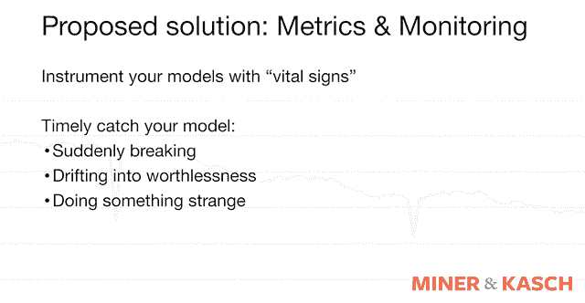
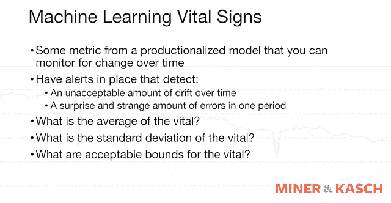
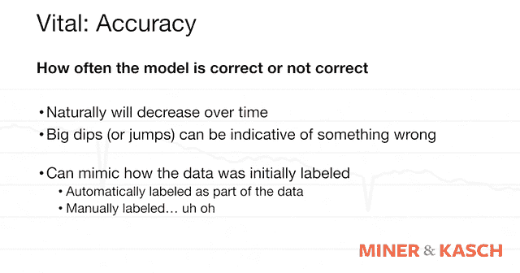
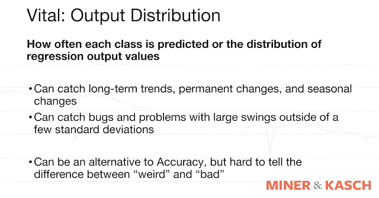

# 论模型驱动:度量和监控

> 原文：<https://www.dominodatalab.com/blog/on-being-model-driven-metrics-and-monitoring>

*本文涵盖了在生产中跟踪机器学习模型时要考虑的几个关键机器学习(ML)生命体征，以确保模型未来的可靠性、一致性和性能。非常感谢 Don Miner 在本文中与 Domino 合作。欲了解本文之外的其他生命体征和见解，请参加[网络研讨会](https://www.brighttalk.com/webcast/17563/373152)。*

## 机器学习模型:疯狂奔跑

许多数据科学家、ML 研究人员和他们的模型驱动组织开发了一个模型来解决一个特定的问题。当模型在生产中“工作”时，他们也可能会感到轻松。然而，当有数百个模型在生产中运行并与现实世界交互时，会发生什么呢？当没有人跟踪模型在实时数据上的表现时会发生什么？不幸的是，随着时间的推移，偏差和方差可能会渗入模型，这可能会导致它们变得毫无价值。这些结果对于产生积极的业务影响并不理想。

在 Domino 寻求加速研究和加强数据科学家对其公司的积极影响时，我们联系了 Don Miner，与他合作举办了一场网络研讨会，“机器学习的重要标志:生产中的度量和监控模型”，该研讨会详细介绍了度量和监控，或生产中机器学习模型的跟踪，以确保模型的可靠性、一致性和未来的性能。Miner 之前作为数据科学家、工程师和首席技术官的经历造就了他独特而务实的观点。这篇博客文章包括幻灯片摘录和几个关键的 ML 生命体征，包括准确性和输出分布，您可以参加[完整的网络研讨会](https://www.brighttalk.com/webcast/17563/373152)，了解更多生命体征和深入见解。

## 什么是 ML 生命体征？

Miner 提倡使用一个生命体征或一个来自生产化模型的可以随时间测量的指标。这超出了传统的衡量标准“模型有效吗？是或否。”这个额外的指标有助于确定随着时间的推移，模型是否在做它们应该做的事情。

## ML 生命体征:准确性

准确性是一个核心的“生命体征”。它解决的问题包括:模型是否准确？正确吗？它正在做它应该做的事情吗？是对的多过错的吗？当根据新数据重新训练模型时，精确度可能会提高，特别是如果 ML 研究人员已经建立了一个系统，每个月左右重新训练模型。然而，随着时间的推移，模型的准确性可能会逐渐降低。

该模型的准确性可能会下降，因为研究人员围绕[超参数调整](https://www.dominodatalab.com/blog/hyperopt-bayesian-hyperparameter-optimization)所做的决定以及初始开发期间使用的模型类型可能会随着时间的推移而不再合适。此外，任何时候准确性出现大幅下降或大幅上升，都可能预示着发生了一些事情。

## ML 生命体征:准确性挑战

对准确性的挑战使得它在某些情况下非常有用，但在其他情况下却没有用。例如，我们如何衡量我们得到的是对还是错？模型产生了一个输出。然而，这个模型预测了一些我们不知道的事情。如果我们不知道在某个时间点的输出应该是多少，那么我们就无法真正测量精度。Miner 引用了一个 HR 员工流失用例作为例子。一家公司试图预测一名员工在未来 18 个月内是否有离职风险。在这 18 个月内，员工离职的可能性百分比以及他们可能离职的时间。18 个月后，公司将知道 18 个月前的模型是否准确。从实用主义的角度来看，18 个月太长了，不能确定你的模型有问题。这是仅依赖某些用例或工作流的准确性所面临的挑战的一个例子。当准确性不够时，可以考虑替代的生命体征。

## ML 生命体征:输出量分布

准确性生命体征的一个替代方法是输出分布。输出分布是计算或总结模型从给定的输入中返回的内容。在分类模型中，这是对模型在生产中输出的输出标签进行计数。在回归模型中，这可能是更复杂的分布、分位数分析或简单的平均值。如果先前模型的输出分布有显著变化，此指标有助于检测问题。要么是世界变化太大导致产出分布改变，要么是模型变化太大导致产出分布改变。无论哪种方式，这都是值得研究的，以确保模型仍然表现良好。这些都是在实际上不知道模型是否正确的情况下完成的，但是仅仅观察行为的变化就可以表明人类应该调查一些事情。

## 结论

由于 Domino 寻求支持数据科学家和研究人员加快他们的工作，我们联系了 Don Miner，以合作举办一场网络研讨会“机器学习的重要特征:生产中的度量和监控模型”。虽然这篇博客文章包括幻灯片摘录和一些关键的 ML“生命体征”，包括准确性和输出分布，但要了解更多生命体征和深入见解，请参加[完整的网络研讨会](https://www.brighttalk.com/webcast/17563/373152)或阅读我们的[关于模型监控的白皮书](https://www.dominodatalab.com/resources/model-monitoring-best-practices/)。

 

[完整的网上研讨会](https://www.brighttalk.com/webcast/17563/373152)涵盖

*   为什么您应该投资时间来监控您的机器学习模型。
*   现实世界中关于不关注模型性能如何随时间变化的一些危险的轶事。
*   您应该为每个模型收集的指标，以及它们通过生命体征列表告诉您的内容，它们提供的价值以及如何衡量它们。
*   生命体征，包括分类标签随时间的分布、回归结果的分布、偏差的测量、方差的测量、先前模型的输出变化以及准确性随时间的变化。
*   监视模型随时间漂移的实现策略。