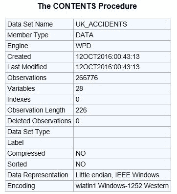
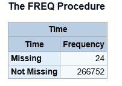

# 面向 SAS 用户的 python:Pandas 数据分析库

> 原文：<https://www.dominodatalab.com/blog/pandas-for-sas-users-part-1>

*这篇文章是兰迪·贝当古的 *[Python 为 SAS 用户准备的](http://nbviewer.jupyter.org/github/RandyBetancourt/PythonForSASUsers/tree/master/)* 快速入门指南的[章节](http://nbviewer.jupyter.org/github/RandyBetancourt/PythonForSASUsers/blob/master/Chapter%2004%20--%20Pandas%2C%20Part%201.ipynb)。Randy 写这个指南是为了让 SAS 用户熟悉 Python 和 Python 的各种科学计算工具。* 

## 熊猫简介

本章介绍*熊猫*库(或包)。pandas 为 Python 开发者提供了高性能、易于使用的数据结构和数据分析工具。这个包是基于 NumPy(读作“numb pie”)构建的，NumPy 是一个基础科学计算包，它提供了一个用于数组运算的高性能对象`ndarray`。我们将举例说明一些有用的数字对象，以此来说明熊猫。

对于数据分析任务，我们经常需要将不相似的数据类型分组在一起。例如，使用带有频率的字符串对分类数据进行分组，使用整数和浮点数对连续值进行计数。此外，我们希望能够将标签附加到列、透视数据等。

我们首先引入`Series`对象作为`DataFrame`对象的组件。系列可以被认为是一个带索引的一维数组，类似于一列值。数据帧可以被认为是一个由行和列索引的二维数组。一个很好的类比是通过行和列位置可寻址的 Excel 单元格。

换句话说，数据帧看起来很像 SAS 数据集(或关系表)。下表比较了熊猫组件和 SAS 中的组件。

| 熊猫 | **SAS** |
| --- | --- |
| 数据帧 | SAS 数据集 |
| 排 | 观察 |
| 圆柱 | 可变的 |
| 群组依据 | 按组 |
| 圆盘烤饼 | **。** |
| 薄片 | 子集 |
| 轴 0 | 观察 |
| 轴 1 | 圆柱 |

`DataFrame`和`Series`索引在第 6 章“理解索引”中有详细介绍。

## 导入包

为了开始利用 pandas 对象，或者任何其他 Python 包中的对象，我们首先通过名称将库导入到我们的名称空间中。为了避免重复输入完整的包名，请使用标准别名`np`表示 NumPy，使用`pd`表示 pandas。

```py
import numpy as np
import pandas as pd
from numpy.random import randn
from pandas import Series, DataFrame, Index
from IPython.display import Image
```

## 系列

一个`Series`可以被认为是一个带有标签的一维数组。该结构包括一个标签索引，用作定位值的键。`Series`中的数据可以是任何数据类型。熊猫数据类型在[这里](http://nbviewer.jupyter.org/github/RandyBetancourt/PythonForSASUsers/blob/master/Chapter%2003%20%20--%20Data%20Types%20and%20Formatting.ipynb)有详细介绍。在 SAS 示例中，我们使用数据步长`ARRAY` s 作为`Series`的模拟。

首先创建一个随机值`Series`:

```py
s1 = Series(randn(10))
print(s1.head(5))
```

```py
0   -0.467231

1   -0.504621

2   -0.122834

3   -0.418523

4   -0.262280

dtype: float64
```

请注意，索引起始位置从 0 开始。大多数 SAS 自动变量像`_n_`都用 1 作为索引开始位置。SAS `DO loop 0 to 9`结合`ARRAY`的迭代产生数组下标越界错误。

在下面的 SAS 示例中，`DO`循环用于遍历数组元素来定位目标元素。

SAS 中的数组主要用于一起迭代处理类似的变量。SAS/IML 更类似于 NumPy 阵列。 [SAS/IML](http://support.sas.com/documentation/cdl/en/imlug/68150/HTML/default/viewer.htm#imlug_imlstart_toc.htm) 不在[这些例子](https://gist.github.com/60e35332fc40e2be46a186ac3672b876)的范围内。

```py
0.4322317772

0.5977982976

0.7785986473

0.1748250183

0.3941470125
```

一个`Series`可以有一个索引标签的[列表](http://nbviewer.jupyter.org/github/RandyBetancourt/PythonForSASUsers/blob/master/Chapter%2002%20--%20Data%20Structures.ipynb#list)。

```py
s2 = Series(randn(10), index=["a", "b", "c", "d", "e", "f", "g", "h", "i", "j"])
print(s2.head(5))

```

```py
a   -1.253542

b    1.093102

c   -1.248273

d   -0.549739

e    0.557109

dtype: float64
```

`Series`由整数值索引，起始位置为 0。

```py
print(s2[0])
```

```py
-1.25354189867
```

SAS 示例使用一个`DO`循环作为数组的下标。

```py
0.4322317772
```

返回`Series`中的前 3 个元素。

```py
print(s2[:3])
```

```py
a   -1.253542

b    1.093102

c   -1.248273

dtype: float64
```

```py
0.4322317772

0.5977982976

0.7785986473
```

该示例有两个操作。`s2.mean()`方法计算平均值，然后进行小于该计算平均值的布尔测试。

```py
s2[s2 < s2.mean()]
```

```py
a   -1.253542

c   -1.248273

d   -0.549739

h   -2.866764

i   -1.692353

dtype: float64
```

`Series`而其他对象都有使用点(.)链式语法。`.name`是`Series`对象的多个属性之一。

```py
s2.name="Arbitrary Name"
print(s2.head(5))

```

```py
a   -1.253542

b    1.093102

c   -1.248273

d   -0.549739

e    0.557109

Name: Arbitrary Name, dtype: float64
```

## DataFrames

如前所述，`DataFrames`是带有标签的类似关系的结构。或者，一个单列的`DataFrame`是一个`Series`。

和 sa 一样，`DataFrames`有不同的创作方法。可以通过从其他 Python 对象加载值来创建数据帧。还可以从一系列非 Python 输入源加载数据值，包括。csv 文件、DBMS 表、Web API，甚至 SAS 数据集(. sas7bdat)等。细节在[第 11 章-熊猫读者](http://nbviewer.jupyter.org/github/RandyBetancourt/PythonForSASUsers/blob/master/Chapter%2011%20--%20Panda%20Readers.ipynb)中讨论。

从读取`UK_Accidents.csv`文件开始。它包含从 2015 年 1 月 1 日到 2015 年 12 月 31 日在英国发生的交通事故数据。的。csv 文件位于[这里](https://github.com/RandyBetancourt/PythonForSASUsers/blob/master/data/uk_accidents.csv)。

一年中的每一天都有多个报告，其中的值大部分是整数。另一个。CSV 文件在这里找到将值映射到描述性标签。

## 阅读。csv 文件

下面的示例中使用了默认值。pandas 为许多读者提供了用于控制缺失值、日期解析、行跳转、数据类型映射等的参数。这些参数类似于 SAS 的`INFILE/INPUT`处理。

注意附加的反斜杠`\\`来规范化窗口的路径名。

```py
file_loc2 = "C:\Data\uk_accidents.csv"
df = pd.read_csv(file_loc2, low_memory=False)
```

`PROC IMPORT`用来读同。csv 文件。这是 SAS 读取. csv 文件的几种方法之一。这里我们采用了默认值。

```py
NOTE: The file 'c:\data\uk_accidents.csv' is:

      File Name 'c:\data\uk_accidents.csv',

      Lrecl=32760, Recfm=V
```

```py
NOTE: 266776 records were read from file 'c:\data\uk_accidents.csv'
 The minimum record length was 65
 The maximum record length was 77
 NOTE: Data set "WORK.uk_accidents" has 266776 observation(s) and 27 variable(s)
```

与 SAS 不同，Python 解释器在正常执行时主要是静默的。在调试时，调用方法和函数来返回关于这些对象的信息是很有帮助的。这有点类似于在 SAS 日志中使用`PUT`语句来检查变量值。

下面显示了`size`、`shape`和`ndim`属性(分别为单元格数、行数/列数和维数)。

```py
print(df.size, df.shape, df.ndim)
```

```py
7202952 (266776, 27) 2
```

## 读取验证

读完一个文件后，你常常想了解它的内容和结构。DataFrame `.info()`方法返回 DataFrame 属性的描述。

```py
df.info()
```

```py
<class 'pandas.core.frame.DataFrame'>

RangeIndex: 266776 entries, 0 to 266775

Data columns (total 27 columns):

Accident_Severity               266776 non-null int64

Number_of_Vehicles              266776 non-null int64

Number_of_Casualties            266776 non-null int64

Day_of_Week                     266776 non-null int64

Time                            266752 non-null object

Road_Type                       266776 non-null int64

Speed_limit                     266776 non-null int64

Junction_Detail                 266776 non-null int64

Light_Conditions                266776 non-null int64

Weather_Conditions              266776 non-null int64

Road_Surface_Conditions         266776 non-null int64

Urban_or_Rural_Area             266776 non-null int64

Vehicle_Reference               266776 non-null int64

Vehicle_Type                    266776 non-null int64

Skidding_and_Overturning        266776 non-null int64

Was_Vehicle_Left_Hand_Drive_    266776 non-null int64

Sex_of_Driver                   266776 non-null int64

Age_of_Driver                   266776 non-null int64

Engine_Capacity__CC_            266776 non-null int64

Propulsion_Code                 266776 non-null int64

Age_of_Vehicle                  266776 non-null int64

Casualty_Class                  266776 non-null int64

Sex_of_Casualty                 266776 non-null int64

Age_of_Casualty                 266776 non-null int64

Casualty_Severity               266776 non-null int64

Car_Passenger                   266776 non-null int64

Date                            266776 non-null object

dtypes: int64(25), object(2)

memory usage: 55.0+ MB
```

在 SAS 中，同样的信息通常可以在`PROC CONTENTS`的输出中找到。




## 检查

pandas 有用于检查数据值的方法。DataFrame `.head()`方法默认显示前 5 行。默认情况下，`.tail()`方法显示最后 5 行。行计数值可以是任意整数值，例如:

```py
# display the last 20 rows of the DataFrame
df.tail(20)
```

SAS 使用`FIRSTOBS`和`OBS`选项和程序来确定输入观测值。打印 uk _ accidents 数据集的最后 20 个观察值的 SAS 代码是:

```py
df.head()
```

```py
5 rows × 27 columns
```

`OBS=n`在 SAS 中确定用作输入的观察值的数量。

```py
The output from PROC PRINT is not displayed here.
```

下面的单元格中显示了按列划分的范围输出。列列表类似于`PROC PRINT`中的`VAR`语句。注意这个语法的双方括号。此示例说明了按列标签进行切片。切片机也是成排工作的。方括号`[]`是切片操作符。详细说明[这里](http://pandas.pydata.org/pandas-docs/stable/indexing.html#slicing-ranges)

```py
df[["Sex_of_Driver", "Time"]].head(10)
```

|   | 司机的性别 | 时间 |
| --- | --- | --- |
| Zero | one | seven o'clock pm |
| one | one | seven o'clock pm |
| Two | one | half past six p.m. |
| three | Two | half past six p.m. |
| four | one | half past six p.m. |
| five | one | ten to six p.m. |
| six | one | ten to six p.m. |
| seven | one | five past seven |
| eight | one | five past seven |
| nine | one | half past twelve |

请注意 DataFrame 默认索引(从 0 到 9 递增)。这类似于 SAS 自动变量 *n* 。稍后，我们将说明如何使用数据帧中的其他列作为索引。

下面是 SAS 程序，打印数据集的前 10 个观察值以及变量 Sec_of_Driver 和 Time。

```py
The output from PROC PRINT is not displayed here.
```

## 处理缺失数据

在分析数据之前，一个常见的任务是处理缺失数据。pandas 使用两个名称来表示丢失的数据，`NaN`(不是数字)和 Python `None`对象。

下面的单元格使用 Python `None`对象来表示数组中缺少的值。反过来，Python 推断数组的数据类型是对象。不幸的是，对数组使用带有聚合函数的 Python `None`对象会引发错误。

```py
s1 = np.array([32, None, 17, 109, 201])
s1
```

```py
array([32, None, 17, 109, 201], dtype=object)
```

```py
s1.sum()
```

```py
---------------------------------------------------------------------------
TypeError                                 Traceback (most recent call last) in <module>
----> 1  s1.sum()

/opt/anaconda3/envs/reporting_env/lib/python3.8/site-packages/numpy/core/_methods.py in _sum(a, axis, dtype, out, keepdims, initial, where)
 45 def _sum(a, axis=None, dtype=None, out=None, keepdims=False,
 46          initial=_NoValue, where=True):
---> 47  return umr_sum(a, axis, dtype, out, keepdims, initial, where)
 48 
 49 def _prod(a, axis=None, dtype=None, out=None, keepdims=False,

TypeError: unsupported operand type(s) for +: 'int' and 'NoneType'
```

为了减少上面提到的错误，在下面的数组示例中使用`np.nan`(缺失值指示器)。另请注意，与上面两个单元格的相同示例相比，Python 是如何为数组选择浮点(或向上转换)的。

```py
s1 = np.array([32, np.nan, 17, 109, 201])
print(s1)
s1.dtype
```

```py
[  32\.   nan   17\.  109\.  201.]
```

`dtype('float64')` 

并非所有使用`NaN`的算术运算都会产生`NaN`。

```py
s1.mean()
```

```py
nan
```

将上面单元格中用于计算数组元素平均值的 Python 程序与下面的 SAS 示例进行对比。SAS 排除缺失值，并利用剩余的数组元素来计算平均值。

```py
89.75
```

## 缺失值标识

回到我们的数据框架，我们需要分析所有列的缺失值。Pandas 提供了四种检测和替换缺失值的方法。它们是:

`isnull()`生成一个布尔掩码来指示缺失值

| **方法** | **采取的行动** |
| `notnull()` | 与`isnull()`相反 |
| `dropna()` | 返回数据的筛选版本 |
| `fillna()` | 返回填充或估算缺失值的数据副本 |

我们将在下面详细讨论其中的每一个。

解决缺失数据分析的典型 SAS 编程方法是编写一个程序，使用计数器变量通过`IF` / `THEN`测试缺失值来遍历所有列。

这可以遵循下面输出单元格中的示例。df.columns 返回数据帧中的列名序列。

```py
for col_name in df.columns:
    print(col_name, end="---->")
    print(sum(df[col_name].isnull()))
```

```py
Accident_Severity---->0

Number_of_Vehicles---->0

Number_of_Casualties---->0

Day_of_Week---->0

Time---->24

Road_Type---->0

Speed_limit---->0

Junction_Detail---->0

Light_Conditions---->0

Weather_Conditions---->0

Road_Surface_Conditions---->0

Urban_or_Rural_Area---->0

Vehicle_Reference---->0

Vehicle_Type---->0

Skidding_and_Overturning---->0

Was_Vehicle_Left_Hand_Drive_---->0

Sex_of_Driver---->0

Age_of_Driver---->0

Engine_Capacity__CC_---->0

Propulsion_Code---->0

Age_of_Vehicle---->0

Casualty_Class---->0

Sex_of_Casualty---->0

Age_of_Casualty---->0

Casualty_Severity---->0

Car_Passenger---->0

Date---->0
```

虽然这给出了期望的结果，但是还有更好的方法。

另外，如果你发现自己正在考虑使用迭代处理来解决 pandas 操作(或者 Python ),停下来花点时间做研究。很有可能，一个方法或函数已经存在了！

典型的例子如下图所示。它将`.sum()`属性链接到`.isnull()`属性，以返回数据帧中的列的缺失值的计数。

对于缺少的值，`.isnull()`方法返回`True`。通过将`.sum()`方法链接到`.isnull()`方法，它为每一列产生缺失值的计数。

```py
df.isnull().sum()
```

```py
Accident_Severity                0

Number_of_Vehicles               0

Number_of_Casualties             0

Day_of_Week                      0

Time                            24

Road_Type                        0

Speed_limit                      0

Junction_Detail                  0

Light_Conditions                 0

Weather_Conditions               0

Road_Surface_Conditions          0

Urban_or_Rural_Area              0

Vehicle_Reference                0

Vehicle_Type                     0

Skidding_and_Overturning         0

Was_Vehicle_Left_Hand_Drive_     0

Sex_of_Driver                    0

Age_of_Driver                    0

Engine_Capacity__CC_             0

Propulsion_Code                  0

Age_of_Vehicle                   0

Casualty_Class                   0

Sex_of_Casualty                  0

Age_of_Casualty                  0

Casualty_Severity                0

Car_Passenger                    0

Date                             0

dtype: int64
```

为了识别缺失值，下面的 SAS 示例使用`PROC`格式来绑定缺失值和非缺失值。缺省情况下，缺失值表示为(*)。*)表示数值，空白(“”)表示字符变量。因此，这两种类型都需要用户定义的格式。

`PROC FREQ`与自动变量`_CHARACTER_`和`_NUMERIC_`一起使用，为每个变量类型生成一个频率列表。

只显示了 SAS 输出的一部分，因为为每个变量产生了单独的输出。与上面的 Python `for`循环示例一样，`time`变量是唯一缺少值的变量。



另一种检测缺失值的方法是使用链接属性`.isnull().any()`的`axis=1`参数按列进行搜索。然后沿着列执行操作。

```py
null_data = df[df.isnull().any(axis=1)]
null_data.head()
```

```py
5 rows × 27 columns
```

## 缺失值替换

下面的代码用于并排呈现多个对象。它来自杰克·范德普拉斯的《数据处理的基本工具》。它显示对象更改的“之前”和“之后”效果。

```py
class display(object):
    """Display HTML representation of multiple objects"""
    template = """<div style="float: left; padding: 10px;">
<p style="font-family: 'Courier New', Courier, monospace;">{0}</p> {1}</div>""" 
def __init__(self, *args):
    self.args = args

def _repr_html_(self):
    return "\n".join(self.template.format(a, eval(a)._repr_html_()) for a in self.args)

def __repr__(self):
    return "\n".join(a + "" + repr(eval(a)) for a in self.args)
```

为了说明`.fillna()`方法，考虑下面创建一个数据帧。

```py
df2 = pd.DataFrame([["cold","slow", np.nan, 2., 6., 3.],
["warm", "medium", 4, 5, 7, 9],
["hot", "fast", 9, 4, np.nan, 6],
["cool", None, np.nan, np.nan, 17, 89],
['"cool","medium",, 16, 44, 21, 13],
["cold","slow", np.nan, 29, 33, 17]],
columns=["col1", "col2", "col3", "col4", "col5", "col6"],
index=(list('abcdef')))
display("df2")
```

df2

|   | col1 | 第二栏 | col3 | col4 | col5 | col6 |
| --- | --- | --- | --- | --- | --- | --- |
| a | 寒冷 | 慢的 | 圆盘烤饼 | Two | Six | Three |
| b | 温暖的 | 媒介 | Four | Five | Seven | Nine |
| c | 热的 | 快的 | Nine | Four | 圆盘烤饼 | Six |
| d | 凉爽的 | 没有人 | 圆盘烤饼 | 圆盘烤饼 | Seventeen | Eighty-nine |
| e | 凉爽的 | 媒介 | Sixteen | Forty-four | Twenty-one | Thirteen |
| f | 寒冷 | 慢的 | 圆盘烤饼 | Twenty-nine | Thirty-three | Seventeen |

```py
df_tf = df2.isnull()
display("df2", "df_tf")

```

df2

|   | col1 | 第二栏 | col3 | col4 | col5 | col6 |
| --- | --- | --- | --- | --- | --- | --- |
| a | 寒冷 | 慢的 | 圆盘烤饼 | Two | Six | Three |
| b | 温暖的 | 媒介 | Four | Five | Seven | Nine |
| c | 热的 | 快的 | Nine | Four | 圆盘烤饼 | Six |
| d | 凉爽的 | 没有人 | 圆盘烤饼 | 圆盘烤饼 | Seventeen | Eighty-nine |
| e | 凉爽的 | 媒介 | Sixteen | Forty-four | Twenty-one | Thirteen |
| f | 寒冷 | 慢的 | 圆盘烤饼 | Twenty-nine | Thirty-three | Seventeen |

|   | col1 | 第二栏 | col3 | col4 | col5 | col6 |
| --- | --- | --- | --- | --- | --- | --- |
| a | 错误的 | 错误的 | 真实的 | 错误的 | 错误的 | 错误的 |
| b | 错误的 | 错误的 | 错误的 | 错误的 | 错误的 | 错误的 |
| c | 错误的 | 错误的 | 错误的 | 错误的 | 真实的 | 错误的 |
| d | 错误的 | 真实的 | 真实的 | 真实的 | 错误的 | 错误的 |
| e | 错误的 | 错误的 | 错误的 | 错误的 | 错误的 | 错误的 |
| f | 错误的 | 错误的 | 真实的 | 错误的 | 错误的 | 错误的 |

默认情况下，`.dropna()` 方法会删除找到空值的整行或整列。

```py
df3 = df2.dropna()
display("df2", "df3")
```

df2

|   | col1 | 第二栏 | col3 | col4 | col5 | col6 |
| --- | --- | --- | --- | --- | --- | --- |
| a | 寒冷 | 慢的 | 圆盘烤饼 | Two | Six | Three |
| b | 温暖的 | 媒介 | Four | Five | Seven | Nine |
| c | 热的 | 快的 | Nine | Four | 圆盘烤饼 | Six |
| d | 凉爽的 | 没有人 | 圆盘烤饼 | 圆盘烤饼 | Seventeen | Eighty-nine |
| e | 凉爽的 | 媒介 | Sixteen | Forty-four | Twenty-one | Thirteen |
| f | 寒冷 | 慢的 | 圆盘烤饼 | Twenty-nine | Thirty-three | Seventeen |

df3

|   | col1 | 第二栏 | col3 | col4 | col5 | col6 |
| --- | --- | --- | --- | --- | --- | --- |
| b | 温暖的 | 媒介 | Four | Five | Seven | Nine |
| e | 凉爽的 | 媒介 | Sixteen | Forty-four | Twenty-one | Thirteen |

`.dropna()`方法也适用于列轴。`axis = 1`或`axis = 'columns'`相当。

```py
df4 = df2.dropna(axis="columns")
display("df2", "df4")
```

df2

|   | col1 | 第二栏 | col3 | col4 | col5 | col6 |
| --- | --- | --- | --- | --- | --- | --- |
| a | 寒冷 | 慢的 | 圆盘烤饼 | Two | Six | Three |
| b | 温暖的 | 媒介 | Four | Five | Seven | Nine |
| c | 热的 | 快的 | Nine | Four | 圆盘烤饼 | Six |
| d | 凉爽的 | 没有人 | 圆盘烤饼 | 圆盘烤饼 | Seventeen | Eighty-nine |
| e | 凉爽的 | 媒介 | Sixteen | Forty-four | Twenty-one | Thirteen |
| f | 寒冷 | 慢的 | 圆盘烤饼 | Twenty-nine | Thirty-three | Seventeen |

df4

|   | col1 | col6 |
| --- | --- | --- |
| a | 寒冷 | Three |
| b | 温暖的 | Nine |
| c | 热的 | Six |
| d | 凉爽的 | Eighty-nine |
| e | 凉爽的 | Thirteen |
| f | 寒冷 | Seventeen |

显然，这丢弃了相当数量的“好”数据。`thresh`参数允许您为行或列指定非空值的最小值。在这种情况下，删除行“d ”,因为它只包含 3 个非空值。

```py
df5 = df2.dropna(thresh=5)
display("df2", "df5")
```

df2

|   | col1 | 第二栏 | col3 | col4 | col5 | col6 |
| --- | --- | --- | --- | --- | --- | --- |
| a | 寒冷 | 慢的 | 圆盘烤饼 | Two | Six | Three |
| b | 温暖的 | 媒介 | Four | Five | Seven | Nine |
| c | 热的 | 快的 | Nine | Four | 圆盘烤饼 | Six |
| d | 凉爽的 | 没有人 | 圆盘烤饼 | 圆盘烤饼 | Seventeen | Eighty-nine |
| e | 凉爽的 | 媒介 | Sixteen | Forty-four | Twenty-one | Thirteen |
| f | 寒冷 | 慢的 | 圆盘烤饼 | Twenty-nine | Thirty-three | Seventeen |

df5

|   | col1 | 第二栏 | col3 | col4 | col5 | col6 |
| --- | --- | --- | --- | --- | --- | --- |
| a | 寒冷 | 慢的 | 圆盘烤饼 | Two | Six | Three |
| b | 温暖的 | 媒介 | Four | Five | Seven | Nine |
| c | 热的 | 快的 | Nine | Four | 圆盘烤饼 | Six |
| e | 凉爽的 | 媒介 | Sixteen | Forty-four | Twenty-one | Thirteen |
| f | 寒冷 | 慢的 | 圆盘烤饼 | Twenty-nine | Thirty-three | Seventeen |

可以估算或替换缺失值，而不是删除行和列。`.fillna()`方法返回空值被替换的`Series`或`DataFrame`。下面的例子将所有的`NaN`替换为零。

```py
df6 = df2.fillna(0)
display("df2", "df6")
```

df2

|   | col1 | 第二栏 | col3 | col4 | col5 | col6 |
| --- | --- | --- | --- | --- | --- | --- |
| a | 寒冷 | 慢的 | 圆盘烤饼 | Two | Six | Three |
| b | 温暖的 | 媒介 | Four | Five | Seven | Nine |
| c | 热的 | 快的 | Nine | Four | 圆盘烤饼 | Six |
| d | 凉爽的 | 没有人 | 圆盘烤饼 | 圆盘烤饼 | Seventeen | Eighty-nine |
| e | 凉爽的 | 媒介 | Sixteen | Forty-four | Twenty-one | Thirteen |
| f | 寒冷 | 慢的 | 圆盘烤饼 | Twenty-nine | Thirty-three | Seventeen |

df6

|   | col1 | 第二栏 | col3 | col4 | col5 | col6 |
| --- | --- | --- | --- | --- | --- | --- |
| a | 寒冷 | 慢的 | Zero | Two | Six | Three |
| b | 温暖的 | 媒介 | Four | Five | Seven | Nine |
| c | 热的 | 快的 | Nine | Four | Zero | Six |
| d | 凉爽的 | Zero | Zero | Zero | Seventeen | Eighty-nine |
| e | 凉爽的 | 媒介 | Sixteen | Forty-four | Twenty-one | Thirteen |
| f | 寒冷 | 慢的 | Zero | Twenty-nine | Thirty-three | Seventeen |

从上面单元格中的例子可以看出，`.fillna()`方法适用于所有 DataFrame 单元格。我们可能不希望用零替换`df['col2']`中缺失的值，因为它们是字符串。使用`.loc`方法将该方法应用于目标列的列表。`.loc`方法的细节在[第 05 章——理解索引](http://nbviewer.jupyter.org/github/RandyBetancourt/PythonForSASUsers/blob/master/Chapter%2005%20--%20Understanding%20Indexes.ipynb#.loc-Indexer)中讨论。

```py
df7 = df2[["col3", "col4", "col5", "col6"]].fillna(0)
display("df2", "df7")
```

df2

|   | col1 | 第二栏 | col3 | col4 | col5 | col6 |
| --- | --- | --- | --- | --- | --- | --- |
| a | 寒冷 | 慢的 | 圆盘烤饼 | Two | Six | Three |
| b | 温暖的 | 媒介 | Four | Five | Seven | Nine |
| c | 热的 | 快的 | Nine | Four | 圆盘烤饼 | Six |
| d | 凉爽的 | 没有人 | 圆盘烤饼 | 圆盘烤饼 | Seventeen | Eighty-nine |
| e | 凉爽的 | 媒介 | Sixteen | Forty-four | Twenty-one | Thirteen |
| f | 寒冷 | 慢的 | 圆盘烤饼 | Twenty-nine | Thirty-three | Seventeen |

df7

|   | col3 | col4 | col5 | col6 |
| --- | --- | --- | --- | --- |
| a | Zero | Two | Six | Three |
| b | Four | Five | Seven | Nine |
| c | Nine | Four | Zero | Six |
| d | Zero | Zero | Seventeen | Eighty-nine |
| e | Sixteen | Forty-four | Twenty-one | Thirteen |
| f | Zero | Twenty-nine | Thirty-three | Seventeen |

基于平均值`df['col6']`的插补方法如下所示。`.fillna()`方法查找并使用这个计算值替换所有出现的`NaN`。

```py
df8 = df2[["col3", "col4", "col5"]].fillna(df2.col6.mean())
display("df2", "df8")
```

df2

|   | col1 | 第二栏 | col3 | col4 | col5 | col6 |
| --- | --- | --- | --- | --- | --- | --- |
| a | 寒冷 | 慢的 | 圆盘烤饼 | Two | Six | Three |
| b | 温暖的 | 媒介 | Four | Five | Seven | Nine |
| c | 热的 | 快的 | Nine | Four | 圆盘烤饼 | Six |
| d | 凉爽的 | 没有人 | 圆盘烤饼 | 圆盘烤饼 | Seventeen | Eighty-nine |
| e | 凉爽的 | 媒介 | Sixteen | Forty-four | Twenty-one | Thirteen |
| f | 寒冷 | 慢的 | 圆盘烤饼 | Twenty-nine | Thirty-three | Seventeen |

df8

|   | col3 | col4 | col5 |
| --- | --- | --- | --- |
| a | 22.833333 | 2.000000 | 6.000000 |
| b | 4.000000 | 5.000000 | 7.000000 |
| c | 9.000000 | 4.000000 | 22.833333 |
| d | 22.833333 | 22.833333 | 17.000000 |
| e | 16.000000 | 44.000000 | 21.000000 |
| f | 22.833333 | 29.000000 | 33.000000 |

相应的 SAS 程序如下所示。`PROC SQL SELECT INTO`子句将变量`col6`的计算平均值存储到宏变量`&col6_mean`中。接下来是一个数据步骤，对数组`x`中的`col3 - col5`进行迭代，并用& col6_mean 替换缺失值。

SAS/Stat 有`PROC MI`用于缺失值的插补，这里描述了一系列方法 [。](https://support.sas.com/documentation/cdl/en/statug/63962/HTML/default/viewer.htm#statug_mi_sect001.htm) `PROC MI`不在这些例子的范围之内。

`.fillna(method='ffill')`是一种“向前”填充方法。`NaN`被上面的相邻单元格替换，向下遍历各列。下面的单元格将上面创建的数据帧`df2`与用“向前”填充方法创建的数据帧`df9`进行对比。

```py
df9 = df2.fillna(method='ffill')
display("df2", "df9")
```

df2

|   | col1 | 第二栏 | col3 | col4 | col5 | col6 |
| --- | --- | --- | --- | --- | --- | --- |
| a | 寒冷 | 慢的 | 圆盘烤饼 | Two | Six | Three |
| b | 温暖的 | 媒介 | Four | Five | Seven | Nine |
| c | 热的 | 快的 | Nine | Four | 圆盘烤饼 | Six |
| d | 凉爽的 | 没有人 | 圆盘烤饼 | 圆盘烤饼 | Seventeen | Eighty-nine |
| e | 凉爽的 | 媒介 | Sixteen | Forty-four | Twenty-one | Thirteen |
| f | 寒冷 | 慢的 | 圆盘烤饼 | Twenty-nine | Thirty-three | Seventeen |

df9

|   | col1 | 第二栏 | col3 | col4 | col5 | col6 |
| --- | --- | --- | --- | --- | --- | --- |
| a | 寒冷 | 慢的 | 圆盘烤饼 | Two | Six | Three |
| b | 温暖的 | 媒介 | Four | Five | Seven | Nine |
| c | 热的 | 快的 | Nine | Four | Seven | Six |
| d | 凉爽的 | 快的 | Nine | Four | Seventeen | Eighty-nine |
| e | 凉爽的 | 媒介 | Sixteen | Forty-four | Twenty-one | Thirteen |
| f | 寒冷 | 慢的 | Sixteen | Twenty-nine | Thirty-three | Seventeen |

同样，`.fillna(bfill)` 也是一种‘反向’填充方法。 `NaN` 被“向上”遍历列的相邻单元格替换。下面的单元格将上面创建的数据帧 `df2` 与用“向后”填充方法创建的数据帧 `df10` 进行对比。

```py
pythondf10 = df2.fillna(method="bfill")
display("df2", "df10")
```

df2

|   | col1 | 第二栏 | col3 | col4 | col5 | col6 |
| --- | --- | --- | --- | --- | --- | --- |
| a | 寒冷 | 慢的 | 圆盘烤饼 | Two | Six | Three |
| b | 温暖的 | 媒介 | Four | Five | Seven | Nine |
| c | 热的 | 快的 | Nine | Four | 圆盘烤饼 | Six |
| d | 凉爽的 | 没有人 | 圆盘烤饼 | 圆盘烤饼 | Seventeen | Eighty-nine |
| e | 凉爽的 | 媒介 | Sixteen | Forty-four | Twenty-one | Thirteen |
| f | 寒冷 | 慢的 | 圆盘烤饼 | Twenty-nine | Thirty-three | Seventeen |

df10

|   | col1 | 第二栏 | col3 | col4 | col5 | col6 |
| --- | --- | --- | --- | --- | --- | --- |
| a | 寒冷 | 慢的 | Four | Two | Six | Three |
| b | 温暖的 | 媒介 | Four | Five | Seven | Nine |
| c | 热的 | 快的 | Nine | Four | Seventeen | Six |
| d | 凉爽的 | 媒介 | Sixteen | Forty-four | Seventeen | Eighty-nine |
| e | 凉爽的 | 媒介 | Sixteen | Forty-four | Twenty-one | Thirteen |
| f | 寒冷 | 慢的 | 圆盘烤饼 | Twenty-nine | Thirty-three | Seventeen |

下面，我们将上面使用“向前”填充方法创建的数据帧`df9`与使用“向后”填充方法创建的数据帧`df10`进行对比。

```py
display("df9", "df10")
```

df9

|   | col1 | 第二栏 | col3 | col4 | col5 | col6 |
| --- | --- | --- | --- | --- | --- | --- |
| a | 寒冷 | 慢的 | 圆盘烤饼 | Two | Six | Three |
| b | 温暖的 | 媒介 | Four | Five | Seven | Nine |
| c | 热的 | 快的 | Nine | Four | Seven | Six |
| d | 凉爽的 | 快的 | Nine | Four | Seventeen | Eighty-nine |
| e | 凉爽的 | 媒介 | Sixteen | Forty-four | Twenty-one | Thirteen |
| f | 寒冷 | 慢的 | Sixteen | Twenty-nine | Thirty-three | Seventeen |

df10

|   | col1 | 第二栏 | col3 | col4 | col5 | col6 |
| --- | --- | --- | --- | --- | --- | --- |
| a | 寒冷 | 慢的 | Four | Two | Six | Three |
| b | 温暖的 | 媒介 | Four | Five | Seven | Nine |
| c | 热的 | 快的 | Nine | Four | Seventeen | Six |
| d | 凉爽的 | 媒介 | Sixteen | Forty-four | Seventeen | Eighty-nine |
| e | 凉爽的 | 媒介 | Sixteen | Forty-four | Twenty-one | Thirteen |
| f | 寒冷 | 慢的 | 圆盘烤饼 | Twenty-nine | Thirty-three | Seventeen |

在删除丢失的行之前，计算上面创建的意外事件数据框架中丢失的记录部分。

```py
print("{} records in the DataFrame will be dropped.".format(df.Time.isnull().sum()))
print("The portion of records dropped is {0:6.3%}".format(df.Time.isnull().sum() / (len(df) - df.Time.isnull().sum())))
```

```py
24 records in the DataFrame will be dropped.
The portion of records dropped is 0.009%
```

除了出现错误的情况之外，`.dropna()`方法是静默的。应用该方法后，我们可以验证数据帧的形状。

```py
print(df.shape)
df = df.dropna()
print(df.shape)
```

```py
(266776, 27)
(266752, 27)
```

## 资源

距离来自 pandas.pydata.org 的熊猫还有 10 分钟。

教程，这个链接下面是熊猫食谱的链接，来自 pandas.pydata.org 的熊猫 0.19.1 文档。

Python 数据分析库的主页。

Jake VanderPlas 的《Python 数据科学手册》,处理数据的基本工具。

[pandas:Python 中的数据处理和分析](http://byumcl.bitbucket.org/bootcamp2013/labs/pandas.html)来自 2013 年 BYU MCL 训练营文档。

Greg Reda 介绍熊猫数据结构。这是一个由三部分组成的系列，用电影镜头数据集很好地阐释了熊猫。

小抄:位于爱达荷大学网站上的熊猫数据框对象。

[处理缺失数据](http://pandas.pydata.org/pandas-docs/stable/missing_data.html) pandas 0.19.1 文档。

## 读这本书

这篇文章摘自 Randy Betancourt *Python 为 SAS 用户编写的*快速入门指南。查看完整的[章节列表。](http://nbviewer.jupyter.org/github/RandyBetancourt/PythonForSASUsers/tree/master/)