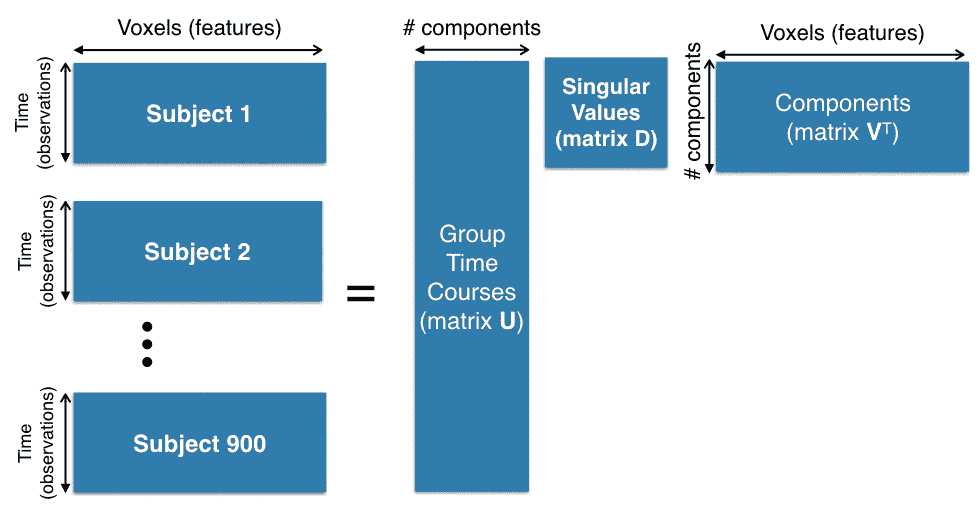
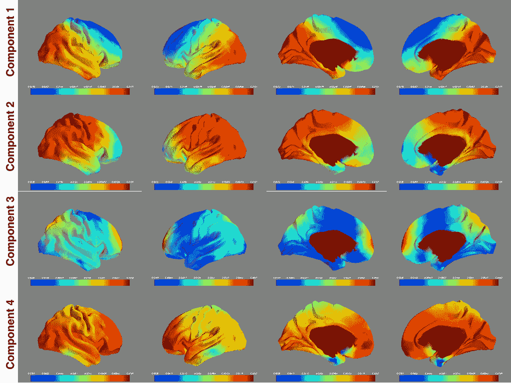

# 使用 Apache Spark 分析大型神经影像数据集

> 原文：<https://www.dominodatalab.com/blog/pca-on-very-large-neuroimaging-datasets-using-pyspark>

## 基于 PySpark 的神经影像数据主成分分析

在这篇文章中，我们将描述我们如何通过 [Domino 的数据科学平台](https://www.dominodatalab.com/product/domino-data-science-platform/)使用 PySpark 来分析高维神经成像数据中的主导成分。我们将演示如何在一个足够大的数据集上执行主成分分析(PCA ),标准的单机技术将无法工作。

PCA 是机器学习、数据分析和统计中广泛使用的工具。PCA 的目标是在低维空间中表示数据。PCA 对于去噪以及数据中主要线性趋势的数据探索是有用的。作为设置的一部分，PCA 确保返回的维度是正交的，并捕捉数据中最大的变化方向。^(【2】)

## 什么是主成分分析？

为了描述 PCA，我们将从具有 *m* 个特征和 *n* 个观察值的数据集开始，表示为具有 *m* 行和 *n* 列的矩阵 *X* 。让我们还假设我们已经从每个特征中减去了一个常数，这样得到的特征都具有平均值 *0* 。

我们的目标是找到最能捕捉数据集中跨观测值变化的 *d* 向量，用矩阵 *Z* 表示，矩阵中有 *d* 个不相关的行和 *n* 个列。有两种方法可以找到这种数据汇总:使用样本协方差矩阵，以及使用奇异值分解(SVD)。

### 使用协方差矩阵的 PCA

具体来说，我们将使用样本协方差矩阵的特征值分解。样本协方差矩阵是\ begin { equation } c _ { xx } = \ frac { 1 } { n } x x^t\end{equation}，其中$C_{ij}$ entry 是第$ I $-个要素与第$ j $-个要素之间的协方差。我们的目标是找到一个矩阵$P$将$X$投影到一个低维子空间上

\ begin { equation }
z = \ mathbf { p } x \ label { eqn:projection }
\ end { equation }
其中$ z $ $ c _ { ZZ } $的协方差矩阵是对角的(相当于$\bZ$的行彼此正交):
\ begin { equation }
c _ { ZZ } = \ frac { 1 } { n } z z^t = p c _ { xx } p^t = d \ label { eqn:diagonal _ condition }
和\end{equation}

由于$$C_{xx}$$是对称矩阵，特征值分解可以表示为:

\ begin { equation }
c _ { xx } = e d e^t
\ end { equation }

其中 *E* 是正交矩阵，每列是$$C_{xx}$$的特征向量。代入{eqn: diagonal_condition}，我们可以看到，设置$$P = E^T$$满足 *D* 上的条件。因此，我们通过设置$$Z = E^T X$$得到我们的主成分。

### 使用奇异值分解的 PCA

我们不需要使用样本协方差矩阵来获得最大主成分。定义$ $ y = \frac{1}{\sqrt{n}}x^t$$；因此,$\bY$的每一列的平均值为零。从线性代数中，我们可以将$\bY$分解成三个矩阵
\begin{equation}
Y =美国 V^T
\end{equation}
其中$\bU$是$ n \乘以 k$，而$\bV$是$ k \乘以$m$$和$$S$$是$ k \乘以 k$，大约是$k$。$k$称为矩阵的秩。如果我们仔细观察$$Y^TY$$的产品

* * *

\ begin { align }
y^ty&= \ frac { 1 } { n } x x^t = c _ { xx } \
&= v s^2 v^t
\ end { align }

* * *

*V* 的列不仅是$Y^TY$的特征向量；它们也是$C_{xx}$的特征向量。因此， *V* 可以是用于计算$Z$的投影矩阵:$Z = V^T X$。

奇异值分解通常优于协方差矩阵的特征分解，因为协方差矩阵的计算是误差源。在奇异值分解中，对于如此大的数据集，我们对由于数字的动态范围或计算误差引起的误差更加鲁棒。

## 玩具示例

### 协方差矩阵

让我们从一个玩具例子开始

\ begin { equation }
X = \ begin { array } { CCC } 0&2&4 \ 1&0&0 \ 0&3&0 \ 7&4&6 \ 0&5&7【end { array }
\ end { equation }

其中每一列都是另一个五维随机变量的观测值。让我们计算$ \ bx $:
\ begin { align }
c _ { xx } = \ frac { 1 } { 3 } \ left(x-{ \ mu } \ right)\ left(x-{ \ mu } \right)^t
\ end { align }

其中五维向量

\ begin { align }
{ \ mu } \ mbox { \ stack rel { \ triangle } { = } } \ left[\ begin { array } { ccccc } 2&0.33&1&5.6&4 \ end { array } \right]^t
\ end { align }

是所有观察值的平均值。因此，协方差矩阵为:

\ begin { align }
C _ { xx } = \ left[\ begin { array } { ccccc } 2.66&-0.66&0&-0.66&4.66 \
-0.66&0.22&-0.33&0.44&-1.33
0&-0.33&2&

而特征值分解是:
\ begin { equation }
c _ { xx } = e d e^t
\ end { equation }

在哪里

\ begin { align }
E = \ left[\ begin { array } { cc }-0.44&-0.28 \
0.13&-0.05 \
-0.12&0.76 \
0.21&-0.56 \
-0.84&-0.11 \ end { array } \ right】
\ end { align }

和

\ begin { align }
D = \ left[\ begin { array } { cc } 12&0 \ 0&3.1 \ end { array } \ right]。
\end{align}

有 2 个特征向量，因为$X$的秩是 2，并且$\bE$的每一列表示一个特征向量，该特征向量按照矩阵$\bD$的对角元素中表示的特征值的幅度排序。如果我们要在二维空间中表示$\bX$，我们需要做的就是将$X$乘以$e^t$:
\ begin { align }
z&= p x \ label { eqn:z } \
\&= e^t x \
&= \ left[\ begin { array } { CCC } 1.64&-4.64&-6.42 \
-4.01&-1.11&
\end{align}

如果您希望您的输出在列之间为零均值，您可以将$E^T$乘以$ x-m $:
\ begin { align }
【z _&= e^t \左(x-m \右)\ label { eqn:zzeromean } \
&= \左[\ begin { array } { CCC } 4.79&-1.5&-3.28
-0.52&2.37&-1.88
%&= \ left[\ begin { array } { CCC } 4.79&-1.5&-3.28 \
%-0.52&2.37&-1.84 \ end { array } \ right]。
\end{align}

### 奇异值分解

按照我们在第 1.2 节中的符号，矩阵$Y$是:
\ begin { align }
y&= \ frac { 1 } { \ sqrt { t } } x^t \
&= \ frac { 1 } { sqrt { 3 } } \ left[\ begin { array } { ccccc } 0&1&0&7&0 \
2&0&3&4&
\end{align}
计算奇异值分解结果:
\begin{equation}
Y =美国 V^T
\end{equation}

其中$ U = \ left[\ begin { array } { cc } 0.79 &-0.17 \-0.25 & 0.77 \-0.54 &-0.60 \ end { array } \ right]$和$ \ bV = \ left[\ begin { array } \ cc }-0.44 &-0.28 \【中

注意矩阵$V$和$E$是等价的，如 1.2 节所讨论的。

## 实施 PCA

### 使用 scikit-learn

下面的代码演示了使用 scikit-learn 的 PCA。这些结果与我们在第 2 节中给出的理论结果一致，除了组分的符号。这不是问题，因为符号不会影响组件的方向。

```py
import numpy as np

from sklearn.decomposition import PCA

x = np.array([[0.0, 1.0, 0.0, 7.0, 0.0], [2.0, 0.0, 3.0, 4.0, 5.0], 

             4.0, 0.0, 0.0, 6.0, 7.0], dtype=object)

pca = PCA(n_components=2, whiten=False)

pca.fit(x)
```

```py
PCA(copy=True, n_components=2, whiten=False)
```

### 组件(矩阵 V)

```py
pca.components_.transpose()
```

```py
array([[-0.44859172, -0.28423808],

       [ 0.13301986, -0.05621156],

       [-0.12523156,  0.76362648],

       [ 0.21650757, -0.56529588],

       [-0.84765129, -0.11560341]])
```

### 二维表示(矩阵 Z)

```py
pca.transform(x)
```

```py
array([[ 4.79037684, -0.5239389 ],

       [-1.50330032,  2.37254653],

       [-3.28707652, -1.84860763]])
```

### 协方差矩阵

```py
pca.get_covariance()
```

```py
array([[ 4.00000000e+00, -1.00000000e+00,  3.62064830e-15,

        -1.00000000e+00,  7.00000000e+00],

       [-1.00000000e+00,  3.33333333e-01, -5.00000000e-01,

         6.66666667e-01, -2.00000000e+00],

       [ 3.82368329e-15, -5.00000000e-01,  3.00000000e+00,

        -2.50000000e+00,  1.50000000e+00],

       [-1.00000000e+00,  6.66666667e-01, -2.50000000e+00,

         2.33333333e+00, -3.00000000e+00],

       [ 7.00000000e+00, -2.00000000e+00,  1.50000000e+00,

        -3.00000000e+00,  1.30000000e+01]])

```

### 使用 PySpark

如前所述，我们正在使用大型数据集。Scikit-learn 将在试图对这样的数据集计算 PCA 的单台计算机上崩溃。因此，我们期待 PySpark 来分配 PCA 的计算。

#### 方法一:Spark 的 ML 包

下面的代码展示了 PySpark 中使用 Spark 的 ML 包的 PCA。转换后的矩阵看起来与 sklearn 的结果不同。这是因为 sklearn 减去输入的平均值，以确保输出为零平均值。但是，PySpark 中的 PCA 模块将转换应用于原始输入。基本上，sklearn 计算$ \ bZ _ { zero mean } $(equation \ ref { eqn:Zzeromean })，PySpark 计算$\bZ$ (equation \ref{eqn:Z})。

```py
import os

import sys

# Path for Spark Source folder

os.environ['SPARK_HOME'] = '/Applications/spark-1.6.0-bin-hadoop2.6'

# Append pyspark to Python Path

sys.path.append('/Applications/spark-1.6.0-bin-hadoop2.6/python')

from pyspark import SparkContext

from pyspark import SparkConf

from pyspark.sql import SQLContext
```

#### 在 ML 中使用 Spark 的 PCA 模块

```py
from pyspark.ml.feature import PCA

from pyspark.mllib.linalg import Vectors

sc = SparkContext('local')

sqlContext = SQLContext(sc)

data = [(Vectors.dense([0.0, 1.0, 0.0, 7.0, 0.0]),), 

        Vectors.dense([2.0, 0.0, 3.0, 4.0, 5.0,]),

       Vectors.dense([4.0, 0.0, 0.0, 6.0, 7.0])]

df = sqlContext.createDataFrame(data, ["features"])

pca_extracted = PCA(K=2, inputCol="features", outputCol="pca_features")

model = pca.extracted.fit(df)

features = model.transform(df) # this creates a DataFrame with the regular features and pca_features
```

#### 二维表示(矩阵 Z)

```py
features.select("pca_features").collect()
```

```py
[Row(pca_features=DenseVector([1.6486, -4.0133])),
 Row(pca_features=DenseVector([-4.6451, -1.1168])),
 Row(pca_features=DenseVector([-6.4289, -5.338]))]
```

#### 组件(矩阵 V)

```py
indetity_input = [(Vectors.dense([1.0, .0, 0.0, 0.0]),),

                  (Vectors.dense([.0, 1.0, .0, .0\. .0]),),

                  (Vectors.dense([.0, 0.0, 1.0, .0, .0]),)

                  (Vectors.dense([.0, 0.0, .0, 1.0, .0]),)

                  (Vectors.dense([.0, 0.0, .0, .0, 1.0]),)]

df_identity = sqlContext.createDataFrame(identity_input, ['features'])

identity_features = model.transform(df_identity)

identity_features.select("pca_features").collect()
```

```py
[Row(pca_features=DenseVector([-0.4486, -0.2842])),
Row(pca_features=DenseVector([0.133, -0.0562])),
Row(pca_features=DenseVector([-0.1252, 0.7636])),
Row(pca_features=DenseVector([0.2165, -0.5653])),
Row(pca_features=DenseVector([-0.8477, -0.1156]))]
```

您可能已经注意到，提取特性需要一个单位矩阵。Spark 的 PCA 模块输出有限，所以为了能够看到组件，我们必须对特征使用虚拟转换。

#### 方法 2:通过包装 Java/Scala 实现 SVD

在 Spark 1.6.0 中，我们可以使用 Spark 的 mllib 包中的一些模块来计算 SVD。然而，Spark 中的 SVD 是用 Scala 和 Java 实现的。我们借助 Elias Abou Haydar 编写的函数为这些 SVD 类制作 PySpark 包装器。^(【1】)

```py
from pyspark.mllib.common import callMLlibFunc, JavaModelWrapper

from pyspark.mllib.linalg.distributed import RowMatrix

from pyspark.mllib.linalg import _convert_to_vector, Matrix, DenseMatrix

from pyspark.ml.feature import StandardScaler

class RowMatrix_new(RowMatrix):

    def multiply(self, matrix):

        &amp;quot;&amp;quot;&amp;quot;

        Multiplies the given RowMatrix with another matrix.

        :param matrix: Matrix to multiply with.

        :returns: RowMatrix

        &amp;gt;&amp;gt;&amp;gt; rm = RowMatrix(sc.parallelize([[0, 1], [2, 3]]))

        &amp;gt;&amp;gt;&amp;gt; rm.multiply(DenseMatrix(2, 2, [0, 2, 1, 3])).rows.collect()

        [DenseVector([2.0, 3.0]), DenseVector([6.0, 11.0])]

        &amp;quot;&amp;quot;&amp;quot;

        if not isinstance(matrix, DenseMatrix):

            raise ValueError(&amp;quot;Only multiplication with DenseMatrix &amp;quot;

                             &amp;quot;is supported.&amp;quot;)

        j_model = self._java_matrix_wrapper.call(&amp;quot;multiply&amp;quot;, matrix)

        return RowMatrix_new(j_model)

class SVD(JavaModelWrapper):

    &amp;quot;&amp;quot;&amp;quot;Wrapper around the SVD scala case class&amp;quot;&amp;quot;&amp;quot;

    @property

    def U(self):

        &amp;quot;&amp;quot;&amp;quot; Returns a RowMatrix whose columns are the left singular vectors of the SVD if computeU was set to be True.&amp;quot;&amp;quot;&amp;quot;

        u = self.call(&amp;quot;U&amp;quot;)

        if u is not None:

            return RowMatrix(u)

    @property

    def s(self):

        &amp;quot;&amp;quot;&amp;quot;Returns a DenseVector with singular values in descending order.&amp;quot;&amp;quot;&amp;quot;

        return self.call(&amp;quot;s&amp;quot;)

    @property

    def V(self):

        &amp;quot;&amp;quot;&amp;quot; Returns a DenseMatrix whose columns are the right singular vectors of the SVD.&amp;quot;&amp;quot;&amp;quot;

        return self.call(&amp;quot;V&amp;quot;)

def computeSVD(row_matrix, k, computeU=False, rCond=1e-9):

    &amp;quot;&amp;quot;&amp;quot;

    Computes the singular value decomposition of the RowMatrix.

    The given row matrix A of dimension (m X n) is decomposed into U * s * V'T where

    * s: DenseVector consisting of square root of the eigenvalues (singular values) in descending order.

    * U: (m X k) (left singular vectors) is a RowMatrix whose columns are the eigenvectors of (A X A')

    * v: (n X k) (right singular vectors) is a Matrix whose columns are the eigenvectors of (A' X A)

    :param k: number of singular values to keep. We might return less than k if there are numerically zero singular values.

    :param computeU: Whether of not to compute U. If set to be True, then U is computed by A * V * sigma^-1

    :param rCond: the reciprocal condition number. All singular values smaller than rCond * sigma(0) are treated as zero, where sigma(0) is the largest singular value.

    :returns: SVD object

    &amp;quot;&amp;quot;&amp;quot;

    java_model = row_matrix._java_matrix_wrapper.call(&amp;quot;computeSVD&amp;quot;, int(k), computeU, float(rCond))

    return SVD(java_model)

def computePCA_sergul(input, numReducedDim):

    &amp;quot;&amp;quot;&amp;quot;

    Computer PCA for a given input using SVD

    :param input: A matrix of dimension num_of_observation x num_of_features

    :param numReducedDim: Dimension of reduced space

    :return: components, projection and singular values

    &amp;quot;&amp;quot;&amp;quot;

    df = sqlContext.createDataFrame(input,[&amp;quot;features&amp;quot;])

    standardizer = StandardScaler(withMean=True, withStd=False,

                              inputCol='features',

                              outputCol='std_features')

    model_normalizer = standardizer.fit(df)

    df_normalized = model_normalizer.transform(df)

    pca_features = df_normalized.select(&amp;quot;std_features&amp;quot;).rdd.map(lambda row : row[0])

    mat = RowMatrix_new(pca_features)

    svd = computeSVD(mat,numReducedDim,True)

    components = svd.call(&amp;quot;V&amp;quot;).toArray() # dim_of_data x reduced dim

    projection = RowMatrix_new((pca_features)).multiply(svd.call(&amp;quot;V&amp;quot;))

    singularValues = svd.call(&amp;quot;s&amp;quot;).toArray()

    return components, projection, singularValues

\end{lstlisting}
```

我们可以将这个框架应用于玩具示例中的相同输入，如下所示。

```py
data = sc.parallelize([(Vectors.dense([0.0, 1.0, 0.0, 7.0, 0.0]),),

                       Vectors.dense([2.0, 0.0, 3.0, 4.0, 5.0,]),

                       Vectors.dense([4.0, 0.0, 0.0, 6.0, 7.0])])

components, projection, singularValues = computePCA_sergul(input=data,

                                                          numReducedDim=2)
```

#### 组件(矩阵 V)

```py
components
```

```py
array([[-0.44859172, -0.28423808],
[0.13301986, -0.5621156],
[-0.12523156, 0.76362648], 
[0.21650757, -0.56529588], 
[-0.84765129, -0.11560341]])
```

#### 二维表示(矩阵 Z)

```py
projection.rows.collect()
```

```py
[DenseVector([4.7904, -0.5239]),
 DenseVector([-1.5033, 2.3725]),
 DenseVector([-3.2871, -1.8486])]
```

#### 奇异值(矩阵 S)

```py
singularValues()
```

```py
array([6.00104109, 3.05300494])
```

这些结果与第二节中的理论结果一致。

## 应用:功能磁共振成像

我们将主成分分析应用于神经成像数据集，以探索人脑中的神经元特征。我们使用了 900 名受试者的静息态功能磁共振成像数据(fMRI ),这些数据是作为人类连接体项目(HCP)的一部分收集的。^(【3】)

这个数据集的预处理超出了本文的范围，但是您可以在图 1 中看到创建数据集所涉及的维度。

每个对象的时间点的数量是 1200，体素的数量是 13000。由于有 900 名受试者，我们需要在大小为 1080000 美元乘以 13000 美元的矩阵上计算奇异值分解(矩阵$\bX^T$在我们的符号中)。



图一。用于 PCA 计算的 900 个主题的串联。

在大小为 1080000 美元乘以 13000 美元的矩阵上计算 SVD 的计算开销很大。因此，我们用 Amazon Web Services 提供的商用硬件来支持 PySpark，并通过 Domino 数据科学平台进行访问。

使用具有 16 个内核和 30GB RAM 的硬件，对整个数据集进行 PCA 需要 27 个小时。图 2 从四个不同的角度展示了前四个组件。

虽然解释这些图像很难，但有两个结论值得注意。这些图谱大致对称，符合大脑静息状态网络的预期。
2。第三个部分在背内侧前额叶皮层和楔前叶有热点，这是默认模式网络的两个关键部分。



图二。用于 PCA 计算的 900 个主题的串联。

## 参考

1.  埃利亚斯·阿布·海登。[http://stack overflow . com/a/33500704/4544800](http://stackoverflow.com/a/33500704/4544800)。2015.
2.  黄邦贤·史伦斯。主成分分析教程。arXiv 预印本
    arXiv:1404.1100 ，2014 年。
3.  stephen m smith，christian f beckmann，Jesper Andersson，edward j auerbach，Janine Bijsterbosch，Gwenaëlle Douaud，Eugene Duff，david a feinberg，Ludovica Griffanti，michael p harms，等,《人类连接组项目中的静息态功能磁共振成像》。*神经影像*，80:144–168，2013。

标题为[“DSC _ 2236”](https://www.flickr.com/photos/eblake/8591312258/)的横幅图片由爱德华·布莱克制作。许可在 [CC 下由 2.0](https://creativecommons.org/licenses/by/2.0/)
乳胶渲染由 [QuickLaTeX](http://quicklatex.com/) 。