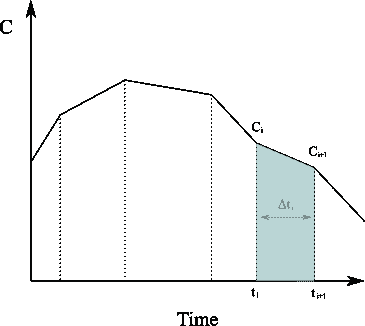
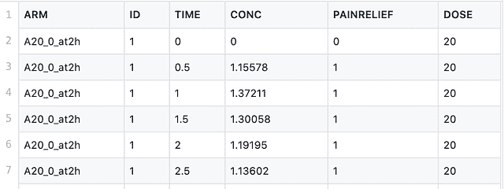
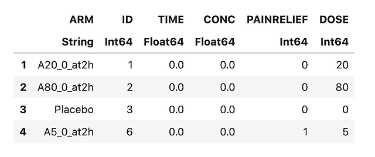
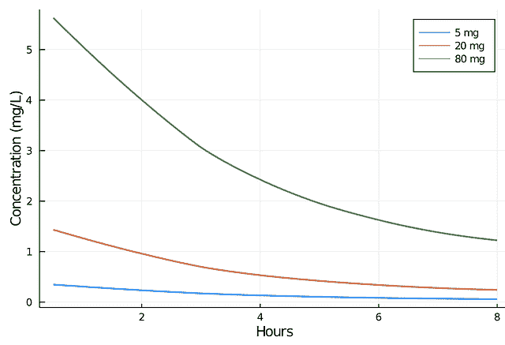
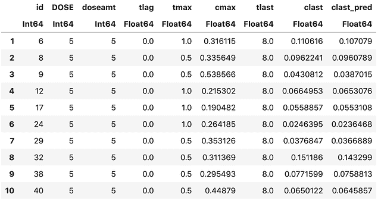
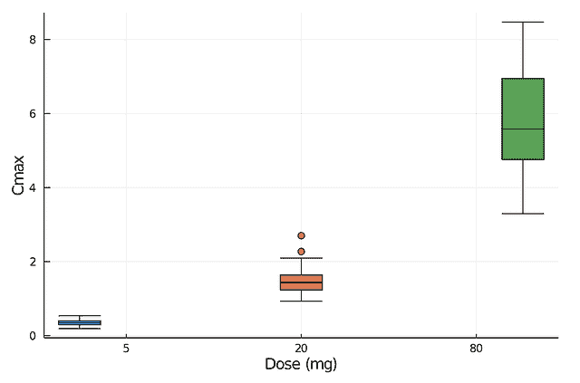

# 与 Julia 和 Pumas AI 一起进行非房室分析

> 原文：<https://www.dominodatalab.com/blog/performing-non-compartmental-analysis-with-julia-and-pumas-ai>

当分析药代动力学数据以确定药物的暴露程度和相关药代动力学参数(如清除率、消除半衰期、最大观察浓度$$C_{max}$、观察到最大浓度的时间$$T_{max}$)时，非房室分析(NCA)通常是首选方法[1]。

## 什么是非房室分析(NCA)？

NCA 的核心是基于对血浆浓度-时间曲线应用数值分析的梯形法则来计算曲线下面积(AUC)和一阶矩曲线下面积(AUMC)。为了计算给定时间间隔的曲线下面积，例如从[latex]t_0[/latex]到最后一次血液样品的时间[latex]t_{last}[/latex]，我们需要求解血浆中浓度变化率作为时间函数的下列积分。

$ $

{auc}=\int_{t_0}^{t_{last}}c(t)dt
$ $



将[latex]C(t)[/latex]图下的区域近似为一系列梯形，并计算它们的面积之和(在[latex]N[/latex]非均匀分布数据点的情况下)由下式给出

$ $

{auc}=\int_{t_0}^{t_{last}}c(t)dt \约\sum_{i=1}^{n}\frac{c(t_{i-1})+c(t_i)}{2}\delta t _ { I }
$ $

第一弯矩曲线下的面积分别为

$ $

{aumc}=\int_{t_0}^{t_{last}} t \乘以 c(t)dt \近似\sum_{i=1}^{n} \ frac { t _ { I-1 } \乘以 c(t _ { I-1 })+t _ I \乘以 c(t _ I)} { 2 } \δt _ I
$ $

计算出 AUC/AUMC 后，我们可以进一步得出一些有用的指标，如:

*   药物从血浆中的总清除率$$CL=\frac{Dose}{AUC}$$
*   平均停留时间$ $ MRT = \ frac { \ text { AUMC } } { \ text { AUC } } $ $
*   终端处置率常数$ $ \λz = \ frac { \ text { CL } } { \ text { volume of distribution } } $ $

NCA 不需要药物或代谢物的特定房室模型的假设；相反，它不需要假设，因此很容易自动化[1]。

制药建模和模拟(或 PUMAS)是一套为制药药物开发进行定量分析的工具[2]。该框架可以促进广泛分析任务，包括但不限于:

*   非房室分析
*   非线性混合效应(NLME)模型的规范
*   使用微分方程或解析解模拟 NLME 模型
*   基于最大似然和贝叶斯方法的 NLME 参数估计
*   模型后处理的模拟和估计诊断
*   多尺度模型的全局和局部灵敏度分析程序
*   生物等效性分析

请注意，Pumas 包含在朱莉娅计算 EULA 中。它可以免费用于教育和研究目的，但其他用途需要获得商业许可证。

## 表演 NCA

本教程将展示在[Domino Enterprise MLOps Platform](https://www.dominodatalab.com/product/domino-enterprise-mlops-platform)中集成和使用 Pumas 是多么容易，我们将使用一个免费提供的数据集进行一个简单的非房室分析。下面显示的分析可以在达美乐试验基地的 [NCA 项目中获得。](https://try.dominodatalab.com/u/nmanchev/NCA)

Domino 数据科学平台使数据科学家能够开发和交付模型，并开放对他们喜欢的工具的访问。Domino Lab 支持使用所有流行的 ide 和笔记本(Jupyter、RStudio、SAS、Zeppelin 等)进行交互式和批处理实验。).在本教程中，我们将使用 JupyterLab。

由于 Domino 数据科学平台的开放性，安装第三方包相当简单。它简单地归结为运行`pip install`、`install.packages()`，或者在朱莉娅- `Pkg.add()`的情况下。在 Pumas AI 的情况下，该包只通过 [JuliaPro](https://juliacomputing.com/) 分发，但设置一个预装 JuliaPro 和 Pumas AI 的[定制计算环境](https://docs.dominodatalab.com/en/4.3.2/reference/environments/index.html)也很简单。

可以理解，本教程的第一步是确认我们可以访问 PumasAI。这是通过启动一个 JupyterLab 工作区并确保我们能够成功地导入分析所需的包来完成的。注意，由于 Julia 使用的超前(JAOT)编译器的性质，导入可能需要一段时间。

```py
using Pumas
using PumasPlots
using CSV
using StatsPlots
using Suppressor
```

一旦所有的包都被导入，我们就可以继续加载我们的测试数据了。在本教程中，我们将使用官方 [Pumas 教程](https://tutorials.pumas.ai/)中的一些免费数据。我们需要的样本数据集在一个名为 pk_painscore.csv 的 CSV 文件中，也可以从 [GitHub](https://github.com/PumasAI/PumasTutorials.jl/blob/master/data/intro/pk_painscore.csv) 下载。



该 CSV 文件包含来自剂量范围试验的数据，该试验将安慰剂与新开发药物的三个剂量进行了比较。正在研究的药物是一种抗炎剂，该研究着眼于自我报告的疼痛缓解和血浆浓度随时间的变化。该研究分为 4 组(包括安慰剂组)，使用 5mg、20mg 和 80mg 的剂量，在 0 时间给药，并跟踪 0、0.5、1、1.5、2、2.5 和 3 至 8 小时的自我报告疼痛缓解和药物浓度。

数据集的属性如下:

*   临床研究的分支机构
*   测量疼痛评分和血浆浓度的时间点(小时)
*   CONC -药物的血浆浓度(毫克/升)
*   疼痛缓解-自我报告的疼痛评分(0 =不痛，1 =轻度疼痛，2 =中度疼痛，3 =重度疼痛)。疼痛评分超过 2 被视为“无缓解”
*   剂量-服用的药物量(毫克)

请注意，研究中药物的最大耐受剂量为每天 160 毫克。如果在给药后 2 小时内没有感觉到疼痛减轻，则允许受试者要求重新给药。

我们使用以下代码将数据加载到 Julia 数据帧中。

```py
pain_df = DataFrame(CSV.File("data/pk_painscore.csv"))
```

We can also check for missing values, although it appears that none are present.

```py
colwise(x -&amp;amp;amp;amp;amp;amp;gt; any(ismissing.(x)), pain_df)
```

Next, we can look at the different arms of the study that are included in the dataset.

```py
unique(pain_df, "ARM")
```



安慰剂组与非房室分析无关，因此我们可以安全地将其移除。

```py
pain_df = filter(row -&amp;amp;gt; (row.ARM != "Placebo"), pain_df)
```

The NCA functions in Pumas require that the observations have an amount (AMT) and route (ROUTE) attributes. The route attribute indicates the route of administration. Possible choices are iv for intravenous, ev for extravascular, and inf for infusion. As the trial drug is not administered via an intravenous route, we'll add a ROUTE column to the data and set it to ev for all observations.

```py
pain_df[:"ROUTE"] = "ev"
```

The requirement for the AMT attribute is that it should contain the relevant drug amount as a floating-point value at each dosing time, and otherwise should be set to missing. As each dose is administered at TIME=0 (the other entries are times of concentration and pain measurement), we create an AMT column as follows:

```py
pain_df[:"AMT"] = ifelse.(pain_df.TIME .== 0, pain_df.DOSE, missing)
```

我们现在可以直观地观察 5、20 和 80mg 浓度的血浆浓度随时间的变化:



接下来，我们调用 Pumas read_nca 函数，该函数创建一个 ncaPopulation 对象，其中包含用于生成所有 NCA 值的预处理数据。有关更多详细信息，请参见解析 PumasNCADF。

```py
pain_nca = read_nca(pain_df,

id = :ID,

time = :TIME,

conc = :CONC,

group = [:DOSE],

route = :ROUTE,

amt = :AMT)
```

现在，我们可以将预处理后的数据传递给 Pumas NCAReport 函数，该函数计算各种相关的 NCA 指标。该函数返回一个 DataFrame，这样我们可以查看它的前十行。

```py
nca_report = NCAReport(pain_nca, sigdig=2)
```



请注意，上面的输出是按列截断的，并且只显示了一小部分指标。让我们看看 NCAReport 计算的所有不同属性。

```py
show(setdiff(names(nca_report), names(pain_df)))
```

```py
"id", "doseamt", "tlag", "tmax", "cmax", "tlast", "clast", "clast_pred", "auclast", "kel", "half_life", "aucinf_obs", "aucinf_pred", "vz_f_obs", "cl_f_obs", "vz_f_pred", "cl_f_pred", "n_samples", "cmax_dn", "auclast_dn", "aucinf_dn_obs", "auc_extrap_obs", "aucinf_dn_pred", "auc_extrap_pred", "aumclast", "aumcinf_obs", "aumc_extrap_obs", "aumcinf_pred", "aumc_extrap_pred", "n_samples_kel", "rsq_kel", "rsq_adj_kel", "corr_kel", "intercept_kel", "kel_t_low", "kel_t_high", "span", "route", "run_status"
```

我们可以研究特定的指标，如最大观察浓度(cmax)和外推观察 AUC (aucinf_obs)。我们可以在单独的数据帧中提取两者。

```py
cmax_auc_df = select(nca_report, [:DOSE, :cmax, :aucinf_obs])
```

We can group by study arm and calculate various statistics as mean and standard deviation.

```py
gdf = groupby(cmax_auc_df, :DOSE);

combine(gdf, :aucinf_obs =&amp;amp;amp;amp;amp;amp;gt; mean, :aucinf_obs =&amp;amp;amp;amp;amp;amp;gt;std, :cmax =&amp;amp;amp;amp;amp;amp;gt; mean, :cmax =&amp;amp;amp;amp;amp;amp;gt; std)
```

我们还可以绘制观察到的最大浓度值，并根据药物剂量直观检查最小值、四分位数、中值和异常值。



有单独的 [NCA 函数](https://docs.pumas.ai/dev/basics/overview/)，允许我们手动计算感兴趣的特定药代动力学测量值。例如:

*   口服后药物从血浆中的总清除率(CL/F)
*   最终处置速率常数(λz)
*   药物颗粒离开控制体积的平均停留时间(MRT)

和许多其他人。我们可以将所有指标合并到一个单独的数据框架中，以便进一步分析。

```py
cl_f = NCA.cl(pain_nca)

lambda_z = NCA.lambdaz(pain_nca)

mrt = NCA.mrt(pain_nca)

metrics_df = innerjoin(cl_f, lambda_z, mrt, on=[:id, :DOSE], makeunique=true)
```

基于我们的初步分析和血浆浓度曲线的单相形态，似乎一个房室模型将符合数据。然后，我们可以继续进行药代动力学建模，测试各种模型的拟合优度。这个例子在最初的 Pumas 教程中得到了进一步的发展:

*   全面介绍美洲狮-第一部分
*   [非房室分析](https://tutorials.pumas.ai/html/nca/nca_introduction.html)

在本教程中，我们演示了如何进行简单的非房室分析。 [Domino Enterprise MLOps 平台](https://www.dominodatalab.com/product/domino-enterprise-mlops-platform)的开放性允许我们使用任何语言、工具和框架，同时提供可再现性、计算弹性、知识发现和治理。因此，运行 Julia 代码并利用像 Pumas AI 这样的第三方框架是相当容易的。这也允许我们提供一个[公开可用的 Domino 项目](https://try.dominodatalab.com/u/nmanchev/NCA)，它包含了本教程中完整的 Julia 代码。鼓励读者注册一个免费的 [Domino 试用账户](https://try.dominodatalab.com/)，派生 [NCA 项目](https://try.dominodatalab.com/u/nmanchev/NCA)，并检查/修改代码以了解更多关于 Domino 平台和 Pumas AI 框架的功能。

#### 参考

[1] Gabrielsson J，Weiner D .非房室分析。方法分子生物学。2012;929:377-89.doi:10.1007/978-1-62703-050-2 _ 16。PMID: 23007438。
【2】Pumas AI 文档，[https://docs . Pumas . AI](https://docs.pumas.ai)
【3】Pumas AI 网站，【https://pumas.ai/products/pumas/overview】T4