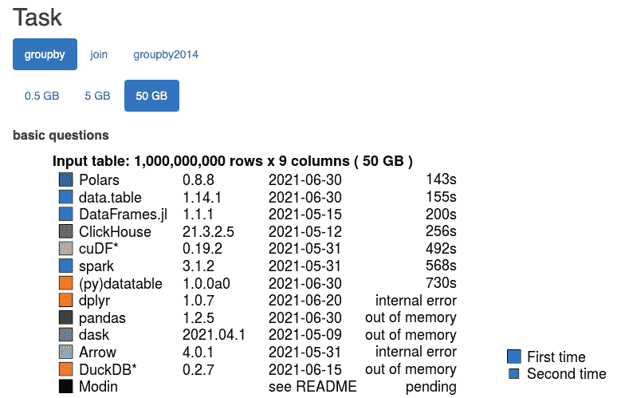
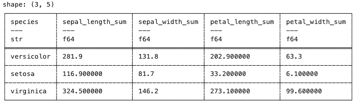
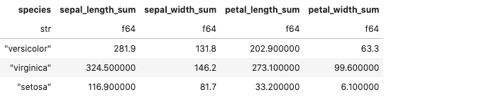
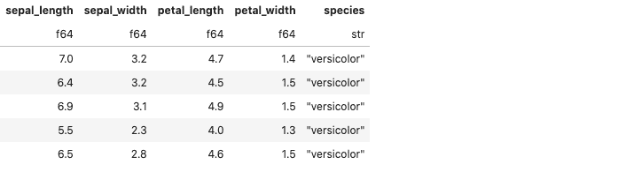
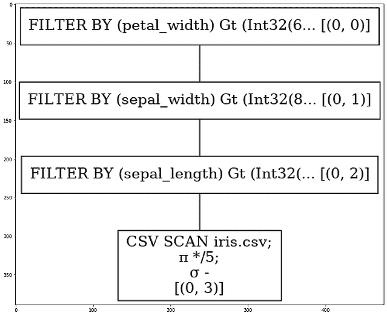
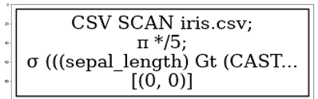
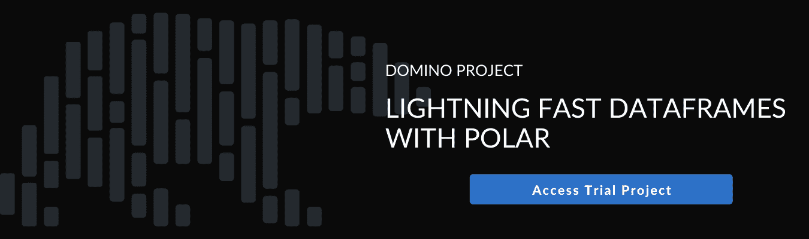

# Polars -一个快如闪电的数据帧库

> 原文：<https://www.dominodatalab.com/blog/polars-a-lightning-fast-dataframes-library>

我们之前已经讨论过最新的 SOTA 模型在计算复杂性方面提出的挑战。我们还谈到了像 [Spark、Dask 和 Ray](https://blog.dominodatalab.com/spark-dask-ray-choosing-the-right-framework) 这样的框架，以及它们如何使用并行化和 GPU 加速来帮助应对这一挑战。

Polars 项目由 Ritchie Vink 于 2020 年 3 月启动，是并行数据处理领域的一个新项目。如果你已经在想 Polars 是不是又一个 Dask，让我向你保证，没有什么比这更偏离事实了。Dask 试图并行化现有的单线程库(想想 NumPy 和 Pandas)，Polars 是在考虑性能和并行化的基础上从头开始编写的。还有两个关键因素使得这个框架非常独特。

## 使用偏光板的优点

首先也是最重要的，Polars 是用 Rust 编写的——一种为性能和安全而设计的语言，接近于“金属”。这使得框架在性能方面具有优势，因为 Rust 编程语言允许完全控制在这种情况下最重要的功能，即内存访问和 CPU 多线程。此外，Rust 还带来了一个额外的好处，即以一种安全的方式完成这两项工作，在编译时捕获问题，而不是在运行时抛出危险的错误。不言而喻，因为 Polars 是在 Rust 中开发的，所以在 Python 和 Rust 中都可以使用。

其次，Polars 由 [Apache Arrow](https://github.com/apache/arrow) 支撑——一个提供标准化的面向列的内存结构和内存计算的框架。Arrow 的内存格式是为高效的平面和分层数据操作量身定制的，并解决了我们在 Pandas 中观察到的较差性能，特别是数据接收和数据导出。

使用 Apache Arrow 的一个主要好处是它的 IPC 文件可以在本地进行内存映射，这允许您处理比内存大的数据，并跨语言和进程共享数据。这里强调的是分享。例如，如果您从 Pandas 转到 Spark，即使所有数据都是本地操作的，您实际上也是在执行复制和转换操作(通过 Parquet)。这种序列化/反序列化类似于可怕的 Spark shuffle 操作，我们知道这会引入大量开销，有经验的 Spark 开发人员会不惜一切代价避免这种操作。另一方面，Arrow 将所有数据保存在共享内存对象存储中，并使其跨进程可用。这种零拷贝方法使得在进程和语言之间共享数据的速度快如闪电。

与细分市场中的其他产品相比，高效的内存组织、高速缓存处理和底层优化为 Polars 带来了巨大的性能优势。H2O.ai 最近的一项独立基准测试显示，Polars 在 50GB 测试中的 groupby 和 join 操作都优于其他参与者。



## 使用 Python 中的极坐标

因为 Polars 依赖于 Arrow，所以它利用了 Arrow 的列数据格式。有趣的是，Polars 既有急切的 API，也有懒惰的 API。eager API 的体验类似于您对 Pandas 的期望，而 lazy API 更像 SQL，更类似于 Spark API。lazy API 特别令人感兴趣，因为它对整个查询应用了抢先优化，从而提高了性能并减少了内存占用。这种优化的典型例子是标准 SQL 中的一系列过滤子句。一种典型的非优化方法是顺序运行所有语句，产生许多数据帧，其中每个过滤操作都实现一个新的内存结构。另一方面，Polars 可以透明地合并所有单独的滤波条件，并在数据读取阶段一次性应用滤波。

```py
import polars as pl

df = pl.read_csv("iris.csv")

print(df.filter(pl.col("sepal_length") > 5)

        .groupby("species")

        .agg(pl.all().sum()))
```

正如我们已经提到的，Polars 是用 Rust 写的。然而，它确实提供了一个 [Python 包装器](https://pola-rs.github.io/polars/py-polars/html/reference/) ，并且具有与 NumPy 和 Pandas 的互操作性。我们先来看 eager API。下面的例子摘自该项目的 [官方文档](https://pola-rs.github.io/polars-book/user-guide/introduction.html) 。



将它转换成 lazy API 相当简单。我们需要做的就是用 lazy()开始查询，如下所示。

```py
(

df.lazy()

  .filter(pl.col("sepal_length") > 5)

  .groupby("species")

  .agg(pl.all()
  .sum())

  .collect()

)
```



注意，您需要使用 collect()或 fetch()来触发实际的执行。如果您习惯于 PySpark 中的惰性求值(即 collect()和 take()的行为)，这听起来会很熟悉

我们还可以很容易地看到查询优化的影响，因为 Polars 可以向我们展示单个查询的执行计划。让我们构造以下查询:

```py
q1 = (

  pl.scan_csv("iris.csv")

    .filter(pl.col("sepal_length") > 2)

    .filter(pl.col("sepal_width") > 1.5)

    .filter(pl.col("petal_width") > 1)

)

q1.fetch(5)
```



我们现在可以让 Polars 向我们展示未优化的执行计划，看起来像这样:

```py
q1.show_graph(optimized=False)
```



我们看到，在这种情况下，FILTER BY 语句被顺序应用，导致多个数据帧的构造。另一方面，使用优化会极大地改变计划:

```py
q1.show_graph(optimized=True)
```



我们看到，在第二种情况下，选择应用于 CSV 扫描级别，并且在初始数据读取期间跳过不必要的行，从而移除不必要的下游过滤操作。

## 摘要

本文的目的是介绍 Polars 作为加速数据帧领域的另一个入口。该项目相对年轻，但一直在稳步增长，绝对是您应该考虑的数据科学工具箱中的东西。Polars 的创建者 Ritchie Vink 表示，目前正在进行的一些关键改进包括:

*   为类似 SQL 的查询提供最佳性能
*   拥有声明式可预测 API
*   能够用小得多的 API 表面做熊猫能做的事情

请记住，与其他旨在替代熊猫的项目不同(例如，我想到了摩丁)，Polars 的主要设计目标是速度和存储效率，而不是兼容性。熟悉熊猫的人会撞见几个没有索引之类的怪事，但你遇到的都不会觉得特别别扭。同样重要的是要注意 Polars 数据帧不能跨越多台机器。Polars 的亮点在于利用了一个强大实例的多核和内存。它完美地填补了这个笨拙的空间，你的数据对熊猫来说太大，但对 Spark 来说又太小。

## 额外资源

您可以查看以下附加资源:

*   Polars 官方文档-[https://pola-RS . github . io/polars-book/user-guide/introduction . html](https://pola-rs.github.io/polars-book/user-guide/introduction.html)
*   注册一个[免费的 Domino 帐户](https://try.dominodatalab.com),访问 Polaris 和额外的代码示例，让你开始使用这个框架。一旦你的账户创建完成，点击下面的按钮打开 Polars 项目并开始。

[](https://cta-redirect.hubspot.com/cta/redirect/6816846/b7619e84-a274-4918-8264-29f43fbd7df4)