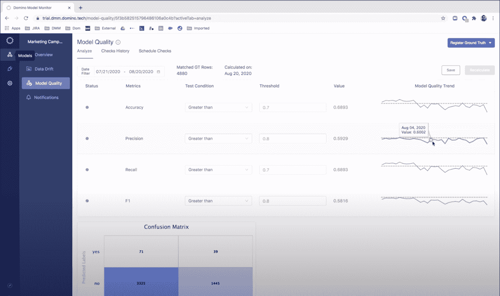
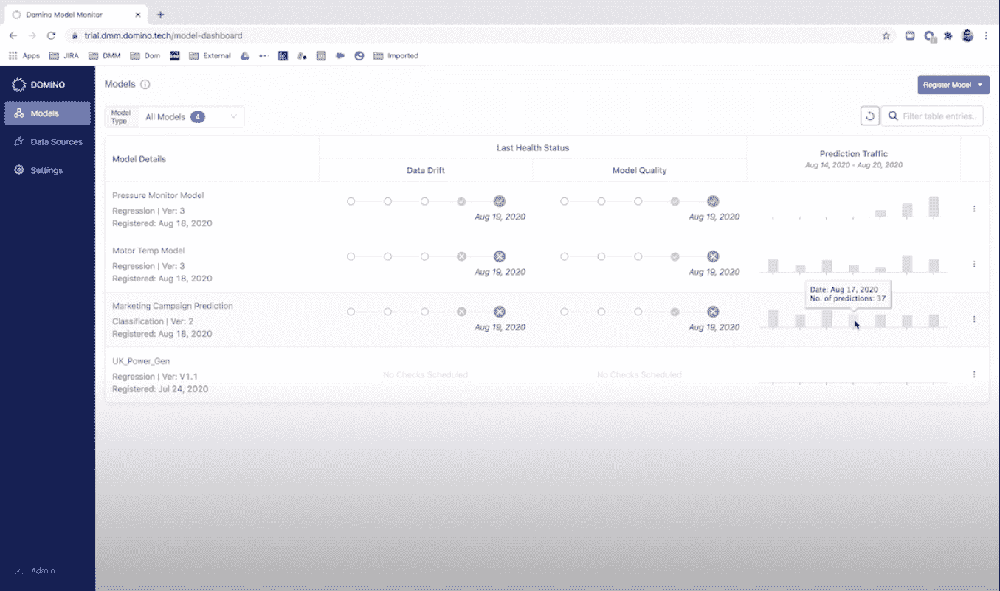

# Domino 模型监视器(DMM)的强大新功能

> 原文：<https://www.dominodatalab.com/blog/powerful-new-capabilities-for-domino-model-monitor-dmm>

By Bob Laurent, Senior Director, Product Marketing, Domino Data Lab on September 04, 2020 in [Product Updates](/blog/product-updates/)

本周我们[宣布了](https://www.dominodatalab.com/news/domino-4-3-embraces-red-hat-openshift-making-it-easier-for-enterprises-to-scale-secure-data-science-workloads-on-any-platform/)Domino 的数据科学平台 Domino 4.3 的最新版本，这与它在基础设施和安全性方面的关键投资相一致，以支持企业数据科学家和大规模数据科学的需求。我们还宣布了激动人心的模型监控产品[的强大新功能，Domino 模型监控器(DMM)](https://www.dominodatalab.com/product/domino-model-monitor/) 。DMM 是[在 2020 年 6 月](https://www.dominodatalab.com/blog/domino-model-monitor-a-single-place-to-monitor-the-health-of-all-your-models/)随 Domino 4.2 推出的，它让组织能够自动监控生产中的机器学习模型，以降低财务损失和客户体验下降的风险。

随着世界上数据的变化，机器学习预测会随着时间而发展。这个问题被称为“数据漂移”，它会降低模型的准确性，通常会被忽视，直到它对业务成果产生负面影响。DMM 创建了一个“单一平台”来监控整个组织中所有模型的性能，而不管这些模型是在哪里开发或部署的。

在当今前所未有的时代，模型监控尤为重要；公司的重要模型是根据来自完全不同的经济环境的数据训练出来的，当时人类行为是“正常的”，在 COVID 之前。借助 DMM，您可以识别与培训数据不同的生产数据(即数据漂移)、缺失信息和其他问题，并在更大的问题出现之前采取纠正措施。要了解更多关于模型监控的信息和一些你可以遵循的最佳实践，以确保你的模型以最佳状态运行，请查看最近的博客。

我们已经看到很多客户对 DMM 感兴趣，既有现有的 Domino 客户，也有全新的潜在客户，他们将 DMM 视为模型监控策略的核心。在 Domino 4.3 中，我们向 DMM 添加了强大的功能，使得维护高性能模型变得更加容易。

### 新的趋势分析功能

DMM 可以测量模型自训练以来经历的变化量，并在变化超过您设置的阈值时发出警报。这种持续的监控能力将您(以及其他数据科学家和 ML 工程师)从不断监控生产中的每个模型中解放出来，并专注于其他增值工作。现在，当您收到警报并希望进一步调查时，新的趋势分析功能可让您深入了解模型预测(模型输出)的质量如何随时间变化。此分析可以突出显示最近的模型降级是否是由一次性事件引起的(例如，库存短缺、临时商店关闭、数据管道问题等)。)或者是否已经逐渐退化。

### 新交通图

新的流量图表提供了对模型预测量和随时间推移的真实数据的深入了解。这些图表可以突出显示特定型号是否异常活跃，以便于故障排除。流量图表在与数据漂移分析功能结合使用时，可以帮助您有效地甄别潜在的模型降级问题。有了这个功能，您现在不仅可以更深入地了解模型做出的预测量，还可以了解每个模型在不同的日子里产生了多少真实数据。

### 后续步骤

模型监控是一个新兴的学科，它解决了公司在大规模部署机器学习时面临的一些挑战。我们很高兴站在 DMM 的最前沿，我们致力于帮助数据科学和 MLOps 团队优化其模型的健康和流程。

有关模型监控以及 DMM 如何解决公司在保持高质量预测方面最常见的问题的更多信息，请查看我们关于最佳实践的新白皮书。您还可以观看最近网上研讨会的[回放，我们在会上讨论了数据漂移可能导致的问题，并提供了 DMM 的详细演示。如果您准备好试用 DMM，我们已经准备好了一个](https://www.dominodatalab.com/resources/monitor-the-health-of-all-your-models-introducing-domino-model-monitor/)[免费试用版](https://go.dominodatalab.com/dmm-trial)，这样您就可以了解更多关于 DMM 的信息，并在您的生产模型中体验它的最新功能。

[Twitter](/#twitter) [Facebook](/#facebook) [Gmail](/#google_gmail) [Share](https://www.addtoany.com/share#url=https%3A%2F%2Fwww.dominodatalab.com%2Fblog%2Fpowerful-new-capabilities-for-domino-model-monitor-dmm%2F&title=Powerful%20New%20Capabilities%20for%20Domino%20Model%20Monitor%20(DMM))