# 预测橄榄球世界杯的获胜者

> 原文：<https://www.dominodatalab.com/blog/predicting-winners-of-the-rugby-world-cup>

这是 Arnu Pretorius 的客座博文

为了简洁起见，并不是所有的相关数据和代码都显示在这篇文章中，而是可以在这里找到。

## 介绍

橄榄球世界杯(RWC)来了！世界各地的许多粉丝都兴奋地期待着接下来一个半月的比赛。

*   第 1 部分:[获取数据](#part1)
*   第二部分:[探索数据](#part2)
*   第三部分:[型号选择](#part3)
*   第 4 部分:[使用 Domino 调度自动化流程](#part4)
*   第 5 部分:[使用 Domino API 端点进行预测请求](#part5)

在我讲述细节之前，我想提一下，最初的想法是简单地从网络上获取一些相关的橄榄球数据，[使用收集的数据训练一个模型，然后进行预测](/introduction-to-predictive-modeling)。非常简单，让我们开始吧！

## 获取数据

与许多机器学习项目一样，第一步是收集数据。我在 rugbydata.com 找到了一个很好的橄榄球数据来源。对于 RWC 的 20 支球队，我收集了一些球队的一般历史统计数据和追溯到 2013 年初的过往比赛(如下所示)。

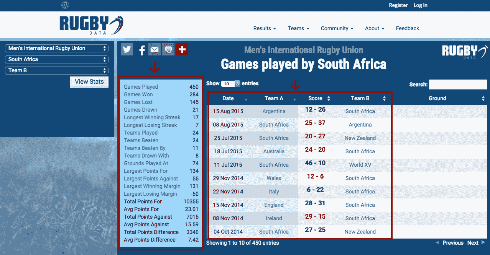

只有真正要参加锦标赛的队伍之间的比赛被保留下来。此外，不分胜负的比赛被取消。第一个原因是，在橄榄球比赛中，平局的情况很少发生。第二，我更关心的是预测输赢，这是大多数球迷关心的结果，而不是预测比赛的胜负。

作为另一个数据来源，我从[这个站点](http://wrr.live555.com/ "rankings")收集了每个团队的排名以及他们最近的排名变化(如下所示)。

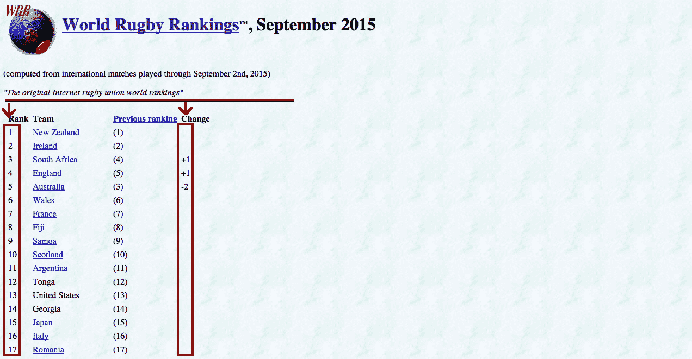

最后，与球队排名相关的是我在世界橄榄球排名维基百科页面上找到的排名分数。

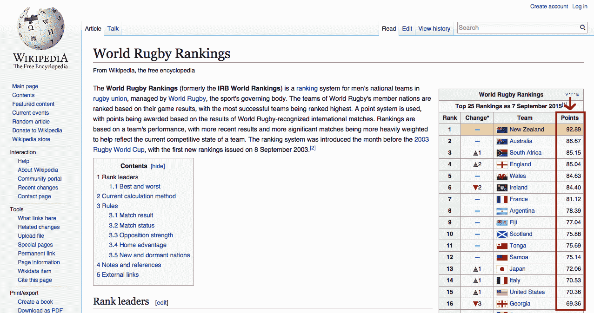

由于大多数数据只反映了每个队的历史表现和排名的当前状态，因此权重是根据每场比赛的日期计算的(比赛被视为观察)，以试图调整数据，使其更准确地反映过去。整个数据收集、清理和结构化都是用 r 编写的。

## 探索数据

既然数据已经收入囊中，是时候去探索了！作为对数据的快速概述，我查看了所有变量之间相关性的[热图。](http://www.r-bloggers.com/using-r-correlation-heatmap-take-2/ "corr heat map")

```py
# load data
data <- readRDS("RWCData.rda")

# Correlation heat map of the training dat
library(ggplot2)
library(reshape2)
dataCor <- data
dataCor <- cbind(as.numeric(data[,1]), as.numeric(data[,2]), as.numeric(data[,3]),
as.numeric(data[,4]), as.numeric(data[,5]), data[,-c(1,2,3,4,5)])

colnames(dataCor) &lt;- colnames(data)
title <- "Rugby training data correlation heat map"
corp <- qplot(x=Var1, y=Var2, data=melt(cor(dataCor, use="p")), fill=value, geom="tile") +
scale_fill_gradient2(limits=c(-1, 1))
corp <- corp + theme(axis.title.x=element_blank(), axis.text.x=element_blank()
, axis.ticks=element_blank())
corp <- corp + ggtitle(title)
corp
```

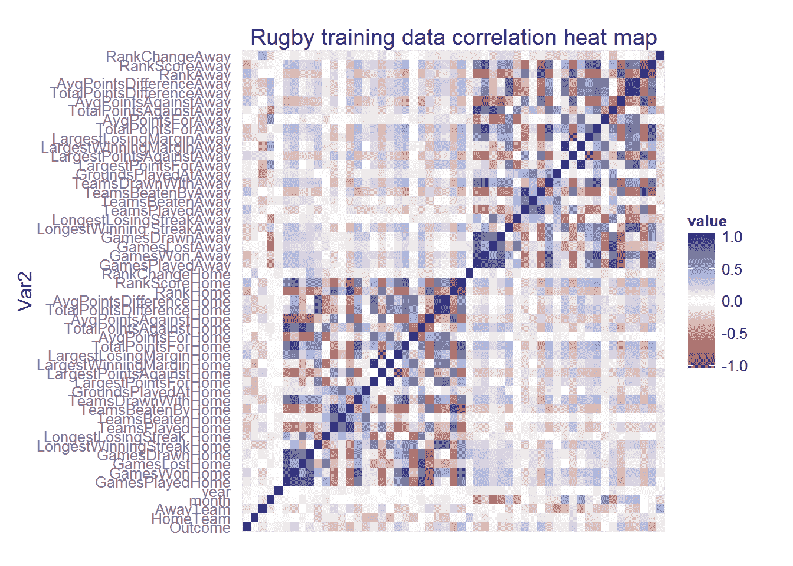

深蓝色方块表示两个变量之间的强正相关，深红色方块表示强负相关。正如我所料，许多变量似乎是相互关联的(如主场对阵一支球队的平均得分和球队主场输掉的比赛数量)。然而，在热图的第一列中，我能够找到所有变量(按行索引)与匹配结果之间的相关程度。与其他变量相比，主客场球队的排名似乎与比赛结果相当相关。所以我仔细看了看。

```py
ggplot(data, aes(RankAway, RankHome, color=Outcome)) + geom_point() + geom_smooth()
```

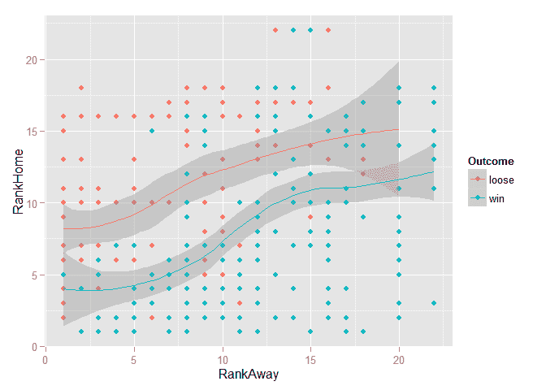

由于*结果*变量被编码来指示主队是赢还是输，我可以清楚地看到更多的获胜比赛与排名更高的球队在主场比赛有关。经过进一步的探索(此处未显示)，我希望在模型中使用时，至少有一些变量可能有一些辨别能力。

## 型号选择

我首先将数据分成训练集和测试集。由于目标是预测在 2015 年下半年举行的世界杯中发生的比赛，所以我选择了从 2015 年初到最近一场比赛的每第二场比赛作为我的测试集。剩下的比赛全部用于训练。

```py
# create training and test set
testIndex <- seq(360,400,2)
train <- data[-testIndex,]
test <- data[testIndex,]
```

由于其良好的性能、易于训练和适合并行处理，像许多其他人一样，我选择了[随机森林](https://en.wikipedia.org/wiki/Random_forest "rf") (RF)分类器作为一个好的起点。用于分类的随机森林是[分类树](https://en.wikipedia.org/wiki/Decision_tree_learning "class trees")的集合，每个分类树都是使用观测值的引导样本构建的，并且只允许在每个节点分裂处选择变量的随机子集。最终分类采取多数投票的形式。关于分类树和随机森林的精彩介绍，请看托马斯·富克斯的[幻灯片](https://class.coursera.org/bigdataschool-001/wiki/Day_8 "RF slides")。另外，我还考察了[斜向随机森林](https://www.google.co.za/url?sa=t&rct=j&q=&esrc=s&source=web&cd=1&cad=rja&uact=8&ved=0CCEQFjAAahUKEwiX5P3Zv_bHAhVD6RQKHXhQBhg&url=http%3A%2F%2Fpeople.csail.mit.edu%2Fmenze%2Fpapers%2Fmenze_11_oblique.pdf&usg=AFQjCNFp_luWSlWHAKcZ5FoGta_4WSZzKg&sig2=h_oL4JqZyKAcopJTykMw-At "orf") (ORF)的性能。

通常随机森林中使用的分类树使用正交(垂直于变量轴)分裂来分裂变量空间，而倾斜随机森林使用变量的一些线性组合来分裂。斜树更适合分割由许多相关变量组成的空间，因此我认为斜随机森林可能在橄榄球数据上表现更好。此外，可以使用许多不同的线性分类器来产生用于分裂的线性组合。我最后用了[偏最小二乘法](https://en.wikipedia.org/wiki/Partial_least_squares_regression "PLS") (PLS)。

与随机森林和倾斜随机森林相关联的调整参数是在每个节点分裂时使用的随机选择变量子集的大小。以下代码设置了一个由该子集的几个不同大小组成的调整网格，并指定了用于训练模型的方法，在本例中为 5 重[交叉验证(CV)](chrome-extension://oemmndcbldboiebfnladdacbdfmadadm/http://research.cs.tamu.edu/prism/lectures/iss/iss_l13.pdf "CV") 。

```py
# Train classifiers
library(doParallel)
cl <- makeCluster(8)
registerDoParallel(cl)

# Load libraries
library(caret)
library(randomForest)

# Model tuning grids
rfGrid <- expand.grid(mtry = c(1, 7, 14, 27, 40, 53))

# Tune using 5-fold cross-validation
fitControl <- trainControl(method = "cv",
    number = 5,
    repeats = 1)
```

为了训练模型，我使用了 r 中的[分类和回归训练(caret)包](http://topepo.github.io/caret/index.html "caret")中的*训练*函数。这是一个极其强大和方便的包，能够执行许多机器学习任务，从数据预处理和分割到模型训练、调整和变量选择。为了训练随机森林，将*方法*参数设置为“rf ”,对于带有 PLS 节点分割的倾斜随机森林，将其设置为“ORFpls”。下面是使用 1000 棵树的 RF 的代码(有额外的代码位来存储训练模型所花费的时间)。

```py
# Random Forests
start.time &lt;- Sys.time()
set.seed(2)
rf <- train(x=train[,-1], y=train[,1], method="rf", ntree=200, trControl=fitControl, tuneGrid=rfGrid, importance=TRUE)
end.time <- Sys.time()
time.taken.rf <- end.time - start.time
```

```py
Model | Training time
--------------------- | -------------
Random Forest | 14.32 secs
Oblique RF pls | 6.93 mins
```

RF 的训练时间为 14.32 秒，ORF 的训练时间为 6.93 分钟，这意味着 ORF 的训练时间大约要长 29 倍。这是因为在 ORF 的每个分裂处，拟合 PLS 模型，而不是 RF 中使用的计算强度较低的正交分裂。下图显示了随机选择变量的不同子集大小以及标准偏差范围的每个模型的 CV 精确度。

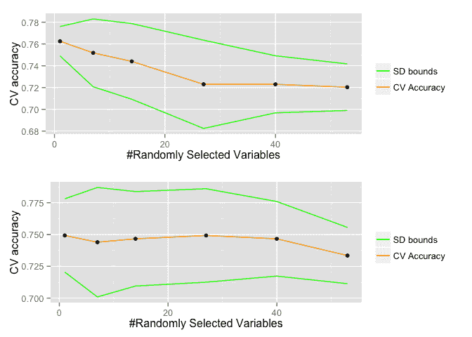

RF 的最佳子集大小为 1，当子集大小对每个模型都是最佳时，ORF 1 的 RF 优于 or f1。但是，以这种方式(仅使用训练数据)计算的精度并不能真实反映模型对未知数据进行归纳的能力。因此，为了更好地了解模型的性能，我绘制了一条 ROC 曲线。

RF 和 ORF 都为属于某一类的观察值产生[(在考虑数据之后)后验概率](https://en.wikipedia.org/wiki/Posterior_probability "post probs")。在二元情况下，例如一个队将输掉还是赢得一场比赛，可以设置一个阈值(比如 0.5)，如果后验概率高于该阈值，我们将其分类为“赢”类，否则，如果低于该阈值，我们将其分类为“输”类。ROC 曲线显示了从 0 到 1 的一系列阈值的[假阳性率](https://en.wikipedia.org/wiki/Sensitivity_and_specificity "FPR/TPR")(一个队赢的比赛被错误分类为输的分数)和[真阳性率](https://en.wikipedia.org/wiki/Sensitivity_and_specificity "FPR/TPR")(一个队赢的比赛被正确分类为赢的分数)。简而言之，具有相应 ROC 曲线的分类器被认为具有最高的预测能力，该 ROC 曲线最紧密地拥抱图的左上角，因为它从左下角到右上角成弧形。所以这两个模型看起来非常相似。最后，保持测试集用于获得每个模型的测试准确性，如下所示。

```py
Model | Test set accuracy
----------------- | -----------------
Random Forest | 80.95%
Oblique RF pls | 76.19%
```

RF 跑赢 ORF 大约 4.76%。

就这样，我有了我的模型！准备好我训练有素的随机森林在我身边，我要预测橄榄球世界杯的未来。但后来我想，如果我能找到一些方法来做我刚才做的事情，但在每场比赛之间纳入锦标赛的最新结果，这不是很酷吗？换句话说，在比赛发生后立即收集比赛结果，将其添加到我的数据中，重新训练模型，并用新的最新模型预测下一场比赛。除此之外，有没有可能以某种自动化的方式来完成呢？然后多米诺骨牌出现了！

## 使用 Domino 调度自动化流程

我第一次听说多米诺是在[这个](//blog.dominodatalab.com/using-r-h2o-and-domino-for-a-kaggle-competition/ "domBlog1")由[周若辉](http://www.jofaichow.co.uk/ "jo")写的博客文章中，这篇文章向你展示了如何在一场 [Kaggle](https://www.kaggle.com/ "kaggle") 比赛中使用 R、 [H2O](http://h2o.ai/ "H2O") 和多米诺。简而言之，Domino 是一个企业级平台，使您能够运行、缩放、共享和部署分析模型。这篇文章还包括一个关于如何开始使用 Domino 的教程，从启动和运行到在云中运行您的第一个 R 程序！对于 Domino 新手来说，我推荐这是一个很好的起点。

因此，我需要做的第一件事就是上传我的 R 脚本，以实现数据收集和模型再训练过程的自动化。首先，脚本( *GetRWCData。R* )负责获取和清理数据，输出包含新数据的. csv 文件。第二，我必须上传脚本( *RWCPrediction。R* )用于根据输出的数据训练模型，将模型保存为. rda 文件。

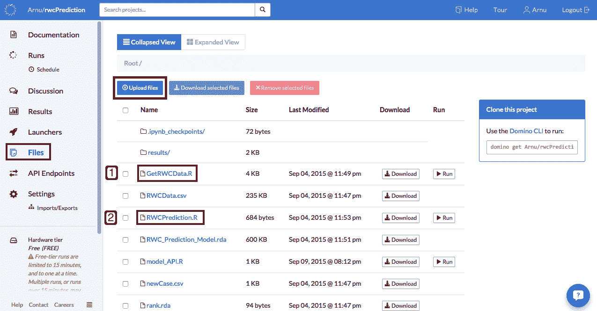

因为我决定使用 RF 而不是 ORF，所以模型训练脚本 *RWCPrediction。R* 包含以下代码。

```py
### International Rugby world cup match prediction model ###

# load libraries
library(caret)
library(randomForest)

# load data
data <- readRDS("RWCData.rda")

# tune Grid
rfGrid <- expand.grid(mtry = c(1, 7, 10, 15, 20, 25, 30, 35, 40, 45, 50))

# Tune using 5-fold cross-validation
fitControl &lt;- trainControl(method = "cv",
number = 5,
repeats = 1)

# train classifier
model <- train(x=data[,-1], y=data[,1], method="rf", ntree=1000,trControl=fitControl, tuneGrid=rfGrid)

# save model
saveRDS(model, file = "RWC_Prediction_Model.rda")
```

现在使用 Domino 的调度功能实现自动化！要做到这一点，我只需进入 schedule 选项卡，插入我的脚本来获取数据，作为运行的*命令，设置一个循环时间，然后点击 *schedule* 。(下面的例子稍微简化了一些，因为我不得不微调时间表，在每场比赛之间运行，而不仅仅是在每天的固定时间运行。)*

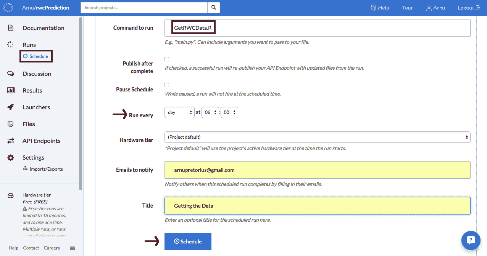

数据脚本成功运行后，模型脚本可以使用新数据来重新训练模型。因此，类似地，我插入了用于训练模型的脚本，作为运行的*命令，设置循环时间(数据收集后的一个小时)，并点击*计划*。注意，在这种情况下，我还勾选了负责重新发布 API 的*完成后发布*框(稍后会详细介绍)。*

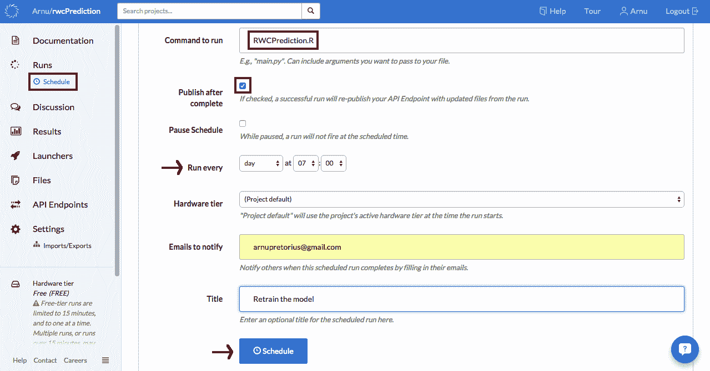

就这么简单，我有一个自动化的数据收集、清理和模型训练管道！然而，从这个项目的一开始，我就不是一个人在工作，所以当我获取数据和建立模型的时候，我的一个好朋友道格正在建立一个网络应用程序来显示预测。一旦应用程序启动并运行，我们需要做的就是弄清楚它如何获得模型预测。输入 Domino API 端点。

## 使用 API 端点进行按需预测

Domino 的 API 端点允许您将 R(或 Python)预测模型部署为 API，以便其他软件系统可以使用它们。[这篇来自 ProgrammableWeb 的](http://www.programmableweb.com/news/how-to-turn-your-predictive-models-apis-using-domino/how-to/2015/07/22?page=2 "domapi")帖子和尼克在[发表的关于 Revolution Analytics 的](http://blog.revolutionanalytics.com/2014/08/using-r-inside-the-enterprise-integration-with-existing-systems.html "nick post")帖子是我将预测模型转化为 API 所需要的全部内容。第一步是在 R 脚本(下面给出)中编写一个*预测匹配*函数，该函数将两个团队作为参数，并将预测作为字符串返回。

```py
## Load Library
library(caret)
library(randomForest)
library(lubridate)

## Load Pre-trained model
model<- readRDS(file = "RWC_Prediction_Model.rda")

## Load predictors
teamStats <- readRDS(file="teamStats.rda")
rank &lt;- readRDS("rank.rda")
rankScore <- readRDS("rankScore.rda")
rankChange <- readRDS("rankChange.rda")
teams <- readRDS("teamNames.rda")

## Create a function to take team name inputs
## and then return a prediction for the match
predict_match <- function(homeTeam, awayTeam) {

homeIndex <- which(teams == homeTeam)
awayIndex <- which(teams == awayTeam)

swap <- awayTeam == "England"

if(swap){

temp<- homeTeam
homeTeam <- awayTeam
awayTeam <- temp

temp <- homeIndex
homeIndex <- awayIndex
awayIndex <- temp

}

homeTeamStats <- c(teamStats[[homeIndex]], rank[homeIndex], rankScore[homeIndex], rankChange[homeIndex])
awayTeamStats <- c(teamStats[[awayIndex]], rank[awayIndex], rankScore[awayIndex], rankChange[awayIndex])

date<- Sys.Date()
levelsx <- levels(factor(teams))
levelsy <- levels(factor(c("loose","win")))
newCase <- readRDS("newCase.rda")
newCase[1,2] <- homeTeam
newCase[1,3] <- awayTeam
newCase[1,4] <- factor(month(date))
newCase[1,5] <- factor(year(date))
newCase[1,6:29] <- homeTeamStats
newCase[1,30:53] <- awayTeamStats

## Return the predicted class probabilities
if(swap){
y_probs <- predict(model, newCase, type="prob")
return(as.character(rev(y_probs)))
} else if(homeTeam == "England") {
y_probs <- predict(model, newCase, type="prob")
return(as.character(y_probs))
} else {
y_probs1 <- predict(model, newCase, type="prob")

temp <- homeIndex
homeIndex <- awayIndex
awayIndex <- temp

homeTeamStats <- c(teamStats[[homeIndex]], rank[homeIndex], rankScore[homeIndex], rankChange[homeIndex])
awayTeamStats <- c(teamStats[[awayIndex]], rank[awayIndex], rankScore[awayIndex], rankChange[awayIndex])

date<- Sys.Date()
levelsx <- levels(factor(teams))
levelsy <- levels(factor(c("loose","win")))
newCase <- readRDS("newCase.rda")
newCase[1,2]<- homeTeam
newCase[1,3]<- awayTeam
newCase[1,4]<- factor(month(date))
newCase[1,5]<- factor(year(date))
newCase[1,6:29]<- homeTeamStats
newCase[1,30:53]<- awayTeamStats

y_probs2<- predict(model, newCase, type="prob")
looseProb<- round((y_probs1[1] + y_probs2[2])/2,4)
winProb<- round((y_probs1[2] + y_probs2[1])/2,4)
return(as.character(c(looseProb, winProb)))
}
}
```

现在，我必须记住的一点是，在数据中有一个隐含的主团队优势，因此团队在函数的输入字符串中的顺序很重要。由于英格兰是世界杯的主办国，我设定他们的预测总是展示这种主队优势。对于所有其他球队，我做了两个预测，两支球队都有机会成为主队。最终概率是两次预测的平均值。下一步是上传这个脚本(在我的例子中称为 *model_API。R* )到我的 Domino 项目。

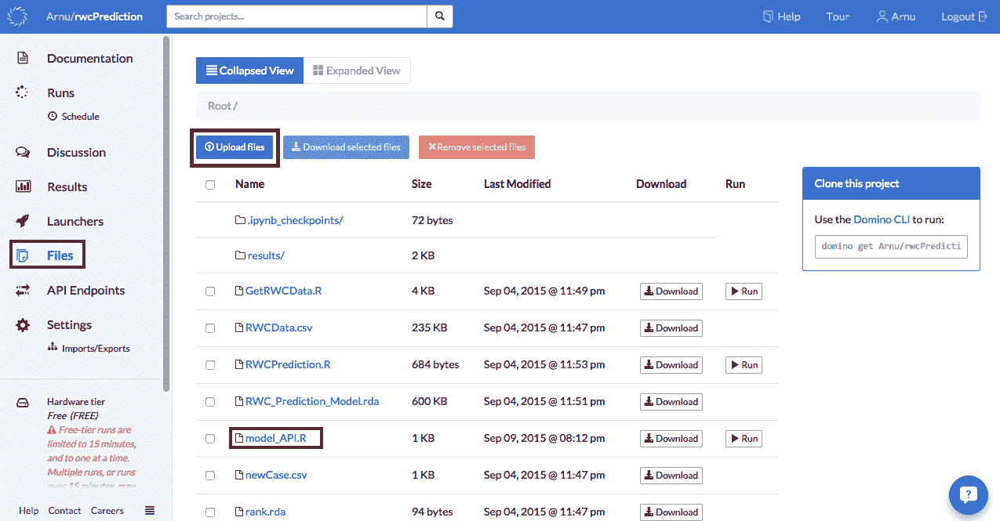

最后一步是发布 API(这对于 Domino 来说非常容易)。我只需导航到 *API 端点*选项卡，输入包含预测函数的 R 脚本的名称，输入预测函数名称，然后点击*发布*按钮！

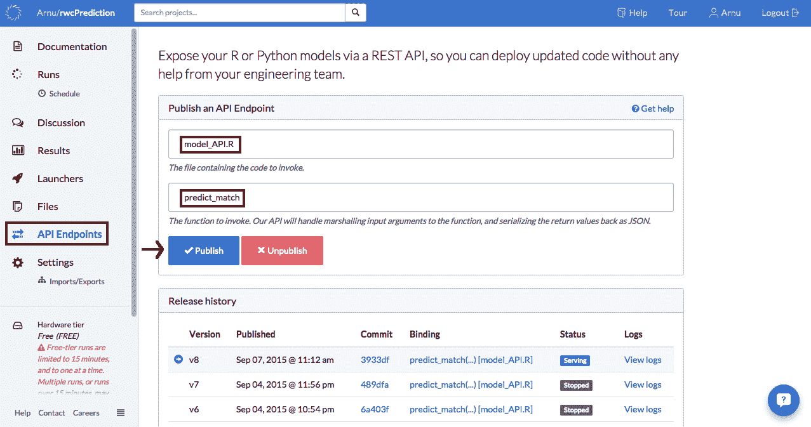

它还活着！！(弗兰肯斯坦的声音)

这就是这个项目目前的情况。既然所有必要的难题都已解决，那么每天都要收集数据，使用一些与下面给出的代码非常相似的 Python 代码发送模型重新训练和预测请求。

```py
import unirest

import json

import yaml

homeTeam = 'South Africa'

awayTeam = 'New Zealand'

response = unirest.post("https://app.dominodatalab.com/u/v1/Arnu/rwcPrediction/endpoint",

headers={"X-Domino-Api-Key": "MY_API_KEY",

         "Content-Type": "application/json"},

                        params=json.dumps({

                            "parameters": [homeTeam, awayTeam]}))

## Extract information from response

response_data = yaml.load(response.raw_body)

## Print Result only

print("Predicted:")

print(response_data['result'])
```

### 结论

所以你有它。

总之，使用 Domino 和 R，我能够:

1.  编写脚本以收集相关橄榄球数据，进行探索性分析并选择合适的模型。
2.  当新的比赛结果可用时，每天自动进行数据收集。
3.  每天收集数据后，自动进行模型训练。
4.  使用 API 端点将定型模型转换为能够接收预测请求的 API。
5.  当计划预测模型的训练时，通过勾选完成框后的*发布来自动重新发布 API。*