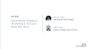

# 夏季分析:预测大肠杆菌和西尼罗河病毒

> 原文：<https://www.dominodatalab.com/blog/predictive-analytics-e-coli-and-west-nile-virus>

来自芝加哥市的 *[吉恩·莱恩斯](https://www.linkedin.com/in/geneleynes/)(高级数据科学家)和[尼克·卢修斯](https://www.linkedin.com/in/nicklucius/)(高级分析)讨论了两个预测分析项目，这两个项目预测了密歇根湖中的大肠杆菌和蚊子传播的西尼罗河病毒的潜在风险。*

## 会话摘要

在最近的[数据科学弹出窗口](https://popup.dominodatalab.com/?utm_source=blog&utm_medium=post&utm_campaign=predictive-analytics-e-coli-and-west-nile-virus)上，来自芝加哥市高级分析团队的 Gene Leyes 和 Nick Lucius 提供了对两个预测分析项目所涉及的数据收集、分析和模型的见解。

会议重点包括

*   使用广义线性混合效应模型，并纳入季节和区域偏差。78%的时间提前一周预测到西尼罗河病毒的可能性。这个预测有 65%是正确的。
*   研究小组发现线性模型无法预测密歇根湖中的大肠杆菌，因为没有明确的相关性。团队实施了易变海滩的快速测试，预测海滩的战略选择，使用“k-means 聚类算法将海滩分成不同的组，然后使用该信息来决定我们的模型预测。”

对西尼罗河项目感兴趣？在 Github 上查看[西尼罗河项目，](https://github.com/Chicago/west-nile-virus-predictions)[下载西尼罗河数据](https://data.cityofchicago.org/Health-Human-Services/West-Nile-Virus-WNV-Mosquito-Test-Results/jqe8-8r6s)。大肠杆菌项目怎么样？然后在 Github 上查看[清水项目，](https://github.com/Chicago/clear-water)[在数据门户](https://data.cityofchicago.org/Parks-Recreation/Beach-E-coli-Predictions/xvsz-3xcj)上下载数据。要从演示中获得更多见解，请查看视频和演示文稿。

## 演示文稿

你好。我是吉恩·莱恩斯。

我是芝加哥市的数据科学家。我们将开始下一次演示。我们已经很好地结合了技术和更高层次的会谈。今天我将谈论几个我们在这个城市进行的项目，这些项目在今年夏天首次亮相。在任何给定的时间，我们有相当多的不同的倡议正在芝加哥市进行。我们一直在做不同的数据科学项目来优化运营，并努力做到事半功倍。我们就像其他公司一样。我们面临着预算缩减的问题，我们总是试图找到更明智的方法来进一步扩展我们的资源。在我们的数据科学团队中，有数据库管理员，也有商业智能专家。Nick 和我是高级分析团队的代表，我们直接向首席数据官 Tom Schenk 报告，如果您从事任何与数据有关的工作并且居住在芝加哥，您可能已经见过 Tom，因为他无处不在。我们今天要谈论的两个项目是西尼罗河病毒预测和水质预测。

我将以一张幻灯片开始——这是一匹死于西尼罗河病毒的马的脑组织……这是敌人，这是蚊子。这就是人类，马，婴儿，老人…这就是我们如何得到西尼罗河。

这是一个非常有趣的项目。在工作中我学到了很多。我不是瘟疫的狂热爱好者，但同时这是一个非常令人愉快的项目。这真的很令人惊讶和有趣。

谁能猜猜西尼罗河在美国的什么地方，或者它起源于哪里？你会想到哪些州？佛罗里达，加利福尼亚，北卡罗来纳，那是个好地方。在这些地方有一点。它始于皇后区。这其实是一个非常城市化的问题。这是一件非常不寻常的事情。它于 1999 年来到皇后区，很快在美国传播开来。到 2001 年或 2002 年，它已经在伊利诺伊州。我们是美国第五大腐败州——我不知道该用什么词来形容。就西尼罗河病毒病例而言，我们实际上处于首位。所以，这让我非常惊讶。

不过，有一些好消息。尽管它无处不在，但通常也没那么糟糕。大多数感染西尼罗河病毒的人甚至不知道他们曾经被感染过。大约 80%的人完全没有任何症状。在 20%出现症状的人中，他们有类似流感的症状，他们甚至很少去医院或急诊室。在这些人中，1%的人有神经侵袭性疾病的严重症状，这就是情况变糟的地方。这是人们瘫痪、慢性疼痛和死亡的地方。但这确实是一个很小的数字。

例如，今年，我想，我们已经有了最终的统计结果——他们还在进来。在孵化和测试之间有大约 60 天的间隔，30 天孵化，30 天测试。数字实际上还在增加，但我想整个伊利诺伊州今年只有三到四个病例。但奇怪的是，这实际上是一个非常重要的公共卫生问题，因为疫情可能在任何地方爆发，而且非常不可预测。

例如，有一年在科罗拉多州，大约有 2500 个病例。我不知道为什么。我不认为科罗拉多知道原因。但是，提前发现这些病例并采取行动减少西尼罗河的传播和减少蚊子数量是非常重要的。

另一个需要知道的重要事情是，并不是每一种蚊子都会传播西尼罗病毒；是 restuans 库蚊和尖音库蚊。这些不是通常在后院烧烤时叮咬你的讨厌的蚊子。芝加哥的很多人——这很有趣……芝加哥的南部真的希望我们喷洒杀虫剂，而北部真的不希望我们喷洒杀虫剂，因为他们想要他们的蜂箱，他们更注重自然主义。你会有这种二分法，比如谁想被喷，谁不想。这实际上并不重要，因为我们并不是在为困扰你的事情喷，至少在大多数情况下是这样。

理解这一点很重要。这基本上是疾病的生命周期。西尼罗河主要在蚊子和鸟类之间传播。鸟类迁徙并在全国传播。这就是它在美国传播如此迅速的原因。蚊子在鸟与鸟之间传播它。感染鸟类的蚊子实际上并不喜欢人类。人类和马的案例几乎都溢出来了。

所以，不要再扫兴了(我将使用我在 Chi Hack 之夜使用的相同语言。如果你在那里，我很抱歉，但这就是我要做的)。我想谈谈我们在芝加哥市为预防西尼罗河病毒所做的工作；我们真的做三件事。

第一件事是我们消灭了雨水管道中的幼虫，这是一个令人难以置信的数字。我还是有点不敢相信。我必须亲眼目睹才会相信。但是我们消灭了芝加哥市周围 150，000 条下水道的幼虫。他们让实习生或其他人扔球。[笑声]所以他们把这些颗粒扔进雨水管的收集盆里，这基本上可以防止蚊子在雨水中繁殖。

我们做的第二件事是 DNA 测试。我们有这些重力陷阱，里面有特殊化学配方的糖水，可以吸引我们想要的蚊子种类。有一个小风扇，因为蚊子是可怕的飞行者，它只是把它们吹到网里。我们活捉蚊子。我们有-我应该知道号码…整个城市大概有 40 个陷阱。我们收获这些蚊子，抖掉它们，然后分批磨碎蚊子，每批不超过 50 只，因为超过 50 只，西尼罗河的 DNA 会变得太稀而无法测量。我们将每批不到 50 只的蚊子磨碎，在西边的疾病控制中心实验室用 DNA 测试来检测西尼罗河病毒。

接下来我们要做的第三件事是，如果西奈尔斯出现在我们测试的特定区域，我们几乎覆盖了整个城市，如果我们连续两周看到它，我们就会为它喷药。这个项目的重点是将时间从两周减少到一周，当我们确实有这些问题时，真正将它扼杀在萌芽状态，并立即减少蚊子数量。这就是数据的样子。这不是一张奇特的 ESRI 地图…这只是我的地图。[笑声]

所以-哦，还有，这是个好时机。我应该指出我们使用了很多开源工具。我们的很多项目，包括这个项目，都在 GitHub 上。数据本身在开放数据门户上。我在模型中使用的数据与您可以使用的数据完全相同，至少就测试结果而言是如此。

我确实有一些我们不能公开的秘密数据。这是精确的陷阱位置，因为我们不能公开。这些是大概的陷阱位置，因为我们不希望有人篡改陷阱。但是你可以非常接近。我们在开放数据门户网站上公布了所有陷阱的大致位置。我想我的数字错了。大约有 60 个。我写了这些幻灯片，但是我忘记了，因为已经有一段时间了。我们在全市大约有 60 个这样的陷阱来收集这些蚊子。它们通常一周采集一次，也可能一周采集两次。我们在数据门户上发布实际实验室结果方面的数据。

这是芝加哥蚊子季节的形状。蓝线代表蚊子的平均数量。等等，让我看看这个。其实我觉得是总数。反正不是，这是每个诱捕器捕获的蚊子总数。橙色线是感染西尼罗河病毒的平均人数。你可以看到在五月，我们开始收集。我们还没有把所有的陷阱都放出来，因为在五月从来没有西尼罗河。六月，天气开始好转。我们开始得到第一个积极的结果。七月，天气越来越热了。八月是真正沉重的月份。到今年年底或 10 月，它就没了。那里有一点点，但是到十月底就真的没了。

与我个人一起参与这个项目的另一件事是，我们可以真正看到气候变化的影响。许多这种媒介传播的疾病，我说的媒介，是指蚊子媒介或扁虱媒介，在美国不同的气候下确实在增加。季节变得越来越长，因为我们错过了杀死病媒的真正寒冷的冬天。这是一个将继续成为问题或者继续恶化的问题。但是很抱歉。但这肯定是我强化了的东西。

所以，在我之前的那个人——对不起——可能比我更能解释这个模型。我们使用了一个通用的混合效应模型，它使用贝叶斯优化来校正季节形状的偏差，以及逐个陷阱的偏差。有些陷阱更有可能产生积极的结果。我们输入到模型中的其他变量包括天气和陷阱上周是否有正面结果，以及陷阱在整个赛季中的累计结果数。我们试图了解这是否是一个糟糕的赛季，上周发生了什么，天气如何，然后整合这个赛季的整体形状。

我们尝试了很多不同的模型。我们尝试了梯度增强[模型]/GBM，我们尝试了随机森林，我们实际上——再次支持，这整个事情始于一个 Kaggle 竞赛，它使用非常复杂的贝叶斯模型来计算整个赛季。这很有趣。Kaggle 比赛的结果对我们来说并不是特别有用，因为他们赢得了比赛，但每个赛季都有调整。直到季节发生后你才知道季节。所以，他们没有作弊，但这不是我们可以立即从架子上拿下来，用于下周预测的东西。顺便说一句，在所有这些数据科学问题中，对我来说最困难的事情通常是弄清楚——对东西建模很容易——很难弄清楚如何为你的 t+1 时间步长将其投影出来，以及如何将东西放回你的模型中，以便你对下周进行预测。这是课本上没有的东西，这是橡胶遇到路面的地方，这总是棘手的部分。我们模型的结果是一个介于 0 和 1 之间的数字。让我想一想。大多数情况下，结果在 14 左右。我想这是平均水平。我们选择了 0.39 的临界值。任何超过 0.39 的，我们说“这是一个积极的”。有了这个截止值，我们能够预测 78%的真实阳性结果，而我们的阳性结果有 65%是正确的。我手边没有 f 分数。你当然可以在 GitHub 页面找到它。它真的在那里。一些更倾向于机器学习的人可能会喜欢看到这些统计数据和老式的混淆矩阵，但这使得与公众、管理层、流行病学家和芝加哥市内的其他人沟通变得容易得多。

一旦我们有了这些预测，我们就把它们放入我们的情境感知程序。我会给你一个大概的概念。我们有这样的东西，你可以找到数据，然后选择你想要的数据集。这是一个预加载的查询，我们基本上说，任何超过 0.39，颜色是红色的。下面的任何东西，都涂上绿色。这是仲夏某个特定的星期，我们的地图看起来是这样的。这些是在那个陷阱里实际发生的一些细节。下面，我想我没有展示这一部分，但是这里有一个小东西，你可以查看原始数据，如果你想要的话可以下载。因此，不幸的是，由于陷阱位置的原因，这个特定的数据集只能在 Windy Grid 内部获得，这是我们的情况感知计划。但是我们也有一个叫做开放网格的东西，里面有我们大部分的其他数据集。我认为它确实有西尼罗河的测试结果，但它本身没有预测，因为预测也有最高机密的位置。

我希望这能让你对我们的一个项目有所了解。我将让尼克接手，告诉你们我们正在做的另一个非常酷的项目。谢了。

谢谢大家。

我期待着向你们介绍芝加哥市的另一个项目。这涉及到相似的情况，湖水中的大肠杆菌。因此，我们再次关注一种病原体，一种可以导致疾病的东西，以及一种使用预测分析的方法，以帮助人们了解问题并尝试减轻疾病。对于这张幻灯片我真的很抱歉。鉴于今年的时间，我考虑过不把它包括在内。但是如果没有这个，要讲述大肠杆菌和芝加哥海滩的故事是不可能的，因为这就是这个项目存在的原因。

夏季，芝加哥的海滩是居民和游客的一大享受。人们去游泳。人们去野餐。人们去骑自行车。我们拥有如此令人惊叹的便利设施。所以再多说一点——当我开始这个项目时，我没有意识到这一点，但是每年有超过 2000 万人参观芝加哥海滩。我认为这只是一个令人震惊的数字，因为芝加哥市甚至没有三百万居民。我认为这也是一个及时的数字，因为我想，昨天或前天刚刚有消息说芝加哥创下了旅游记录。每年有超过 5500 万人参观芝加哥。所以，是的，这太神奇了。其中 2000 万人来到了海滩。

现在，每年在我们拥有的 27 个芝加哥海滩，大约有 150 个水质超标。这意味着水中的细菌，大肠杆菌，达到了一定的水平，研究表明，如果人们在那个水平的水游泳，他们会生病。把这 150 个数字放在上下文中，每年大约有 2000 个海滩日。当你把海滩的数量乘以游泳的天数，大约有 2000 天。所以这种情况真的是屈指可数。但当它真的发生时，通知公众是非常重要的，准确的通知，这样人们就可以决定是否要游泳。海滩不会关闭。通常，当这种情况发生时，会发出一个建议。如果一个人的免疫系统很弱，或者是一个孩子或老人，他们可以决定是否下水。

现在，最后，检查水质的海滩技术是这样的。有这些传统的培养测试，他们在培养皿中培养细菌，大约 18 小时后回来检查有多少细菌生长。这些太慢了。这些是缓慢的测试。由于大肠杆菌数量在一天中的变化速度，一旦你得到这些结果，它就不再反映当时水中发生的情况。

由于 18 小时的滞后时间，用这些测试结果建立的模型从来没有真正准确地通知人们。我知道这可能会令人不安。但在前几年，如果你去海滩，你看到一个咨询，它说，“嘿，这里有一个问题，”它告诉你昨天。那天在海滩可能不会有什么问题。

另一种全新的检测海滩上大肠杆菌的方法是快速 DNA 检测。现在，这些都是在过去几年里研究和开发的。今年，刚刚过去的夏天是芝加哥第一次在每个海滩使用它们。世界各地的许多市政当局都在关注芝加哥在快速检测方面所做的工作，以便有可能将其带到他们的社区，并用于海滩监测。

但是这些快速 DNA 测试方法的一个主要缺点是它们非常昂贵。主要是它所需要的机械。这些样本每天早上在湖边被采集，然后被送到 UIC，在那里它们被放进机器里进行测试。虽然这是在夏季发生的，但这占用了该地区所有的能力，甚至进行这种测试。如果有人想说，“嘿，我也想在上午 11:00 做这些测试中的一个，”在夏天的任何一天，那么你必须等待。所以，这就是现在存在的供给和需求。

所有这些都促使人们使用预测模型，以便能够获得任何特定时间任何海滩的水质的经济、准确读数。预测模型有能力预防疾病，并在通知公众是否应该下水的同时，为政府节省数百万美元。

现在我要告诉你的这个项目是关于我们所做的，它是如何产生的真的很有趣。它实际上来自 Chi Hack Night，一群人注意到数据门户网站上有海滩水质在线，他们认为也许他们可以制作一个预测模型，并接近了这座城市。芝加哥市与这些开发者一起工作，在 Chi Hack 之夜与这些数据科学家一起工作——实际上我在今晚的人群中看到了一些——在志愿者的基础上为了开发模型，还与来自德保罗大学的学生一起工作，为了开发数据可视化和做一些模型改进。我实际上是志愿者之一。在 Chi Hack 之夜发生的时候，我并不为芝加哥市工作。所以真的很酷。我成为了 Chi Hack 之夜的志愿者，提高我的数据科学技能，然后作为一名数据科学家在芝加哥工作。这是一次很棒的经历。

我现在给你讲一点这个模型。最初开发的模型使用水传感器。这就是左上方的内容。水中有一个水传感器，它正在不断地读取水的云量、浪高、水温等信息，然后将其发送到芝加哥的一个数据门户网站。该小组使用了气象传感器数据。它还使用了前几天、前一天、前一周的大肠杆菌测试结果来为模型提供动力。

然后有很多有趣的一次性数据集。就像水闸打开的时候，污水被注入密歇根湖，如果你不知道的话，实际上每年都会发生几次，通常是在有大暴雨的时候，整个芝加哥地区都会被淹没。他们会打开闸门，让水流入湖中。在这种情况下，海滩将立即关闭，直到这种情况消失。但当时的想法是，在接下来的几天里，可能会有一些影响，可能会导致一个更好的模型。

在底部，你看到的是一个海滩一年中的大肠杆菌水平。我认为这向你展示了水质不好的日子有多罕见。这个特殊的海滩在 2015 年只有一天，没有太多预警。它不知从哪里冒出来的。它马上就消失了。这些异常罕见的事件很难预测，这就是研究小组马上注意到的。

志愿者投入全部时间的所有建模工作，最终得出的结论是，无论我们能够获得多少环境数据，我们似乎都无法确定是什么导致了大肠杆菌，因此在自然界中，你可以用什么来预测大肠杆菌。模型的准确率从来没有超过某个阈值。这是一次令人沮丧的经历。但是这项工作以及所有这些个人对这个团体的贡献引起了一场讨论，围绕着我们可以用什么其他方法来看待这个问题。

我们最终开发了一种新的方法来模拟海滩水质，到目前为止，这显示了一些很大的希望。它的工作方式是，不是使用这些环境变量来试图找出水中发生了什么与空气中发生了什么，这个想法是这样的。今天支付一些昂贵的测试，然后用这些测试预测今天该地区的其他海滩会发生什么。这实际上更像是一个价值缺失的问题。你正在测试一些海滩。那你就可以推断出一些海滩。密歇根湖存在区域效应，一些海滩会随着其他海滩移动。所以你可以预测一个海滩的大肠杆菌水平和另一个的。但它仍然不是——你不能用线性模型来描述它。没有明显的关联。

我们所做的是，我们使用了 k-means 聚类算法，以便将海滩分成不同的组，然后使用该信息来决定模型的预测值。我们要做的是，我们说，好的，这些是我们要付费测试的海滩，这些是我们要测试的。这些就是我们要预测的海滩。

Now, for the finer details on that, I'll refer you to a paper that's forthcoming. There's a draft version on our GitHub page already. It really goes into the details of all the modeling. So, I won't go into that here.

我想做的是展示一个我们制作的公共网站，让人们了解这个模型，了解这个项目，也可以创建他们自己的模型。因为这个模型中的一个关键结构是选择你使用的海滩，你选择去测试的海滩。所以，一个人可以在这里选择-他们看到一个海滩列表。你可以选择任何你想说的海滩，好的，我要测试这些，建立一个模型。

在这个闪亮的应用程序的背景中，有一个 R 脚本正在运行，它将构建这个模型。也许我应该在开始之前做一个演示。我想我只需要重新装弹。让我再选几个海滩。后台要建立和验证一个模型。你将能够看到你的模型做得如何，并将其与芝加哥市的模型进行对比。

让我给它几秒钟来开始。这条虚线显示了芝加哥市模型的真实阳性率。然后那个柱状图表明我刚刚做的那个真的不行——它有 15%的真实阳性率，相比之下这个城市的模型是 38%。人们可以去尝试建立自己的海滩，看看他们是否能想出一个有用的海滩组合。

你也可以把假阳性率搞乱。我把假阳性率提高了不少，这意味着现在模型会发出警告，而实际上湖中并没有问题。但正因为如此，它得到了更好的真阳性率。当我们去评估模型时，我们决定将它投入生产。因为，就像 Gene 说的，我们面临的最困难的部分之一是模型的可操作性，并让它在真实的数据上实时工作。

在 2017 年，也就是刚刚过去的这个夏天，尽管芝加哥市正在对每一个海滩进行快速测试，但我们创建了一个模型，选择了几个海滩，然后预测了其他海滩，这样我们就可以看到它是如何做到的。在使用这种混合方法的过程中，我们发现公众被告知我们的流程的时间增加了约 60 天，而使用旧模式时，公众不知道这个问题。其中很多确实来自于我们的过程实际上会做快速测试。这样你会赢得一些胜利。但是这个模型本身也做得更好。

预测模型本身与先前的预测模型相比，其准确性大约是前者的三倍。我有一张幻灯片，精确度是之前模型的三倍。就像我说的，我们已经做的是，我们已经有了一篇论文来发表这个模型。我去和水质专家交谈过，他们实际上是定期进行科学研究的人，向他们展示，以确保一切对他们都有意义，并希望能在他们可能需要的任何地方把它送到海滩水质监测员的手中。这就是这次展示的清水和西尼罗河病毒部分的结束。

但我们只是想告诉你更多关于芝加哥市和我们所做的事情。这些项目实际上实现了——它们是实现一些核心承诺的一部分，这个城市称之为科技计划。该市市长在上任伊始就发布了一项科技计划。它向芝加哥市承诺，除其他事项外，我们将与市政技术创新者合作，开发应对城市挑战的创造性解决方案。这个项目正是这样做的。我们不仅一起工作，而且个人志愿者作为一个团体最终为此贡献了 1000 小时的时间。在周二晚上看到人们是一件很棒的事情。现在，每个人都有工作。每个人都过着忙碌的生活，一起坐在这栋大楼的一个房间里，致力于这项工作，试图找到一种方法让这个城市对每个人都更好。我有证据，以防你不想相信我的话。我们在 GitHub 上查看了历史记录，并且能够将这些记录放在一起，这样你就可以看到人们实际工作的时间。我不知道周六凌晨两点这里发生了什么。但在周二晚上，你可以看到正在进行的工作大幅增加。当你回顾这个项目的整个历史时，Chi Hack 之夜志愿者真的真的做到了。该市的计划中的另一个承诺是，这两个项目都将利用数据和新技术使政府更加高效、有效和开放。

最后，我要提一下 Gene 的项目的其他一些东西，这个项目真的很酷。他发布了开放网格，这个城市的态势感知地图平台，为你做了一个演示。但他的项目实际上增强了那个平台，并为它创造了新的发展。为西尼罗河项目制作的一些地图实际上进入了开放网格，不仅供芝加哥居民使用，而且任何其他使用开放网格的市政当局现在都将内置这些功能。对我们来说就是这样。如果你有任何问题，我相信吉恩可以提出来，我们可以回答你可能有的任何问题。