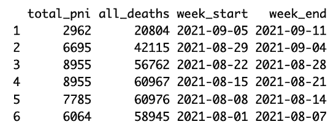
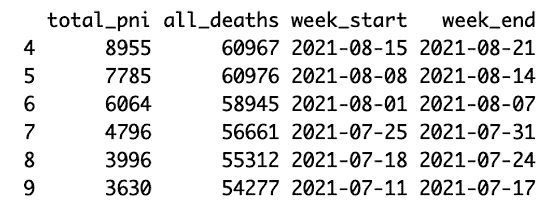
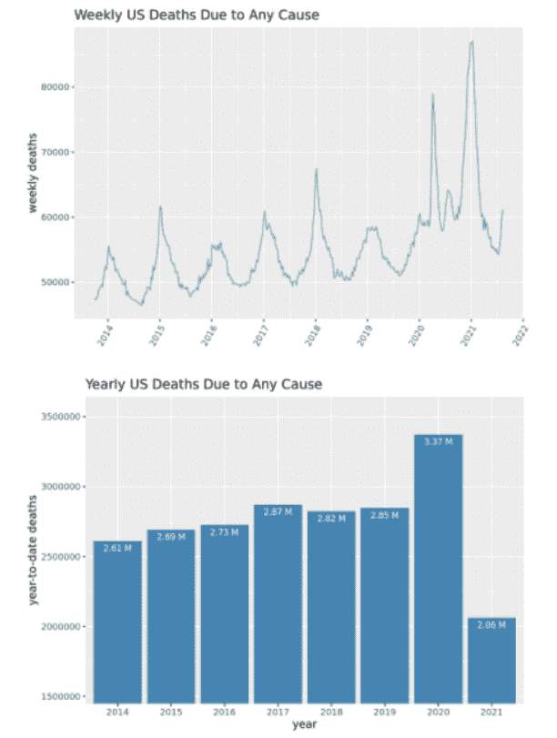
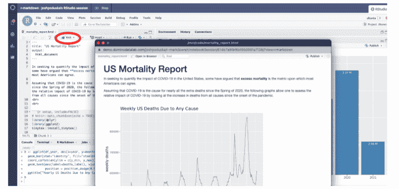
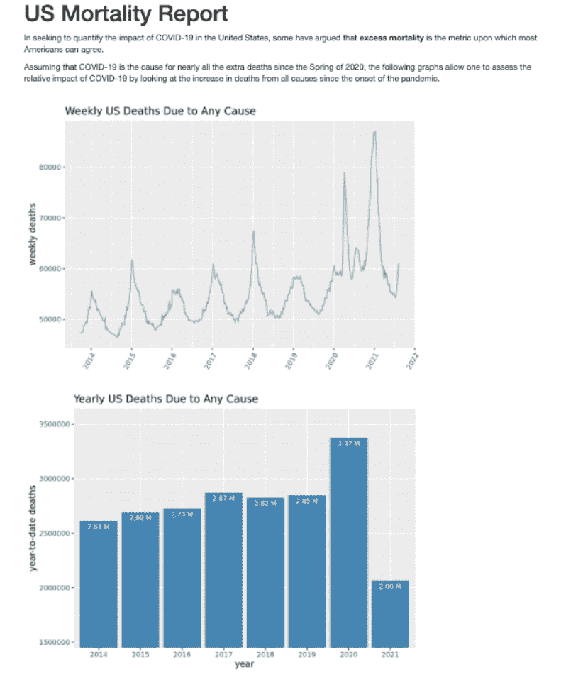
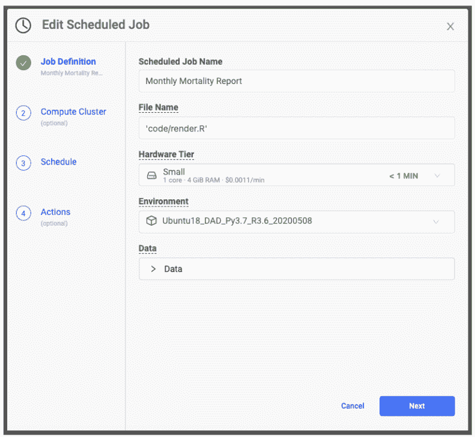
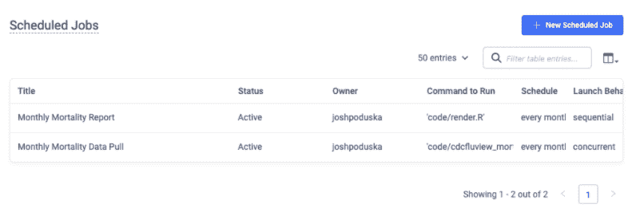

# 生产数据科学:用 R Markdown 交付模型

> 原文：<https://www.dominodatalab.com/blog/production-data-science-delivering-models-with-r-markdown>

R Markdown 是数据科学家工具箱中不可或缺的工具之一，它提供了将您的工作投入生产的最后一英里问题的速度和灵活性。速度来自于主持和安排 R Markdown 报告的容易程度。灵活性来自生产输出的广泛选择。无论是制作一个中间结果的原型，还是产生高质量的输出，让你的工作展现出最好的一面，R Markdown 都能提供很多。

在本帖中，我们提供了在部署模型和构建 [MLOps](https://www.dominodatalab.com/data-science-dictionary/mlops) 管道时，拥有各种部署选项的动机。在项目进展太远之前，我们为原型模型做一个论证。我们鼓励在这两种情况下使用 R Markdown。最后，我们浏览了使用 R Markdown 构建新冠肺炎报告所需的代码，该报告计划定期运行，并在报告完成时自动向利益相关者发送电子邮件。

## 部署 MLOps 解决方案时的选项和原型制作

考虑以下假设场景。你会见你的商业利益相关者。你会听到他们解释对客户有特别的洞察力是多么的重要。你知道最好不要相信他们的话，所以你让他们量化“极其重要”。在验证假设和计算数据后，事实证明他们是对的。如果你能生产出合适的模型，那么会有很大的投资回报。你开始创建一个漂亮的模型，提供完全符合要求的见解。这是事情开始解开的地方。首先，您将模型交给中央 IT 部门，一个月后，他们已经构建了一个可以集成到任何应用程序中模型 API。然后，业务涉众再花一个月的时间就集成 API 的最佳方式达成一致，这样对他们的决策者就有用了。最后，拥有最终用户应用程序的业务部门的 it 人员会涉及到将新 API 集成到他们的应用程序中的各种繁文缛节。啊！几个月过去了，热情已经消退，所有的投资回报率仍然舒适地坐在桌子上。哪里出了问题？

有两件事。首先是显而易见的。第二，也许没有那么多。明显的错误是在开始项目工作之前忽略了可交付物的详细范围。那应该是每个 [数据科学家](https://www.dominodatalab.com/resources/managing-data-science/) 飞行前清单的一部分。在此范围界定过程中，了解 R Markdown 的可能性非常重要，因为它扩展了您对模型交付外形的选择。如果 R Markdown 满足了实际需要，它可以减轻 it 人员的负担，避免构建一个一应俱全的应用程序。如果需要大量的 IT 参与，范围界定工作将增加 IT 工作说明书的清晰度和准确性。

第二个错误是错过了与用户/模型客户进行项目中期检查的机会。在进入下一阶段工作之前，早期原型是验证假设的好方法。有经验的数据科学家通常会使用 web 应用程序、轻量级模拟和 R Markdown 出版物来构建他们模型交付的原型。在我们假设的例子中，首席数据科学家可能已经创建了一个 R Markdown 参数化的 HTML 页面，该页面接受用户的输入并在 HTML 页面上返回预测。R Markdown 在原型制作中很有用，因为它允许详细的评论和背景信息，这将有助于框定用户在原型中看到的内容。

## 使用 R Markdown 构建新冠肺炎报告

让我们从假设转向更具体的东西，通过一个编码示例来演示 R Markdown 的速度和灵活性。在这个例子中，我们想要创建一个简单的新冠肺炎 HTML 报告，比较疫情战争前后美国的死亡率。我们将在所有工作中使用 R。我们将涵盖的步骤有:

1.  使用 CDC FluView 图书馆下载美国死亡率数据
2.  使用 R 数据帧和 dplyr 库处理数据
3.  使用 ggplot2 库构建图形
4.  将代码转换成 R Markdown 文档
5.  从 RStudio 以 HTML 格式呈现报告
6.  创建一个以 HTML 格式呈现报告的 R 脚本，以帮助安排报告
7.  计划每月运行一次数据处理和报告生成
8.  创建报告后，通过电子邮件将结果发送给风险承担者

### 1.使用 CDC FluView 图书馆下载美国死亡率数据

美国国家卫生统计中心(NCHS)收集和传播国家官方生命统计数据。NCHS 从各州生命统计办公室收集美国几乎所有死亡的死亡证明数据。这些数据可以使用 [cdcfluview 库](https://cran.r-project.org/web/packages/cdcfluview/cdcfluview.pdf) 下载到 R 脚本中。

```py
install.packages('cdcfluview')
library(cdcfluview)

mypath = './data/'

mortality <- pi_mortality()

write.csv(mortality, paste(mypath,"mortality.csv", sep=''), row.names = FALSE)
```

### 2.使用 R 数据帧和 dplyr 库处理数据

将下载的 csv 文件读入数据帧后，需要将日期格式化为 R 日期格式。

```py
library(dplyr)

# Bring in CDC US mortality data

df <- read.csv('./data/mortality.csv', header = TRUE, stringsAsFactors = FALSE)

df <- df[c('total_pni','all_deaths','week_start', 'week_end')]

df$week_end <- as.Date(df$week_end, format = "%Y-%m-%d")

df$week_start <- as.Date(df$week_start, format = "%Y-%m-%d")

df <- df %>% arrange(desc(week_end))

head(df)
```



由于 NCHS 需要一些时间来汇编所有的死亡证明，如果你需要一个完整的记录，建议删除最近三周的数据。

```py
exc_date <- df$week_start[3]

df <- subset(df, week_start < exc_date)

head(df)
```



### 3.使用 ggplot2 库构建图形

在试图量化新冠肺炎在美国的影响时，一些人认为超额死亡率是大多数美国人都同意的标准。

假设新冠肺炎是自 2020 年春季以来几乎所有额外死亡的原因，下图允许人们通过查看自疫情开始以来各种原因导致的死亡增加来评估新冠肺炎的相对影响。

```py
# trend line

library(ggplot2)

p <- ggplot(df, aes(x=week_start, y=all_deaths)) + 

scale_x_date(date_breaks = "1 year", date_labels = "%Y") +

geom_line(color="#69b3a2") + 

xlab("") + 
ylab("weekly deaths") +

theme(axis.text.x=element_text(angle=60, hjust=1)) +

ggtitle("Weekly US Deaths Due to Any Cause")

p

# bar plot

# sum by year first

df$year <- format(as.Date(df$week_start, format="%d/%m/%Y"),"%Y")

df_year <- df %>% 

group_by(year) %>% 

summarise(deaths = sum(all_deaths)) %>% 

as.data.frame()

df_year$deaths_label <- paste(round(df_year$deaths / 1000000,2), "M") 

df_year <- df_year[df_year$year != 2013,]

head(df_year)

# calculate y axis limits

y_min <- round(min(df_year$deaths)*0.75,0)

y_max <- round(max(df_year$deaths)*1.05,0)

# plot

b <- ggplot(df_year, aes(x=year, y=deaths)) +

geom_bar(stat="identity", fill="steelblue") +

coord_cartesian(ylim = c(y_min, y_max)) + 

geom_text(aes(label=deaths_label), vjust=1.6, color="white",

position = position_dodge(0.9), size=3.0) +

gtitle("Yearly US Deaths Due to Any Cause")

b
```



### 4.将代码转换成 R Markdown 文档

创建标题并指定输出类型。添加一些描述性文本和一些断行。使用`{r, include=FALSE}`运行数据处理代码，使用`{r, echo=FALSE}`显示图表。

```py
---

title: "US Mortality Report"

output:

html_document

---

In seeking to quantify the impact of COVID-19 in the United States, some have argued that 

**excess mortality** is the metric upon which most Americans can agree.

Assuming that COVID-19 is the cause for nearly all the extra deaths since the Spring of 2020,

the following graphs allow one to assess the relative impact of COVID-19 by looking at the 

increase in deaths from all causes since the onset of the pandemic. 

<br>

<br>

```{r setup, include=FALSE}

# knitr::opts_chunk$set(echo = TRUE)

library(dplyr)

library(ggplot2)

tinytex::install_tinytex()

Bring in CDC US mortality data

df <- read.csv('../data/mortality.csv', header = TRUE, stringsAsFactors = FALSE)

df <- df[c('total_pni','all_deaths','week_start', 'week_end')]

df$week_end <- as.Date(df$week_end, format = "%Y-%m-%d")

df$week_start <- as.Date(df$week_start, format = "%Y-%m-%d")

df <- df %>% arrange(desc(week_end))

# Exclue the most recent rows as it seems to take the CDC several weeks to update 

# total death numbers

exc_date <- df$week_start[3]

exc_date

df <- subset(df, week_start < exc_date)

```py

```{r, echo=FALSE}

# plot US deaths due to any cause - trend line

p <- ggplot(df, aes(x=week_start, y=all_deaths)) + 

scale_x_date(date_breaks = "1 year", date_labels = "%Y") +

geom_line(color="#69b3a2") + 

xlab("") + 

ylab("weekly deaths") +

theme(axis.text.x=element_text(angle=60, hjust=1)) +

ggtitle("Weekly US Deaths Due to Any Cause")

print(p)

```py

```{r, include=FALSE}

# plot US deaths due to any cause - bar plot

df$year <- format(as.Date(df$week_start, format="%d/%m/%Y"),"%Y")

df_year <- df %>% 

group_by(year) %>% 

summarise(deaths = sum(all_deaths)) %>% 

as.data.frame()

df_year$deaths_label <- paste(round(df_year$deaths / 1000000,2), "M") 

df_year <- df_year[df_year$year != 2013,]

head(df_year)

y_min <- round(min(df_year$deaths)*0.75,0)

y_max <- round(max(df_year$deaths)*1.05,0)

```py

```{r, echo=FALSE}

b <- ggplot(df_year, aes(x=year, y=deaths)) +

geom_bar(stat="identity", fill="steelblue") +

coord_cartesian(ylim = c(y_min, y_max)) + 

geom_text(aes(label=deaths_label), vjust=1.6, color="white",

position = position_dodge(0.9), size=3.0) +

ylab("year-to-date deaths") +

ggtitle("Yearly US Deaths Due to Any Cause")

print(b)

```py
```

### 5.使用 RStudio 以 HTML 格式呈现报表

在 RStudio IDE 中呈现 R Markdown 很简单。出现时，单击“编织”按钮。Rmd 文件在当前编辑窗口中。



### 6.创建一个以 HTML 格式呈现报告的 R 脚本，以帮助安排报告

在 R 脚本中以编程方式呈现 R Markdown 报告只需要一行代码。中的所有数据处理代码。当这个脚本被调用时，Rmd 文件将被执行。在下一步中，我们将安排该脚本每月运行一次。

```py
rmarkdown::render("./code/mortality_report.Rmd")
```

这是在网络浏览器中看到的最终报告。



### 7.计划每月运行一次数据处理和报告生成

我们可以使用几个工具来安排数据收集。在这篇博客中，我将使用 Domino 数据实验室的企业 MLOps 平台。你可以免费试用 Domino 来 [安排你自己的工作](https://www.dominodatalab.com/trial) 。

在包含您的文件的项目中，选择左侧导航窗口中的计划作业。创建两个计划作业；一个运行下载最新 CDC 死亡率数据的脚本，另一个运行呈现 R Markdown 文档的单行脚本。数据下载脚本应该首先启动，然后运行呈现脚本。Domino 管理软件环境，因此您可以确保您的生产管道使用与您在开发工作中使用的库组合和版本相同的 docker 映像。



### 8.创建报告后，通过电子邮件将结果发送给风险承担者

[mailR 库](https://www.rdocumentation.org/packages/mailR/versions/0.4.1) 具有通过 R 脚本发送电子邮件的能力。然而，让这个库适用于所有情况并不容易。从公司的电子邮件服务器发送电子邮件可能很难设置，可能需要 IT 部门的帮助。根据电子邮件客户端的类型，电子邮件收件人的体验可能会有所不同。由于 CSS 错误是常见的，发送正文 HTML 文档可能会很麻烦。另一种方法是使用 MLOps 平台，使电子邮件更加无缝。例如，在 Domino 中，您可以很容易地在同一个调度作业向导中包含一个电子邮件地址列表。作业完成后，列出的收件人将收到一封电子邮件，其中包含 R Markdown 报告的链接。




## 包扎

当进行为期一周的背包旅行时，任何人都会喜欢瑞士军刀，而不是标准的小刀。最好有选择。在将模型投入生产时也是如此。在我们确定数据科学交付成果的范围时，我们永远不知道会遇到什么样的客户和 IT。R Markdown 是帮助您满足可能出现的各种需求的重要工具。此外，在我们深入项目之前，我们已经讨论了 R Markdown 在原型模型输出方面的能力。这篇文章分享了构建一个简单的 HTML 报告并使用 R Markdown 呈现它的代码示例。使用 Domino 安排数据捕获、数据处理和呈现管道，并在完成后自动将报告通过电子邮件发送给利益相关者。如果您有兴趣了解有关其他灵活模型部署选项的更多信息，您可能会喜欢在生产中使用数据科学 Web 应用程序的[](https://www.brighttalk.com/webcast/17563/369588)网络研讨会。