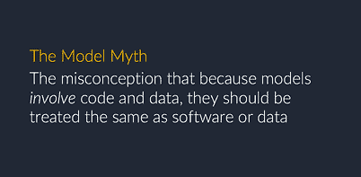

# 将模型置于业务流程的核心

> 原文：<https://www.dominodatalab.com/blog/put-models-core-business-processes>

*在 [Rev](http://dominorev.wpengine.com/speakers/nick-elprin/) ，[达美乐首席执行官](https://www.linkedin.com/in/nick-elprin-0b30a038/)，[根据多年来与客户的坦诚讨论，继续提供关于管理数据科学的见解](https://blog.dominodatalab.com/managing-data-science-as-a-capability/)。他还深入研究了数据科学领导者如何利用模型管理，并帮助他们的公司成为成功的模型驱动型组织。这篇博客文章提供了白皮书“[介绍模型管理](https://www.dominodatalab.com/resources/model-management/?utm_source=blog&utm_medium=post&utm_campaign=)”的摘要。这份白皮书是他演讲的附录，也可以从[下载](https://www.dominodatalab.com/resources/model-management/?utm_source=blog&utm_medium=post&utm_campaign=)。*

## 模特神话

Domino 的最新白皮书[“介绍模型管理](https://www.dominodatalab.com/resources/model-management/?utm_source=blog&utm_medium=post&utm_campaign=)”涵盖了模型管理如何成为希望将模型置于业务流程核心的公司的一种新的组织能力。由于模型是数据科学的核心产出，它们拥有巨大的力量来改变公司、行业和社会。然而，尽管拥有模型驱动的优势，企业仍在努力实现这一目标。麻省理工学院斯隆管理学院最近的一项研究发现，只有 5%的公司在其业务中广泛使用模型。为什么会这样？公司对待模型就像对待软件一样，而事实上，它们是非常不同的——这就是模型神话。尽管模型看起来像软件并且涉及数据，但是模型有不同的输入材料、不同的开发过程和不同的行为。

## 用模型管理克服模型神话

为了克服模型神话，公司需要开发一种新的组织能力，称为模型管理。以前，模型管理指的是监控生产模型。然而，它应该包含更广泛的能力。正如公司已经建立了销售、营销、人员管理、财务等方面的能力一样，它们也需要数据科学方面的同等能力。模型管理是一种新的技术和流程类别，这些技术和流程协同工作，使公司能够可靠、安全地开发、验证、交付和监控能够创造竞争优势的模型。

随着更多模型带来更好的客户体验和更高的利润，成功构建模型管理能力的数据科学领导者和组织将获得指数级回报。随着模型的建立，更多的模型也意味着更多的数据和能力，组织可以投资新的和更好的模型。这些组织还将更好地应对阻碍道德和合规风险等模型影响的常见陷阱。最终，下一个计算时代的富人和穷人将由组织的模型管理质量决定。

指南[“模型管理”](https://www.dominodatalab.com/resources/model-management/?utm_source=blog&utm_medium=post&utm_campaign=)综合了 Domino 的经验，提炼出问题，并提出了实现数据科学全部潜力的前进道路。第一部分描述了什么是模型，并讨论了模型如何驱动商业价值。第二部分关注问题的本质——模型不同于迄今为止构建的任何东西，组织可以像管理其他资产一样管理它们是一个神话。第三部分深入到一个提议的模型管理框架的细节，包括 5 个支柱，它解决了模型的独特属性。