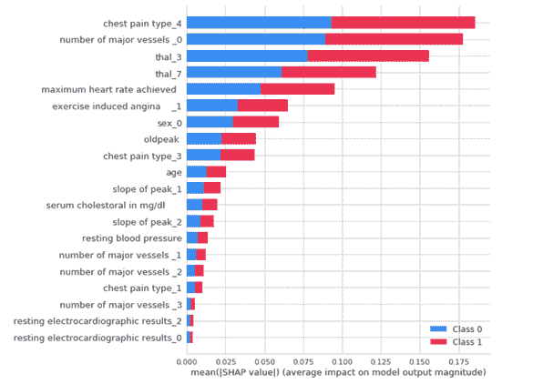

# PyCaret 2.2:模型开发的高效管道

> 原文：<https://www.dominodatalab.com/blog/pycaret-2-2-efficient-pipelines-for-model-development>

数据科学是一个令人兴奋的领域，但它可能会令人生畏，尤其是对那些编码新手来说。即使对于有经验的开发人员和数据科学家来说，开发一个模型的过程也可能涉及到将许多包中的许多步骤串联起来，其方式可能不像人们希望的那样优雅或高效。R 中 [Caret](http://topepo.github.io/caret/index.html) 库的创建者是一位名叫 Max Kuhnwho 的软件工程师，他试图通过创建[一个更有效的、开发模型](https://www.r-project.org/conferences/useR-2010/slides/Kuhn.pdf)的“流线型”过程来改善这种情况。最终，数据科学家 [Philip Goddard](http://philipmgoddard.com/Python/pycaret) 从 R 转到了 Python，为了带来 Caret 的“平滑和直观”的工作流，他创建了第一个名为 [pycaret](https://github.com/philipmgoddard/pycaret) 的包作为个人项目。然而，我们现在知道的 PyCaret 包的诞生是在 2019 年，当时数据科学家 Moez Ali 认识到公民数据科学家需要更好的工具，并创建了 [PyCaret](https://pycaret.org/) 来满足这一需求。


Image from [github.com/pycaret](http://github.com/pycaret)

## PyCaret 是什么？

PyCaret 是进入机器学习的便利入口，也是有经验的从业者的生产力工具。它为科学家和分析师提供了一个简单、简洁、低代码的接口，可以访问数据科学生态系统中许多最受欢迎和最强大的机器学习库，从而可以轻松地开始探索新技术或数据集。PyCaret 用户生成的清晰、简洁的代码也易于合作者和队友阅读和适应，无论这些同事是该领域的新手还是有经验的数据科学家。

## PyCaret 的构建模块

PyCaret 最初是为了将许多有用的 Python 库和常见任务包装成简洁的可重复组件而构建的，这使得用最少的语句构建管道变得很容易。今天，PyCaret 仍然使用许多 Pythonistas 熟悉的模块:用于数据辩论的 Pandas 和 Numpy、用于可视化的 Matplotlib、 [Plotly](https://www.dominodatalab.com/blog/visualizing-data-with-plotly-and-domino) 和 Seaborn、用于建模的 scikit-learn 和 XGBoost、用于自然语言处理的 Gensim、Spacy 和 NLTK 等等。


Image from [pycaret.org](http://pycaret.org)

## 建设管道

虽然从第一个版本到 PyCaret 2.2，内部结构和用法有了很大的变化，但是体验仍然植根于同一个目标:整个模型开发生命周期的简单效率。这意味着您可以利用 PyCaret 从原始数据到训练、调整、可解释性分析，再到[模型选择](/data-science-dictionary/model-selection)和实验记录，所有这些都只需要几行代码。


Training and comparing models in just a few lines of code

让我们浏览一下在 PyCaret 中构建分类管道的每一步。

## 装置

您可以在这里的预配置示例项目中快速试用 PyCaret:[Domino 上的 py caret 项目](https://try.dominodatalab.com/u/katie_shakman/PyCaret/overview)。如果您想将它安装在另一个 Domino 计算环境中，或者在其他地方使用 Docker 映像，您可以添加以下 RUN 语句来添加 PyCaret 2.2.2(以及本演练所需的依赖项):

```py
RUN sudo apt-get purge python-numpy -y

&& sudo apt-get autoremove --purge python-numpy -y

&& sudo pip uninstall numpy -y

&& sudo pip install numpy==1.17 && sudo pip install pycaret==2.2.2 && sudo pip install shap==0.36.0
```

或者你可以用 pip 安装(尽管如果你没有使用 Docker，你可能想在虚拟环境中这样做): **`pip install pycaret`**

对于这个例子，我从 Domino Analytics 发行版环境开始。根据您的启动环境，您可能还需要安装 Pandas 和 Domino Analytics 发行版附带的一些附加依赖项。

您可以通过导入软件包来验证是否安装了所有内容，如下所示:

```py
import pycaret

print('Using PyCaret Version', pycaret.__version__)

print('Path to PyCaret: ', pycaret.__file__)

import os

import pandas as pd

from pycaret.classification import *

from pycaret import datasets
```

### 访问数据

有两种方法可以将您的数据注册到 PyCaret 中:通过存储库或 Pandas 数据框架。让我们来看看每种方法。

### 加载带有熊猫的数据框

将数据放入 PyCaret 的第一种方法是加载一个 Pandas 数据帧，然后将其传递给 PyCaret。

```py
data_path = os.path.join(os.environ['DOMINO_WORKING_DIR'], 'mushrooms.csv')

print('Data path: ', data_path)

data = pd.read_csv(data_path)

data.head()
```


**使用数据仓库**

PyCaret 教程中使用的第二种获取数据的方法是从 [PyCaret 数据存储库](https://pycaret.org/get-data/#datasets)中提取一个精选的数据集。该存储库包含了用于分类、回归、聚类、NLP 等的流行样本数据集，非常有用。(据我所知，该存储库包含 56 个数据集，这里显示了其中的一个示例。)您可以列出存储库中所有可用的数据集，并查看相关的元数据:

```py
all_datasets = pycaret.datasets.get_data('index')
```


```py
all_datasets = pycaret.datasets.get_data('index')

dataset_name = 'heart_disease' # Replace with your desired dataset.

data = pycaret.datasets.get_data(dataset_name)
```


**注意** : PyCaret 2.2 期望数据作为数据帧加载到内存中。如果您使用的是大型数据集，PyCaret 在项目的探索和原型阶段可能会很有用，前提是您可以将足够多的数据样本加载到内存中进行有意义的探索。如果您的数据集既大又宽，使得您的要素数量接近或大于您可以加载到内存中的样本数量，那么预处理以减少要素数量或利用其他工具将是更好的选择。

### 实验设置

PyCaret 自动处理许多繁琐的预处理步骤，它将基本的数据准备步骤标准化并方便地打包到可重复的省时工作流中。用户能够自动清理(例如，使用各种可用的插补方法处理缺失值)，分成训练集和测试集，以及[特征工程和训练](/blog/manual-feature-engineering)的某些方面。虽然在这个过程中创建的许多对象没有明确地显示给用户(比如训练和测试集，或者标签向量)，但是如果更有经验的从业者需要或者希望的话，它们是可以访问的。

```py
clf1 = setup(data,

             target = target_variable_name, # Use your target variable.

             session_id=123,

             log_experiment=True,

             experiment_name='experiment1', # Use any experiment name.

             silent=True # Runs the command without user input.

            )
```


## 比较基线模型

在这里，我们开始看到 PyCaret 的全部功能。在一行代码中，我们可以训练和比较数据集上所有可用模型的基线版本:

**T2`best_model = compare_models()`**

这将训练每个可用模型类型的基线版本，并产生训练模型的度量的详细比较，并突出显示跨模型的最佳结果。

```py
best_model = compare_models()
```

请注意，我们不需要手动准备任何数据——我们只需要以 CSV 格式提供数据，并运行 setup 函数。在这两个设置步骤的幕后，数据被传递到 PyCaret，并被转换到训练和评估可用模型所必需的程度。要查看 PyCaret 了解哪些模型，我们可以运行

**T2`models()`**

它返回所有可用模型的数据框架、它们的专有名称、它们所来自的参考包(例如 sklearn.linear_model。_ 后勤。LogisticRegression)，以及是否支持 Turbo(一种限制模型训练时间的模式，对于快速比较可能是可取的)。

```py
models()
```


### 训练和调整特定模型

从 **compare_models** 中，我们可以轻松地看到每个指标的最佳基线模型，并选择它们进行进一步的研究。例如，如果我们要寻找上面 AUC 最高的模型，我们会选择继续使用随机森林。然后，我们可以使用 **create_model** 和 **tune_model** 函数保存并微调我们的模型。

```py
rf = create_model('rf', fold = 5)
```


```py
Tuned_rf = tune_model(rf) 
```


### 组合模型(可选)

我们可以用各种方式组合我们训练好的模型。首先，我们可以使用 bagging(引导聚合)和 boosting 等方法创建集成模型。装袋和增压均由**系综 _ 模型**函数调用。我们可以进一步应用混合和堆叠方法来组合不同的模型或估计器——估计器的列表可以传递给 **blend_models** 或 **stack_models** 。如果需要，可以创建集合模型，并通过混合或堆叠将它们组合在一起，所有这些都在一行代码中完成。为了清楚起见，我们将展示一个例子，其中这四个方法中的每一个都在它自己的单元格中顺序显示，这也允许我们看到当使用这些方法中的每一个时 PyCaret 的默认输出。

创建袋装决策树集成模型:

```py
bagged_dt = ensemble_model(dt) 
```


创建增强决策树集成模型:

```py
boosted_dt = ensemble_model(dt, method = ‘Boosting’) 
```


混合估计量:

```py
blender = blend_models(estimator_list = [boosted_dt, bagged_dt, tuned_rf], method = 'soft')
```


堆叠袋装、增强和调谐估值器；

```py
stacker = stack_models(estimator_list = [boosted_dt,bagged_dt,tuned_rf], meta_model=rf)
```


### AutoML (Optional)

使用 AutoML 特性可以快速、轻松地调整特定指标。

```py
# Select the best model based on the chosen metric

best = automl(optimize = 'AUC')

best
```


AutoML 技术通常减少了对模型选择过程的人工监督，这在许多情况下可能是不理想或不合适的，它们可以是一种有用的工具，用于快速识别特定目的的最高性能选项。

## 用图分析模型

一旦选择了首选模型，无论采用何种方法，其性能都可以通过内置的绘图选项进行可视化。例如，您可以简单地在随机森林模型上调用 **plot_model** 来返回每个类的重叠 ROC 曲线:

```py
plot_model(best)
```


### 用 SHAP 解释模型(对于兼容的模型类型)

越来越多的情况是，仅仅有一个性能良好的模型是不够的——在许多行业和应用中，模型还必须是可解释的。我们的首席数据科学家 Josh Poduska 在两部分系列中写了关于 SHAP 和其他可解释工具的精彩概述，第一部分讨论了 SHAP 的利弊，第二部分讨论了 t 2 在多米诺骨牌中使用 SHAP 的问题。PyCaret 提供与 SHAP 的无缝集成，因此您可以轻松地将解释图添加到您的模型分析中。

```py
interpret_model(best)
```



```py
interpret_model(best, plot = 'correlation')
```


```py
interpret_model(best, plot = 'reason', observation = 12)
```

### 预测

正如我们现在所期望的，根据我们的测试数据生成预测是轻而易举的事情:

```py
predict_model(best)
```


## 保存并加载模型

一旦我们对选择的模型感到满意，我们就可以轻松地保存它:

```py
save_model(best, model_name='best-model')
```


最后，我们可以加载我们保存的模型以供使用:

```py
loaded_bestmodel = load_model('best-model')

print(loaded_bestmodel)
```


如果您想了解我们如何将所有这些整合到一个可复制、可共享的 Domino 项目中，请查看下面的参考项目。它包括上面讨论的所有内容，以及一些其他的例子和资源。任何人都可以浏览项目并下载代码文件。您必须登录(免费 do to - [在此注册](/trial/))才能在 Domino 中运行代码。

我们很想听听您对 PyCaret 的使用案例和体验。让我们知道它是否对您有所帮助，以及您是否希望在这个领域看到更多关于工具的项目和片段。给我们留言或者把你的问题和反馈带到[多米诺社区](https://community.dominodatalab.com/)(也是免费的- [在这里注册](https://community.dominodatalab.com/entry/register?Target=categories))。

#### Domino 参考项目

Domino 上的 PyCaret 项目

这篇文章附带了一个参考项目，为您提供了一种快速的方法来尝试我们的 PyCaret 并跟随这个演练。该项目包括一个分类管道[模板笔记本](https://try.dominodatalab.com/u/katie_shakman/PyCaret/view/PyCaret_Template.ipynb)，它解决了上述问题并展示了附加功能。