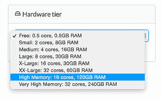
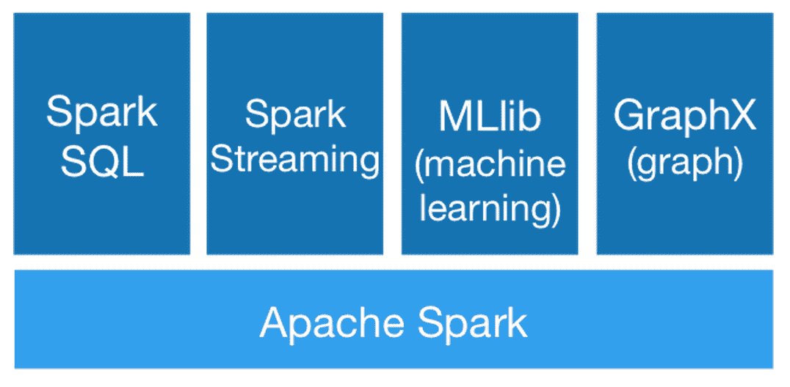

# 如何使用 Domino 在 32 核集群上运行 PySpark

> 原文：<https://www.dominodatalab.com/blog/pyspark-on-domino>

在本帖中，我们将向您展示使用 Spark 的两种不同方式。第一种是使用 Domino，它在功能强大的 AWS 机器上预装和配置了 Spark。第二种选择是使用您自己的本地设置——我将指导您完成安装过程。

## Spark 概述

[Spark](https://www.dominodatalab.com/data-science-dictionary/apache-spark) 是一个快速通用的集群计算平台，非常适合数据科学家每天需要执行的多种类型的并行任务。Spark 扩展了只有两个操作符的 MapReduce，使其包含更广泛的交互式分析查询和流处理选项。Spark 最大的优势可能是它能够在内存中运行计算。Spark 网站称，它在内存上运行程序的速度比 Hadoop MapReduce 快 100 倍，在磁盘上快 10 倍。

Spark 如此强大有两个原因。首先，**它为表达并行计算任务**提供了一个很好的语法。其次，**它极大地简化了跨集群扩展作业**。Spark 让我们更接近实时分析数字处理。作为在物联网领域工作的人，这种可能性不仅有趣，而且对基于传感器的触发器、警报和可操作智能的未来至关重要。许多应用程序的未来取决于以快速方式对多种数据类型进行“实时”处理，以便更快地向客户交付结果。

## 多米诺骨牌中的火花

Domino 允许您在任何类型的 EC2 机器上运行您自己的代码(或者在您自己的硬件上，当安装在本地时)。这让我们可以在一台多达 32 个内核的机器上运行 Spark 代码，而无需任何设置或配置。在 Domino 端，一切都是预先配置好的，所以您不需要安装任何东西。

在本文中，我们将使用一种现成的 MLlib 算法来测试 Spark 的核心并行化能力。

让我们跳过大数据的 Hello 世界——计算单词——直接进入更有趣的话题。如果您想知道，Spark 支持两种用于二进制分类的线性方法:支持向量机(SVM)和逻辑回归。为了更好地了解 PySpark 中的 SVM 和对数回归，请查看加州大学洛杉矶分校的 Mevlut Turker Garip 的教程。

在 Python 中，我们从导入适当的 Spark 库开始。

```py
from pyspark import SparkContext

from pyspark.mllib.regression import LabeledPoint

from pyspark.mllib.classification import LogisticRegressionWithSGD
```

第一个，SparkContext，是 Spark 最重要的组件。为什么？SparkContext 是到 Spark 集群的连接，可以用来创建我们前面讨论过的非常重要的 rdd。

## 尊重公园背景

现在我们可以开始我们的火花了:

```py
sc = SparkContext(appName="PythonLR")
```

接下来，我们需要确保每个数据点的特征和标签以 MLlib 喜欢的方式格式化。注意:如果您习惯于用-1 和 1 标记二进制分类，那么您必须在 MLlib 中将-1 标记切换到 0。幸运的是，进行这种转换很简单。如果你分叉这个项目，一定要格式你的数据“正确”第一！以下函数拆分数据集中的值(逐行)，将任何-1 转换为 0，然后以 LabeledPoint 格式返回一组标注/要素。

```py
def parsePoint(line):

    values = [float(s) for s in line.split(' ')]

    if values[0] == -1:   # Convert -1 labels to 0 for MLlib

        values[0] = 0

    return LabeledPoint(values[0], values[1:])
```

下一行很长。它使用我们选择的数据集创建我们的 RDD，然后执行地图转换。在本例中，我们已经用 parsePoint()函数创建了所需的 map 过程。

```py
points = sc.textFile("sample_svm_data.txt").map(parsePoint)
```

最后，我们设置迭代次数，用随机梯度下降训练我们的逻辑回归模型，打印一些最终权重和截距值，然后在最后关闭我们的 Spark 集群。

```py
iterations = 5

model = LogisticRegressionWithSGD.train(points, iterations)

print("Final weights: " + str(model.weights))

print("Final intercept: " + str(model.intercept))

sc.stop()
```



拥有一个可以从 Spark 强大的数据处理中受益的大数据集？转到 Domino 项目设置中的“**硬件层**，并根据需要进行扩展。Spark + Domino 是一个非常棒的组合。这里我只演示了一个小的数据集用例，但是我强烈建议在用您自己的数据扩展硬件时测试一下 Domino 的性能变化。有趣的是 Spark 在多达 32 个内核的“集群”上运行时是多么强大...当集群实际上只在一台机器上运行时。这并不是说你不能在 8 台各有 4 个内核的机器上使用 Spark，但是如果你在一台机器上有 32 个内核，为什么不让它们唱歌呢，对吗？

让我们看看使用不同硬件层设置的输出。

| 硬件层 | 持续时间 |
| --- | --- |
| 小型(双核，8GB) | 26s |
| 中型(4 核，16GB) | 22s |
| 超大(16 核，30GB) | 35s |
| XX-大型(32 个内核，60GB) | 19 岁 |
| GPU (8 色，15GB) | 14s |

这里有一些令人惊讶的结果。首先，16 核机器(EC c3.4xlarge)比预期慢得多。我们不确定这是为什么——这不是我们第一次在特定类型的 EC2 机器上看到奇怪的配置。第二个令人惊讶的结果是 GPU 实例有多快(一个 EC2 g2.2xlarge)，尽管它的内核较少)。这个故事的寓意是，越大并不总是越好=)

顺便说一下，如果您已经建立了自己的 Spark 集群，Domino 也可以连接到它并在那里运行代码。

## 本地安装

如果你有一天带着笔记本电脑被困在荒岛上，无法上网，以下是如何在你自己的环境中安装 Spark 的方法。JSpark 是建立在 [Scala](http://www.scala-lang.org/) 之上的，但是如果你对如何用 Scala 编码有一点模糊的了解，并且更喜欢 Python 这样的语言，那么你就没问题了。事实上，从最新的 Spark 版本(1.4.0)开始，你可以使用 R。就我个人而言，如果你计划创建可部署的应用程序/产品，我发现 Python 或 Java 是更好的 Scala 选择，但是如果你只需要在 R 中运行“一次性”脚本，那么 Spark 会工作得非常好。

Spark 文档给出了一个不太令人满意的[安装指南](https://spark.apache.org/docs/latest/)，所以如果你是 Mac 用户，我强烈推荐[这个](http://genomegeek.blogspot.com/2014/11/how-to-install-apache-spark-on-mac-os-x.html)教程。Linux 用户应该看看[的这个](http://blog.prabeeshk.com/blog/2014/10/31/install-apache-spark-on-ubuntu-14-dot-04/)教程。不管是什么操作系统，安装 Spark 都是一个相当轻松的体验。接下来的过程主要是这样的:

1.  确保您安装了 Java 开发工具包的版本 7 或 8
2.  安装 Scala
3.  从[https://spark.apache.org/downloads.html](https://spark.apache.org/downloads.html)下载火花
4.  光盘放入 Spark 下载目录并运行:
    `sbt/sbt clean assembly`
5.  用
    `./bin/pyspark`从 Python 运行 Spark

我不知道你，但我总是忘记给我的生活增加新的内容。zshrc 或者。bashrc 文件。我相信你们大多数人都走在了这条曲线的前面，但是对于像我这样容易分心的人来说，下面是我在我的。zshrc 文件。请确保根据您独特的安装路径进行更改，否则您的 shell 会向您抛出错误。

```py
prettyprint lang-sh

export JAVA_HOME=$(/usr/libexec/java_home)

export SCALA_HOME=/usr/local/bin/scala

export PATH=$PATH:$SCALA_HOME/bin

export SPARK_HOME=~/spark-1.4.0

export PATH=$PATH:$SPARK_HOME/bin

export PYTHONPATH=$SPARK_HOME/python:$SPARK_HOME/build:$PYTHONPATH
```

另一个小提示。火花太健谈了，我不喜欢。告诉我最基本的，伙计！我通过将信息打印转换为如下警告，使 Spark 不那么冗长:

```py
cd ~/spark-1.4.0/conf

cp log4j.properties.template log4j.properties
```

编辑 log4j.properties 并更改下面一行，通过将 INFO 改为 WARN，将 log4j.rootCategory 设置为只记录警告和错误。保存并关闭文件，一切都准备好了。

您可以在 Spark 安装中的 examples 部分找到我们之前在 Domino 中运行的逻辑回归示例。Spark 附带了一些非常好的 MLlib 示例，您可以在下面找到:

```py
$SPARK_HOME/examples/src/main/python/mllib/. Spark also provides some basic datasets to start with under $SPARK_HOME/data/mllib/.
```

## 进一步阅读

既然您有了一个可以轻松扩展工作的平台，那么在 Spark 的核心之上自然会有 Apache 支持的包，以便使整个数据路由、存储和处理过程更加容易。下图显示了当前的 Spark 生态系统，其中包括用于数据查询的 Spark SQL、用于实时流处理的 Spark Streaming、用于开箱即用的机器学习算法的 MLlib 以及面向所有图论爱好者的 GraphX。



Spark 中有很多值得学习的内容，会让您忙碌一段时间。如果你想深入兔子洞，我推荐你去拿奥莱利的书[学习火花](http://shop.oreilly.com/product/0636920028512.do)。