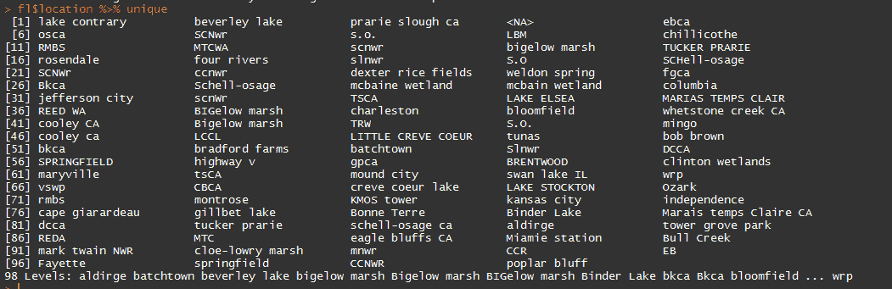
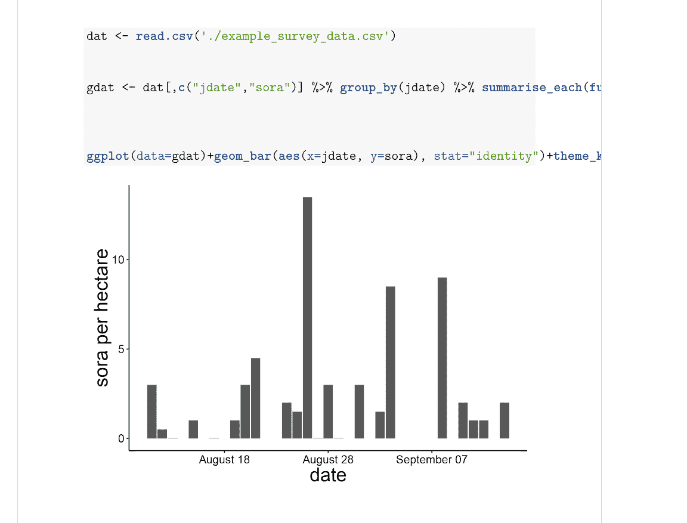
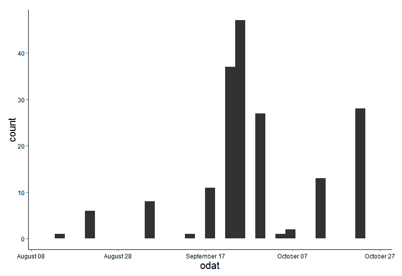

# 生态学中的 r

> 原文：<https://www.dominodatalab.com/blog/r-in-ecology>

我是个有点 R 的书呆子。好吧，那是骗人的；我是个大书呆子。但是有很好的理由，因为 R 在简化科学过程中非常有用，并且增加了以更少的人为错误复制发现的能力。

我经常和我的研究生同学谈论学习 R 的主要原因是因为研究生必须重做的事情几乎是常数；这甚至发生在作为一个整体的科学中。如果你花了整整一周的时间使用 GUI 来运行你的所有模型，然后你把它们呈现给你的顾问，而她/他告诉你你需要改变“仅仅一件事”，这将花费你另外一周的时间来完成。这是令人沮丧的，至少可以说，尤其是当它发生不止一次。

然而，当您编写了该过程的脚本后，返回并进行小的更改通常会更快、更容易，而不必手动重做大部分工作，或者记住该过程的每一步。无论是总结数据、运行模型还是制作图表，都是如此。学习曲线是陡峭的，但特别是如果你打算在获得学位后继续进行研究，这是非常值得的。当您正在处理多个项目，并且您可能三个月没有接触数据，然后需要立即返回时，它也是有帮助的。如果你已经很好地描述了你的脚本(你有一个包含代码和正在发生的事情的大量细节的文件)，你可以更容易地恢复项目，记住你从哪里停止，为什么你从站点 23 丢弃所有的数据，以及你运行的是什么类型的模型。现在，我正忙于五个论文章节和三个兼职项目。我的待办事项清单和 R 脚本是唯一让我不至于负债的东西。

此外，当您需要向分析中添加更多数据时，这也很有帮助，因为已经收集了更多数据，或者因为您之前只分析了数据的一个子集。诺姆·罗斯有一些很好的幻灯片，描述了为什么可复制的研究是一个有价值的目标。这些幻灯片讨论了一些其他工具，但这些概念非常适用于 R。R 可以帮助您使您的分析尽可能透明，并消除不断重新运行它的需要，并重新生成包含讨厌的“又一次修复”的图形

## 数据清理

我不在 r 中输入我的数据。有些人输入了，但我觉得这很乏味，我也让我的技术人员输入我一半的数据，因为使用电子表格更容易。然而，一旦它被输入和校对，我就把它导出到。csv，其他都用 r 写，我记性太差了。我从来不记得我对我的数据做了什么，所以我把它写成脚本，这样我就可以回头看，弄清楚所有的事情，如果/当我需要的时候再做一次。我从不更改原始数据文件(从我的现场数据表输入的原始文件)。该数据的任何更改都在 R 中完成，然后写入不同的. csv。

该过程的第一部分是数据清理。尽管我在 Twitter 上谈论了很多，但我经常花大量时间清理我自己的数据。这包括检查不可能的数值，通常还有拼写错误。因为我每年秋天收集三个月的数据，这也让我可以一路探索数据，看看发生了什么。

清理数据听起来可能很繁琐，也确实如此，但这非常重要。否则，当你试图运行一个分析或总结你的数据，并获得“密苏里”，“密苏里”和“密苏里”水深的总结，这是不太有用的。

以下是我所处理的不同数据集的所有唯一位置值的示例。如你所见，有许多不一致的地方:比如，毕格罗沼泽和毕格罗沼泽。



此外，如果您有一个随时间增长的数据集，您可以使用这种方法将所有这些不同时期的数据文件合并到一个脚本中，这样您就不必粘贴、复制和担心破坏任何东西。如果您从不同的人那里接收数据，这也非常有帮助，因此您可以确保所有数据都是相同的格式。

该方法还保留了原始文件，以防您以后需要返回并找出任何奇怪值的来源。在我的野外工作中，每天早上我从我们的 GPS 管理软件中导出测量数据，并使用“combining_night_files.R”清理/检查/缝合它们。

```py
file_names <- list.files (path=”./R_in_ecology/night_files/“,pattern=“.csv”) 

# creates a list of the files so that we can read all of them in, and not have to copy and paste all the file names, or worry about updating that list manually as the files grow in number. These data are highly subsetted files from my dissertation, and I realize that latitude typically is accompanied by longitude, but this is all I’m using for this example.  

library(tidyr)

library(dplyr) # gives us the gift of pipes “%>%” 

library(auriel) # my personal R package, used here for the ordinal_date_con() function

nights <- list() # creates the list into which all of our files are going to be stored

for(i in 1:length(file_names)){

# first I have to pull the data I need out of the file name, as I store a bunch of information there.

  dat <- as.data.frame(file_names[i]) 

  colnames(dat) <- “name”

  names <- dat %>% separate(name, into=c(“year”,”month”,”day”,”obs”,”round”,”region”,”area”,”impound”,”treat”,”night”),sep=“_”)

  names <- names %>% separate(night, into=c(“night”,”file”), sep=-5)

 # now we read in the .csv and stitch together all of the data from above with this data   frame, as well as splitting things apart into multiple columns

  int <-  read.csv(paste0(“./R_in_ecology/night_files/“,file_names[i]))

  lesscol <-  int[,c(“lat”,“name”)]

  lesscol$name <- as.character(lesscol$name)

  lesscol$name <-  ifelse(nchar(lesscol$name)==7,paste0(lesscol$name, “N”),lesscol$name)

  lesscol <- lesscol %>% separate(name, into=c(“name”,“distance”),sep=5) %>%  separate(distance, into=c(“species”,“distance”), sep=1) %>% separate(distance, into=c

  (“distance”,“flush_walk”), sep=-2)

  lesscol$distance <- as.numeric(lesscol$distance)

  lesscol$species <- tolower(lesscol$species)

  lesscol$year <- as.numeric(names$year)

  lesscol$month <- as.numeric(names$month)

  lesscol$day <- as.numeric(names$day)

  lesscol$obs <- names$obs

  lesscol$round <- names$round

  lesscol$region <- names$region

  lesscol$area <- names$area

  lesscol$impound <- names$impound

  lesscol$treat <- names$treat

  lesscol$night <- names$night

  lesscol$odat <- ordinal_date_con(lesscol[,c(“month”,“day”,“year”)])

  nights[[i]] <- lesscol # throws it back into the list in the same place it came from; some will hate this.

  }

  masterdat <- do.call(rbind, nights) #: this binds together all of the items in the nights[[]] list. This script is great because it can grow with each file.

 # now we can write this out, or do whatever needs to be done with it. 
```

我也有一个我们的调查和植被数据的脚本。同样的过程，循环，逐个检查每个文件，检查一遍，然后把它们缝合在一起。为了简单起见，github 上的示例数据文件只有一个文件。

我使用 match (%in%)等神奇的东西来确保我的植物拼写正确，我的网站没有错别字，这样以后当我开始分析我的数据时，我就不必花很多时间来校对了。

```py
int <- read.csv(“./R_in_ecology/example_survey_data.csv”)

regions <- c(“nw”,“nc”,“ne”,“se”)

fs <- c(“fed”,“stat”)

print(paste0(int[(int$region %in% regions==FALSE),]$region,“ ”, “region”))

print(paste0(int[(int$fs %in% fs==FALSE),]$area,“ ”,“area”))

is.numeric(dat$sora)

is.numeric(dat$jdate)
```

当这个文件只是返回一堆“区域”和“面积”而不是“SDF 区域”或任何其他不正确的值时，我们就可以开始了。当我对整个赛季收集的 100 多个文件执行此操作时，我将使用“for”循环来单独检查每个文件。

dplyr 和 tidyr 包是实现这一切的关键。

## 报告

我几乎每天都使用 R 的一个主要方式是通过 RMarkdown 文件，它允许我在编写报告和重新生成一系列图表时消除一些麻烦。我可以用 R 写出来，然后把它们编织在一起，这样看起来就很清楚了。html 或者。pdf 文件。

这对于为合作者创建定期报告，或者每天生成一堆图表而不必做一堆工作(聪明地工作，而不是努力地工作)来说是超级棒的！).

它消除了所有的复制和粘贴过程，可以轻松地制作出漂亮的报告。我爱 RMarkdown 这简直是最好的。现在，如果我能让我所有的合作者也在上面写就好了。相反，我送他们。pdf，他们给我评论，这也可以。[这个](http://rmarkdown.rstudio.com/)是开始 RMarkdown 的好地方。

最棒的是你可以写这样的东西:

```py
# Fun with Graphs
You can create graphs in RMarkdown and print them with or without the code shown. The echo, message, and warning arguments are set to false in the first graph to hide the code and any other outputs.

{r, echo=F, message=F, warning=F}
dat <- read.csv(‘./example_survey_data.csv’)
gdat <- dat[,c(“jdate”,“sora”)] %>%
group_by(jdate) %>% summarise_each(funs(median))

ggplot(data=gdat) +geom_bar(aes(x=jdate, y=sora), stat=“identity”)+theme_krementz()+scale_x_ordinaldate(year=2015)+xlab(“date”)+ylab(“sora per hectare”)
```

编织它，得到这个。



很酷，是吧？不必导出图表、将它们复制并粘贴到 Word 中，以及处理格式等，这是一个巨大的救命稻草，可以更容易地使用相同的图表/表格和其他数据分析定期创建报告。我将它用于我的常规实地调查报告、包含 50 多张地图和 25 幅图的年度报告，以及我每天/每周/每月使用的许多其他小型产品。

You 还可以在 markdown 文档中包含 latex 代码，以帮助对其进行更多的定制。我这样做是为了我的简历。

## 绘制图形

我喜欢 ggplot2。我从制作大量漂亮的图表中获得了极大的快乐。当我对论文的其余部分感到沮丧时，我就会调整图表。

ggplot 是制作可用于演示或制作有趣图形的出版物质量图表的好方法，它们是通过我前面提到的 RMarkdown 报告生成的，我使用这些报告来关注我的数据并为合作者创建更新。

我喜欢 ggplot 的一点是，我构建了一个以我的顾问命名的自定义主题，制作他喜欢的图形，这为我节省了大量时间，这是一件有价值的事情，并有助于让我的顾问高兴，这是一件更有价值的事情。因此，我不必每次都写出/复制并粘贴这些内容来制作我想要的图形:

```py
ggplot(data=masterdat)+

   geom_histogram(aes(x=odat))+

   scale_x_ordinaldate(2015)+

   theme(axis.text.x = element_text(size=12,color=“black”),

     axis.text.y = element_text(size=12,color=“black”),

     axis.title.y=element_text(size=20),

     plot.background = element_blank(),

     panel.border=element_blank(),

     panel.grid.major= element_line(colour=NA), 

     panel.grid.minor=element_line(colour=NA),

     title=element_text(size=20),

     panel.background = element_rect(fill =“white”),

     axis.line=element_line(colour=“black”),

     strip.background=element_rect(fill=“white”, color=“black”),

     strip.text=element_text(size=15))
```



我可以这样写:

```py
ggplot(data=masterdat) +
   geom_histogram(aes(x=odat)) +
   scale_x_ordinaldate(2015) +
   theme_krementz()
```


这更短，更干净，并且不需要我记住很多，这是我在每个 R 脚本中的目标，以拯救我可怜的记忆。

## 定制 R 包

有自己的 R 包真的很有用；这是一个保存东西的好地方，比如为 ggplot 保存自定义主题，以及为 ggplot 的其他部分保存有用的 mod，比如这个。

我用序数日期(一年中的某一天)来保存我所有的日期，所以我为 ggplot 构建了这个自定义的缩放器，使它可以轻松地创建具有真实日期(8 月 1 日)的图形，而不是序数日期。

```py
scale_x_ordinaldate &lt;- function(year){
   scale_x_continuous(label=function(x) strftime(chron(x, origin=c(month=1, day=1,year=year)), “%B %d”))
}
```

因此，我只需将`scale_x_ordinaldate(2015)`添加到我的 ggplot 图中，它就会将我图中的序数日期(一年中的某一天)更改为更易读的日期(8 月 1 日)。

希拉里·帕克写了一篇关于创建你自己的 R 包的精彩介绍。这非常适合保存和使用您编写的函数，以及保存您需要经常查看的数据集。我在很多很多项目中使用相同的数据集，如果我只在一台计算机上工作，这没什么大不了的。我可以使用文件路径将所有东西组织起来并保存在某个文件夹中。然而，相反，平均一周，我在两台，如果不是三台，不同的计算机上工作，所以如果它们不浪费我大量时间的话，这些文件路径只会引起挫败感。

有几种方法可以绕过这个问题，但是 Oliver Keyes 和 Jeff Hollister 向我建议的方法之一是将这些数据文件保存到一个 R 包中。然后你只需将软件包加载到你的计算机上，然后砰，数据文件。这些数据文件可以很容易地更新，通过使用 github，您可以很容易地在计算机之间移动包。您不必担心任何数据隐私问题，因为您可以拥有私人包。然而，在 github 上，如果你没有教育折扣，你将不得不为此付费(bitbucket 是解决这个问题的一种方法)。

将数据保存在 R 包中也有助于鼓励您(虽然它不强迫您)记录您的数据，这通常是当您将您的数据交给其他人时的一个大问题——缺少文档(所有这些列标题到底是什么意思？).

这也是编写和排除函数故障的很好的练习，并且维护一个包，这样有一天你就可以处理你将与其他人共享的包。也许你永远也不会这样做，但是知道软件包是如何工作的，以及如何对它们进行故障排除，可以在将来为你省去一大堆麻烦。

你可以在这里查看我个人 R 包常用的一些功能[。我也有一个私人数据包，但遗憾的是，我不能公开分享。](https://github.com/aurielfournier/rel)

## 建模

我做的大多数建模，以及我一天中的大多数头痛都是因为“未标记”包，它允许我使用距离采样数据来检查关于栖息地内鸟类密度的问题，并研究它们的迁徙。

在 R 语言中建模的方法非常多，种类也非常多。我最熟悉的是无标记支持的层次模型。这些模型允许同时估计动物的丰度、占用(或可用性)和检测概率，这是非常强大的，并允许我使用各种协变量来解释模型的每个级别。

## R 怎么入门

我非常喜欢使用 R 的一个原因是它可以非常灵活地使数据的重新排列变得简单，这样当我的合作者带着另一种思考数据的新方法回来时，我可以快速地重新排列事物并继续运行模型。这有助于消除进行科学研究的大量记忆，这是一件好事，而且它还允许你回去找出哪里出了问题(因为它们会出问题)。

r 确实有一个学习曲线，尤其是如果你以前从未编程过，但是它可以非常有趣和有益，一旦你超过了学习曲线，它就非常强大。

我是[软件木工](http://software-carpentry.org/)和[数据木工](http://www.datacarpentry.org/)的讲师，他们的课程可以在他们的网站上找到，非常棒。我经常指导人们从软件木工开始，以便在进入数据木工之前掌握 R 语言，但是这真的取决于你在哪里以及你的目标是什么。

像 [tidyr](http://blog.rstudio.org/2014/07/22/introducing-tidyr/) 和 [dplyr](https://www.dominodatalab.com/blog/manipulating-data-with-dplyr) 这样的软件包非常适合在一组一致的函数中清理、组织和操作你的数据。这两篇文章都是由活跃于 R 社区的 [Hadley Wickham](http://had.co.nz/) 撰写的，我推荐人们通过 Twitter 参与其中。

Twitter 上的标签是一个提问的好地方，我经常在 20 分钟内收到多个有用的回复。此外，这是一个逃离困扰其他 R 帮助来源的危险的好地方。