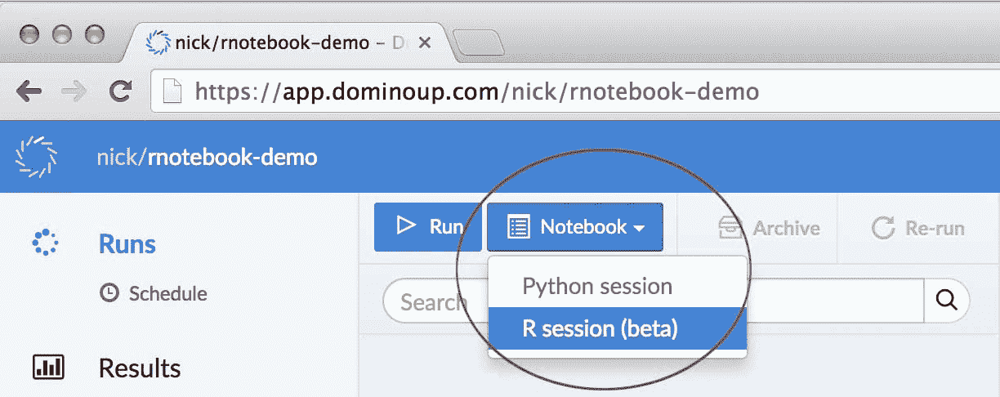
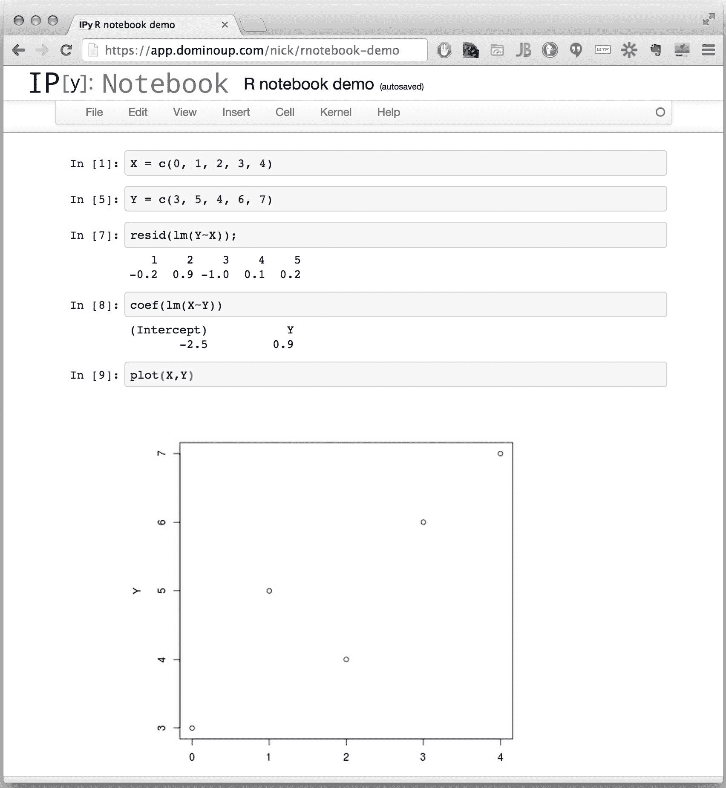
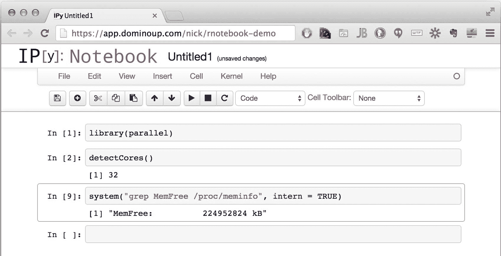

# r 云中的笔记本电脑

> 原文：<https://www.dominodatalab.com/blog/r-notebooks>

我们最近为 Domino 添加了一个特性，让您只需点击一下鼠标，就可以在您选择的任何一类硬件上启动交互式 R 会话，从而在 R 中实现更强大的交互式探索性工作，而无需任何基础设施或设置麻烦。这篇文章描述了我们如何以及为什么构建我们的“ [R Notebook](https://www.dominodatalab.com?utm_source=blog&utm_medium=post&utm_campaign=r-notebooks) ”特性。

## R 笔记本如何工作

我们想要一个解决方案:(1)让我们的用户与 R 交互工作；(2)在强大的机器上；以及(3) [在云上运行 R](https://www.dominodatalab.com?utm_source=blog&utm_medium=post&utm_campaign=r-notebooks)而不需要任何设置或基础设施管理。出于我下面描述的原因，我们修改了 IPython Notebook 来满足这个需求。结果就是我们所说的 R 笔记本:一个交互式的 IPython 笔记本环境，使用 R 代码。它甚至处理绘图和视觉输出！

那么它是如何工作的呢？

### 第 1 步:一键启动笔记本会话:

与 Domino 中的任何其他运行一样，这将启动一台新机器(在您选择的硬件上)，并自动加载您的项目文件。



### 第二步:使用笔记本！



任何 R 命令都可以工作，包括加载包的命令和`system`函数。既然 Domino 允许您在功能强大得离谱的机器上运行这些笔记本(例如，32 个内核，240GB 内存)，那么让我们展示一下:



## 动机

我们对 [Domino](https://www.dominodatalab.com) 的愿景是成为一个平台，加速整个分析生命周期的工作，从早期探索，一直到分析模型的打包和部署。我们认为我们正在朝着这个目标前进，这篇文章是关于我们最近添加的一个特性，它填补了我们对生命周期早期阶段支持的一个空白:r 中的交互式工作。

## 分析生命周期

分析思想经历了不同的阶段:

1.  **探索/构思**。在一个想法的早期阶段，能够交互地“玩数据”是至关重要的。你正在尝试不同的技术，快速解决问题，找出可行的方法。
2.  **细化**。最终你有了一个你想要投资的方法，你必须提炼或者“硬化”一个模型。通常这需要更多的实验:例如，用几个不同的参数在你的整个数据集上运行一个模型，看看什么效果最好。

3.  **包装和部署。一旦你有了可以工作的东西，通常它会被部署用于一些正在进行的使用:要么打包成一个 UI 供人们交互，要么部署一些 API(或 web 服务)以便软件系统可以使用它。**

Domino 为所有三个阶段提供了多种不同语言的解决方案，但是我们有一个缺口。对于交互式探索性工作，我们支持在 Python 中使用 IPython 笔记本，但是对于在 r 中使用，我们没有一个好的解决方案。

| 分析生命周期的阶段 |
| --- |
|   | 1.探索/构思 | 2.改善 | 3.打包/部署 |
| --- | --- | --- | --- |
| 要求 | 互动环境 | 能够快速并行运行多个实验，并跟踪工作和结果 | 围绕您的模型轻松创建 GUI 或 web 服务 |
| 我们的解决方案
为 R | **我们的
差距** | 我们的面包和黄油:轻松地在远程机器上运行您的脚本，您想要多少就有多少，并保持它们都被跟踪 | 用户界面的[发射器](https://support.dominodatalab.com/hc/en-us/articles/204139569-Launchers)，API 发布的[服务器](https://rforge.net/Rserve/) |
| 我们的 Python 解决方案
 | ipython 笔记本 | 用于 UI 的[启动器](https://support.dominodatalab.com/hc/en-us/articles/204139569-Launchers)，以及用于 API 发布的 [pyro](https://github.com/irmen/Pyro4) |

## 实施细节

因为我们已经支持在任意 EC2 机器上的 docker 容器中运行 IPython 笔记本服务器，所以我们选择使用 IPython 笔记本作为我们的 R 解决方案。

关于 IPython Notebook 的一个鲜为人知的事实(可能是因为它的名字)是，它实际上可以运行各种其他语言的代码。特别是，它的 [RMagic 功能](https://ipython.org/ipython-doc/2/config/extensions/rmagic.html)允许你在 IPython 笔记本单元格内运行 R 命令，方法是在命令前加上`%R`修饰符。我们改编了[这个【黑客】](https://github.com/fperez/ipython-rkernel/blob/master/README.md)(谢谢， [fperez](https://github.com/fperez) ！)将 RMagic 修改自动添加到每个单元格表达式中。

这种方法是用一个启动脚本创建一个新的 ipython 概要文件，该脚本会自动在您计算的任何表达式前面加上`%R`魔法前缀。结果是一个交互式 R 笔记本。

具体步骤如下:

1.  *pip 安装 rpy2*
2.  ipython 配置文件创建 rkernel
3.  将 rkernel.py 复制到~/中。ipython/profile _ rker nel/startup

其中`rkernely.py`是 fperez 脚本的稍微修改版本。我们只需将第 15 行的`rmagic`扩展改为`rpy2.ipython`扩展，以兼容 IPython Notebook 2。

15 行代码的“原生”IPython R 内核。

这不是一个真正的原生 R 内核，只是一个快速而肮脏的黑客行为，只需要几行代码就可以实现基本的运行。

将它放入您的启动目录，作为一个名为“rkernel”或类似名称的配置文件，启动时，内核将通过简单地在每个单元格前添加`%%R`来模仿 R one。

```py
from IPython.core.interactiveshell import InteractiveShell

print('*** Initializing R Kernel ***')

ip = get_ipython()

ip.run_line_magic('load_ext', 'rpy2.ipython')

ip.run_line_magic('config', 'Application.verbose_crash=True')

old_run_cell = InteractiveShell.run_cell

def run_cell(self, raw_cell, **kw):

    return old_run_cell(self, '%%Rn' + raw_cell, **kw)

InteractiveShell.run_cell = run_cell
```

## RStudio 服务器怎么样？

一些使用过这个的人问我们为什么不集成 RStudio 服务器，这样你就可以在浏览器中启动 RStudio 会话。诚实的回答是，使用 IPython Notebook 要容易得多，因为我们已经支持它了。不过，我们正在探索与 RStudio 服务器的集成。如果您要使用它，请[让我们知道](mailto:support@dominodatalab.com?subject=RStudio%20Server)。

同时，[试用 R 笔记本功能](https://www.dominodatalab.com?utm_source=blog&utm_medium=post&utm_campaign=r-notebooks)！