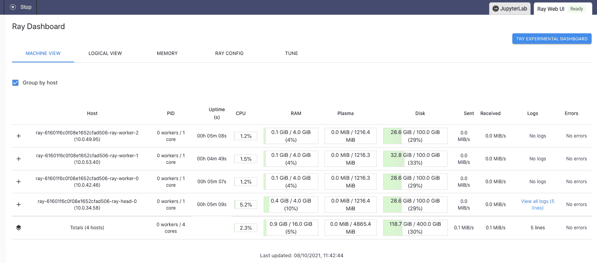

# 雷入门

> 原文：<https://www.dominodatalab.com/blog/ray-tutorial-for-accessing-clusters>

在这篇博客文章中，我们简单介绍了雷。我们讨论了架构和执行模型，并展示了一些 Ray 的核心范例，比如远程函数和参与者。

在之前的 [博客文章](https://blog.dominodatalab.com/spark-dask-ray-choosing-the-right-framework) 中，我们谈到了各种并行 Python 计算的框架，以及在 Spark、Dask 和 Ray 之间自由无缝移动的重要性。在本文中，我们将通过对 Ray 的简单介绍来扩展这个主题，并展示在 Domino 中访问按需 Ray 集群是多么容易。

## 雷是什么？

Ray 是一个通用框架，使您能够快速并行化现有的 Python 代码，但它也被称为“构建框架的框架”。事实上，有越来越多的特定领域库在 Ray 之上工作。


例如:

*   ***rays GD***——分布式深度学习的库，提供了 PyTorch 和 TensorFlow 的包装器
*   ***rl lib***——一个强化学习的库，它本身也支持 TensorFlow、TensorFlow Eager 和 PyTorch
*   RayServe -一个可伸缩的模型服务库
*   ***雷调***——一个超参数优化框架，最常用于深度和强化学习

可以在[这里](https://docs.ray.io/)找到这些组件的文档。

## 接近雷

Ray 既可以安装在本地，也可以安装在多节点集群上。本地安装是一个相当简单的过程，它提供了一个让您熟悉框架的简单方法。正式的项目文档包含了一个关于在一台机器 上安装 Ray 的综合章节，可以归结为:

1.  通过 *pip* 安装 Ray，或者通过用 Ray 和所有需要的依赖项拉一个 Docker 映像
2.  调用*射线启动头*，它启动运行时并提供连接细节。一个成功启动的光线实例的示例输出如下所示:

    ```py
    Local node IP: 10.0.40.194

    --------------------

    Ray runtime started.

    --------------------

    Next steps

      To connect to this Ray runtime from another node, run

        ray start --address='10.0.40.194:6379' --redis-password='5241590000000000'

      Alternatively, use the following Python code:

        import ray

        ray.init(address='auto', _redis_password='5241590000000000')

      To connect to this Ray runtime from outside of the cluster, for example to

      connect to a remote cluster from your laptop directly, use the following

      Python code:

        import ray

        ray.init(address='ray://<head_node_ip_address>:10001')

      If connection fails, check your firewall settings and network configuration.

      To terminate the Ray runtime, run

        ray stop
    ```

3.  打开 Python REPL、JupyterLab 或任何您喜欢的 Python IDE，并通过在运行 *ray start* 的同一节点上启动驱动程序进程来连接到运行时。

当然，Ray 的亮点在于它能够在多台机器上同时编排和运行代码。在多节点配置中，Ray 操作一个**头节点**和多个**工作节点**。


在这个设置中，头节点首先启动，工作节点在启动时被赋予地址，因此它们形成一个集群。根据底层基础设施(Azure、AWS、GCP、内部部署等)，配置 Ray 集群有其自身的复杂性。)

[Domino Enterprise MLOps platform](https://www.dominodatalab.com/product/domino-enterprise-mlops-platform/)支持 [按需射线集群](https://docs.dominodatalab.com/en/latest/reference/ray/On_demand_ray_overview.html) ，可以使用简单的 GUI 进行配置，而无需深入到与基础架构相关的配置任务。


上面的截图显示了将按需光线簇附加到您选择的工作空间(例如 JupterLab、VS Code、Zeppelin 等)的简单性。)

假设您现在可以通过本地或云安装访问 Ray，让我们看看如何开始熟悉这个框架。

## 连接到射线

### 局部射线

一旦安装并运行了 Ray，我们的第一个任务就是连接到集群。如果这是本地安装，我们可以复制在 *ray start* 输出中建议的 Python 代码。


命令启动一个驱动程序进程，并把它连接到已经在本地系统上运行的头部。我们可以通过调用 *ray.is_initialized()* 来验证 Ray 是否被初始化:


在我们完成之后停止 Ray 可以通过调用 *ray.shutdown()* 或者通过命令行来完成:

```py
ubuntu@run-61600c7b0f08e1652cfad481-p9bx8:/mnt$ ray stop

Stopped all 11 Ray processes.

ubuntu@run-61600c7b0f08e1652cfad481-p9bx8:/mnt$
```

## 连接到按需光线簇

如果我们使用 Domino on demand 提供的适当的多节点集群，我们可以使用下面的代码连接到它:

```py
import ray
import ray.util
import os
if ray.is_initialized() == False:
   service_host = os.environ["RAY_HEAD_SERVICE_HOST"]
   service_port = os.environ["RAY_HEAD_SERVICE_PORT"]
   ray.util.connect(f"{service_host}:{service_port}")
```

正如您在上面看到的，Domino 自动设置环境变量，这些变量包含连接到集群所需的信息。

Domino 还提供了对仪表板(Web UI)的访问，它允许我们查看集群资源，如 CPU、磁盘和内存消耗



在工作区或作业终止时，按需 Ray 集群和所有相关资源会自动终止并取消供应。这包括为群集分配的任何计算资源和存储。在工作区或作业启动时，Domino 会自动提供并启动具有所需集群设置的 Ray 集群，并在集群可用时将其附加到工作区或作业。

## 与雷的第一步

通过将标准 Python 函数转换成 Ray 任务(也称为远程函数)，Ray 使我们能够异步执行这些函数。这是一个非常简单的过程，我们可以通过一个非常简单的例子来演示。

让我们从编写一个基本的下沉排序函数开始，至少可以说，根据定义，这不是最有效的排序方法。

```py
def bubble_sort(to_sort):
    n = len(to_sort)
    for i in range(n):
        for j in range(n - 1):
            if to_sort[j] > to_sort[j+1]:
                to_sort[j], to_sort[j+1] = to_sort[j+1], to_sort[j]
```

然后，我们可以在[1；1，000，000]范围，并将其传递给 *bubble_sort* 函数。我们可以用 20 次运行的累计运行时间来计算执行时间，如下所示:

```py
start_time = time.time()
[bubble_sort(random.sample(range(1, 1000000), 3000)) for _ in range(20)]
print("--- %s seconds ---" % (time.time() - start_time))
```

让我们看看 *bubble_sort* 使用 Python 和本地 CPU 完成排序通常需要多长时间。在这种情况下，我们的系统可以访问 8 个 CPU 内核:

```py
--- 22.029696702957153 seconds ---
```

看起来 20 次运行 *bubble_sort* 的挂钟大约是 22 秒。

现在让我们看看 Ray 是否能在这个运行时间上有所改进。要将我们的 *bubble_sort* 函数转换成一个 Ray 任务，我们唯一需要做的就是对它应用 *@ray.remote* 装饰器。让我们创建一个等效的副本，这样我们仍然可以完整地保留原始文件，以备将来需要。我们将新函数命名为 *bubble_sort_remote* ，除了新的装饰器之外，我们将让它与 *bubble_sort* 完全相同:

```py
@ray.remote
def bubble_sort_remote(to_sort):
    n = len(to_sort)
    for i in range(n):
        for j in range(n - 1):
            if to_sort[j] > to_sort[j+1]:
                to_sort[j], to_sort[j+1] = to_sort[j+1], to_sort[j]
```

为了调用上面的远程函数，我们需要使用 *remote* 方法。这将立即创建一个对象引用( *obj_ref* )和一个将在工作进程上执行的 Ray 任务。执行的结果可以通过调用 *ray.get(obj_ref)* 来检索。因此，修改后的执行和计时代码应该如下所示:

```py
start_time = time.time()
ray.get([bubble_sort_remote.remote(random.sample(range(1, 1000000), 3000)) for _ in range(20)])
print("--- %s seconds ---" % (time.time() - start_time))
```

```py
--- 6.814101696014404 seconds ---
```

现在，工作负载似乎需要大约 7 秒钟。与单节点 Python 相比，性能提高了三倍。

作为一个 Domino 集群，我们还可以访问 Web UI，因此我们可以在运行远程冒泡排序方法时检查集群节点的资源利用情况。


我们可以确认所有集群节点都被同时使用，这是 Ray 提供的加速的关键。因为单独的 Ray 任务被异步处理，所以 Ray 可以独立地调度和运行它们。相反，纯 Python 方法作为 list comprehension 语句的一部分一个接一个地运行。

请注意，尽管本质上是异步的，但是 Ray 任务仍然可以依赖于其他任务。例如，我们可以通过以下方式修改对 *bubble_sort_remote* 的调用:

```py
@ray.remote
def random_list(n=3000):
    return random.sample(range(1, 1000000), n)

start_time = time.time()
ray.get([bubble_sort_remote.remote(random_list.remote()) for _ in range(20)])
print("--- %s seconds ---" % ((time.time() - start_time)))
```

在这种情况下，随机列表的创建被重构到一个单独的 Ray 任务中，该任务嵌套在 *bubble_sort_remote* 调用中。Ray 通过构建一个内部依赖图来透明地处理这些情况，所以我们没有什么特别需要注意的。请注意，在这种情况下，在 *random_list* 任务执行完毕之前，不会执行实际的排序。相互依赖的任务通常都是这样。

此外，善于观察的读者可能会问，“等等，我以为调用一个 Ray 任务会返回一个对象引用，而不是实际的对象。难道我不需要调用 *ray.get()* 并将其传递给*bubble _ sort _ remote . remote*？”答案是否定的；雷为我们做了这一步。

## 演员简介

到目前为止，我们已经了解了如何将简单的 Python 函数转换成 Ray 任务。Actors 进一步将 API 扩展到 Python 类。类似于函数的转换，用 *@ray.remote* 修饰一个 Python 类，把它转换成一个有状态的 actor。用 *@ray.remote* 修饰的类的每个实例都会产生一个新的进程(actor ),由 ray 在集群的某个地方启动。对实例方法的每个调用都作为一个 Ray 任务执行，这可能会改变参与者的状态。

让我们看一个例子。下面是一个简单的类，它实现了我们的下沉排序算法:

```py
@ray.remote
class Bubble_Remote(object):

    def __init__(self):
      self.to_sort = self.shuffle()

    def shuffle(self):
        return random.sample(range(1, 1000000), 3000)

    def sort(self):
        n = len(self.to_sort)
        for i in range(n):
            for j in range(n - 1):
                if self.to_sort[j] > self.to_sort[j+1]:
                    self.to_sort[j], self.to_sort[j+1] = self.to_sort[j+1], self.to_sort[j]

    def get_value(self):
        return self.to_sort
```

从上面可以看出，除了 decorator，这个类没有什么特别的地方。该类封装了我们的 *bubble_sort* 方法，一个随机初始化 *to_sort* 类成员的 shuffle 方法，以及一个用于检索排序列表的 getter 方法。需要后者是因为我们不能直接读取 Ray actors 中的字段。

使用上面的代码非常简单，但是要注意这个类是如何被实例化的:

```py
bubble_remote = Bubble_Remote.remote()
print("Unsorted:", ray.get(bubble_remote.get_value.remote())[:10])
start_time = time.time()
bubble_remote.sort.remote()
print("Sorted:", ray.get(bubble_remote.get_value.remote())[:10])
print("--- %s seconds ---" % ((time.time() - start_time)))
```

```py
Unsorted: [616716, 419779, 57565, 782118, 577401, 61843, 102215, 499268, 287925, 57212]
Sorted: [124, 175, 1603, 1909, 2280, 2424, 2896, 2990, 3235, 3398]
--- 1.17197277545928955 seconds ---
```

并行化呢？让我们再做 20 次洗牌和排序，并检查挂钟。

```py
start_time = time.time()
for _ in range(20):
    bubble.remote.shuffle.remote()
    ray.get(bubble_remote.sort.remote())
print("--- %s seconds ---" % ((time.time() - start_time)))
```

```py
--- 24.30797028541565 seconds ---
```

好吧，看起来这和普通的单线程 Python 执行一样慢。这是因为在同一个 actor 上调用的方法是按照它们被调用的顺序连续执行的。记住 actors 是有状态的，所以 Ray 不允许多个远程函数乱序改变类成员。这种行为乍一看可能令人失望，但请记住以下几点:

*   不同参与者上的方法是并行执行的
*   参与者句柄可以传递给远程函数和其他参与者，它们可以相互调用

上述特性使我们能够设计高度复杂的并行执行图。这里有一个来自 [官方雷文档](https://docs.ray.io/) 的例子，说明了如何构建演员树:

```py
@ray.remote(num_cpus=1)
class Worker:
    def work(self):
        return "done"

@ray.remote(num_cpus=1)
class Supervisor:
    def __init__(self):
        self.workers = [Worker.remote() for _ in range(3)]
    def work(self):
        return ray.get([w.work.remote() for w in self.workers])

ray.init()
sup = Supervisor.remote()
print(ray.get(sup.work.remote()))  # outputs ['done', 'done', 'done']
```

在上面的代码中，您可以看到一个管理许多工作人员的 Supervisor 类。如果您想要并行训练多个模型(在本例中为三个),这将非常有用。这种设置的另一个好处是，对监控器的单个调用触发多个工作器的实例化，并且监控器能够在任何给定时间检查和修改工作器的状态。请注意，就依赖关系和相互调用的参与者而言，您可以比这里所示的两级主管/工作人员结构更深入。

## 摘要

在这篇博客文章中，我们研究了 Ray——一个用于 Python 的通用并行化框架，它可以通过最少的代码修改来加速计算繁重的工作负载。我们展示了框架使用的两个主要范例——远程函数和参与者，并演示了如何在单台机器或多节点分布式集群上使用 Ray。

要了解更多关于 Ray 的信息，请访问官方的 Ray [文档。](https://docs.ray.io/en/latest/)更多详细信息可在 Do mino Enterprise MLOps 平台文档- [按需射线概述中找到。](https://docs.dominodatalab.com/en/latest/reference/ray/On_demand_ray_overview.html) 您可能也对各种集成感兴趣，如 [分布式 scikit-learn](https://docs.ray.io/en/latest/joblib.html) 、 [Dask on Ray](https://docs.ray.io/en/latest/data/dask-on-ray.html) 、[Apache air flow provider for Ray](https://registry.astronomer.io/providers/ray)、以及许多其他应用。

[](https://cta-redirect.hubspot.com/cta/redirect/6816846/17946acf-bac1-417d-8261-1b048f64d48b)