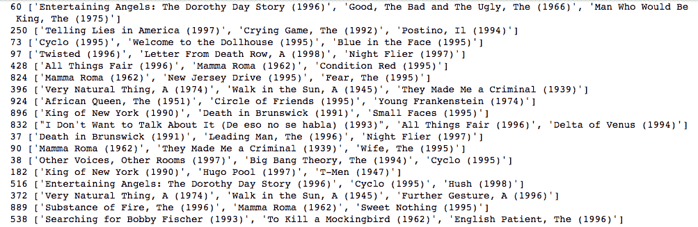

# 基于协同过滤的推荐系统

> 原文：<https://www.dominodatalab.com/blog/recommender-systems-collaborative-filtering>

这是对协同过滤算法以及如何在实践中使用它的技术深度探讨。

从亚马逊根据你最近的购买推荐你可能感兴趣的产品，到网飞推荐你可能想看的节目和电影，推荐系统已经在数据科学的许多应用中变得流行。像数据科学中的许多其他问题一样，有几种方法来处理推荐。其中最流行的两种是协同过滤和基于内容的推荐。

1.  协同过滤:对于每个用户，推荐系统根据相似用户对项目的喜欢程度来推荐项目。假设爱丽丝和鲍勃对电子游戏有相似的兴趣。爱丽丝最近玩并喜欢上了游戏[塞尔达传说:野性的呼吸](http://www.zelda.com/breath-of-the-wild/)。Bob 没有玩过这个游戏，但是因为系统已经了解到 Alice 和 Bob 有相似的口味，所以它向 Bob 推荐这个游戏。除了用户相似性，推荐系统还可以使用项目相似性来执行协同过滤(“喜欢这个项目的用户也喜欢 X”)。
2.  基于内容的推荐:如果公司有关于你的每个项目的详细元数据，他们可以推荐具有相似元数据标签的项目。例如，假设我看了网飞的节目[杰克骑士](http://www.imdb.com/title/tt3398228/)。这个节目可能有“动画”、“喜剧”和“成人”的元数据标签，所以网飞推荐了其他具有这些元数据标签的节目，如[家庭盖伊](http://www.imdb.com/title/tt0182576/)。

在这篇博客文章中，我将重点介绍第一种协作过滤方法，同时也简要讨论第二种基于内容的推荐方法。这是为希望实现推荐系统的数据科学家、工程师和产品经理撰写的关于推荐系统的一系列博客文章中的第一篇。

## 基于协同过滤的推荐

协同过滤背后的想法是基于用户的相似性来推荐新项目。在这一部分，我将讨论

1.  如何衡量用户或对象之间的相似度？
2.  用余弦相似性度量一对向量之间的相似性
3.  如何使用基于模型的协同过滤来识别相似的用户或项目。
4.  使用 Surprise，一个用于简单推荐系统的 Python 库，来执行项目-项目协同过滤。

### 测量相似性

如果我给你点 *(5，2)* 和 *(8，6)* ，让你告诉我这两点相距多远，你可以给我多个答案。最常见的方法是计算欧几里德距离(对应于连接这两点的直线路径的长度),并说它们相距 **5** 个单位。另一种方法是计算曼哈顿距离，并说它们相距 **7** 个单位。

我们在计算相似度的时候，是要把它作为“反距离”的度量来计算的。两个物体之间的距离越大，它们之间的距离就越大。另一方面，两个对象之间的相似度越高，它们就越“靠得更近”。通常，相似性度量返回一个介于 0 和 1 之间的值，其中 0 表示没有相似性(完全不相似)，1 表示完全相似(完全相同)。

### 余弦相似性

现在，让我们讨论最常用的相似性度量之一，余弦相似性。如果我给你矢量 **U** = *(3，4)* 和 **V** = *(1，1)* ，你可以很容易地告诉我这两个矢量相距多远(再次使用欧几里德距离或其他度量)。现在，重要的问题来了:这两个向量有多相似？


同样，对于相似性，我们想要一个介于 0 和 1 之间的“反距离”度量。如果你还记得三角学，余弦函数的范围是从-1 到 1。回忆一下余弦的一些重要性质:

1.  余弦(0 ) = 1
2.  余弦(90 ) = 0
3.  余弦值(180 ) = -1

对于余弦相似性，我们将基于两个向量之间的角度来评估它们之间的相似性。角度越小，两个向量越相似。


使用余弦相似性，我们得到当两个向量之间的角度为 0°时，它们达到最大相似性(它们朝向相同的方向)，当它们之间的角度为 90°时，它们具有 0°相似性(它们彼此正交)，当它们之间的角度为 180°时，它们具有-1°相似性(它们朝向完全相反的方向)。下面是正交矢量的一个例子。它们之间的角度为 90°，所以余弦相似度为 0。


如果我们将我们的向量限制为非负值(如电影评级的情况，通常从 1-5 的范围)，那么两个向量之间的分离角度被限制在 0°和 90°之间，分别对应于 1 和 0 之间的余弦相似性。因此，对于正值向量，余弦相似性返回一个介于 0 和 1 之间的值，这是相似性度量的“理想”标准之一。需要注意的一点是余弦相似度是方向的量度，而不是幅度。两个向量可以指向完全相同的方向(因此余弦相似度为 1 ),但幅度不同。

比如向量 *(3，4)* 和 *(30，40)* 方向相同，但大小不同(后一个向量是前一个的倍数)。使用余弦相似性时，请记住，仅仅因为两个向量的相似性得分为 1 并不意味着它们是相同的，这一点很重要！

## 基于模型的协同过滤

既然我们有了定义向量之间相似性的具体方法，我们现在可以讨论如何使用该方法来识别相似的用户。问题设置如下:

1.)我们有一个 *n* X *m* 矩阵，由 *n* 用户和 *m* 物品的评分组成。矩阵的每个元素( *i* ， *j* )代表用户 *i* 如何对项目 *j* 进行评分。由于我们正在处理电影评级，如果用户 *i* 已经对电影 *j* 进行了评级，则每个评级可以是从 1 到 5 的整数(反映一星评级到五星评级)，如果用户没有对该特定电影进行评级，则为 0。

2.)对于每个用户，我们要推荐一组他们还没看过的电影(电影评分为 0)。为此，我们将有效地使用一种类似于加权 K 近邻的方法。

3.)对于每一部还没有看过的电影 *j* 用户 *i* ，我们找到与用户 *i* 相似并且看过电影 *j* 的用户 **U** 的集合。
对于每个相似用户 *u* ，我们取 *u* 对电影 *j* 的评分，并乘以用户 *i* 和用户 *u* 的余弦相似度。把这些加权评分加起来，除以 **U** 的用户数，我们就得到了电影 *j* 的加权平均评分。

4.)最后，我们按照加权平均排名对电影进行排序。这些平均排名作为用户对每部电影的评价的估计。平均排名较高的电影更容易受到用户的青睐，所以我们会把平均排名最高的电影推荐给用户。

我前面说过，这个过程类似于加权 K-最近邻算法。我们把看过电影 *j* 的用户集合作为 K-NN 的训练集，每个没看过电影的用户作为测试点。对于没有看过电影的每个用户(测试点)，我们计算与看过电影的用户的相似性，并基于邻居的已知评级来分配估计的评级。

举个具体的例子，假设我没有看过电影[](http://www.imdb.com/title/tt4846340/)*。不过，我看过很多其他电影，并给它们打了 5 星的分。有了这些信息，你要预测我会对*隐藏的数字*做出什么评价。基于我的评分历史，你可以找到一群和我评分差不多，也看过*隐藏人物*的用户。为了使这个例子简单，让我们看看与我最相似并且看过这部电影的两个用户。假设用户 1 和我有 95%的相似度，给了电影四星评价，用户 2 和我有 80%的相似度，给了电影五星评价。现在我的预测评分是 0.95 *4 = 3.8(用户 1 的相似度 X 评分)和 0.80* 5 = 4(用户 2 的相似度 X 评分)的平均值，所以预测我给电影的评分是 3.9。*

 *### 惊喜

我们将使用 [Surprise](https://surprise.readthedocs.io/en/stable/index.html) 库，一个用于简单推荐系统的 Python 库，而不是自己手动实现这个过程。

我们将使用 [MovieLens 数据集](https://grouplens.org/datasets/movielens/)，这是推荐系统算法的一个通用基准数据集。通过惊喜库，我们可以加载*movie lens 100k*数据集，该数据集由大约 1000 名用户和 1700 部电影的 100，000 部电影评级组成。

```py
from surprise import Dataset, evaluate

from surprise import KNNBasic
```

*数据集*方法允许我们在用户-电影交互矩阵中轻松下载和存储*电影镜头 100k* 数据。这个矩阵的行代表用户，列代表电影。使用这个 *load_builtin* 方法，我们得到一个 943 行 1682 列的稀疏矩阵。

```py
data = Dataset.load_builtin("ml-100k")

trainingSet = data.build_full_trainset()
```

对于我们的任务，我们希望使用电影之间的余弦相似性来进行新的推荐。虽然我解释了基于用户相似性的协同过滤，但是我们可以同样容易地使用项目间的相似性来进行推荐。通过项目-项目协同过滤，每部电影都有一个所有评级的向量，我们计算两部电影评级向量之间的余弦相似度。

```py
sim_options = {

    'name': 'cosine',

    'user_based': False

}

knn = KNNBasic(sim_options=sim_options)
```

现在，我们可以在训练数据集上训练我们的模型。

```py
knn.train(trainingSet)
```

现在我们已经训练了我们的模型，我们想为用户提供电影推荐。使用 *build_anti_testset* 方法，我们可以在用户没有观看电影的训练集中找到所有用户-电影对，并从这些条目中创建一个“测试集”。

```py
testSet = trainingSet.build_anti_testset()

predictions = knn.test(testSet)
```

因为我们的模型将为每个用户推荐几十部电影，所以我们将使用一个助手方法来为每个用户只获得前三部电影推荐。

```py
from collections import defaultdict

def get_top3_recommendations(predictions, topN = 3):

    top_recs = defaultdict(list)

    for uid, iid, true_r, est, _ in predictions:

        top_recs[uid].append((iid, est))

    for uid, user_ratings in top_recs.items():

        user_ratings.sort(key = lambda x: x[1], reverse = True)

        top_recs[uid] = user_ratings[:topN]

    return top_recs
```

在我们的数据集中，每个用户和电影都用一个 ID 号表示。如果我们现在要查看模型的输出，我们会收到每个用户的电影 id 列表；这不是我们能轻易解释的结果。因此，我们将使用第二个辅助方法 *read_item_names* 来创建一个字典，将每个电影的 ID 映射到它的名称。这个方法是基于惊喜库 [Github repo](https://github.com/NicolasHug/Surprise) 中的[例子](https://github.com/NicolasHug/Surprise/blob/master/examples/k_nearest_neighbors.py)之一。

```py
import os, io

def read_item_names():

    """Read the u.item file from MovieLens 100-k dataset and returns a
mapping to convert raw ids into movie names."""

   file_name = (os.path.expanduser('~') +
'/.surprise_data/ml-100k/ml-100k/u.item')
rid_to_name = {}

    with io.open(file_name, 'r', encoding='ISO-8859-1') as f:

        for line in f:

            line = line.split('|')

            rid_to_name[line[0]] = line[1]

        return rid_to_name
```

现在，我们可以调用我们的 *get_top3_recommendations* 方法来获取每个用户的热门电影推荐并输出结果。

```py
top3_recommendations = get_top3_recommendations(predictions)

rid_to_name = read_item_names()

for uid, user_ratings in top3_recommendations.items():

    print(uid, [rid_to_name[iid] for (iid, _) in user_ratings])
```



如您所见，每个用户都会收到基于他们对所看电影的评价的个性化电影推荐。

协同过滤的一个主要弱点是众所周知的*冷启动问题*:我们如何向新用户提供推荐，我们对他们的偏好几乎没有数据。因为我们没有关于用户偏好的信息，所以我们不能精确地计算新用户和更老的用户之间的相似性。

## 基于内容的推荐

在这一节中，我将简要讨论基于内容的推荐是如何工作的。在上一节中，我们讨论了使用余弦相似性来衡量两个用户基于他们的向量的相似程度。假设我们想根据一对项目的元数据标签来确定它们的相似程度。例如，对于电影，元数据标签可以是关于电影中的男演员或女演员(*道恩·强森*)、流派(*动作*)和导演( *J.J .艾布拉姆斯*)的信息。

Jaccard 相似性为我们提供了一种度量两个集合之间相似性的方法，即计算两个集合之间共有的项目数，然后除以两个集合之间唯一项目的总数。本质上，这是他们共享的项目数量与他们可能共享的项目数量的比率。在正式的数学术语中，两个集合 A 和 B 之间的 Jaccard 相似性是 A 和 B 的交集的基数或元素数除以 A 和 B 的并集的基数。

现在我们有了基于每个项目的元数据标签的相似性度量，我们可以很容易地向用户推荐新项目。假设我在网飞看电影 [*《疯狂动物城》*](http://www.imdb.com/title/tt2948356/) 。因为网飞在其平台上有大量的节目和电影的元数据标签，网飞可以计算出 *Zootopia* 和我还没有看过的节目和电影之间的 Jaccard 相似度。在计算相似度后，它可以向我推荐与 *Zootopia* 相似的新电影，如 *Finding Dory* 。

当然，这不是执行基于内容的过滤的唯一方式。我们可以使用许多其他方法来分析每个项目的元数据。通过 TF-IDF 或主题建模等自然语言处理技术，我们可以分析电影的描述，并基于相似的 TF-IDF 向量或主题模型定义电影之间的相似性度量。

与协同过滤一样，如果我们没有用户偏好的数据，基于内容的推荐也会受到影响。如果我们没有任何关于新用户感兴趣的信息，那么无论我们的元数据有多详细，我们都无法做出任何推荐。

## 结论

有了足够的数据，协同过滤为数据科学家向用户推荐新产品或项目提供了一种强大的方式。如果你有关于你的产品的详细的元数据，你也可以使用基于内容的推荐方法。

对于那些有兴趣了解更多关于推荐系统的人来说，我强烈建议你们去看看 [*挖掘海量数据集*](https://www.amazon.com/Mining-Massive-Datasets-Jure-Leskovec-dp-1108476341/dp/1108476341/ref=dp_ob_title_bk) 一书中关于[推荐系统](http://infolab.stanford.edu/~ullman/mmds/ch9.pdf)的章节。

在接下来的一篇博文中，我将展示我们如何使用矩阵分解为用户产生推荐，然后我将展示一种混合的推荐方法，它结合了协同过滤和基于内容的推荐。这种混合方法解决了协同过滤和基于内容推荐的缺点。*