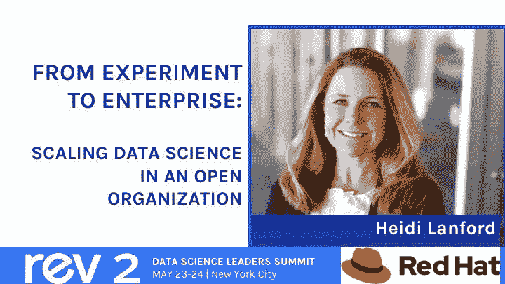

# Red Hat 的 Heidi Lanford 分享了她成为模特驱动的公式

> 原文：<https://www.dominodatalab.com/blog/red-hats-heidi-lanford-to-share-her-formula-for-becoming-model-driven>

Heidi Lanford 因其在分析和数据科学领域的领导地位而闻名。从她在 Harley-Davidson 的早期客户细分工作(该工作指导了一次重要的营销重组)到她在北电的营销活动和预测计划(该计划使两个关键垂直市场的收入翻了一番)，Heidi 已经指导一些世界上最大的品牌成功地利用他们的数据来更好地竞争。

现在，作为世界上最大的开源软件公司 Red Hat 的企业数据和分析副总裁，Heidi 再次崭露头角。在加入 Red Hat 不到两年的时间里，她实施了该公司首个用于协作的企业数据科学平台和一个用于认证企业数据资产的框架，这两个平台都是全面计划的一部分，该计划将帮助 Red Hat 在其业务的各个方面扩展数据科学。

她的工作为如何成为模型驱动的公司提供了宝贵的见解-正如大多数数据科学领导者所知，尽管人们对数据科学普遍感到兴奋并进行投资，但这仍是一个重大挑战。事实上，2017 年麻省理工学院斯隆管理学院的一项研究发现，尽管其调查的 85%的公司认为模型能够让他们获得(或保持)竞争优势，但只有 5%的公司在业务中广泛使用模型。

Red Hat 如何建立真正的企业数据科学能力来推动采用？在 Heidi 本月的 Rev 2 会议之前，我们与她坐在一起，先睹为快地了解了她的成功公式，该公式以三个支柱为中心:协作、社区和采纳。以下是我们谈话的编辑记录。

## 合作的重要性

让拥有大量数据和强大工具的聪明的数据科学家到位，只能让公司走到这一步。许多公司正在通过协作转变他们在业务各个部分使用数据的方式，如果我们不适应，我们知道我们只能从我们的数据和分析工作中获得一定程度的成功。例如，就模型开发而言，最好的数据科学成果来自数据科学家和商业社区之间的大量合作。因此，在前端，我们坚持要求数据科学和分析社区以业务能够理解的方式解释他们将着手的任何建模项目的价值。为了投资生产模型或其他分析输出，企业必须阐明:*模型将如何改变某人的日常工作或改善客户体验？*

数据科学家还必须真正了解业务，以便他们可以从业务角度看模型建议是否有意义，并且他们需要与业务团队一起审查初始模型输出，以获得他们的反馈。通常，业务团队可以提供一些趋势和模式是否相关的见解，但更重要的是是否存在因果关系。

## 为数据科学家建立一个社区

我们的数据科学家在不同的环境中接受过教育，有过不同的经历，我们需要为他们提供可以利用彼此知识的方式。因此，我们创建了一个名为 DAVE 的环境，即数据分析虚拟化环境，为数据科学家提供了一个空间来分享想法、建模技术、数据源和他们的主题知识，并就他们试图解决的业务挑战提出问题。

## 从可信数据到可信模型的思考

虽然我们知道我们正在处理可信的数据源，但我们也希望有一个过程来确定哪些是我们最可信的模型，例如，他们是否使用了足够大的样本量，他们是否采用了正确的方法，他们是否有正确的文档，技术基础设施是否支持该模型，模型何时需要更新，等等。随着我们治理实践的扩展，既有开发部分，也有运营部分。我们正在组建一个数据科学委员会，该委员会将提供同行评审，以确保模型的构建足够严谨。我们只是在测试流程和确定委员会成员的早期阶段，但我们认为这项工作对于建立一条清晰的道路以将模型投入生产和建立信任以最终推动采用至关重要。

谈到推动最终用户的采用，我们还需要确保我们的销售、产品、客户体验和其他团队中的人员都精通“数据作为第二语言”我们的数据素养计划和“你会说数据吗”活动正在帮助我们将数据科学带到组织的每个层面。

* * *

在 5 月 24 日于纽约举行的 Rev 2 会议上，您可以听到 Red Hat 的完整故事(和挣扎),并获得关于建立真正的企业数据科学能力的建议。