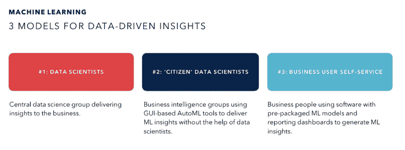
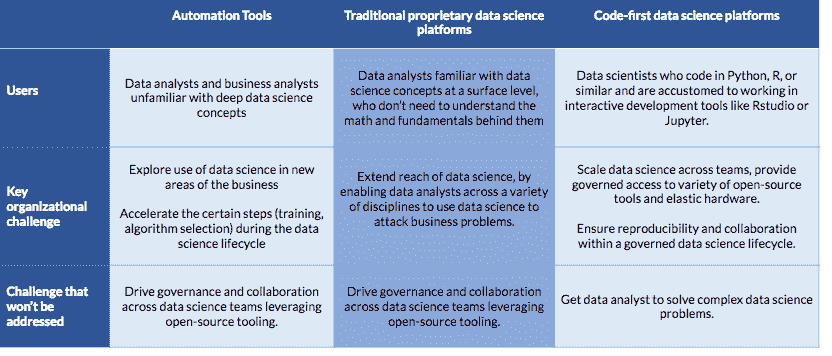

# 关于数据科学平台市场的思考

> 原文：<https://www.dominodatalab.com/blog/reflections-data-science-platform-market>

在我们进入 2019 年之前，我想花一点时间来反思我们在市场上看到的一些变化。2018 年，我们看到“数据科学平台”市场迅速具体化为三个不同的产品细分市场。这篇文章描述了我们对这三个细分市场的观察，并为评估这一领域产品的人们提供了建议。

在过去的几年里，很难责怪任何人对数据科学平台市场前景感到不知所措。尽管为不同类型的用户解决了不同的问题，但有几十种产品使用相似的语言描述自己。这不仅困惑了数据科学家，也影响了作为软件供应商的我们:一些市场分析将 Domino 与完全不同于我们的产品混为一谈，迫使我们回答这样的问题:我们如何与解决根本不同的需求和用例的产品进行比较。有时，感觉就像是一个汽车制造商，看着别人把我们的汽车比作潜艇、飞机和踏板车。

我们惊喜地看到，尤其是在过去的六个月里，公司在为其数据科学团队配备一流技术时，对这些产品的看法越来越清晰。正如经常发生的那样，这种清晰性同时从世界不同的角落出现，反映了似乎是数据科学平台市场的时代精神。

已经结晶的三个部分是:

1.  自动化工具
2.  专有(通常是 GUI 驱动的)数据科学平台
3.  代码优先的数据科学平台

## 自动化工具

这些解决方案通过自动化数据科学中的任务(包括训练模型、选择算法和创建特征)来帮助数据分析师构建模型。这些解决方案主要面向非专家数据科学家或对简化构建快速基线模型过程中的繁琐步骤感兴趣的数据科学家。这些“自动化机器学习”解决方案通过让非专家数据科学家参与模型构建过程，提供拖放界面，帮助传播数据科学工作。它们通常包括用于部署已经被自动训练的模型的功能，并且它们也越来越多地为那些模型集成可解释性和可解释性特性。当数据准备充分且结构一致时，它们工作得最好。

## 专有(通常是 GUI 驱动的)数据科学平台

这些工具支持广泛的用例，包括数据科学、数据工程和模型操作。它们提供拖放和代码接口，并在许多企业中拥有强大的立足点，甚至可能为特定的微型垂直市场提供独特的功能或算法。虽然这些解决方案提供了广泛的功能，但用户必须利用专有的用户界面或编程语言来表达他们的逻辑。

## 代码优先的数据科学平台

这组解决方案面向代码优先的数据科学家，他们使用统计编程语言，整天呆在计算笔记本(例如 Jupyter)或 ide(例如 RStudio)中，利用开源和商业软件包和工具的组合来开发复杂的模型。这些数据科学家需要灵活地使用不断发展的软件和硬件堆栈来优化他们模型生命周期的每一步。这些代码优先的数据科学平台协调必要的基础设施，以加速高级用户的工作流，并为拥有数百或数千个模型的组织创建记录系统。拥有数据科学家团队的企业选择这些解决方案来加速个人实验，同时推动组织的协作和治理。主要功能包括可扩展计算、环境管理、可审核性、知识管理和可再现性。

## 证据:我们所看到的

我们已经看到多个组织描述了类似的市场划分，有时使用稍微不同的术语。

例如，一家排名前十的全球金融机构的首席数据科学家告诉我，他们的组织研究了产品前景，并根据目标用户的技术技能将其分为三个级别:

*   “1 级”包括自动化数据科学任务的工具；
*   “第 2 级”包括面向技术水平较低的分析师的拖放式 GUI 工具；
*   “第三级”是为那些希望使用统计编程语言来编写逻辑的技术数据科学家准备的。

评估团队将这些层表示为一个金字塔:随着级别的上升，用户数量减少，但用户更具技术性，影响更大。至关重要的是，这些级别并不相互排斥——事实上，评估最终建议从每个级别购买一个工具，以支持组织内不同类型的用户。

同样，2018 年，Forrester 将其预测分析产品的“浪潮”分为两个不同的浪潮。第一个——“[多模式解决方案](https://www.forrester.com/report/The+Forrester+Wave+Multimodal+Predictive+Analytics+And+Machine+Learning+Solutions+Q3+2018/-/E-RES141374)”——包含了我们在本文中称之为“专有/基于 GUI”的解决方案(包括一些“自动化工具”)。他们的第二次浪潮——“[基于笔记本的解决方案](https://www.forrester.com/report/The+Forrester+Wave+NotebookBased+Predictive+Analytics+And+Machine+Learning+Solutions+Q3+2018/-/E-RES143219)”描述了“代码优先”平台。他们今年有一份[即将发布的关于自动化平台的报告](https://go.forrester.com/blogs/read-two-forrester-waves-on-machine-learning-solutions-for-data-science-teams/)。

作为最后一个例子， [2018 工作台企业年鉴](https://medium.com/work-bench/the-work-bench-enterprise-almanac-2018-edition-6796f3941337)有一个很大的部分是关于企业的机器学习产品。在第 31 张幻灯片中，他们描述了三种“数据驱动洞察模型”,这三种模型与我们看到的三种产品类别非常吻合:

 *                                                  Image excerpted from [2018 Work-Bench Enterprise Almanac](https://medium.com/work-bench/the-work-bench-enterprise-almanac-2018-edition-6796f3941337)*

虽然来自这些不同领域的解决方案解决不同的问题，但许多组织需要来自这些领域的解决方案。例如，一家保险公司可以指派一组专家数据科学家在一个代码优先的平台上协作开发他们专有的索赔风险模型。与此同时，他们可能在营销部门有一名[公民数据科学家](https://www.dominodatalab.com/blog/shattering-the-myth-of-the-citizen-data-scientist)，他正在探索自动化工具，看看是否有一种新的方法来进行销售线索评分，从而超越他们现有的基于规则的流程。

下表总结了这些细分市场。

## 结束语

如果您正在考虑使用这些细分市场中的任何产品，我们的建议(适用于大多数技术选择)是对宣传持怀疑态度，并从评估您的业务需求、使用案例和数据科学人才战略开始。根据您雇佣的人员类型以及您计划如何解决数据科学问题(非技术人员、半技术人员、复杂的技术人员)，您将需要并想要不同的解决方案。

如果你对不同类型的问题采取多层次的人才战略，你可能需要多种解决方案。仅仅在一年前，这可能看起来令人不快，但一旦你将这一市场格局视为三个不同的产品类别，它就有意义了。