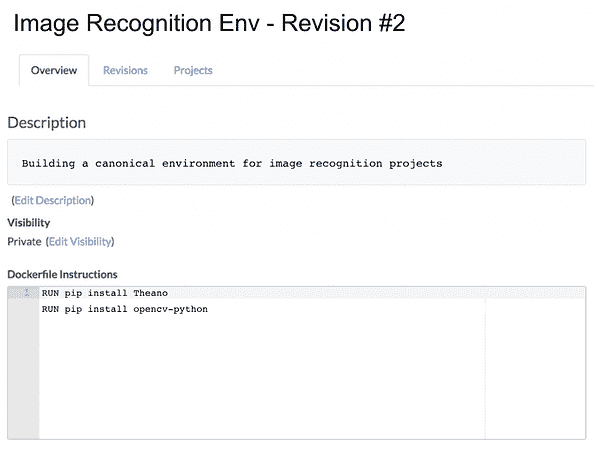
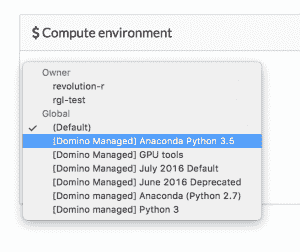
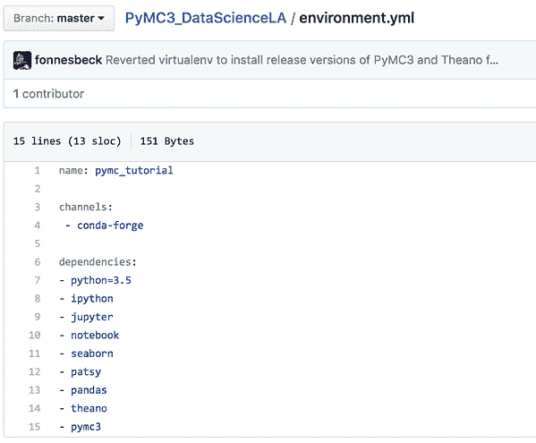
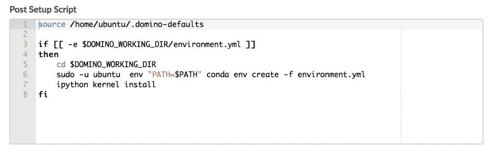

# 在 Conda 和 Domino 环境中实现再现性

> 原文：<https://www.dominodatalab.com/blog/reproducibility-conda-domino-environments>

管理“环境”(即一组包、配置等)。)是任何一个[数据科学平台](https://www.dominodatalab.com/resources/field-guide/data-science-platforms/)的关键能力。环境设置不仅会浪费人员的时间，而且跨环境的配置问题会破坏可再现性和协作，并且会在将模型从开发转移到生产时引入延迟。

这篇文章描述了 Domino 如何使用 Docker 来解决这些环境问题，更具体地说，是如何将这种方法与常见的包管理解决方案集成，如 [Anaconda](https://www.dominodatalab.com/data-science-dictionary/anaconda) 。

## 计算环境快速介绍

Domino 计算环境允许数据科学家使用任意软件和配置来管理图像。这些环境定义是共享的、集中的和修订的——当 Domino 在其计算网格上运行您的代码时(在模型训练期间或为了部署),您的代码也在您的环境中运行。这意味着无论您何时进行项目(甚至几个月后)，或者谁在进行项目(例如，一位新同事加入您的项目)，或者项目是为了开发还是生产目的而运行，您都可以获得相同的环境。

下面展示了 Domino 环境强大功能的一个例子，下面的环境可以用来创建一个安装 Theano 和 opencv python 库的环境。



在这种环境下的项目中运行的任何 python 脚本都能够重复利用 Theano 和 opencv。

## 在 Domino 计算环境中使用 Continuum 的 Anaconda

Continuum 的 conda 是 python 生态系统可用的包和依赖管理工具之一。我们的一些客户问我们“Domino 和 conda 是如何协同工作的？”由于 Domino 环境本质上是 conda 功能的超集，因此利用 conda 或 Domino 内部任何其他类似的依赖管理系统的能力，同时增强其可再现性和可靠性是很容易的。

一些客户使用 conda“渠道”来管理定制套餐。Conda 通道允许用户创建包的内部“存储库”，我们的客户希望使用这些通道(而不是 pip)在 Domino 计算环境中安装包。

这是一个很容易解决的用例。因为 Domino 环境是基于 Docker 映像构建的，所以我们可以简单地在基本环境中安装 conda。我们将通过使用以下 Docker 指令创建一个环境来展示这一点，这些指令是我们从网上获得的:

```py
RUN \

  # Install Anaconda for Python 3.5 v 4.2.0 (current as of 1/27/2017)

  wget -q https://repo.continuum.io/archive/Anaconda3-4.2.0-Linux-x86_64.sh -O anaconda.sh  \

  && yes | bash $HOME/anaconda.sh -b -p /usr/local/anaconda \

  && export PATH=/usr/local/anaconda/bin:$PATH \

  && conda update -q -y --all \

  && ipython kernel install

RUN \
# IPython, Python 3.6; conda can't install due to permissions; conda install soft-linked \
export PATH=/usr/local/anaconda/bin:$PATH \
&& echo 'export PATH=/usr/local/anaconda/bin:${PATH:-}' >> /home/ubuntu/.domino-defaults \

# Allow conda install to access install directory
&& chown ubuntu:ubuntu -R /usr/local/anaconda \
&& chown ubuntu:ubuntu -R /home/ubuntu/*
```

我们已经构建了这样一个环境，并通过我们的托管平台提供给数据科学家:只需从项目“设置”页面的环境菜单中选择它。如果您在防火墙后运行 Domino 的私有部署，请告诉我们，我们可以与您分享。利用这个环境，现在可以从终端访问 Anaconda 的所有 python 包。简单地输入`conda install opencv`将使用 conda 包管理器来处理安装和依赖关系。

## 向 Domino 环境添加动态行为

Domino 环境不必完全是静态的，它们可以保持灵活性和动态行为，同时保持它们的可复制性。在本节中，我将讨论我们如何利用先进的 conda 特性实现动态配置。

conda 更高级的用途之一是“conda 环境”的概念这些为开发人员提供了一种方式，在一个 yaml 文件中声明性地列出一个项目所需的所有包。一个 conda 环境的例子可以在 Chris Fonnesbeck 的关于 PyMC3 概率编程环境的[教程中找到。在这个存储库中，有一个 environments.yml 文件。这个文件描述了运行 PyMC3 的所有 python 要求和提供的示例笔记本。这个 environments.yml 文件如下所示:](http://github.com/fonnesbeck/PyMC3_DataScienceLA)



以这种方式定义环境是一个吸引人的愿景，但不幸的是在实践中并不成功，因为软件包通常依赖于操作系统级的依赖项和系统库。Domino 环境提供了 conda 环境功能的超集，因为 Domino 环境是基于 Docker 映像的，Docker 映像允许将需求定义到 OS 级别。

为了展示 Domino 环境的灵活性，我们扩展了之前构建的 conda Domino 环境来支持 conda 环境。如果环境与包含 environments.yml 文件的 Domino 项目一起使用，它将:

1.  动态发现它
2.  构建康达环境
3.  使其对执行引擎可用。

Domino 环境在可重现运行的执行生命周期中有许多强大的钩子可用。值得注意的是，我们能够在脚本执行前后注入代码，以便提供合理的环境配置。可以利用 Domino 注入的环境变量并编写类似这样的高级行为。这个示例 shell 脚本就是在定制 Domino 环境中动态引导 conda 环境所需要的全部内容。



通过利用 Domino 最近发布的增强的 git 集成和定制环境，有可能利用 conda 发行版，以及诸如 conda 环境这样的高级特性。

当与同事分享时，或者在将来使用时，这种环境没有不起作用的风险。Domino 环境保证配置的行为是可预测的。“它在我的电脑上工作”的老问题不会再次出现。

利用现有的构建模块，我们创建了一个定制环境，它允许我们的客户利用 conda 发行版及其现有的通道基础设施，但仍能获得 Domino 环境的所有优势，例如对操作系统配置的严格控制，以及实验的完全可再现性。

## 结论

Domino 建立在抽象的基础上，这些抽象是我们多年来在数据科学平台领域作为一个有远见的人所策划的。Domino 环境为您的包提供了灵活性和控制，同时降低了包漂移或无法重新创建栈或环境的风险。

这种方法足够灵活，可以包含更专业的包管理工具，如 conda。为此，我们很高兴现在提供一个预装了 conda 的托管环境，我们也很高兴让那些在防火墙后部署了 Domino 的客户也能使用这个环境。

Domino 环境，以及我们可扩展的计算和再现性基础设施，使数据科学团队能够以无与伦比的灵活性进行实验和创新。如果您对 Domino 感兴趣，但是担心一些特殊的需求或依赖性，[请求一个演示](https://www.dominodatalab.com/demo?utm_source=blog&utm_campaign=&utm_medium=post&utm_content=)来看看 Domino 环境有多灵活和强大。

Bouwe Brouwer 的横幅， [CC BY-SA 3.0](http://creativecommons.org/licenses/by-sa/3.0) ，通过维基共享。