# 计算科学中的可复制研究

> 原文：<https://www.dominodatalab.com/blog/reproducible-research-using-domino>

这篇客座博文由斯泰伦博斯大学 MIH 媒体实验室数理统计专业的硕士生 Arnu Pretorius 撰写。Arnu 的研究兴趣包括机器学习和统计学习理论。

在科学中，复制很重要。原因在于，如果一项研究的发现可以被复制，参与研究的利益相关者就更有可能相信支持或反对某个假设的证据。不幸的是，由于各种原因，重复一项研究并不总是容易的。最初的研究可能非常大(包括成千上万的参与者)、昂贵或漫长(持续多年)。另一方面，许多研究由更适度的分析形式组成，这使它们成为复制的良好候选。

这篇文章关注计算科学，着眼于 Domino 如何被用作可重复研究的工具。第一部分将讨论围绕可重复研究的一些概念和想法，第二部分提供一个使用 Domino 的简单示例。请随意跳到您感兴趣的任何部分。

为了更好地介绍可重复研究，请看一下罗杰·彭的 Coursera 课程，这是约翰·霍普金斯大学数据科学专业的一部分。事实上，这里介绍的许多介绍性内容都是基于本课程的幻灯片。

## 可重复的研究

给定一篇报告分析结果的科学文章，下图提供了三个不同级别的复制。

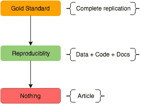

“黄金标准”指的是完美的复制。这意味着在测量机制、计算硬件和软件以及分析中采取的步骤方面的所有必要资源都是可用的，以至于可以进行原始研究的精确复制。另一方面，根本没有复制。这里只给出了关于文章中提供的发现的信息。

可重复的研究介于两者之间。这个想法是让所有的数据、代码和相关的文档都可用，这样研究人员就能够*重现*这项研究。这种可访问性是至关重要的，因为通常一篇文章的读者的旅程是从作者的另一端开始的(如下所示)。

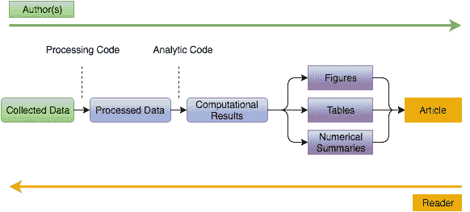

作者从左到右，首先收集数据，处理数据，然后通过计算分析得出结果。每一步之间都有代码段，这些代码段执行将原始数据转换成整洁数据或将整洁数据转换成结果的任务。最后，所有的发现被总结和浓缩成一篇文章，包括图表和/或数字摘要。相比之下，对复制研究感兴趣的读者从右边开始，然后向左移动。没有数据和代码，读者只能根据文章中提供的信息来解读作者做了什么。因此，可复制研究的目标是从本质上给予读者从与作者相同的位置开始的能力，同时以代码的形式添加每个转换之间的缺失部分。因此，要想让读者了解研究的可重复性，需要具备四个条件:

1.  收集的数据。
2.  处理和分析代码。
3.  数据和代码文档。
4.  公众对分发平台的访问。

然而，困难仍然存在，因为读者必须下载数据、代码和文档，以及研究文档，以便能够理解哪个代码段适用于哪个结果以及如何重新运行分析等。此外，读者可能无法获得与撰写文章的研究人员相同的计算资源。然而，下面的例子展示了如何使用 Domino 来规避这些问题，使重现研究更容易、更快。

## 使用 Domino 的示例

本例中的数据来自 Gareth James、Daniela Witten、Trevor Hastie 和 Robert Tibshirani 的《统计学习入门》。它研究产品销售和各种媒体如电视、报纸和广播的营销预算之间的关系。

注:出于示例目的，数据中添加了一个异常值。

### 探索性数据分析

一旦收集了原始数据，分析的第一步通常包括探索数据。这是为使用 R 语言的电视预算而做的。

```py
# read in the data
adsData <- read.csv("Data/Advertising2.csv")

# plot sales per thousand from tv advertising
library(ggplot2)
ggplot(adsData, aes(x=TV, y=Sales)) + geom_point(col="darkorange") +
ylab("Sales (per thousand units)") + xlab("TV budget (per thousand dollars)")
```

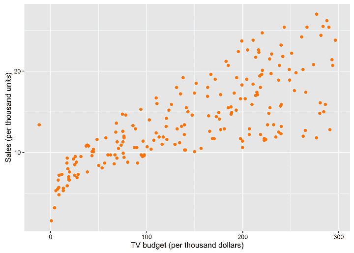

预算的大小和销售额之间似乎有明显的正相关关系。然而，负预算设法渗入数据中，这很可能是数据收集错误。

## 处理代码

下面的代码删除了具有负预算的点，这类似于将原始数据转换为已处理数据的分析中的一段代码。

```py
# processing (remove outlier)
outlierIndex <- which(adsData$TV < 0)
adsData <- adsData[-outlierIndex,]
```

现在数据已经处理完毕，可以进行数据分析了。

## 分析代码

为了更具体地描述预算和销售之间的关系，可以用线性模型来拟合数据。

```py
# fit linear model to the data
lmFit <- lm(Sales~TV, data=adsData)

# print coefficients
lmFitCoef <- coef(lmFit)
lmFitCoef
```

```py
## (Intercept) TV
## 7.03259355 0.04753664
```

根据线性拟合，电视预算增加 1000 美元将大致导致额外销售 47 台。拟合如下图所示。

```py
# plot fit
ggplot(adsData, aes(x=TV, y=Sales)) + geom_point(col="darkorange") +
geom_abline(intercept = lmFitCoef[1], slope = lmFitCoef[2], col="blue") +
ylab("Sales (per thousand units)") + xlab("TV budget (per thousand dollars)")
```

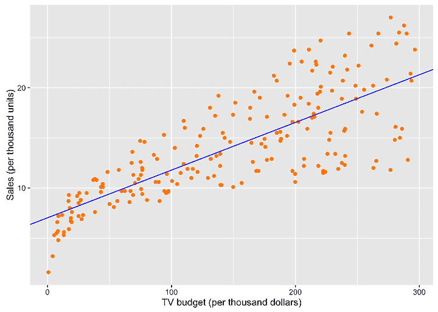

现在分析已经完成，让我们看看如何使用 Domino 来重现结果。

## 使用 Domino 的再现性

简而言之， [Domino](https://www.dominodatalab.com/?utm_source=blog&utm_medium=post&utm_campaign=reproducible-research-using-domino) 是一个企业级平台，支持数据科学家运行、扩展、共享和部署分析模型。[这篇由](//blog.dominodatalab.com/using-r-h2o-and-domino-for-a-kaggle-competition/ "domBlog1") [Jo-Fai Chow](http://www.jofaichow.co.uk/ "jo") 撰写的帖子包含了如何开始使用 Domino 的教程，从启动和运行，到在云中运行您的第一个分析。或者，您可以注册一个[现场演示](//www.dominodatalab.com/demo?utm_source=blog&utm_medium=post&utm_campaign=reproducible-research-using-domino "Domino demo")来看看 Domino 提供了什么。所以让我们开始吧。

下面的代码代表了完整的分析管道，创建该管道是为了执行将原始广告数据转换成线性拟合形式的计算结果的所有必要步骤。代码被保存为 *lmFitAdvertising。R* 。

```py
#########################################################
# Fit linear regression model to the advertising data #
#########################################################

# read in the data
adsData<- read.csv("Advertising2.csv")

# processing (remove outlier)
outlierIndex <- which(adsData$TV < 0)
adsData <- adsData[-outlierIndex,]

# fit linear model to the data
lmFit <- lm(Sales~TV, data=adsData)

# print coefficients
lmFitCoef <- coef(lmFit)
lmFitCoef

# plot linear fit
library(ggplot2)
ggplot(adsData, aes(x=TV, y=Sales)) + geom_point(col="darkorange") +
geom_abline(intercept = lmFitCoef[1], slope = lmFitCoef[2], col="blue") +
ylab("Sales (per thousand units)") + xlab("TV budget (per thousand dollars)")
```

使分析可重现的第一步是确保所有需要的数据和代码都位于 Domino 项目文件中。如果整个分析是使用 Domino 执行的，那么文件应该已经存在于项目中，但是 Domino 还允许上传数据和代码，如下所示。

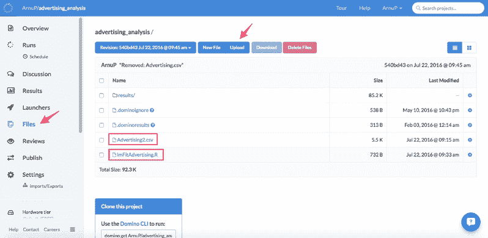

接下来导航到*启动器*页面来创建一个新的启动器。这些是运行在分析代码之上的自助式 web 表单。

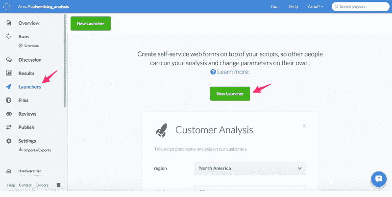

要创建启动器，只需点击*新启动器*按钮，给它一个名称和描述，并选择启动器应该运行的程序(在本例中为 lmFitAdvertising。r)。

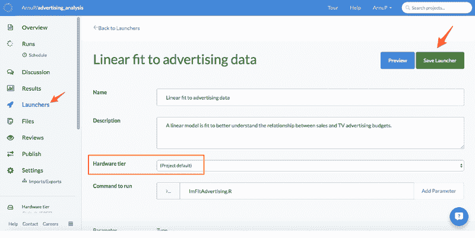

另一个可用选项是设置*硬件层*，在本例中设置为“project default”。**这个选项真的有用**。如果所有的分析最初都是使用 Domino 进行的，那么研究人员可以通过确保为启动器选择分析中使用的相同硬件层，为读者消除可能的计算障碍。最后，点击右上角的*保存启动器*，保存启动器。

在可以公开访问启动器之前，必须更改项目设置。前往*设置*并点击*访问&共享*选项卡。

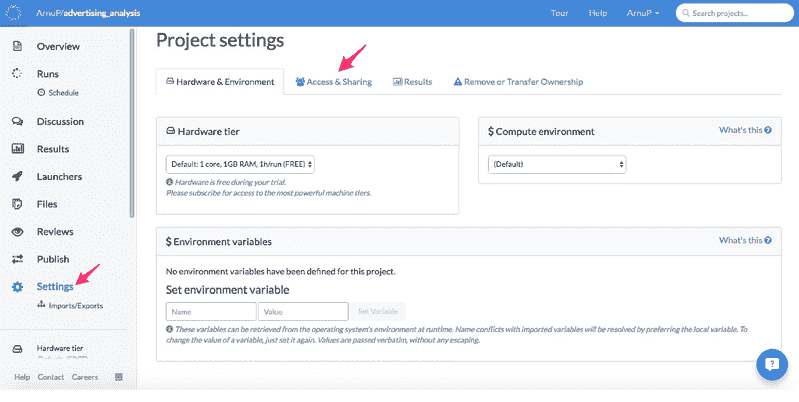

内部访问和共享选择*公共:任何人都可以查看*选项，并勾选*允许匿名用户运行执行*框。

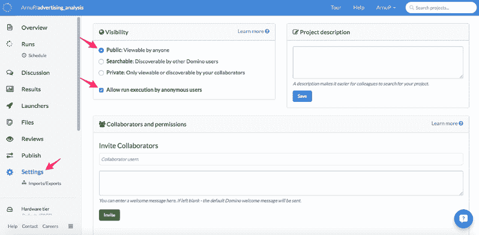

这些设置将使项目可公开访问，并允许任何具有指向启动器页面的 URL 的人运行启动器。所以现在一切都在多米诺这边准备好了。

这个例子将使用 *LaTeX* ，但是步骤可能与 Word 非常相似。下面的代码显示了一个表格(通常可能出现在文章中)，该表格显示了线性拟合的结果(回归系数)。

```py
\documentclass{article}
\usepackage{hyperref}

\begin{document}

\begin{table}[!htbp] \centering
\caption{Linear fit to advertising data}
\href{https://trial.dominodatalab.com/u/ArnuP/advertising_analysis/runLaunchers}{\begin{tabular}{@{\extracolsep{5pt}} cc}
%\\[-1.8ex]\hline
\hline \\[-1.8ex]
\textbf{Intercept} &amp; \textbf{TV (Slope)} \\
\hline \\[-1.8ex]
$7.0326$ &amp; $0.0475$ \\
\hline \\[-1.8ex]
\end{tabular}}
\end{table}

\end{document}
```

通过使用 *hyperref* 包将表格包装在 href 标签中，可以使表格可点击，链接到网络上任何给定的地址。因此，通过插入启动器页面 URL，拥有文章电子版的读者将能够点击表格并被引导至符合线性模型的启动器。点击*运行*按钮，可再现结果。

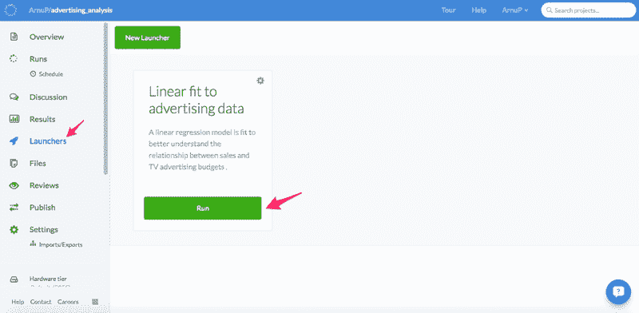

Domino 提供了更改运行标题以及将结果发送到指定电子邮件地址的选项。一旦这些被填充(或留空)，读者再次点击*运行*。

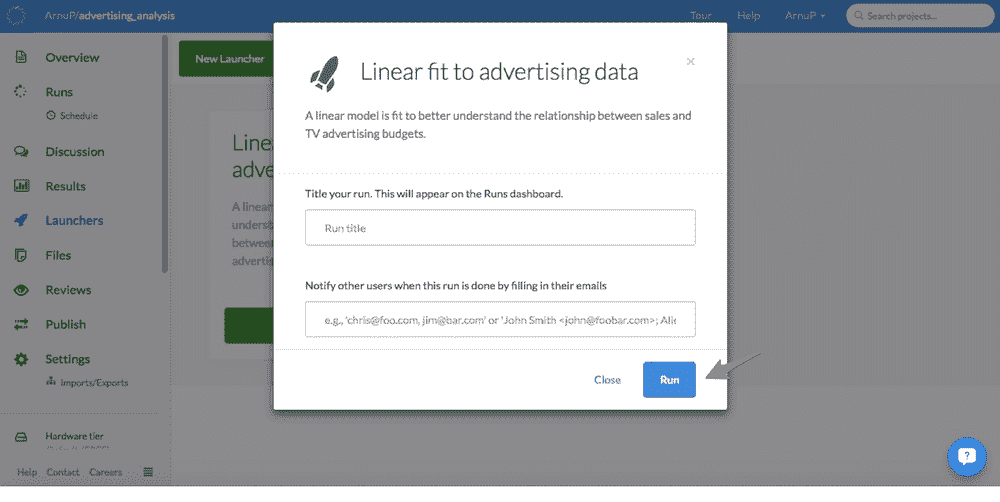 代码运行时显示代码打印输出。可以在下面的红框中查看系数。

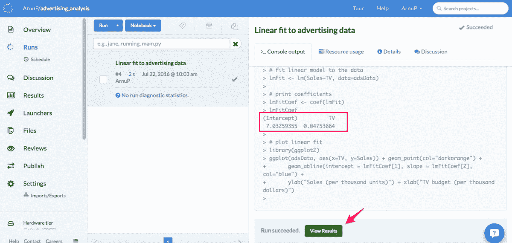

要查看图表，读者可以点击*查看结果*。在这里，系数和图都将被显示。然后可以使用位于右上角的按钮下载该图。

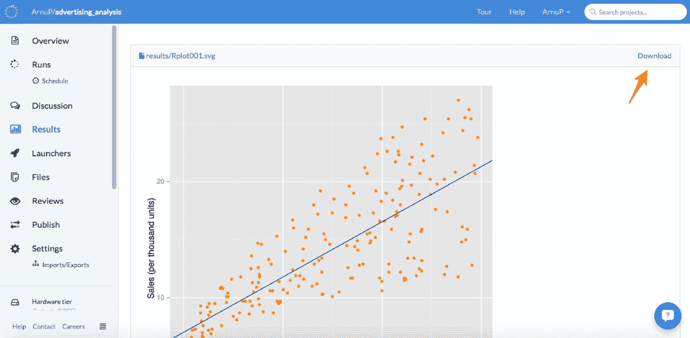

这就是使用 Domino 的可重复研究。总之，Domino 允许作者:

*   在云中进行整个分析。
*   下载将在文章中使用的计算结果。
*   通过创建可公开访问的启动器并将它们链接到文章的电子版，使结果可重复。

这样，读者就不必执行以下任务了:

*   下载重现研究结果所需的数据、代码和文档。
*   确保有足够的计算能力来重新运行分析。

这个例子的工作版本可以在这里找到。它包括构建的 LaTeX 文件和生成的 PDF，后者包含前面介绍的表格。PDF 将引导您到再现该示例的启动程序。您还可以通过访问 Domino 平台上的项目来直接访问启动器。