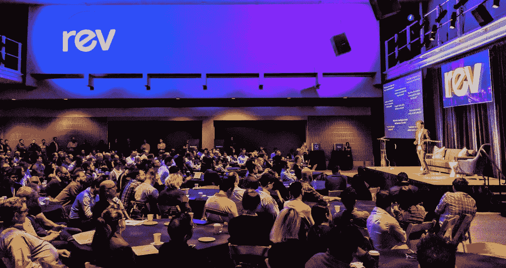

# 反光

> 原文：<https://www.dominodatalab.com/blog/revlections>

By Mac Steele, Director of Product, Domino on June 01, 2018 in [Perspective](/blog/perspective/)

本周，我们在旧金山举行了有史以来第一次 [Rev](https://rev.dominodatalab.com/rev-2018/) 峰会，召集了 300 多位数据科学领袖，为期两天。演讲者和与会者讨论了数据科学行业的战略方向，并在其他领导者之间分享了战术技巧。我们 Domino 主办 Rev 是因为我们听到并感觉到市场上存在一个缺口，需要一个论坛，让领导者们能够聚在一起，带走一些实质性和实际的东西。他们可以在周一早上开始工作。结果超出了我们的最佳预期。我们想为那些无法亲临现场的人分享一些亮点。

*   我们的首席执行官 Nick Elprin 公布了数据科学领域的 Domino 愿景。在他的主题演讲中，他讨论了数据科学领导者社区如何获得千载难逢的机会来帮助建立新的组织能力并释放数据科学的全部潜力。他详细介绍了这种能力的一个新框架，称为模型管理，并通过演示 Domino 数据科学平台的未来，分享了我们如何将这种能力应用到生活中。如果你想了解更多，请[看看这篇论文](https://www.dominodatalab.com/resources/model-management/)，它更详细地介绍了模型管理。
*   我们听到了凯茜·奥尼尔和内特·西尔弗发人深省的主题演讲。

    *   《摧毁数学的武器 的作者凯茜谈到了在考虑到所有不同利益相关者的情况下，从更广阔的角度来看待什么是“好”模型的重要性。她建议团队在盲目地直接进入模型构建之前使用一种叫做道德矩阵的工具，特别是当模型开始驱动我们与大多数官僚机构的互动时。
    *   《信号与噪音 的作者 Nate 讨论了概率思维的重要性，以及大数据推动的模型爆炸如何为社会带来了许多问题和机遇。他强调了快速迭代的必要性，引用了气象学家不断从过去的错误中学习和调整的天气预报的巨大进步。
*   来自 Stitch Fix、谷歌、优步、Airbnb、联合健康集团、摩根大通等模型驱动型公司的领导者分享了他们自己的观点。Bristol-Myers Squibb 的 Nathan Siemers 详细介绍了他的团队如何利用模型发现基因生物标志物来改善癌症治疗。来自[穆迪分析](https://www.dominodatalab.com/customers/moodys-analytics/)的 Jacob Grotta 描述了银行业模型的传奇历史，以及他们如何开发了一个严格的系统来管理这些模型，其他行业可以从中学习。他指出，所有的数据科学家都喜欢把自己当成艺术家，他说在穆迪，真正的艺术是“**可观察的、**可重复的、 **T** 透明的。”****
*   会上就如何最好地管理数据科学组织举行了多个小组讨论和一个互动研讨会。领导们就招聘哪些角色、以什么顺序招聘以及数据科学应向谁汇报展开了一场健康的辩论。协作的重要性和再现性的目标是会议中反复出现的主题。许多与会者描述了一种如释重负的感觉，即他们所面临的挑战并不是他们所独有的，他们都很兴奋能够在我们仍处于萌芽状态的行业中形成最佳实践。

总的来说，这是令人振奋的两天，演讲者和与会者愿意分享他们的见解，以帮助推进数据科学管理的新兴实践，这让我们感到谦卑。随着各行各业的数据科学领导者继续打造模型驱动型公司，我们深受鼓舞。

请继续关注 Rev 2019 的更多内容，同时，请留意 2018 年下半年在你附近的一个城市出现的[数据科学弹出窗口](https://popup.dominodatalab.com/)。

[Twitter](/#twitter) [Facebook](/#facebook) [Gmail](/#google_gmail) [Share](https://www.addtoany.com/share#url=https%3A%2F%2Fwww.dominodatalab.com%2Fblog%2Frevlections%2F&title=Revlections)