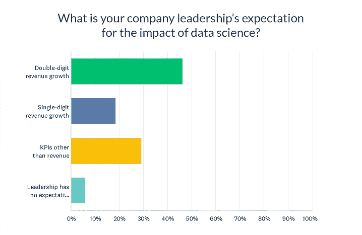

# 民意调查发现，对数据科学的信心直线上升:更好的工具是原因吗？

> 原文：<https://www.dominodatalab.com/blog/rocketing-confidence-in-data-science-poll-finds-are-better-tools-the-reason>

企业越来越多地在数据科学上下大赌注，以实现雄心勃勃的短期增长，这再次表明，这个迅速崛起的行业正在成为医疗保健&制药、国防、保险和金融服务等领域的巨大创新力量。 在最近的一次民意调查中，近一半的受访者表示，他们公司的领导层预计数据科学的努力将带来两位数的收入增长。2021 年的一项类似调查显示，这一数字仅为 25%，表明人们对年轻职业的期望越来越高。

这只是多米诺数据实验室最近 Revelate 调查的发现之一，该调查吸引了该领域相关人员的 151 份回复。近五分之四的受访者(79%)表示，数据科学、ML 和 AI 对其公司的整体未来增长至关重要。整整 36%的受访者称这些技术是他们公司扩张的“唯一最关键的因素”。

##   商家需要做什么才能收获预期的大收益

公司应该把精力集中在哪里才能获得如此巨大的回报？什么能最有效地帮助新兴学科充分发挥其巨大潜力？调查结果也说明了这些问题，发现:

*   **与扩展和运营数据科学相关的最困难的技术问题** 是访问适当的数据科学方法/工具(27%的受访者表示这是他们最大的挑战)和安全性考虑(26%)。
*   **最大的人和流程挑战** 仍然拥有足够的数据科学人才，据 44%的受访者称，这与许多的近期调查一致。因此，精明的企业领导人应该尽一切努力尽可能高效和有效地利用他们现有的数据科学团队。
*   **最能帮助数据科学加速其游戏 的改进包括: **增加协作** 和按需访问 **数据科学工具和基础设施，两者都占** **的 43%。**** 

数据科学领导者还强调需要企业 MLOps 平台来帮助他们解决世界上最大的挑战。特别是，他们中的许多人说他们很乐观，因为企业 MLOps 工具能够应对挑战。

例如，谷歌的首席数据科学家 Cassie Kozyrkov 最近承认，人们对这个年轻的职业越来越有信心。 但是随着数据科学变得越来越受重视，像多米诺数据实验室这样的公司正在投资创造和升级工具来支持这个年轻的职业。Kozyrkov 表示，现在专门为数据科学工作设计的工具的功能增加，是帮助从业者和数据科学领导者跟上发展的非常积极的一步。

她说:“例如，多米诺数据实验室为数据科学家制作了 [**工具**](https://venturebeat.com/2022/05/05/domino-data-lab-announces-latest-mlops-platform-to-satisfy-both-data-science-and-it/) ，这些工具令人难以置信，非常有用，而且非常可爱。”" *那是* 为我们数据科学界所倡导的 *看起来就像* 。"

这项调查是由 Rev 3 的与会者以及他们的团队在 5 月份进行的，Rev 3 是 Domino Data Lab 为数据科学和 IT 领导者举办的一个受欢迎的会议。Kozyrkov 在会议上发言，重点关注数据科学在一些世界上最重要的挑战中的应用，并在 5 月吸引了 800 多名与会者。