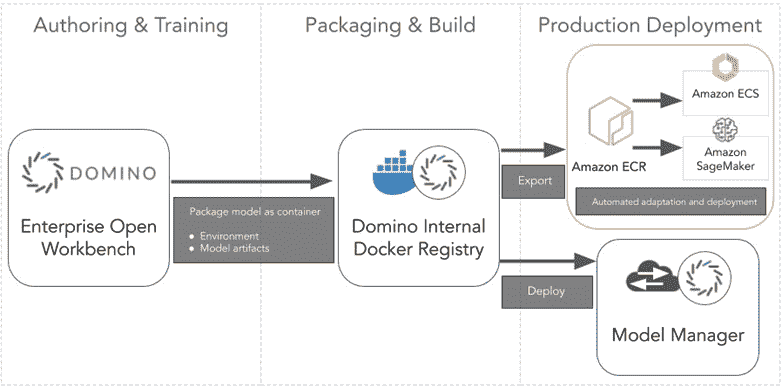

# 容器在 MLOps 和模型生产中的作用

> 原文：<https://www.dominodatalab.com/blog/role-of-containers-on-mlops-and-model-production>

容器技术改变了数据科学的发展方式。数据科学最初的容器用例集中在我所说的“环境管理”上。配置软件环境是一项持续的工作，尤其是在开源软件领域，这是大多数数据科学家工作的领域。这通常需要反复试验。这种修补可能会打破依赖性，例如软件包之间或驱动程序和应用程序之间的依赖性。容器为分析专业人员提供了一种将环境相互隔离的方式，允许分析人员试验和冻结黄金状态环境。容器编排在数据科学工作中具有以下优势:

*   消除 MLOps 生命周期中的中心 IT 瓶颈。

*   共享代码和研究时，数据科学家可以更好地协作。

*   旧项目可以立即复制和重新运行。

将模型投入生产是 [MLOps](https://www.dominodatalab.com/data-science-dictionary/mlops) 生命周期中的一个关键阶段。容器技术在让 ML/AI 模型进入生产中起到了什么作用？为了回答这个问题，我将借助 Domino 数据科学平台中的一个例子。对于那些不熟悉 Domino 的人来说，快速了解一下背景:这是一个数据科学家运行他们的代码(例如 R、Python 等)、跟踪他们的实验、分享他们的工作以及[部署模型](/blog/machine-learning-model-deployment)的平台。Domino 运行在本地或所有主要的云上。

在我们的示例中，考虑一个出于安全目的需要在内部进行模型研究的组织。但是，该组织希望将生产模型部署到 AWS SageMaker，以满足其客户组织的 IT 需求。Domino 可以使用容器及其 SageMaker 导出功能来满足这个组织的需求。我鼓励您阅读发布在 AWS 合作伙伴网络上的博客[How to Export a Model from Domino for Deployment in Amazon sage maker](https://aws.amazon.com/blogs/apn/how-to-export-a-model-from-domino-for-deployment-in-amazon-sagemaker/)，以便更深入地了解 SageMaker Export。

在这种情况下，Domino 将安装在本地，并像往常一样通过容器化实验协调协作研究，所有这些都通过利用容器环境库的本地硬件运行，这些环境也存储在本地并由 Domino 管理。模型通过验证后，Domino 将整个模型环境打包到一个 SageMaker 兼容的容器中，导出到 AWS SageMaker 进行部署，而不是部署到 Domino 用于研究的同一本地服务器场。

*Figure 1 – Options for deploying and hosting models created in Domino.*

这就是现代组织所需要的灵活性。他们希望避免局限于任何一种架构。就像容器最初为配置环境的数据科学家提供灵活性和自由度一样，它们也可以为组织提供跨平台和架构工作的灵活性和自由度。随着数据科学继续通过 CI/CD 和模型验证等原则强化 [MLOps 管道](/blog/designing-a-best-in-class-mlops-pipeline)，很容易相信容器也将在这一演变中发挥关键作用。