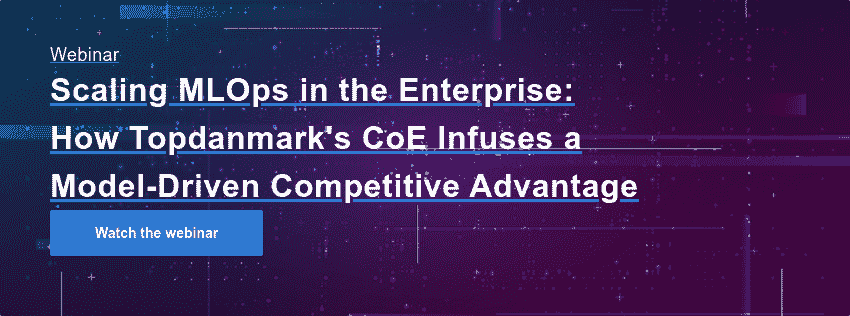

# 在丹麦领先的保险公司之一扩展 MLOps

> 原文：<https://www.dominodatalab.com/blog/scaling-mlops-at-one-of-denmarks-leading-insurers>

*编者按:这是分享开发企业数据科学战略的公司最佳实践的系列文章的一部分。一些文章将包含关于他们使用 Domino 的信息。*

最近，在 NVIDIA 的 GTC 会议 期间，我参加了一个小组讨论，讨论保险行业以及 [Topdanmark](https://www.topdanmark.com/en/) 的 MLOps 规模。

作为丹麦第二大保险公司，我们的目标是提高保险为消费者服务的标准。我们希望为消费者提供更好、更快、更满意的保险体验——无论我们是在制定政策决策还是处理索赔——我们使用机器学习和人工智能来实现这一点。

当我们在 2017 年推出我们的机器学习卓越中心时，我们进行了概念验证，以了解我们如何应用这些技术。我们证明了我们可以使用自然语言处理文档来自动化将近一半的选择过程。由于我们的大部分流程都包含文档，这种潜力对我们来说变得很明显。我们还证明了我们可以应用图像分析(即计算机视觉)，这样我们的核保和理赔专家就可以在最需要的地方运用他们的专业知识。

但是，为了将模型集成到我们的运营工作流程中，并在 2018 年前将我们的第一批模型投入实时生产运行，我们必须克服技术和非技术两方面的挑战。以下是我们在 NVIDIA GTC 会议期间重点讨论的一些领域。(你可以在这里 聆听整个讨论 [。)](/resources/topdanmark-scales-mlops)

### 确保版本控制和再现性

当我们第一次开始努力时，我们立即意识到，如果没有数据科学平台，我们将在各个机器上到处都有模型，这将使我们的工作难以扩展。我们的早期步骤之一是与德勤顾问合作，确定一个可以帮助我们控制版本、重现结果、访问资源以及分离测试和生产环境的平台。我们认为 Domino 的企业 MLOps 平台是代码优先数据科学家加速研究和扩展的理想平台。例如，我们的团队现在可以轻松地在云中旋转 NVIDIA GPUs，使用 Domino 来选择他们需要的大小和功率，以便他们可以快速测试新的想法。它使我们的数据科学家能够专注于他们擅长的领域-数学建模和数据分析-在安全的环境中使用他们选择的任何工具或方法处理数据，在这样的环境中，我们可以记录工作并确保我们产生影响。

数据科学部门内部经常会讨论是构建还是购买数据科学平台。我们不认为建立一个平台是一个好的选择。从头开始构建可能需要很长时间，并且您需要大量的资源来维护和不断添加新的功能。有了 Domino，我们可以从他们的全球经验中受益，获得我们可能没有想到会要求的新特性，但这些新特性会给我们带来巨大的好处。

### 投资于机构知识

在建立我们的机器学习卓越中心的过程中，我们也很快意识到我们需要建立一个专家社区，并使他们易于合作。我们与一所领先的大学合作，为我们的团队开设了语言和图像分析高级方法的大师班。我们在几个方面进行了投资——具有擅长解释数据源的领域专业知识的从业者、对高级技术有深刻理解(博士级别)的专家，以及软件专家。我们的大师班确保每个人都对自然语言处理和图像分析有深刻的理解，这两者对我们的成功至关重要。今天，我们继续拓宽我们的专业知识，与欧洲各地在自然语言处理和图像分析方面具有相同技能水平和相同挑战类型的社区交流知识。

此外，当我们选择 Domino 平台时，我们将协作作为核心需求。 通过使 我们的数据科学家更容易分享和发展彼此的想法，我们创建了一个社区，团队成员在其中不断相互激励，推动我们的能力向前发展。

### 管理模型漂移

我们关注算法的实时曝光，这在技术上比仅仅运行批量模型要求更高。因此，我们需要有信心保持算法的准确性和质量，并证明这些自动化决策的价值。这是一个挑战，我们必须用熟练的人员和先进的模型监测技术来解决。例如，我们有一种算法，它每年为我们节省数百万美元。在我们使用 Domino 来监控模型漂移之前，我们让两位数据科学家花了三个多月的时间来挖掘数据源，以确定一个提供给算法的数据集没有正确格式化，从而导致了模型漂移。今天，我们可以立即看到我们是否有模型漂移以及在哪里寻找，节省了我们大量的时间。

有些人认为你可以将这项工作作为传统 ITOps 流程的一部分留给 IT 部门。但是，通常情况下，它不知道数据源的变化会如何影响算法。我认为，如果您要展示您正在交付预期的价值并快速解决任何问题，企业 MLOps 平台中的实时模型监控功能至关重要。

### 平衡风险和创新

当我们扩展我们的工作时，我们必须确保考虑到潜在的风险。当然，我们会设置围栏，以确保我们对数据的使用符合所有监管和合规指导原则。但除此之外，我们还与我们的法律团队合作，围绕我们的数据科学家可以利用数据和机器学习做些什么来制定政策。我们最重要的问题总是:我们能否站在客户和投资者面前，捍卫我们的工作是合理的？

在过去的四年里，我们取得了长足的进步。通过投资于我们的数据科学社区，并消除他们前进道路上的流程和技术障碍，我们在创新业务方面取得了巨大的收益。例如，我们现在可以立即批准 25%的汽车索赔。在不到两秒钟的时间内，我们还可以批准高达 65%的承保，这是我们向个人客户提供的风险波动最大的保险之一。此外，我们可以不断试验和迭代，以提升我们算法的性能，同时与我们的业务领导者合作，提供更多可以改变我们客户体验的解决方案。

###  

#### 了解更多信息

*   阅读 Topdanmark 案例研究， [*通过模型驱动的保单审批，在几秒钟内为业主解答保险范围问题。*](https://www.dominodatalab.com/customers/topdanmark)
*   阅读 [*企业 MLOps 原理完全指南*](https://www.dominodatalab.com/resources/guide-to-enterprise-ml-ops-principles) *。*