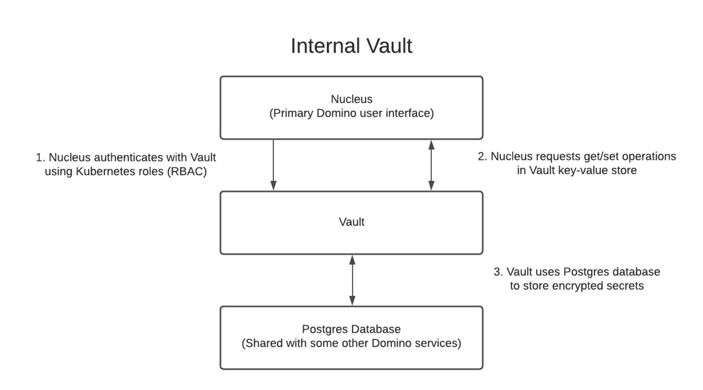
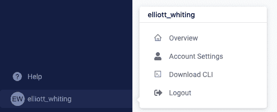
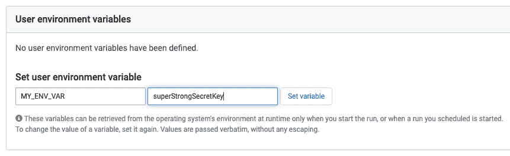

# Domino 5.0:安全地存储凭证以支持最严格的法规遵从性要求

> 原文：<https://www.dominodatalab.com/blog/secret-store>

## 介绍 Domino 5.0 中的秘密商店

Domino 不断创新，使我们的企业 MLOps 平台尽可能安全。我们做到这一点的一个最基本的方法是确保您的数据只能由那些应该有权访问的人访问。即使是需要访问整个平台的管理员，也不应该能够访问特定的数据。这一点尤其重要，因为我们的许多 [客户](https://www.dominodatalab.com/customers) 在受监管行业工作，他们的数据存储必须符合标准，例如[【FIPS】](https://www.nist.gov/standardsgov/compliance-faqs-federal-information-processing-standards-fips)[HIPAA](https://www.hhs.gov/hipaa/index.html)和 [PCI](https://www.pcisecuritystandards.org/) 。考虑到这一点，Domino 引入了一个秘密存储来加密静态的敏感数据，并帮助确保组织能够遵守安全标准。

Domino 现在使用 [HashiCorp Vault](https://www.hashicorp.com/products/vault) 将敏感的用户数据，包括凭证、API 密钥和新的[数据源访问秘密](/blog/data-connectors)存储在一个安全的秘密存储中。存储在 Secret Store 中的数据是静态加密的——如果您在 Kubernetes 集群中启用了 Istio 到它的连接是用 [TLS](https://www.internetsociety.org/deploy360/tls/basics/) 保护的。

Domino 中的 Secret Store 为安全团队提供了生成已被访问的机密日志的能力，然后如果有可疑的活动——或者更糟糕的是，完全违反安全性——就撤销这些机密。您的安全工程师晚上会睡得更好，即使您的组织不在受监管的行业中。

### 它是如何工作的

新安装的 Domino 将把预先配置好的 HashiCorp Vault 实例部署到您的 Kubernetes 集群中。然后，Nucleus 服务(主 Domino 用户界面)根据 Vault 服务进行身份验证，并被授权在 Vault 中读取和写入键值对。

但是，许多组织已经安装了 Vault，并且不想管理第二个服务。其他组织可能尚未部署 Vault，但希望能够灵活地将安装与现有的 HSM 和 PKI 基础架构相集成，并定义自己的策略。在这两种情况下，Domino 都可以配置为使用外部保险库，使用组织现有的加密和密钥轮换策略。然后，Domino 可以通过文字令牌认证或令牌路径认证来访问外部 Vault 实例。

Domino 中创建用户环境变量、API 键等的屏幕。，与以前一样，但是后台基础结构的变化只是改变了数据提交后的存放位置。

例如，要设置一个用户环境变量，进入 Domino UI 左下方用户菜单中的“Account Settings”。

在“用户环境变量”部分，添加新环境变量的键和值，然后单击“设置变量”。当前的 Domino 用户和 DevOps 及其他产品的用户应该对这个过程很熟悉。

一旦您单击“Set variable”，Domino 的 Nucleus 服务将把键-值对写入秘密存储，该对被加密保存在其数据库中。当您需要在项目中引用您的环境变量时，Domino 反转这个过程，从秘密存储中读取键值对，并将值插入到您的项目中。从用户的角度来看，这个过程很简单，因为所有的艰苦工作都是为他们做的。

### 结论

Domino Data Lab 很高兴将 Secret Store 引入 Domino——它扩展了 Domino 中已经存在的安全措施，并简化了对公司政策和行业标准的遵从。升级到 [Domino 5.0](https://www.dominodatalab.com/resources/introducing-domino-5.0) ，你会得到一个预配置的实例，你可以立即开始保存秘密。对于需要更大灵活性的组织，Domino 可以连接到符合既定策略的现有实例。不管怎样，Domino 已经准备好帮助所有组织满足最严格的安全标准。

Domino 是 [企业 MLOps](https://www.dominodatalab.com/resources/a-guide-to-enterprise-mlops/) 平台，它无缝集成了代码驱动的模型开发、部署和监控，以支持快速迭代和最佳模型性能，因此公司可以确保从其数据科学模型中实现最大价值。

