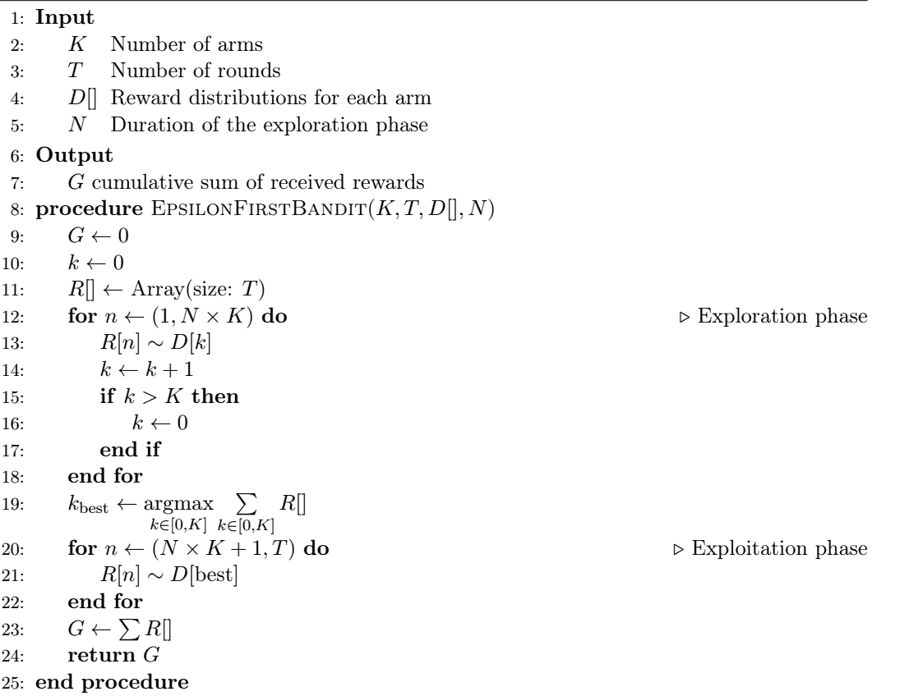
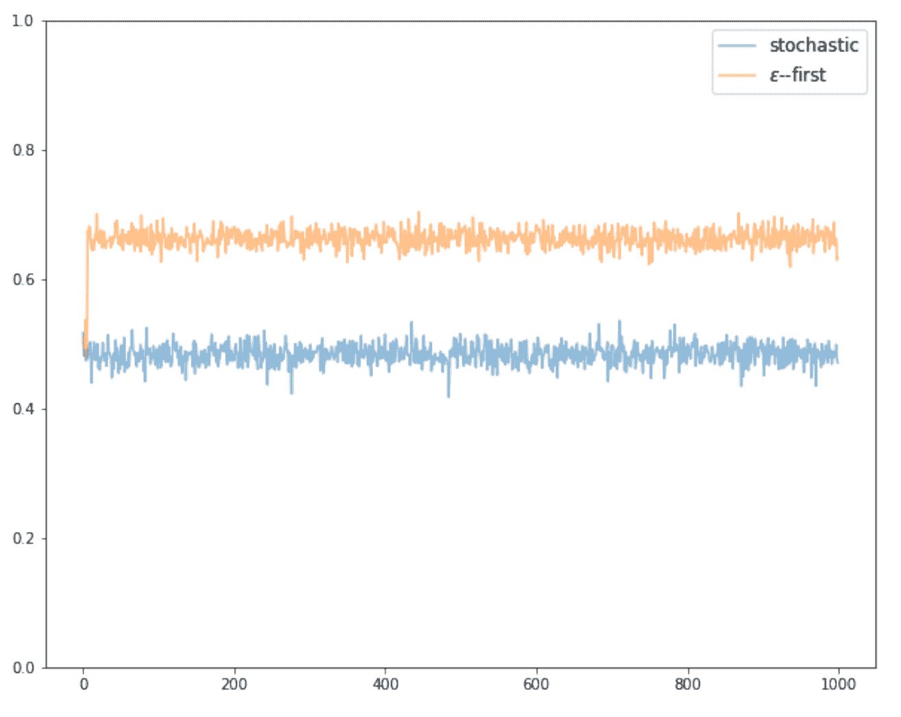
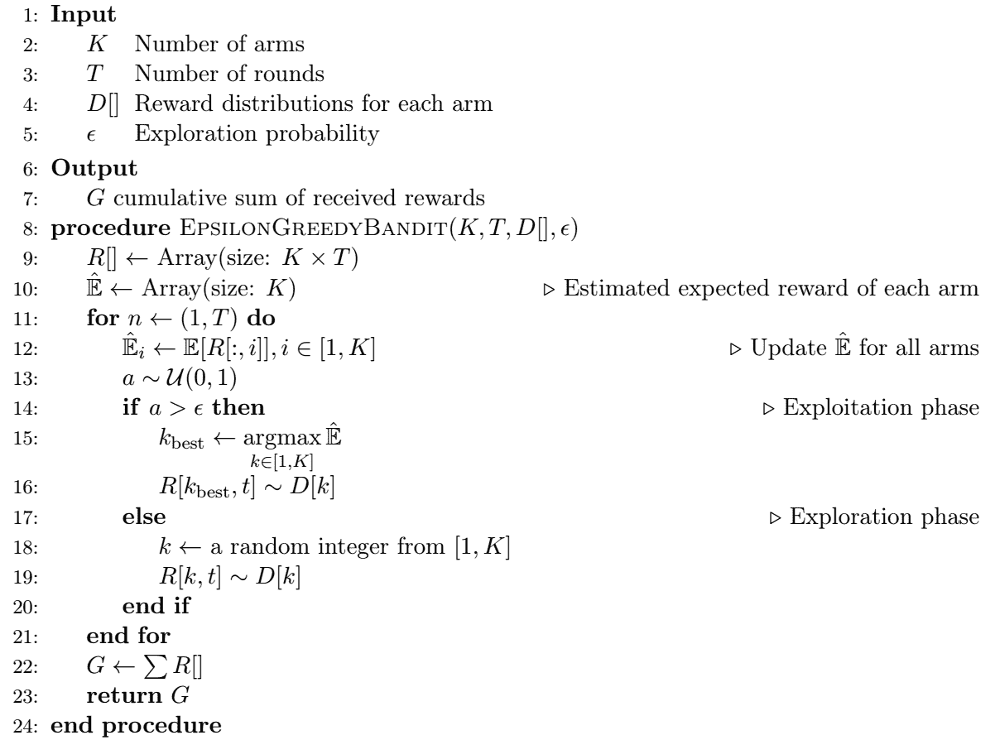
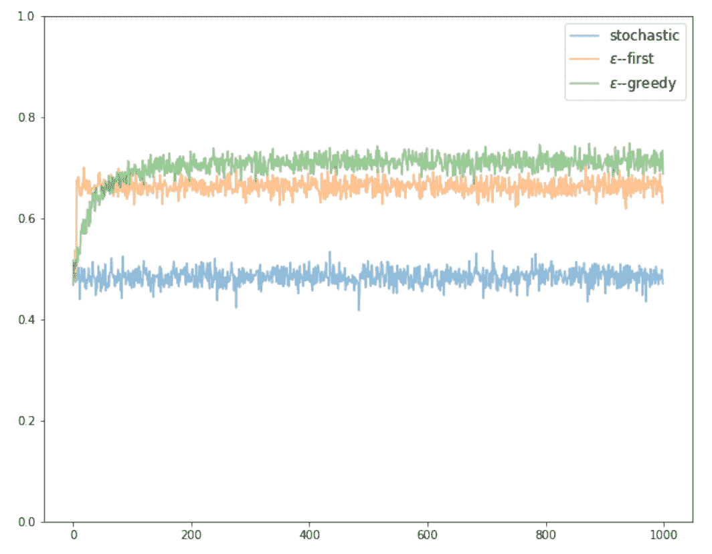

# 解决 K 武装土匪的半统一策略

> 原文：<https://www.dominodatalab.com/blog/semi-uniform-strategies-for-solving-k-armed-bandits>

在 [之前的博客文章](https://blog.dominodatalab.com/k-armed-bandit-problem) 中，我们介绍了 K 臂强盗问题——一个在不确定的时间内分配有限资源的简单例子。我们看到了随机强盗的行为，并证明了随机拉武器产生的奖励接近预期的奖励分布。

在这篇文章中，我们进一步发展了这个概念，并介绍了可能带来更好回报的更聪明的策略。

## ε优先策略

Epsilon-first 是一个两阶段策略，代理从纯粹的探索阶段开始，然后是开发阶段。探索阶段发生在第一次试验期间，其目的是获得足够的知识来确定提供最高预期回报的臂。一旦这个*最佳臂*被识别，算法就在剩余的回合数中播放它\((1-\ε)T \)。在探索阶段，动作要么统一从\(\mathcal{A}\)中选择，要么按顺序执行，重复循环\(\mathcal{A}\)直到阶段结束。在后一种情况下，我们通常对探索阶段执行\(NK\) (\(N \in \mathbb{N}\))次迭代，这保证了所有报酬分布的相等表示。这种方法在算法 1 中给出。

算法 1-ε-第一土匪

我们看到，该算法最初运行一个探索阶段进行\(NK\)次迭代，在每个时间步存储奖励。在探索结束时，它会将所有可能的武器储存的奖励相加，并选择到目前为止已累积最高奖励的武器。然后，该算法切换到开发阶段，并为所有剩余的时间步长播放最佳手臂。查看模拟结果(图 1 ),很明显，当针对相同的报酬分布进行测试时，ε优先策略明显优于随机 bandit。我们看到，这两种算法最初表现相似，这是由于在ε优先算法的探索阶段臂的统一选择。然而，一旦 epsilon-first 过渡到开发阶段，它立即开始累积更高的奖励，产生平均即时奖励\(\ bar { R } \约 0.66\)和累积奖励\(G \约 665\) -与随机 bandit 方法相比，这是一个显著的改进。

 图 1——随机 vs 用\(K=3\)、\(T=1000\)、和\(N=2\)进行第一次盗匪模拟。平均 10 场比赛，每场 100 分。

我们需要认识到，尽管 Epsilon-first 与随机选择相比表现更好，但有几个重要问题代表了实质性的缺点:

*   太短的探索阶段可能导致选择次优的贪婪行为。
*   \(\epsilon\)的选择是外部的—目前没有关于探索阶段应该执行多长时间的规定。这个问题加剧了前一点。
*   ε优先策略的一个关键假设是报酬分布是稳定的。如果违反了这一假设，那么代理很有可能锁定错误的手臂，直到时间用完。

## ε-贪婪策略

ε贪婪是对ε优先策略的一种可能的改进。这种方法的关键区别在于，勘探更均匀地分布在(T)上，而不是有明确的勘探和开采阶段。这是通过在每个时间步\(t \in T\)执行随机动作来实现的，以便对所有试验的\(\epsilon\)比例执行探测，并在\((1-\epsilon)\)比例的试验中利用最佳臂。\(\ε\)的值通常选择为 0.1。

算法二-ε-贪婪大盗

在探索阶段，以均匀的概率随机选择一个分支，在开发阶段，该策略使用具有最高估计期望回报的分支。算法 2 概述了 epsilon-greedy 策略的实施，图 2 将 epsilon-greedy 的性能添加到仿真结果中。我们清楚地看到，ε-greedy 的回报最初在随机策略的范围内，但随着算法执行若干轮探索，其对预期回报的估计提高了，回报开始优于随机策略和ε-优先策略。

 图 2——随机 vs .ε-第一 vs .ε-贪婪土匪模拟用\(K=3\)，\(T=1000\)，和\(N=2\)。平均 10 场比赛，每场 100 分。

## 摘要

在这篇文章中，我们研究了两种针对 K-武装匪徒的半一致策略-ε-优先和ε-贪婪。我们展示了它们都比我们在上一篇文章 的 [中提到的完全随机策略表现得更好。然而，半一致方法的一个问题是，这些策略不能根据观察到的回报更新它们的探索机制。直觉上，能够根据目前的回报调整决策的算法应该表现得更好。一个简单的自适应示例可以是一种算法，该算法可以动态地确定 arm 表现不佳，根本不再可行。这种方法以及其他适应性方法将是以后文章的主题。](https://blog.dominodatalab.com/k-armed-bandit-problem)

## 额外资源

注册一个[免费的多米诺账户](https://try.dominodatalab.com)，获得算法 1 & 2 的实现和额外的代码示例，让你运行上面讨论的模拟。点击下面的按钮，一旦你的帐户被创建，打开强化学习项目开始。文章中讨论的所有策略都可以在 Bandits.ipynb 笔记本中找到。

