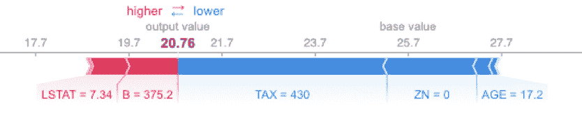
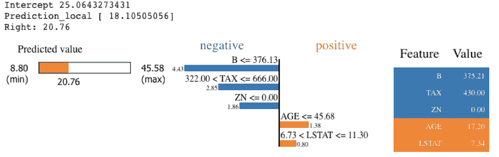
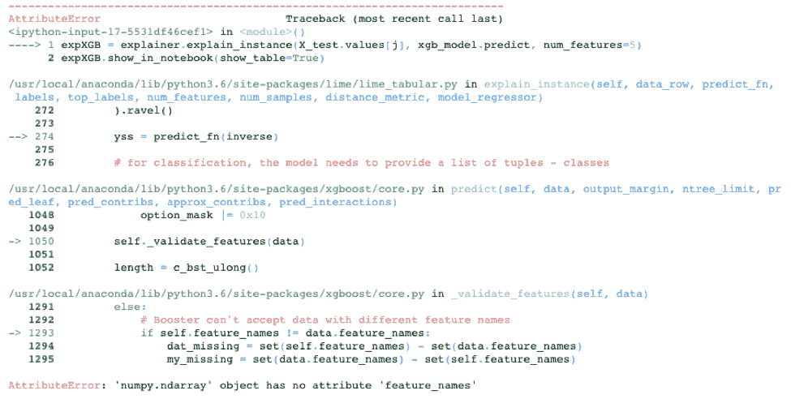
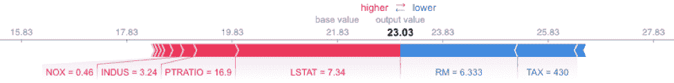

# SHAP 和 LIME Python 库:第 1 部分——很好的解释者，各有利弊

> 原文：<https://www.dominodatalab.com/blog/shap-lime-python-libraries-part-1-great-explainers-pros-cons>

这篇博客文章提供了对 SHAP 和 LIME Python 库的简要技术介绍，随后是代码和输出，强调了各自的优缺点。如果对这篇文章的视觉演示感兴趣，可以考虑参加[网络研讨会](https://www.brighttalk.com/webcast/17563/366621?utm_source=blog&utm_medium=blog&utm_campaign=366621)。

## 介绍

模型可解释性是当今数据科学界的一个优先事项。作为数据科学家，我们希望防止模型偏差，并帮助决策者了解如何以正确的方式使用我们的模型。数据科学的领导者和高管们注意到现有的和即将出台的立法，这些立法要求模型提供它们如何工作以及如何避免错误的证据(例如， [SR 11-7](https://www.federalreserve.gov/supervisionreg/srletters/sr1107.htm) 和[人工智能的未来法案](https://thehill.com/policy/technology/364482-lawmakers-introduce-bipartisan-ai-legislation))。

这篇博文的第 1 部分提供了对 SHAP 和 LIME Python 库的简要技术介绍，随后是代码和输出，强调了各自的优缺点。第 2 部分将通过将这些库应用于各种 Python 模型来更详细地探索这些库。这些帖子的目标是让读者熟悉如何在实践中使用这些库，以及如何解释它们的输出，帮助您在自己的工作中利用模型解释。

## SHAP 对莱姆

SHAP 和莱姆都是模型可解释性的流行 Python 库。SHAP (SHapley 附加解释)利用 SHapley 值的概念对模型特征影响评分。一个 [Shapley 值](https://christophm.github.io/interpretable-ml-book/shapley.html)的技术定义是“一个特征值在所有可能的联合中的平均边际贡献。”换句话说，Shapley 值使用所有可能的输入组合来考虑实例的所有可能的预测。由于这种详尽的方法，SHAP 可以保证像一致性和局部准确性的属性。 [LIME](https://cran.r-project.org/web/packages/lime/vignettes/Understanding_lime.html) (局部可解释模型不可知解释)围绕每个预测建立稀疏线性模型，以解释黑盒模型如何在局部附近工作。在[他们的 NIPS 论文](http://papers.nips.cc/paper/7062-a-unified-approach-to-interpreting-model-predictions)中，SHAP 的作者展示了 Shapley 值提供了准确性和一致性的唯一保证，并且石灰实际上是 SHAP 的子集，但是缺少相同的属性。为了进一步研究，我找到了 GitHub 站点 [SHAP GitHub](https://github.com/slundberg/shap) 和 [LIME GitHub](https://github.com/marcotcr/lime) 有用的资源:

那么为什么会有人使用石灰呢？简单来说，石灰速度快，而 Shapley 值计算时间长。对于你们这些统计学家来说，这种情况让我想起了费希尔的精确检验和列联表的卡方检验。费希尔的精确测试提供了最高的准确性，因为它考虑了所有可能的结果，但它永远需要在大型表上运行。这使得卡方检验，一种基于分布的近似方法，成为一种很好的替代方法。

SHAP Python 库通过使用近似和优化来帮助解决这个计算问题，在寻求保持良好的 Shapley 属性的同时大大加快了速度。当您使用 SHAP 优化模型时，运行速度非常快，并且输出准确可靠。不幸的是，SHAP 还没有针对所有模型类型进行优化。

例如，SHAP 有一个在树上运行快速的树解释器，如来自 [XGBoost](https://www.dominodatalab.com/data-science-dictionary/xgboost) 和 scikit-learn 的梯度增强树和 sci-kit learn 的随机森林，但对于像 k-nearest neighborhood 这样的模型，即使在非常小的数据集上，它也非常慢。这篇文章的第二部分将回顾 SHAP 解释者的完整列表。下面的代码和注释记录了 SHAP 图书馆在[波士顿住房数据集](https://archive.ics.uci.edu/ml/machine-learning-databases/housing/)上的这一缺陷。这段代码是我创建的 Jupyter 笔记本的一个子集，用来浏览 SHAP 和莱姆的例子。该笔记本托管在 Domino 的试用网站上。[点击此处查看、下载或运行笔记本](https://try.dominodatalab.com)。您需要设置一个免费帐户才能登录。

```py
# Load Libraries
import pandas as pd
import sklearn
from sklearn.model_selection import train_test_split
import sklearn.ensemble
import numpy as np
import lime
import lime.lime_tabular
import shap
import xgboost as xgb
import matplotlib
import matplotlib.pyplot as plt
from mpl_toolkits.mplot3d import axes3d, Axes3D
import seaborn as sns
import time
%matplotlib inline

# Load Boston Housing Data
X,y = shap.datasets.boston()
X_train,X_test,y_train,y_test = train_test_split(X, y, test_size=0.2, random_state=0)
X,y = shap.datasets.boston()
X_train,X_test,y_train,y_test = train_test_split(X, y, test_size=0.2, random_state=0)

# K Nearest Neighbor
knn = sklearn.neighbors.KNeighborsRegressor()
knn.fit(X_train, y_train)

# Create the SHAP Explainers
# SHAP has the following explainers: deep, gradient, kernel, linear, tree, sampling
# Must use Kernel method on knn
# Summarizing the data with k-Means is a trick to speed up the processing

"""Rather than use the whole training set to estimate expected values, we summarize with a set of weighted kmeans,
each weighted by the number of points they represent. Running without kmeans took 1 hr 6 mins 7 sec.
Running with kmeans took 2 min 47 sec. Boston Housing is a small dataset.
Running SHAP on models that require the Kernel method becomes prohibitive."""

# build the kmeans summary
X_train_summary = shap.kmeans(X_train, 10)

# using the kmeans summary
t0 = time.time()
explainerKNN = shap.KernelExplainer(knn.predict,X_train_summary)
shap_values_KNN_test = explainerKNN.shap_values(X_test)
t1 = time.time()
timeit=t1-t0
timeit

# without kmeans a test run took 3967.6232330799103 seconds
"""t0 = time.time()
    explainerKNN = shap.KernelExplainer(knn.predict, X_train)
    shap_values_KNN_test = explainerKNN.shap_values(X_test)
    t1 = time.time()
    timeit=t1-t0     timeit"""

# now we can plot the SHAP explainer
shap.force_plot(explainerKNN.expected_value, shap_values_KNN_test[j], X_test.iloc[[j]])
```



在基于 Boston Housing 数据集的 knn 模型上运行 SHAP 花费了一个多小时，这是一颗难以下咽的药丸。如果我们牺牲一些准确性和可靠性，首先用 k-means 算法汇总数据，我们可以将时间缩短到三分钟。作为替代方法，我们可以使用石灰。LIME 使用相同的 knn 模型即时运行，不需要使用 k-means 进行汇总。请参见下面的代码和输出。请注意，LIME 的输出不同于 SHAP 输出，尤其是对于要素 AGE 和 b。由于 LIME 不具有与 Shapley 值相同的准确性和一致性属性，并且 SHAP 在计算影响得分之前使用 k-means 汇总，因此很难判断哪个更接近正确答案。

```py
exp = explainer.explain_instance(X_test.values[j], knn.predict, num_features=5)
exp.show_in_notebook(show_table=True)
```



虽然 LIME 在 knn 模型示例中提供了一个不错的替代方案，但不幸的是，LIME 并不总是能够扭转局面。它并不适用于所有型号。例如，LIME 不能处理 XGBoost 使用 xgb 的要求。输入数据上的 DMatrix()。下面是用 XGBoost 模型调用 LIME 的一次尝试。有一些潜在的方法可以让 LIME 在这个模型上工作，包括创建自己的预测函数，但关键是 LIME 不会自动与 XGBoost 库一起工作。

```py
xgb_model = xgb.train({"objective":"reg:linear"}, xgb.DMatrix(X_train, label=y_train))
    max_features="auto", max_leaf_nodes=None,
    min_impurity_decrease=0.0, min_impurity_split=None,
    min_samples_leaf=1, min_samples_split=2,
    min_weight_fraction_leaf=0.0, n_estimators=10, n_jobs=1, oob_score=False, 
    random_state=None, verbose=0, warm_start=False)

# LIME has one explainer for all models
explainer = lime.lime_tabular.LimeTabularExplainer(X_train.values, 
    feature_names=X_train.columns.values.tolist(),
    class_names=["price"],
    categorical_features=categorical_features,
    verbose=True,
    mode="regression")

# Out-of-the-box LIME cannot handle the requirement of XGBoost to use xgb.DMatrix() on the input data
xgb_model.predict(xgb.DMatrix(X_test.iloc[[j]]))
expXGB = explainer.explain_instance(X_test.values[j], xgb_model.predict, num_features=5)
expXGB.show_in_notebook(show_table=True)
```



另一方面，SHAP 针对 XGBoost 进行了优化，可以提供快速、可靠的结果。下面的代码运行速度非常快。它使用 SHAP 库中的 TreeExplainer，该库经过优化，可以跟踪 XGBoost 树以找到 Shapley 值估计值。

```py
explainerXGB = shap.TreeExplainer(xgb_model)
shap_values_XGB_test = explainerXGB.shap_values(X_test)
shap.force_plot(explainerXGB.expected_value, shap_values_XGB_test[j], X_test.iloc[[j]])
```



## 结论

希望这篇文章能给你一些如何在 SHAP 和莱姆之间做出选择的建议，并揭示出它们各自的局限性。虽然这两种方法都有各自的优势和局限性，但我个人更喜欢在可能的情况下使用 SHAP，而在 SHAP 的计算成本太高时则依赖 LIME。请继续关注我关于这个主题的下一篇文章[，](/blog/shap-lime-python-libraries-part-2-using-shap-lime)，它将提供如何在各种模型上使用这些库的多个示例，并展示如何解释它们的输出。