# SHAP 和 LIME Python 库:第 2 部分——使用 SHAP 和 LIME

> 原文：<https://www.dominodatalab.com/blog/shap-lime-python-libraries-part-2-using-shap-lime>

这篇博文提供了关于如何在实践中使用 SHAP 和莱姆 Python 库以及如何解释它们的输出的见解，帮助读者准备在他们自己的工作中产生模型解释。如果对这篇文章的视觉演练感兴趣，那么考虑参加[网络研讨会](https://www.brighttalk.com/webcast/17563/366621?utm_source=blog&utm_medium=blog&utm_campaign=366621)。

## 介绍

这篇博文的第 1 部分提供了对 SHAP 和 LIME Python 库的简要技术介绍，包括代码和输出，以强调每个库的一些优点和缺点。在第 2 部分中，我们将通过将这些库应用于各种 Python 模型来更详细地探索这些库。第 2 部分的目标是让读者熟悉如何在实践中使用这些库，以及如何解释它们的输出，帮助他们准备在自己的工作中产生模型解释。我们通过对四种常见 Python 模型的 SHAP 和莱姆的并行代码比较来做到这一点。

下面的代码是我创建的 Jupyter 笔记本的一个子集，用来浏览 SHAP 和莱姆的例子。该笔记本托管在 Domino 的试用网站上。[单击此处](https://try.dominodatalab.com)在已经安装了所有必需的依赖项的环境中和 Domino 免费提供的 AWS 硬件上查看、下载或运行笔记本。您需要设置一个免费帐户来登录。

## SHAP 和莱姆个人预测解释者

首先，我们加载所需的 Python 库。

```py
import pandas as pd #for manipulating data

import numpy as np #for manipulating data

import sklearn #for building models

import xgboost as xgb #for building models

import sklearn.ensemble #for building models

from sklearn.model_selection import train_test_split #for creating a hold-out sample

import lime #LIME package

import lime.lime_tabular #the type of LIIME analysis we’ll do

import shap #SHAP package

import time #some of the routines take a while so we monitor the time

import os #needed to use Environment Variables in Domino

import matplotlib.pyplot as plt #for custom graphs at the end

import seaborn as sns #for custom graphs at the end
```

接下来，我们加载波士顿住房数据，这与我们在第 1 部分中使用的数据集相同。

```py
X,y = shap.datasets.boston()X_train,X_test,y_train,y_test = train_test_split(X, y, test_size=0.2, random_state=0)
```

让我们建立模型来测试 SHAP 和石灰。我们将使用四个模型:两个梯度增强树模型，一个随机森林模型和一个最近邻模型。

```py
# XGBoost

xgb_model = xgb.train({'objective':'reg:linear'}, xgb.DMatrix(X_train, label=y_train))

# GBT from scikit-learn

sk_xgb = sklearn.ensemble.GradientBoostingRegressor()

sk_xgb.fit(X_train, y_train)

# Random Forest

rf = sklearn.ensemble.RandomForestRegressor()rf.fit(X_train, y_train)

# K Nearest Neighbor

knn = sklearn.neighbors.KNeighborsRegressor()knn.fit(X_train, y_train)
```

SHAP Python 库提供了以下解释器:deep(一种快速但近似的算法，基于 DeepLIFT 算法计算深度学习模型的 SHAP 值)；gradient(将来自 Integrated Gradients、SHAP 和 SmoothGrad 的思想结合到深度学习模型的单个期望值方程中)；内核(一种特别加权的局部线性回归，用于估计任何模型的 SHAP 值)；线性(计算具有独立特征的线性模型的精确 SHAP 值)；树(一种快速精确的算法，用于计算树和树集合的 SHAP 值)和采样(在假设特征独立的情况下计算 SHAP 值-当您想要使用大型背景集时，这是内核的一种很好的替代方法)。我们的前三个模型可以使用树解释器。

```py
# Tree on XGBoost

explainerXGB = shap.TreeExplainer(xgb_model)

shap_values_XGB_test = explainerXGB.shap_values(X_test)

shap_values_XGB_train = explainerXGB.shap_values(X_train)

# Tree on Scikit GBT

explainerSKGBT = shap.TreeExplainer(sk_xgb)

shap_values_SKGBT_test = explainerSKGBT.shap_values(X_test)

shap_values_SKGBT_train = explainerSKGBT.shap_values(X_train)

# Tree on Random Forest explainer

RF = shap.TreeExplainer(rf)

shap_values_RF_test = explainerRF.shap_values(X_test)

shap_values_RF_train = explainerRF.shap_values(X_train)
```

正如在[第 1 部分](/blog/shap-lime-python-libraries-part-1-great-explainers-pros-cons/)中所解释的，最近邻模型没有一个优化的 SHAP 解释器，所以我们必须使用内核解释器，SHAP 的包罗万象的适用于任何类型的模型。然而，这样做需要一个多小时，即使是在小型波士顿住房数据集上。SHAP [的作者推荐首先用 K-Means 方法总结数据，如下所示。](https://github.com/slundberg/shap)

```py
"""Must use Kernel method on KNN.

    Rather than use the whole training set to estimate expected values, we summarize with

    a set of weighted kmeans, each weighted by the number of points they represent.

    Running without the kmeans took 1 hr 6 mins 7 sec.

    Running with the kmeans took 2 min 47 sec.

    Boston Housing is a very small dataset.

    Running SHAP on models that require Kernel method and have a good amount of data becomes prohibitive"""

X_train_summary = shap.kmeans(X_train, 10)

# using kmeans

t0 = time.time()

explainerKNN = shap.KernelExplainer(knn.predict, X_train_summary)

shap_values_KNN_test = explainerKNN.shap_values(X_test)

shap_values_KNN_train = explainerKNN.shap_values(X_train)

t1 = time.time()

timeit=t1-t0

timeit
```

既然我们已经建立了模型和 SHAP 解释器，我发现将所有 SHAP 值放入数据框架中以备后用是很有帮助的。

```py
# XGBoost

df_shap_XGB_test = pd.DataFrame(shap_values_XGB_test, columns=X_test.columns.values)

df_shap_XGB_train = pd.DataFrame(shap_values_XGB_train, columns=X_train.columns.values)

# Scikit GBT

df_shap_SKGBT_test = pd.DataFrame(shap_values_SKGBT_test, columns=X_test.columns.values)

df_shap_SKGBT_train = pd.DataFrame(shap_values_SKGBT_train, columns=X_train.columns.values)

# Random Forest

df_shap_RF_test = pd.DataFrame(shap_values_RF_test, columns=X_test.columns.values)

df_shap_RF_train = pd.DataFrame(shap_values_RF_train, columns=X_train.columns.values)

# KNN

df_shap_KNN_test = pd.DataFrame(shap_values_KNN_test, columns=X_test.columns.values)

df_shap_KNN_train = pd.DataFrame(shap_values_KNN_train, columns=X_train.columns.values)
```

这就结束了 SHAP 解释器的必要设置。设置 LIME 解释器要简单得多，只需要一个解释器就可以分别应用于每个模型。

```py
# if a feature has 10 or less unique values then treat it as categorical

categorical_features = np.argwhere(np.array([len(set(X_train.values[:,x]))

for x in range(X_train.values.shape[1])]) <= 10).flatten()

    # LIME has one explainer for all models

    explainer = lime.lime_tabular.LimeTabularExplainer(X_train.values

        feature_names=X_train.columns.values.tolist(),

        class_names=['price'],

        categorical_features=categorical_features,

        verbose=True, mode='regression')
```

好了，现在是时候开始解释这些模型的预测了。为了简单起见，我选择使用 SHAP 和莱姆来解释每个模型的测试集中的第一条记录。

```py
# j will be the record we explain

j = 0

# initialize js for SHAP

shap.initjs()
```

## XGBoost SHAP

注意我们前面创建的数据帧的使用。下面的图称为力图。它显示了有助于从基础值推动预测的特征。基本值是我们通过的训练数据集的平均模型输出。将预测值推高的要素以红色显示。将它推低的特征以蓝色显示。与 21.83 相比，我们从测试集中测试的记录在 23.03 处具有高于平均预测值的值。该记录的 LSTAT(人口的低地位百分比)为 7.34。这使得预测值更高。不幸的是，力图没有告诉我们到底高了多少，也没有告诉我们 7.34 与 LSTAT 的其他值相比如何。您可以从 SHAP 值的数据帧中获得此信息，但它不会显示在标准输出中。

```py
shap.force_plot(explainerXGB.expected_value, shap_values_XGB_test[j], X_test.iloc[[j]])
```

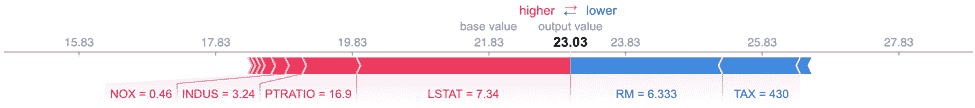

## XGBoost 石灰

现成的 LIME 无法处理 XGBoost 使用 xgb 的要求。DMatrix()，所以下面的代码抛出一个错误，我们将只对 XGBoost 库使用 SHAP。潜在的攻击，包括创建自己的预测函数，可以让 LIME 在这个模型上工作，但关键是 LIME 不会自动与 XGBoost 库一起工作。

```py
expXGB = explainer.explain_instance(X_test.values[j], xgb_model.predict, num_features=5)
expXGB.show_in_notebook(show_table=True)
```

## sci kit-学习 GBT SHAP

```py
shap.force_plot(explainerSKGBT.expected_value, shap_values_SKGBT_test[j], X_test.iloc[[j]])
```

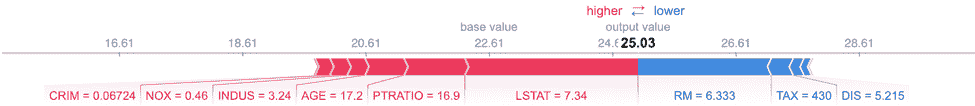

## sci kit-学习 GBT 石灰

LIME 致力于 GBTs 的 Scikit-learn 实现。LIME 的输出比 SHAP 的输出提供了更多的细节，因为它指定了导致该特征产生影响的一系列特征值。例如，我们知道 PTRATIO 对这个预测的房价有积极的影响，因为它的价值低于 17.4。SHAP 没有提供这方面的信息。然而，石灰的功能重要性不同于 SHAP 的。由于 SHAP 有更坚实的理论基础，如果莱姆和 SHAP 不同意，大多数人倾向于相信 SHAP，特别是与树和线性 SHAP 解释者。

```py
expSKGBT = explainer.explain_instance(X_test.values[j], sk_xgb.predict, num_features=5)

expSKGBT.show_in_notebook(show_table=True)
```

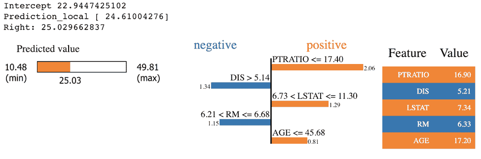

## 随机森林 SHAP

```py
shap.force_plot(explainerRF.expected_value, shap_values_RF_test[j], X_test.iloc[[j]])
```

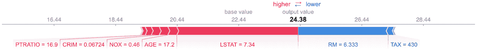

## 随机森林石灰

```py
exp = explainer.explain_instance(X_test.values[j], rf.predict, num_features=5)

exp.show_in_notebook(show_table=True)
```

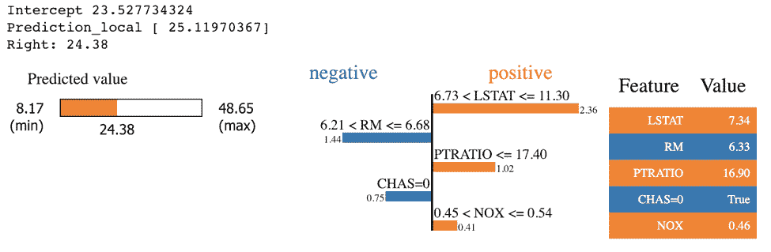

## KNN·SHAP

```py
shap.force_plot(explainerKNN.expected_value, shap_values_KNN_test[j], X_test.iloc[[j]])
```

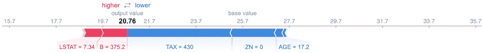

## KNN 石灰

```py
exp = explainer.explain_instance(X_test.values[j], knn.predict, num_features=5)

exp.show_in_notebook(show_table=True)
```

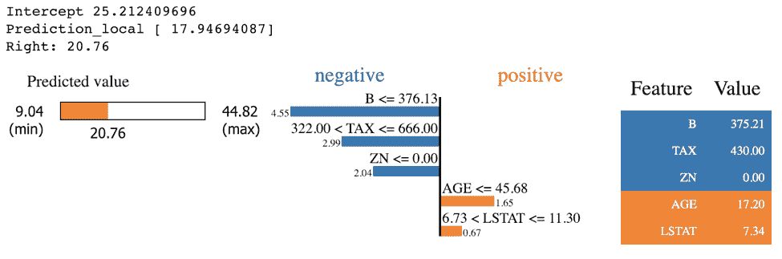

## SHAP 宏观上的可解释性

SHAP 和莱姆背后的整个想法是提供模型的可解释性。我发现把模型的可解释性分成两类是很有用的——局部的和全局的。模型的局部可解释性包括为为什么*做出个体预测*提供详细的解释。这有助于决策者信任该模型，并知道如何将其建议与其他决策因素相结合。模型的全局可解释性需要寻求理解模型的*整体结构*。这比解释一个单一的预测要大得多(也困难得多),因为它涉及到对模型如何工作的陈述，而不仅仅是对一个预测。对于需要在高层次上理解模型的执行发起人、希望从总体上验证模型决策的审计员以及希望验证模型与他们对所研究系统的理论理解相匹配的科学家来说，全局可解释性通常更为重要。

上一节中的图表是局部可解释性的例子。虽然 LIME 没有提供任何全球可解释性的图表，但 SHAP 提供了。让我们来探究其中的一些图表。对于这些图形示例，我选择使用第一个模型，即来自 XGBoost 库的模型。

可变重要性图是从全局意义上理解模型的有用工具。SHAP 为评估可变重要性提供了一个理论上合理的方法。这一点很重要，因为关于计算变量重要性的传统方法哪一种是正确的存在争议，而且这些方法并不总是一致。

```py
shap.summary_plot(shap_values_XGB_train, X_train, plot_type="bar")
```

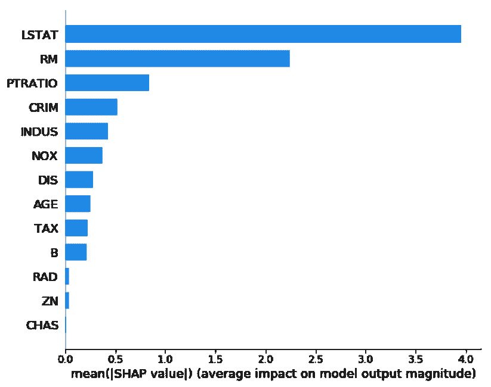

与可变重要性图类似，SHAP 也提供了一个摘要图，显示训练数据集中每个实例的 SHAP 值。这可以更好地理解整体模式，并允许发现预测异常值的口袋。

```py
shap.summary_plot(shap_values_XGB_train, X_train)
```

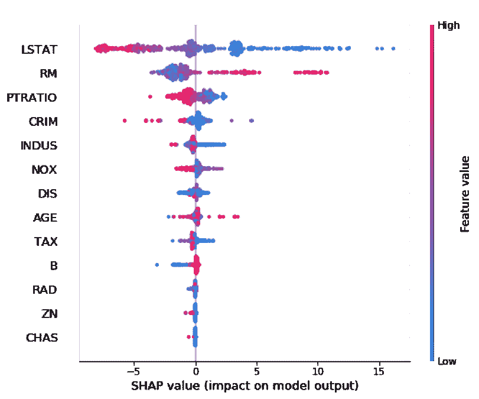

变量影响或依赖图长期以来一直是统计学家对模型可解释性的喜爱。SHAP 也提供这些，我觉得它们很有用。

```py
shp_plt = shap.dependence_plot("LSTAT", shap_values_XGB_train, X_train)
```

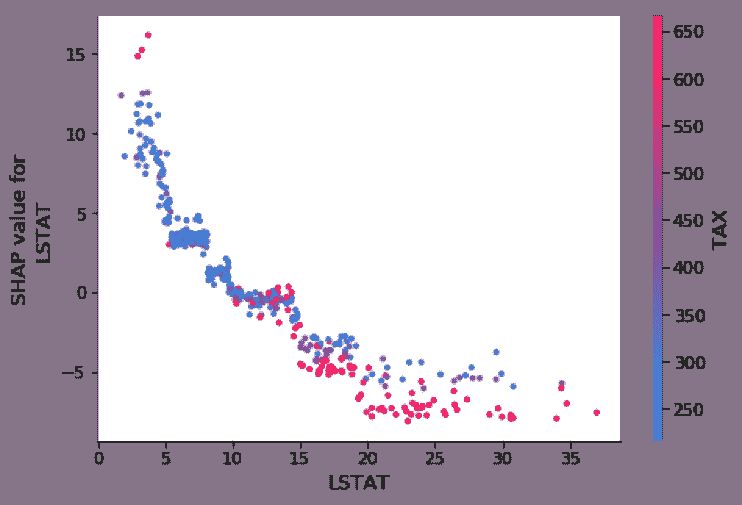

我非常喜欢这些，我决定使用 matplotlib 和 seaborn 对它们进行一些定制，以实现两项改进。首先，我用黑点突出显示了第 j 个实例，这样我们可以将全局和局部可解释性的优点结合到一个图中。第二，我允许根据变量灵活选择颜色。

```py
# inputs = column of interest as string, column for coloring as string, df of our data, SHAP df,

# x position of the black dot, y position of the black dot

def dep_plt(col, color_by, base_actual_df, base_shap_df, overlay_x, overlay_y):
    cmap=sns.diverging_palette(260, 10, sep=1, as_cmap=True) #seaborn palette

    f, ax = plt.subplots()

    points = ax.scatter(base_actual_df[col], base_shap_df[col], c=base_actual_df[color_by], s=20, cmap=cmap)

    f.colorbar(points).set_label(color_by)

    ax.scatter(overlay_x, overlay_y, color='black', s=50)

    plt.xlabel(col)

    plt.ylabel("SHAP value for " + col)

    plt.show()

# get list of model inputs in order of SHAP importance

imp_cols = df_shap_XGB_train.abs().mean().sort_values(ascending=False).index.tolist()

# loop through this list to show top 3 dependency plots

for i in range(0, len(imp_cols)):

    #plot the top var and color by the 2nd var

    if i == 0 : 

        dep_plt(imp_cols[i], imp_cols[i+1], 

        X_train, 

        df_shap_XGB_train,

        X_test.iloc[j,:][imp_cols[i]], 

        df_shap_XGB_test.iloc[j,:][imp_cols[i]])

        #plot the 2nd and 3rd vars and color by the top var

        if (i &gt;; 0) and (i &lt;; 3) : 

            dep_plt(imp_cols[i], 

            imp_cols[0],  X_train, 

            df_shap_XGB_train,

            X_test.iloc[j,:][imp_cols[i]],

            df_shap_XGB_test.iloc[j,:][imp_cols[i]])
```

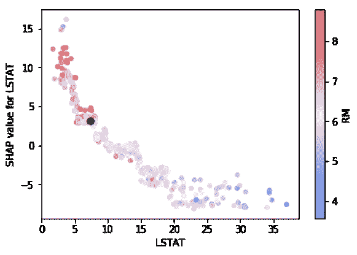
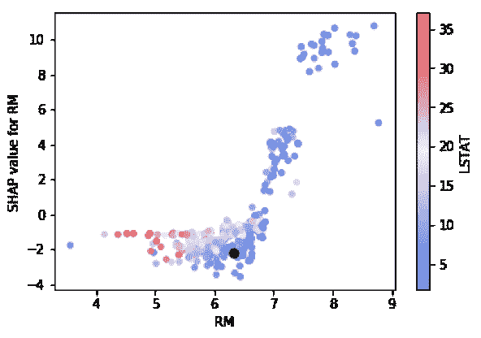


如今，模型可解释性仍然是许多数据科学家和数据科学领导者的头等大事。SHAP 和莱姆是在本地和全球层面上帮助提供这些解释的坚实图书馆。随着时间的推移，解释黑盒模型的需求只会增加。我相信在不太遥远的将来，我们会发现模型可解释性与模型敏感性/压力测试相结合将成为数据科学工作的标准部分，并且它将在大多数数据科学生命周期中拥有自己的一步。