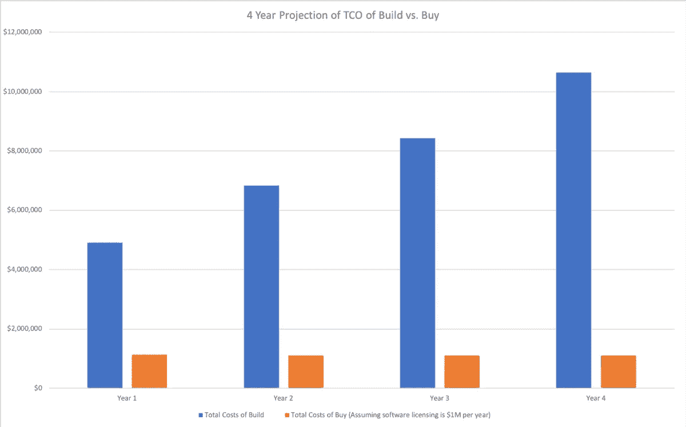

# 是否应该建立自己的数据科学平台？

> 原文：<https://www.dominodatalab.com/blog/should-you-build-your-own-data-science-platform>

随着组织日益努力[成为模型驱动的](/resources/key-factors-journey-become-model-driven/)，他们认识到数据科学平台的必要性。根据最近的调查报告“成为模型驱动的旅程中的[关键因素](/resources/key-factors-journey-become-model-driven/)”，86%的模型驱动公司通过使用数据科学平台来区分自己。然而，是建造还是购买的问题仍然存在。

对于大多数组织来说，从业务战略和项目成本效益的角度来看，购买数据科学平台都是正确的选择。然而，许多组织混淆了模型对他们长期成功的重要性和他们自己构建底层平台的需要。在一些特定的情况下，平台本身就是差异化因素。这些组织拥有高度专业化的工作流程(例如，[优步](https://eng.uber.com/michelangelo/))，内部软件开发的出色记录(例如， [Airbnb](https://airbnb.io/projects/knowledge-repo/) )，以及能够识别模型独特特征的深厚数据科学专业知识(例如，[谷歌](https://ai.google/research/pubs/pub43146))。对于绝大多数组织来说，竞争优势不是平台，而是整个组织的能力——我们称之为[模型管理](/resources/model-management/)——包括许多不同的技术、利益相关者和业务流程。购买该平台是大多数人的合理选择。

您可能会想，“当然，数据科学平台供应商 Domino 认为每个人都应该购买一个数据科学平台。”我们在 Domino 确实对这个主题有自己的看法，但是这种看法来自于与世界各地各种形状和大小的组织的数千次互动，这些组织在成为模型驱动的过程中面临着共同的斗争和障碍。大多数选择自己建造核电站的公司要么停滞不前，要么失败了。那些购买了平台的人正在大规模实施数据科学。这些互动和与试图决定他们是否应该建造或购买的组织一起工作的经验使我们开发了一个严格和客观的框架来促进决策过程。在这个[框架](/resources/understanding-costs-data-science-platform/)中，我们考察三个主要因素:

1.  **总拥有成本**需要仔细考察构建、管理和运营数据科学平台的范围。许多组织低估了构建方法的总拥有成本。在一个为期四年的场景中，一个组织首先构建一个支持 30 名数据科学家的数据科学平台(并在随后的几年中以 20%的年增长率增长)，我们估计构建的 TCO 超过 3000 万美元，而购买的 TCO 只是其中的一小部分。请参见下面的图 1，了解两种方法的 TCO 的年度对比。
    
    图一。构建与购买的四年 TCO 预测

2.  **机会成本**通过投入资源构建数据科学平台，组织不可避免地会选择放弃其他项目。这种选择可能是不明智的，尤其是如果组织牺牲其核心竞争力，最终将损害组织的收入。
3.  **风险因素**数据科学不是一项容易的工作，尽可能降低风险是明智的。在决定构建之前，需要仔细考虑风险因素，如人才获取和保留、技能需求变化以及平台功能需求变化。另一方面，一个组织在选择向哪个供应商购买时也应该非常小心。

如果您想深入了解这个框架的更多细节，可以阅读 Domino 白皮书:“[您应该构建自己的数据科学平台吗？](/resources/understanding-costs-data-science-platform/)”。最终，组织需要决定他们与数据科学的区别在哪里:在他们建立的模型和整体组织能力中，还是在底层基础设施中？对大多数人来说，是前者，所以“购买”方法可能提供最低的 TCO 和最一致的战略选择。

