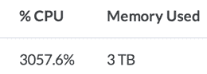

# Python、R、Matlab 和 Octave 中的简单并行循环

> 原文：<https://www.dominodatalab.com/blog/simple-parallelization>

Domino 平台使得[在非常强大的硬件(多达 32 个内核和 250GB 内存)上运行云](/solutions/cloud-data-science)中的分析变得轻而易举，允许通过并行性大幅提高性能。在本帖中，我们将向您展示如何使用多种语言并行化您的代码，以利用多个内核。这听起来可能有点吓人，但是 Python、R 和 Matlab 的特性使它变得非常简单。

请继续阅读，了解如何从一台机器上获得超过 3000%的 CPU 输出。


*Perf stats from some parallelized Python code running on a single, 32-core machine*

## 我的代码是可并行的吗？

出于本文的目的，我们假设一个常见的分析场景:您需要对许多项目执行一些计算，并且一个项目的计算不依赖于任何其他项目。更准确地说:

1.  你的分析处理一系列*事物*，例如，产品、商店、文件、人、物种。让我们称之为`inputs`。
2.  你可以构建你的代码，这样你就有一个函数，它接受一个这样的*东西*，并返回一个你关心的结果。我们称这个函数为`processInput`。(在这一步之后，您可以按照自己的意愿组合您的结果，例如，汇总它们，将它们保存到一个文件中——这对我们的目的来说并不重要。)

通常情况下，您会循环处理您的项目，处理每个项目:

```py
for i in inputs
results[i] = processInput(i)
end
// now do something with results
```

我们将向您展示如何并行处理所有项目，将工作分散到多个内核，而不是在普通的 a 循环中处理项目。

为了使下面的例子更具体，我们使用了一个数字列表和一个平方数字的函数。当然，您会使用您特定的数据和逻辑。

**我们开始吧！**

## 计算机编程语言

Python 有一个很棒的包，[joblib]让并行变得非常容易。

```py
from joblib import Parallel, delayed

import multiprocessing

# what are your inputs, and what operation do you want to

# perform on each input. For example...

inputs = range(10)

def processInput(i):

    return i * i

num_cores = multiprocessing.cpu_count()

results = Parallel(n_jobs=num_cores)(delayed(processInput)(i) for i in inputs
```

`results`现在是`[1, 4, 9 ... ]`

## 稀有

从 2.14 开始，R 包含了[并行](https://stat.ethz.ch/R-manual/R-devel/library/parallel/doc/parallel.pdf)库，这使得这类任务变得非常容易。

```py
library(parallel)

# what are your inputs, and what operation do you want to 

# perform on each input. For example...

inputs <- 1:10

processInput <- function(i) {

    i * i

}

numCores <- detectCores()

results = mclapply(inputs, processInput, mc.cores = numCores)

# the above won't work on Windows, but this will:

cl <- makeCluster(numCores)

results = parLapply(cl, inputs, processInput)

stopCluster(cl)
```

你可以在这个 [StackOverflow 帖子](http://stackoverflow.com/questions/17196261/understanding-the-differences-between-mclapply-and-parlapply-in-r)上找到更多关于`mclapply`和`parLapply`的区别的信息

作为替代，您也可以使用 [foreach 包](http://cran.r-project.org/web/packages/foreach/vignettes/foreach.pdf)，它允许您使用熟悉的`for`循环语法，自动并行化您的代码:

```py
library(foreach)

library(doParallel)

library(parallel)

numCores <- detectCores()

cl <- makeCluster(numCores)

registerDoParallel(cl)

inputs <- 1:10

processInput <- function(i) {

  i * i

}

results <- foreach(i=inputs) %dopar% {

  processInput(i)

}
```

## 矩阵实验室

Matlab 的并行计算工具箱使得通过使用 [parfor 构造](http://www.mathworks.com/help/distcomp/parfor.html)来使用并行 for 循环变得很简单。例如:

```py
inputs = 1:10;

results = [];

% assumes that processInput is defined in a separate function file

parfor i = inputs

	results(i) = processInput(i);

end
```

请注意，如果您的输入不是整数(例如，它们是文件名或项目标识符)，您可以使用 parcellfun 函数，它对单元格输入而不是数组输入进行操作。

## 八度音阶

不幸的是，Octave 没有一个好的`parfor`等价物——但是它有自己的[并行包](http://octave.sourceforge.net/parallel/overview.html)。你可以这样使用它:

```py
if exist('OCTAVE_VERSION') ~= 0

	% you'll need to run this once, to install the package:

	% pkg install -forge parallel

	pkg load parallel

end
inputs = 1:10;
numCores = nproc();

% assumes that processInput is defined in a separate function file
[result] = pararrayfun(numCores,@processInput, inputs);
```

请注意，如果您的输入不是数字(如文件名或产品标识符)，您可以使用 [`parcellfun`](http://octave.sourceforge.net/parallel/function/parcellfun.html) 功能。

## 结论

现代统计语言使得跨内核并行化代码变得非常容易，而 [Domino](/product/domino-enterprise-mlops-platform) 使得访问拥有许多内核的强大机器变得轻而易举。通过使用这些技术，我们已经看到用户在使用单台机器的情况下将代码速度提高了 32 倍以上。

如果您想尝试将这种方法应用到您的分析中，请告诉我们，我们很乐意帮助您！