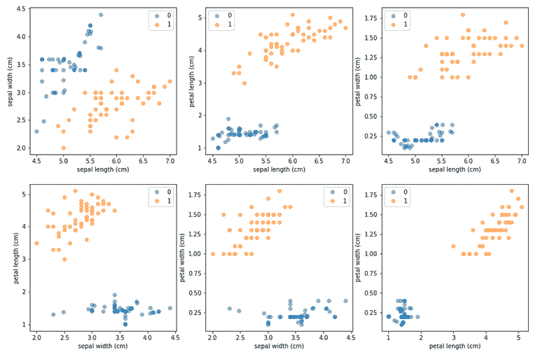

# ML 内部:合成少数过采样(SMOTE)技术

> 原文：<https://www.dominodatalab.com/blog/smote-oversampling-technique>

在本文中，我们讨论了为什么在不平衡的数据集上拟合模型是有问题的，以及通常如何解决类别不平衡。我们展示了 SMOTE 算法的内部工作原理，并展示了一个简单的“从头开始”的 SMOTE 实现。我们使用人工构建的不平衡数据集(基于 Iris)通过我们的 SMOTE 实现生成合成观察值，并讨论帮助 SMOTE 处理分类属性的修改。数据集和代码可在[这里](https://try.dominodatalab.com/u/nmanchev/mlinternals-smote/overview)获得。

机器学习算法通常需要处理高度不平衡的数据集。当我们说一个分类数据集不平衡时，我们通常指的是数据集中包含的不同类不是均匀表示的。例如，欺诈检测数据集通常具有 100:1 的比率，因为与合法支付的数量相比，欺诈交易的数量相对较少。在其他领域观察到甚至更高的偏斜度。例如，高能物理分类问题可以具有 100，000:1 的背景信号比(Clearwater 和 Stern，1991)。在蛋白质分类中遇到同样的挑战，其中一类中的蛋白质数量通常比该类之外的蛋白质数量少得多(赵等，2008)。此外，不平衡的数据加剧了此类生物数据中常见的[维数灾难](https://www.dominodatalab.com/blog/the-curse-of-dimensionality)带来的问题。

处理高度不平衡的数据可能在几个方面存在问题:

*   **扭曲的性能指标** —在高度不平衡的数据集中，比如一个类比为 98:2 的二进制数据集，一个总是预测多数类而完全忽略少数类的算法仍然会有 98%的正确率。这使得像分类准确度这样的度量变得毫无意义。这反过来使得分类器的性能评估变得困难，并且还会损害努力使准确度最大化的算法的学习。
*   **少数类中的训练数据不足** —在数据收集成本高昂的领域中，包含 10，000 个示例的数据集通常被认为是相当大的。但是，如果数据集不平衡，类比率为 100:1，这意味着它只包含 100 个少数类的示例。这个数量的示例可能不足以使分类算法建立良好的决策边界，并且可能导致较差的概括


**Figure 1:** Balanced vs. imbalanced datasets — Left-hand side: a balanced binary dataset, which contains an approximately equal number of observations of its two classes (male and female); right-hand side: an imbalanced dataset where the ratio of legitimate to fraudulent transactions is 100:1.

从历史上看，类不平衡是通过欠采样解决的，其本质归结为丢弃来自多数类的观察值。这可以通过从多数类中随机抽取与少数类中的观察值数量相同的多个观察值来天真地执行。将两者合并会产生一个完全平衡的数据集(50:50)。这种方法的问题是，在高度不平衡的集合中，它很容易导致大部分数据必须被丢弃的情况，并且已经坚定地确立，当涉及到机器学习时，数据不应该被轻易丢弃(Banko 和 Brill，2001；Halevy 等人，2009 年)。其他技术包括简单的重新采样，其中少数类被连续地重新采样，直到获得的观察值的数量与多数类的大小相匹配，以及集中欠采样，其中来自多数类的丢弃的观察值被仔细地选择以远离决策边界(Japkowicz，2000)。研究还表明，考虑中的一些技术可以结合使用，例如，凌和李(1998)同时证明了多数欠采样和少数过采样。然而，似乎尽管对多数类的欠采样比少数类的重采样产生了更好的结果，但是结合这两种技术并没有导致显著的改进。

## 人工示例的生成

必须注意，过采样中使用的传统技术通常依赖于简单的替换采样。在其 2002 年的论文中，Chawla 等人提出了一种不同的策略，其中通过生成合成样本来对少数类进行过采样。他们证明了这种合成少数过采样技术(SMOTE)和多数欠采样的组合产生了显著更好的分类器性能。

以下是 SMOTE 算法的简化版本:

```py
import random

import pandas as pd

import numpy as np

from sklearn.neighbors
import NearestNeighbors

from random import randrange

def get_neigbours(M, k):

nn = NearestNeighbors(n_neighbors=k+1, metric="euclidean").fit(M)

dist, indices = nn.kneighbors(M, return_distance=True)

return dist, indices

def SMOTE(M, N, k=5):

t = M.shape[0] # number of minority class samples
numattrs = M.shape[1]

N = int(N/100)

_, indices = get_neigbours(M, k)

synthetic = np.empty((N * t, numattrs))

synth_idx = 0

for i in range(t):

for j in range(N):

neighbour = randrange(1, k+1)

diff = M[indices[i, neighbour]] - M[i]

gap = random.uniform(0, 1)

synthetic[synth_idx] = M[i] + gap*diff

synth_idx += 1

return synthetic
```

该算法接受三个必需的参数-少数观察值列表(M，一个 Numpy 数组)、所需的过采样量(N)和要考虑的最近邻数(k)。请注意，N 的值被解释为百分比，因此 N = 100 的过采样将产生许多与 M 中的观测值相匹配的合成观测值，N = 200 将产生两倍于 M 中的观测值，依此类推。注意，原始算法没有规定用于选择最近邻居的特定例程。这里我们使用基于欧几里德的 kNN，但这不是一个硬性要求。


**Figure 2:** An imbalanced dataset based on Fisher’s Iris (Fisher, 1936) — six observations of class 0 have been sampled at random, and all observations of class 1 have been kept intact. The minority to majority ratio is 12:100

让我们检查 Iris 数据集的随机不平衡样本(图 2)，其中只考虑了两个目标类。少数类仅包含 6 个观察值，但我们可以使用 SMOTE 对其进行上采样，并获得完全平衡的数据集，其中类 0 和 1 包含相同数量的样本。图 3 显示了在这种情况下 SMOTE 如何生成合成观测值的直观解释。


**Figure 3**: Generation of synthetic observations for a single member of the minority class — Start with the minority class (3a) and select a member at random (3b). Identify its k-nearest neighbours (3c). Place a new observation between the member and each of its neighbours. The specific distance of each synthetic observation from the selected minority member is chosen at random (3d)

该算法迭代少数类中的每个观察值。一旦选择了少数观测值，SMOTE 就识别其 k 个最近的邻居，并随机选择一组邻居用于生成过程。请注意，所用邻居的数量取决于所需的过采样量。例如，如果 k = 3 且 N = 100，则只需要一个随机选择的邻居。如果 N = 200，将选择两个随机邻居。在⌊N/100⌋ > k 的情况下，SMOTE 将使用替换对邻居集进行采样，因此将多次使用同一个邻居。


**Figure 4**: Repeated generation of synthetic observations for the same minority member leads to different new observations, because of the adjustment via the random gap component.

在选择了邻居之后，该算法取少数成员和单个邻居的特征向量之间的差。然后，将每个差值乘以(0，1)中的随机数，并加回特征向量。这在每个成员的方向上构建了合成观测值，这些观测值位于离少数成员随机距离处。请注意，由于距离计算的随机性，使用相同少数成员-最近邻组合的重复迭代仍然会产生不同的合成观察结果(见图 4)。


**Figure 5**: Results of up-sampling via SMOTE for N = 100 (left) and N = 600 (right). The synthetic observations are coloured in magenta. Setting N to 100 produces a number of synthetic observations equal to the number of minority class samples (6). Setting N to 600 results in 6 × 6 = 36 new observations.

图 5 展示了对少数类运行 SMOTE 的结果，其中 k = 5，N 值设置为 100 和 600。检查该图可以发现，所有的合成观测值都位于连接两个少数样本的直线上。这是基于 SMOTE 的上采样的一个非常明显的特征。此外，上采样提供优势背后的直觉可以通过以下事实来解释:少数类中的更多观察导致更宽的决策边界。学习更宽的区域提高了分类器的泛化能力，因为少数类的区域没有被多数类的观察结果如此紧密地约束。Chawla 等人(2002 年)对基于 SMOTE 的上采样的影响进行了综合评估。他们证明了将少数向上采样与多数向下采样相结合会产生最好的结果。他们的测试是使用 C4.5 生成的决策树(Quinlan，1993)进行的，这些决策树适用于十个不同的不平衡数据集(例如，Pima Indian Diabetes (Smith 等人，1988)，E-state 数据(Hall 等人，1991)，Oil 数据集(Kubat 等人，1998)等)。C4.5、SMOTE 上采样和多数下采样组合的性能是针对另外两个分类器进行评估的。第一种是朴素贝叶斯分类器，其先验被调整以校正类别不平衡。第二个是 RIPPER2 拟合的基于规则的分类器，它也非常适合于类分布不平衡的数据集。



**Figure 6:** Up-sampling using SMOTE with k = 5 and N = 500\. The synthetic observations have been merged with the six original minority samples, and the new up-sampled dataset is plotted using pairwise scatter plots for each possible combination of the four original Iris attributes.

结果表明，SMOTE-C4.5 组合始终优于其他两种分类器——SMOTE-c 4.5 分类器仅在所进行的 48 个实验中的 4 个实验中表现最佳。Chawla 等人(2002 年)还解释了为什么简单的替换过采样与基于 SMOTE 的上采样相比性能更差——少数观察值的简单复制导致决策区域缩小，这与良好概括所需的情况相反。另一方面，合成上采样扩展了决策区域，这提高了分类器性能。

## SMOTE 和分类特征

SMOTE 的一个局限性是它不能处理只包含分类特征的数据集。有一种算法的修改，称为合成少数过采样技术-名义连续(SMOTE-NE)，它可以处理具有连续和分类特征混合的样本。除了 vanilla SMOTE 之外，SMOTE-NE 还执行以下操作:

1.  **中值计算** —该算法计算少数类中所有连续属性的标准偏差，然后计算标准偏差的中值；
2.  **最近邻识别**-使用欧几里德距离计算用于 k-最近邻选择的度量，并对任何不匹配的分类属性进行额外的校正。对于所选少数成员和潜在邻居之间不同的每个分类属性，预先计算的中值作为一个分量添加到欧几里德距离计算中；
3.  **合成样本校正** —通过 vanilla SMOTE 计算合成样本的连续特征。使用 k 个最近邻居的分类属性中最频繁的值来设置合成分类属性；

Chawla 等人(2002 年)提供了一个说明这种修改的例子。

**例 1** :设少数集合包含以下观察值:

$ $
O1 = \{1,2,3,a,b,c\}^t \ \
O2 = \{4,6,5,a,d,e\}^t \ \
O3 = \{3,5,6,a,b,k\}^t $ $

设连续属性的标准差中值为\(Med = SD(1，4，3)，SD(2，6，5)，SD(3，5，6)\)，本次迭代选择的少数成员为\(O1\)。\(O1\)和\(O2\)之间的欧几里德距离则为:

$ $ \ begin { equation * }
d(O1，O2)= \sqrt{(4-1)^2+(6-2)^2+(5-3)^2+med^2+med^2}
\ end { equation * } $

对\(O1\)和\(O2\)之间不同的两个分类属性应用两次中值校正，即:\(B \右箭头 d \)、\(C \右箭头 E\)。\(O1\)和\(O3\)之间的距离同样计算如下:

$ $ \ begin { equation * }
d(O1，O3)= \sqrt{(3-1)^2+(5-2)^2+(6-3)^2+med^2}
\ end { equation * } $


对\(C \右箭头 K\)变化进行一次修正。

提醒一句。Chawla 等人(2002 年)没有对这种修正进行严格的数学处理，建议的中值修正似乎完全是由经验驱动的。这带来了这种修改比像多数欠采样这样的简单方法表现更差的风险。事实上，在最初的论文中，Chawla 等人注意到，当在成人数据集上进行测试时，这种变体“比基于 AUC 的普通欠采样表现更差”(Dua & Graff，2017)。

SMOTE 的另一个修改，称为 SMOTE-N(用于名义特征)，试图绕过 SMOTE-NE 的限制，即数据集不能只由分类特征组成。SMOTE-N 变体使用值距离度量(VDM)的修改版本，这是 Cost 和 Salzberg (1993)为在符号域中操作的最近邻算法建议的(即，特征不再是数字的，但是仍然需要观察值之间的实值距离)。对于所有要素都是分类的数据集，VDM 将两个对应的特征值\(v1\)和\(v2\)之间的距离计算为

$$\delta (v1，v2)= \sum_{c=1}^c | p(c | v1 _ f)-p(c | v2 _ f)|^k，k\in\{1，2\}$$

其中\(c\)是数据集中的类的数量，\(p(c|v1_f)\)是类\(C)的条件概率，假设特征\(f\)的值为\(v1\ ),而\(p(c|v2_f)\)是类\(C)的条件概率，假设特征\(f\)的值为\(v2\ ),并且\(k\)是设置为 1 的常数(k=1 产生曼哈顿距离，k=2 产生欧几里德距离)。

两次观测\(O1\)和\(O2\)之间的距离进一步定义为

$$\Delta (O1，O2) = \sum_{f=1}^{F} \delta (O1_f，O2_f)^r，r\in\{1，2\} \text{ (1)}$$

**例 2** :假设\(\mathcal{D}\)是一个二元分类数据集，由以下三个
观测值及其对应的类组成

$$O1 = \{A,B,C,D,E,\}^T，0\\
O2 = \{A,F,C,G,N,\}^T，0\\
O3 = \{H,B,C,D,N,\}^T，1 $ $


\(O1\)和\(O2\)之间的距离可以计算为

$ $ \ begin { equation * }
\ begin { aligned }
\ delta(O1，O2)&= \sum_{f=0}^{f} \ delta(O1 _ f，O2_f)^1 = \delta (A，A) + \delta (B，F) + \delta (C，C) + \delta (D，G) + \delta (E，n)\ \
&= \sum_{c=0}^1 | p(c | a _ 0)-p(c|a_0)|^1+\sum_{c=0}^1 | p(c | b _ 1)-p(c|f_1)|^1+\sum_{c=0}^1 | p(c | c

可以使用以下事实来计算(1)中的条件概率

$ $ p(c | v _ f)= | v _ f | _ c \ div | v _ f | _ \ mathcal { D } $ $

其中\(|v_f|_c\)是类\(c\)的特征值\(v_f\)出现的次数，而\(|v_f|_\mathcal{D}\)是数据集中\(v_f\)出现的总次数。然后，我们可以如下获得成对特征距离

$ $ \ begin { equation * }
\ begin { aligned }
\ delta(a，a)= \sum_{c=0}^1 | p(c | a _ 0)-p(c | a _ 0)|^1&= | | a | _ 0 \ div | a | _ \ math cal { d }-| a | _ 0 \ div | a | _ \ math cal { d } |+| | a | _ 1 \ div | a | _ \ math cal { d }-| a | _ 1 \ math cal { d }-| a | _ 1 \ div | a | _ \ a f)= \sum_{c=0}^1 | p(c | b _ 1)-p(c | f _ 1)|^1&= | | b | _ 0 \ div | b | _ \ mathcal { d }-| f | _ 0 \ div | f | _ \ mathcal { d } |+| | b | _ 1 \ div | b | _ 1 | b | _ \ mathcal { d }-| f | _ 1 \ div | f | _ \ mathcal { d } | \ \【T6 = | 1 \ div 2-1 \ div 1 |+| 1 \ div 1

同样，我们得到

$ $ \ begin { equation * }
\ begin { aligned }
\ delta(C，C)&= | 2 \ div 3-2 \ div 3 |+| 1 \ div 3-1 \ div 3 | = 0 \ \
\ delta(D，G)&= | 1 \ div 2-1 \ div 1 |+| 1 \ div 2-0 \ div 1 | = 1 \ \
\ delta(E，N) & = | 1 \div 1 - 1

最后

$ $ \ begin {equation*}
\ begin { aligned }
\ delta(O1，O2)&= \sum_{f=0}^{f} \ delta(O1 _ f，O2_f)^1 = \delta (A，A) + \delta (B，F) + \delta (C，C) + \delta (D，G) + \delta (E，n)\ \
&= 0+1+0+1 = 3
\ end { aligned }
\ end { equation * } $【结束{ equation * }

类似地\(\Delta (O1，O3) = 5\)和\(\Delta (O2，O3) = 6\)。注意，因为\(\delta\)是对称的，所以\(\Delta (O1，O2) = \Delta (O2，O1)\)、\(\Delta (O2，O3) = \Delta (O3，O2)\)等也是对称的。

在通过 VDM 选择相关的\(k\)最近邻居之后，SMOTE-N 通过简单地基于邻居采取多数投票来获得合成特征向量的值，从而创建新的观察值。请记住，原始论文没有提供 SMOTE-N 的任何性能比较，因此不建议在没有研究替代方法和评估其性能的情况下将其用作“首选”技术。此外，SMOTE-N 的原始描述没有讨论投票过程中的平局打破，但是，一个简单的启发式方法是随机选取一个平局选项。

## 摘要

在这篇博文中，我们讨论了为什么处理不平衡数据集通常会有问题，并介绍了 SMOTE 的内部原理——一种用于上采样少数类的常用技术。我们还讨论了 SMOTE 的两个修改，即 SMOTE-NE 和 SMOTE-N，它们针对具有分类特征的数据集。

这篇博文中使用的数据集和代码可以在**[https://try.dominodatalab.com](https://try.dominodatalab.com/u/nmanchev/mlinternals-smote/overview)**获得，这里显示的所有结果都是完全可再现的，这要感谢 Domino reproducibility engine，它是 Domino Enterprise MLOps 平台的一部分。如果你想自己尝试这个项目，你可以通过点击上面的链接注册一个免费账户。

## 参考

*   Banko，m .，& Brill，E. (2001 年)扩展到非常非常大的自然语言消歧语料库。计算语言学协会第 39 届年会会议录，26–33。https://doi.org/10.3115/1073012.1073017
*   舒拉、鲍耶、K. W .、霍尔、L. O .、凯格尔迈耶、W. P. (2002 年)。Smote:合成少数过采样技术。j .阿提夫。里面的第 16(1)号决议，第 321 至 357 段。
*   s .克利尔沃特和 e .斯特恩(1991 年)。高能物理事件分类中的规则学习程序。计算机物理通讯，67(2)，159–182 页。https://doi . org/10.1016/0010-4655(91)90014-C
*   科恩和辛格(1999 年)。一个简单、快速、有效的规则学习者，335–342。成本，s .，&萨尔茨伯格，S. (1993)。一种带符号
    特征的加权最近邻学习算法。机器学习，57–78。
*   Dua，d .，& Graff，C. (2017)。UCI 机器学习知识库。http://archive.ics.uci.edu/ml·费希尔(1936 年)。分类问题中多重测量的使用。优生学年鉴，
    7(2)，179–188。https://doi.org/10.1111/j.1469-1809.1936.tb02137.
*   Halevy，A. Y .，Norvig，p .，& Pereira，F. (2009 年)。数据的不合理有效性。IEEE 智能系统，24(2)，8–12。http://dblp . uni-trier . de/db/journals/expert/expert 24 . html # halevynp 09
*   霍尔、莫尼和基尔(1991 年)。电拓扑状态:分子图在原子水平上的结构信息。化学博士。Inf。计算机。Sci。, 31, 76–82.
*   Japkowicz，N. (2000 年)。阶层失衡问题:意义与策略。2000 年国际人工智能会议(ICAI)论文集，111–117。
*   Kubat，r . c . Holte 和 s . Matwin(1998 年)。卫星雷达图像中探测石油泄漏的机器学习。马赫。学习。, 30(2–3), 195–215.https://doi.org/10.1023/A:1007452223027
*   凌春霞、李、陈(1998)。直接营销的数据挖掘:问题与解决方案。第四届知识发现和数据挖掘国际会议论文集
    , 73–79。
*   昆兰，J. R. (1993 年)。C4.5:机器学习程序。摩根·考夫曼出版公司。
*   史密斯、J. W .、埃弗哈特、J. E .、迪克森、W. C .、诺勒、W. C .、&约翰内斯、R. S. (1988)。使用 adap 学习算法预测糖尿病的发病。医疗保健中的计算机应用年度研讨会会议录，261–265。
*   赵晓明，李晓霞，陈，李，，王(2008)。不平衡数据下的蛋白质分类。蛋白质，70(4)，1125–1132。https://doi.org/10.1002/prot.21870