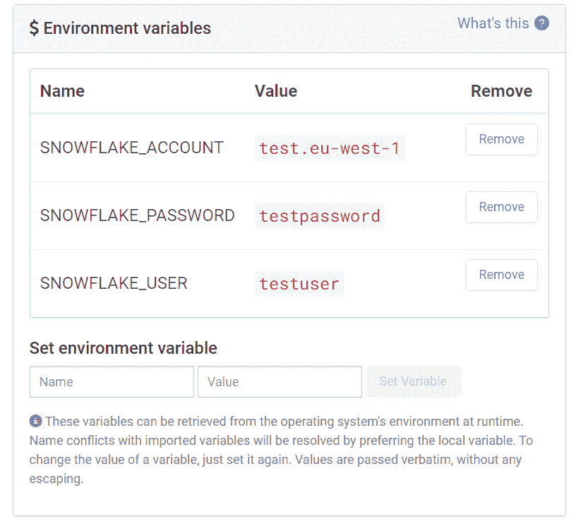
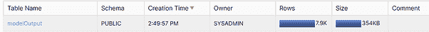
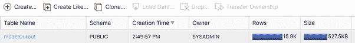
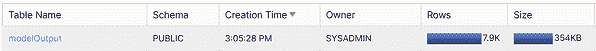
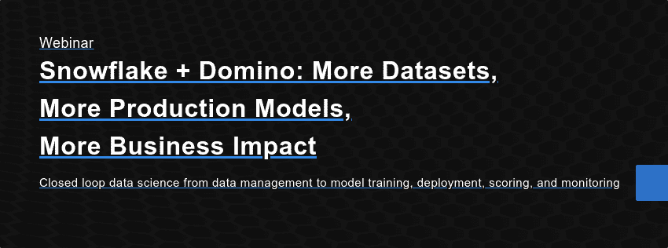

# 使用 Domino Data Lab 简化数据访问并在雪花中发布模型结果

> 原文：<https://www.dominodatalab.com/blog/snowflake-and-domino-better-together>

## 介绍

为数据科学团队提供建立双向信息流所需的访问和能力是许多组织在从建模工作中释放价值时面临的一个关键挑战。

这一挑战的一部分是许多组织寻求使其数据科学工作流与数据仓库模式和实践相一致。这意味着牺牲数据的粒度和延迟，以获得更易于编写查询的结构，这些查询可以聚合、过滤和分组结果以用于报告目的。

当数据尽可能接近真实事件中发生的事情时，如金融交易、医疗咨询或营销活动结果，数据科学在高数据粒度下工作得最好。

也就是说，确保数据科学家不仅能够读取数据仓库结构，而且能够写入数据仓库结构，有很多好处。构建使数据科学家成为信息消费者和生产者的渠道，使得建模工作更有可能以一种终端用户可以改变业务运营的方式到达终端用户，即从数据科学工作中创造价值。

## Domino 数据实验室和雪花:一起更好

Domino 与 Snowflake 集成，通过提供一种现代的数据方法来解决这一挑战。这些现代模式使数据科学家能够从数据仓库中提取信息，关键是将模型得分和派生数据写回到数据仓库中，以便最终用户能够通过他们的报告和业务查询工具进行访问。

使用 Domino dataset 功能，将数据从雪花带到一个环境中，使断开的数据集(如 CSV 或从 API 连接汇集的实时信息)可用。

Domino 提供了一个强大的调度功能，可以协调一个完整的工作流，从雪花和其他来源获取数据，运行模型代码，并将结果(如预测分数)写回到雪花中供最终用户使用——将所有结果保存在一个地方，并与现有的数据存储存储在一起。

## 设置 Domino 环境来使用雪花。

Domino 本身是基于 Kubernetes 架构的，这使得基于容器的映像可以很容易地部署到可伸缩的可配置计算资源上。数据科学家可以访问 docker 指令，这些指令允许他们指定自己选择的工具和库。

要在 Domino 中配置访问环境，我们只需通过 docker 文件指令向该环境添加一个连接器。

1.  *登录 Domino，在 Domino 的“实验室”中找到自己*
2.  *选择侧边栏上的“环境”*
3.  *选择要编辑的现有环境或创建新环境*
4.  *在 Dockerfile 指令中，添加您选择的雪花连接器，例如 Python、R 或其他如 SQL Alchemy*
    1.  *Python 与熊猫:运行 pip 安装雪花-连接器-python【熊猫】*
    2.  *SQLAlchemy:运行 pip 安装雪花-sqlalchemy*

## 按用户/帐户详细信息进行身份验证

用户将他们的凭证存储为项目级别的环境变量，以使每个项目能够通过 Snowflake 进行身份验证。这些变量很容易改变，并允许每个项目有自己的独立连接到雪花，甚至多个雪花帐户。

虽然用户也可以将变量硬编码到他们自己的编码文件中，但使用环境变量是一种更安全、更灵活的选择。

要将环境变量添加到项目中，请执行以下操作:

1.  *从 Domino workbench 中选择一个“项目”,然后在侧边栏上选择“项目设置”*
2.  *在“环境变量”下选择“添加新的环境变量”*
3.  *在本例中，我们将设置雪花账户、雪花密码和雪花用户*
    1.  *SNOWFLAKE_ACCOUNT:您的雪花计算 URL**的子域，即*[*https://test . eu-west-1 . snowflakecomputing . com/console #/data/databases*](https://test.eu-west-1.snowflakecomputing.com/console#/data/databases)*成为账户*
    2.  *雪花 _ 用户:您的雪花用户凭证*
    3.  *雪花 _ 密码:你的雪花密码*



## 从雪花中检索信息以便在 Domino 中使用

Domino 为数据科学家提供了在提供 ide(如 Jupyter、R Studio 或 VS Code)的工作环境中运行代码的能力，或者相反，创建一个运行特定代码段的作业。

在这个例子中，我们使用 Jupyter 和 python 连接器从 Domino 环境中的 Snowflake 检索信息，对数据集执行一些简单的分析。

*使用在项目阶段设置的连接器库和雪花环境变量创建一个到雪花的连接*

```py
import snowflake.connector
import os

# Connect to Snowflake via Python Connector

ctx = snowflake.connector.connect(

    user=os.environ['SNOWFLAKE_USER'],

    password=os.environ['SNOWFLAKE_PASSWORD'],

    account=os.environ['SNOWFLAKE_ACCOUNT']
)

cs = ctx.cursor()
```

*现在我们已经创建了一个雪花连接，我们编写一个查询来访问“DOMINO_TESTING”数据库和“wine_red”表，将结果打印到我们的 Jupyter 实例*

```py
cs.execute("USE DATABASE DOMINO_TESTING")

results = cs.execute("SELECT TOP 10 * from wine_red")

for rec in results:
        print('%s, %s' % (rec[0], rec[1]))
cs.close
```

*为了使数据更加可行，我们现在要创建一个查询，将结果写入熊猫数据帧*

```py
#Write Snowflake Results into a Pandas Container

import pandas as pd

# Create a cursor object from previous connector and select database

cs = ctx.cursor()

cs.execute("USE DATABASE DOMINO_TESTING")

# Execute a statement that will generate a result set.

sql = "SELECT * from wine_red"

cs.execute(sql)

# Fetch the result set from the cursor and deliver it as the Pandas

DataFrame.df = cs.fetch_pandas_all()

df
```

现在，数据作为数据帧加载到 Domino 中，我们可以重复查询数据，而不会引起对雪花实例的回调，并按照我们认为合适的方式操作数据，比如添加列来对信息进行分组或分类。

为了将雪花查询结果作为一个永久对象存储在 Domino 项目中，我们在 Domino 项目中创建一个数据框对象到我们的数据目录后，将结果输出为一个 CSV 文件。

```py
#Write Snowflake Results into a CSV Output File.

df.to_csv('/mnt/data/wine_red_snowflake.csv', index=False)
```

## 将数据从 Domino 写入雪花

一旦开发出模型，就需要通过应用程序、应用编程接口或在这种情况下，将预测模型的模型得分写回到雪花中，以便业务分析师最终用户能够通过他们的报告工具访问预测。

在本例中，我们采用客户流失模型的结果，该模型对客户数据进行了一系列预测，以确定最有可能流失的客户。我们将展示将数据从 Domino 写入雪花的三种方式:

*   基于生成为 CSV 文件的模型输出在雪花中创建表格
*   基于模型输出文件覆盖雪花中的表
*   将新结果追加到现有雪花表中。

我们将使用 Python 中的 SQLAlchemy 来实现这一点，这是我们之前在环境中设置的。

*使用与雪花 Python 连接器相同的环境变量创建 SQLAlchemy 上下文，并指定我们希望写入数据的用户角色、数据库和模式。*

```py
import sqlalchemy as sql

import pandas as pd

import os

# Setup our SQLAlchemy Engine and connection to Snowflake

engine = sql.create_engine(

    'snowflake://{u}:{p}@{a}/{d}/{s}?role={r}'.format(

        u=os.environ['SNOWFLAKE_USER'],

        p=os.environ['SNOWFLAKE_PASSWORD'],

        a=os.environ['SNOWFLAKE_ACCOUNT'],

        r='SYSADMIN',

        d='DOMINO_TESTING',

        s='PUBLIC'

        ))
```

现在，我们将 CSV 文件加载到 Pandas 数据框中，然后将该表写入 Snowflake 中的 DOMINO_TESTING 数据库。请注意，如果已经存在一个具有我们提供的名称的表，这将失败。

```py
data = pd.read_csv('/mnt/data/modelOut.csv')

data.to_sql('modelOutput', engine, index = False)
```

*现在，我们可以在雪花门户中访问我们的 SQL 浏览器，看到已经生成了一个包含 7900 行的新表。*



如果我们再次尝试运行相同的查询，我们将会收到一个错误，指示该表已经存在。

```py
ValueError: Table 'modelOutput' already exists
```

对于 SQLAlchemy，我们必须指定我们希望追加结果(如在文件底部写入更多结果)还是覆盖结果(如在删除表并重新创建中)。将结果追加到表中，或者通过指定 **if_exists** 参数来替换表。

*为了将结果追加到现有的表中，例如用一组新的结果更新它，我们将‘append’指定为****if _ exists****函数的参数。*

```py
data = pd.read_csv('/mnt/data/modelOut.csv')

data.to_sql('modelOutput', engine, index = False, if_exists='append')
```



*为了删除并重新创建该表，我们将“替换”指定为* ***if_exists*** 的参数

```py
data = pd.read_csv('/mnt/data/modelOut.csv')

data.to_sql('modelOutput', engine, index = False, if_exists='replace')
```



## 在 Domino 内部自动将模型结果部署到雪花中

Domino 为用户提供了四种将数据科学模型部署到生产中的方法:

*   发布一个 API，其他应用程序可以调用该 API 来按需接收预测
*   发布一个 Web 应用程序，让用户通过 Dash 或 Shiny 等界面使用数据科学模型
*   发布一个启动器，让用户向底层代码运行提供参数，以接收特定的结果(即日期范围)
*   发布一个调度作业，该作业在 Domino 环境中重复运行底层代码。

通过调度作业，Domino 能够与雪花无缝链接，轻松地从雪花环境中提取数据，执行模型运行，并将模型的结果返回到雪花数据表中，供最终用户使用，使用上述函数和雪花 Python 连接器或雪花 SQLAlchemy 引擎。

## 结论

将雪花和 Domino 结合在一起，研究人员和数据科学家可以更容易地从雪花中访问高质量的信息和强大的查询功能，同时利用 Domino 的开放、可扩展框架。它们共同赋予数据科学家在他们选择使用的任何代码库中访问、转换和操作数据的能力。

数据科学家可以轻松地将模型结果发布到雪花中，以便在数据库中提供预测分数和分类，并自动运行这些模型，使组织能够从他们的数据中提取更多价值，并在数据科学和业务专家之间建立更紧密的协作，这些专家根据模型的结果做出决策。

[](https://cta-redirect.hubspot.com/cta/redirect/6816846/c4ff7b3c-27f7-47bd-9336-7abb002dcd60) 

#### 关于雪花

雪花提供了数据云，这是一个全球网络，成千上万的组织在其中以近乎无限的规模、并发性和性能移动数据。在数据云中，组织可以统一各自孤立的数据，轻松发现和安全共享受监管的数据，并执行各种分析工作负载。无论数据或用户生活在何处，雪花都能跨多个公共云提供单一无缝的体验。雪花的平台是为数据仓库、数据湖、数据工程、数据科学、数据应用开发和数据共享提供解决方案的引擎。

了解更多关于雪花的[。](https://c212.net/c/link/?t=0&l=en&o=3037049-1&h=3060057458&u=https%3A%2F%2Fwww.snowflake.com%2F&a=here)

#### 关于 Domino 数据实验室

Domino 数据实验室是企业数据科学团队的记录系统。该平台管理开发、部署和监控模型的端到端流程。它提供了广泛的功能，使数据科学生命周期中的实验、再现和协作易于管理，帮助组织更快地工作，更快地部署结果，并在整个企业中扩展数据科学。

### 集成功能

*   轻松地将雪花实例和数据源连接到 Domino 项目
*   轻松地从雪花数据库中提取和推送数据，以便将数据集快照存储在 Domino 中进行版本控制
*   利用雪花的时间旅行功能，让您重现长达 90 天的数据历史视图
*   为部署到雪花实例中的模型结果提供端到端的自动化和编排。