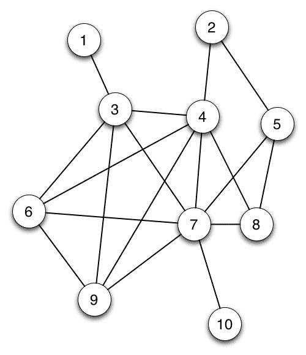
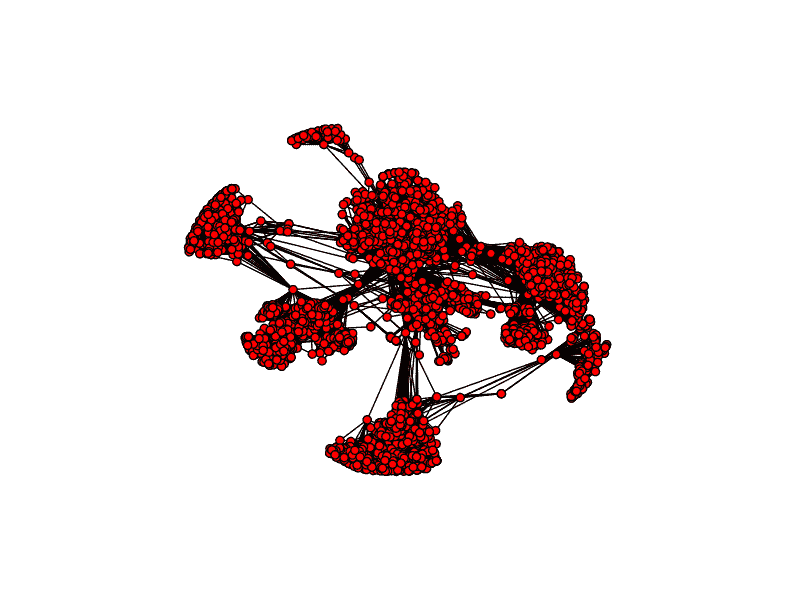
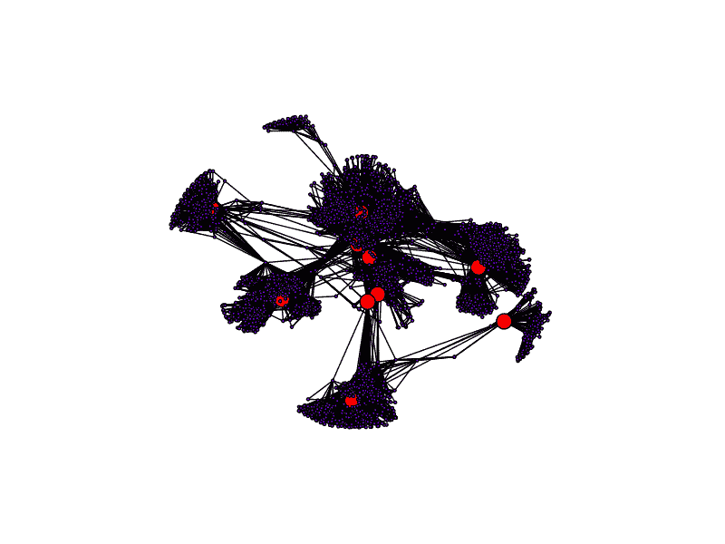
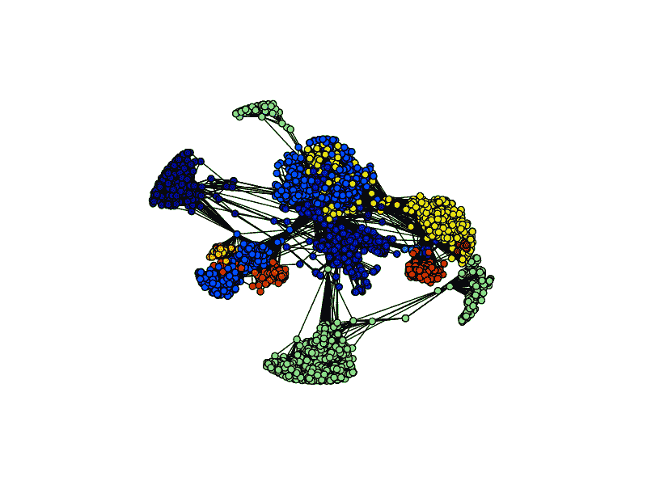
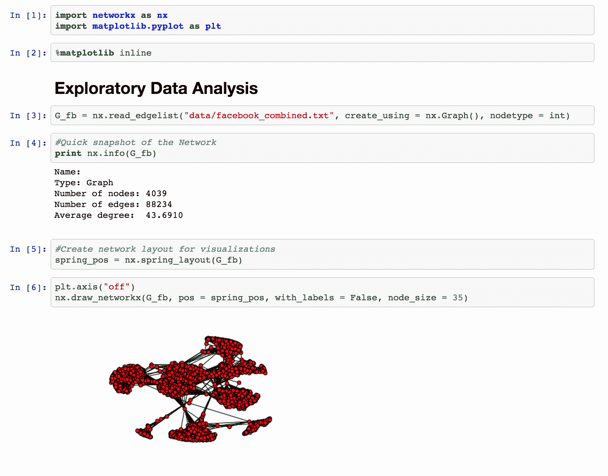

# 基于网络的社会网络分析

> 原文：<https://www.dominodatalab.com/blog/social-network-analysis-with-networkx>

现实世界中的许多问题都涉及数据记录之间的依赖关系。例如，社会学家渴望了解人们如何影响他们的同龄人的行为；生物学家希望了解蛋白质如何调节其他蛋白质的活动。涉及依赖关系的问题通常可以用图来建模，科学家们已经开发出了回答这些问题的方法，称为网络分析。

这篇文章描述了如何使用 Python 库 [NetworkX](https://networkx.github.io/) ，来处理网络数据和解决网络分析中的有趣问题。

## 图表介绍

在我们深入现实世界的网络分析之前，让我们先回顾一下什么是图。图由一组称为顶点的对象 V 和一组连接成对顶点的边 E 组成。



在上图中，圆圈代表顶点，连接圆圈的线是边。如果这个图代表一个社会网络，那么圆圈代表人，两个顶点之间的边可以表示这两个人是朋友。

我们将着眼于一种特殊类型的网络，称为自我网络。在自我网络中，有一个“中心”顶点或网络围绕其旋转的自我顶点。

自我网络在社会学中很重要，因为它们允许研究者研究个体与其世界的关系结构。

## NetworkX 入门

```py
import networkx as nx
```

Domino 提供了 NetworkX 作为它的默认 Python 库之一，所以您所要做的就是用上面的语句导入这个库。

现在，让我们考虑一个真实世界的数据集:[脸书自我网络](https://snap.stanford.edu/data/egonets-Facebook.html)！

这个脸书组合自我网络数据集包含十个人的脸书朋友列表的聚合网络。在这个数据集中，顶点代表脸书上的个体，两个用户之间的边意味着他们是脸书的朋友。每个自我网络都是从一个脸书用户开始创建的，然后挖掘他所有的脸书朋友。然后通过识别出现在多个自我网络中的个体来聚集自我网络。

以下是我们将使用的网络数据集的一些基本信息:

*   节点:4039
*   边缘:88，234
*   平均学位:43.6910



如您所见，这是一个相当连通的网络，网络中边的数量是节点数量的 20 倍以上，因此网络是密集集群的。如果您检查网络，您会注意到出现了某些顶点中枢。像这样的中心是现实社会网络的一个重要特征。密集的枢纽代表高度聚集，通常是科学家感兴趣的潜在社会机制的结果。

## 平行介数

我们如何确定谁是网络中最“重要”的个体。嗯，那要看“重要”的定义了。定义“重要性”的一种方式是个人的[中间性](https://en.wikipedia.org/wiki/Betweenness_centrality)。介数中心性是通过特定顶点的最短路径数量的度量。通过该顶点的最短路径越多，该顶点在网络中的中心位置就越高。

因为任何一对顶点之间的最短路径都可以独立于任何其他一对顶点来确定，所以我们可以利用 Domino 的多核硬件，使用并行算法来计算网络中每个顶点的介数中心性。

为此，我们将使用来自[多处理](https://docs.python.org/2/library/multiprocessing.html)库和 [itertools](https://docs.python.org/2/library/itertools.html) 库的池对象。在这里可以找到对 Python 中的多处理库和并行编程的很好的介绍。

```py
from multiprocessing import Pool
import itertools
```

我们需要做的第一件事是将网络的顶点划分成 *n* 个子集，其中 *n* 取决于我们可以访问的处理器数量。例如，如果我们使用具有 32 个内核的机器，我们将脸书网络划分为 32 个组块，每个组块包含 128 个顶点。

现在，我们可以让 32 个处理器并行计算 128 个顶点的介数，而不是一个处理器计算所有 4，039 个顶点的介数。这大大减少了算法的运行时间，并允许它扩展到更大的网络。

```py
def partitions(nodes, n):
    "Partitions the nodes into n subsets"
    nodes_iter = iter(nodes)
    while True:
        partition = tuple(itertools.islice(nodes_iter,n))
        if not partition:
            return
        yield partition

# To begin  the parallel computation, we initialize a Pool object with the
# number of available processors on our hardware. We then partition the
# network based on the size of the Pool object (the size is equal to the 
# number of available processors). 
def between_parallel(G, processes = None):
    p = Pool(processes=processes)
    part_generator = 4*len(p._pool)
    node_partitions = list(partitions(G.nodes(), int(len(G)/part_generator)))
    num_partitions = len(node_partitions)

    #Next, we pass each processor a copy of the entire network and 
    #compute #the betweenness centrality for each vertex assigned to the 
    #processor.

    bet_map = p.map(btwn_pool,
                    zip([G]*num_partitions,
                        [True]*num_partitions,
                        [None]*num_partitions,
                        node_partitions))

    #Finally, we collect the betweenness centrality calculations from each 
    #pool and aggregate them together to compute the overall betweenness 
    #centrality score for each vertex in  the network.

    bt_c = bet_map[0]
    for bt in bet_map[1:]:
        for n in bt:
            bt_c[n] += bt[n]
    return bt_c
```

现在，让我们看看网络中具有前 10 个最高介数中心性度量的顶点。



如您所见，主要位于一个中枢中心或充当两个中枢之间桥梁的顶点具有较高的介数中心性。桥顶点具有高介数，因为连接集线器的所有路径都经过它们，集线器中心顶点具有高介数，因为所有集线器内路径都经过它们。

## 社区检测

对于那些使用脸书的人来说，你的脸书朋友可能来自你生活的不同方面:有些是你大学时的朋友，有些是你的同事，也许还有一些来自你家乡的老朋友。

因为你的朋友可以像这样分成不同的组，你可能想知道我们是否可以在你的社交网络中识别这些不同的*社区*。答案是肯定的！使用*社区检测*算法，我们可以将一个社交网络分解成不同的潜在重叠社区。

寻找好社区的标准类似于寻找好集群的标准。我们希望最大化社区内的优势，同时最小化社区间的优势。在形式上，该算法试图最大化网络的模块性，或者如果边是随机分布的，则最大化落在社区内的边的比例减去期望的边的比例。好的社区应该具有大量的社区内边缘，因此通过最大化模块性，我们检测到具有高比例社区内边缘的密集社区。

虽然 NetworkX 中没有社区检测方法，但一位好心人在 NetworkX 的基础上编写了一个[社区检测库。](https://python-louvain.readthedocs.io/en/latest/api.html)

```py
import community
```

这个库易于使用，并且允许在不到 3 行代码的无向图上执行社区检测！

```py
parts = community.best_partition(G_fb)
values = [parts.get(node) for node in G_fb.nodes()]
```

这就是全部了！

现在让我们看看不同的社区。


如您所见，社区与顶点中心紧密相连。因为这个数据集是由 10 个个体的自我网络聚合而成的，不同的社区很可能反映了不同的自我网络。

## 结论

图形和网络在数据科学中越来越受欢迎。 [Neo4j](http://neo4j.com/) 是一个将数据表示为图形的数据库，拓扑数据分析算法和光谱聚类算法基于图形来识别数据中的灵活模式和子结构。

你可以使用 [Domino](https://www.dominodatalab.com/product/domino-data-science-platform/) 在大型硬件上运行网络算法来加速你的计算。

