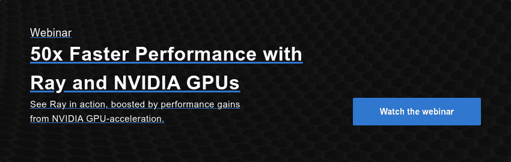

# Spark、Dask 和 Ray:选择正确的框架

> 原文：<https://www.dominodatalab.com/blog/spark-dask-ray-choosing-the-right-framework>

Apache Spark、Dask 和 Ray 是三种最流行的分布式计算框架。在这篇博文中，我们将探讨它们的历史、预期用例、优势和劣势，试图了解如何为特定的数据科学用例选择最合适的一个。

## 火花、达斯克和雷:一段历史

### 阿帕奇火花

Spark 由加州大学伯克利分校 AMPLab 的 Matei Zaharia 于 2009 年创立。该项目的主要目的是加速分布式大数据任务的执行，这些任务当时由 Hadoop MapReduce 处理。MapReduce 的设计考虑了可伸缩性和可靠性，但性能或易用性从来不是它的强项。MapReduce 将中间结果存储到磁盘的持续需求是 Spark 要克服的主要障碍。通过引入弹性分布式数据集(RDD)范式，并利用内存缓存和延迟评估，Spark 能够将延迟降低几个数量级(与 MapReduce 相比)。这使得 Spark 成为大规模、容错、并行数据处理的事实上的标准。该项目通过添加 GraphX(用于分布式图形处理)、MLlib(用于机器学习)、SparkSQL(用于结构化和半结构化数据)等进一步增强。值得注意的是，Spark 是用 Scala 编写的，后来加入了 Python 和 R 支持，因此与它交互一般不会有 Python 的感觉。理解 RDD 范式以及 Spark 中的工作方式需要一点时间来适应，但对于熟悉 Hadoop 生态系统的人来说，这通常不是问题。

### Dask

Dask 是一个用于并行计算的开源库，于 2015 年发布，所以相对于 Spark 来说是比较新的。该框架最初是由 Continuum Analytics(现在的 Anaconda Inc .)开发的，他们是许多其他开源 Python 包的创造者，包括流行的 Anaconda Python 发行版。Dask 最初的目的只是为了并行化 NumPy，以便它可以利用具有多个 CPU 和内核的工作站计算机。与 Spark 不同，Dask 开发中采用的原始设计原则之一是“不要发明任何东西”。这个决定背后的想法是，使用 Python 进行数据分析的开发人员应该对使用 Dask 感到熟悉，并且加速时间应该是最小的。据其创建者称，Dask 的设计原则已经发展了多年，现在它正被开发为一个用于并行计算的通用库。

围绕 parallel NumPy 的最初想法进一步发展，包括一个完全成熟但轻量级的任务调度器，它可以跟踪依赖性并支持大型多维数组和矩阵的并行化。后来增加了对并行熊猫数据帧和 scikit-learn 的进一步支持。这使得该框架能够缓解 Scikit 中的一些主要问题，如计算量大的网格搜索和工作流，它们太大而无法完全放入内存。单机并行化的最初目标后来被分布式调度程序的引入所超越，现在它使 Dask 能够在多机多 TB 问题空间中舒适地运行。

### 光线

Ray 是加州大学伯克利分校的另一个项目，其使命是“简化分布式计算”。Ray 由两个主要组件组成- Ray Core，这是一个分布式计算框架，以及 Ray 生态系统，广义地说，这是许多与 Ray 打包在一起的特定于任务的库(例如，Ray Tune -一个超参数优化框架，用于分布式深度学习的 RaySGD，用于强化学习的 RayRLib，等等。)

Ray 与 Dask 的相似之处在于，它允许用户以并行方式跨多台机器运行 Python 代码。然而，与 Dask 不同，Ray 并没有试图模仿 NumPy 和 Pandas APIs 它的主要设计目标不是替代数据科学工作负载，而是为并行化 Python 代码提供一个通用的底层框架。这使得它更像是一个通用的集群和并行化框架，可以用来构建和运行任何类型的分布式应用程序。由于 Ray Core 的架构方式，它通常被认为是构建框架的框架。也有越来越多的项目与 Ray 集成，以利用加速的 GPU 和并行计算。spaCy、Hugging Face 和 XGBoost 都是引入了 Ray 互操作性的第三方库的例子。

## 选择正确的框架

不幸的是，没有简单直接的方法来选择“最佳”框架。正如每个复杂问题的情况一样，答案在很大程度上取决于上下文以及在我们特定工作流程中起作用的许多其他因素。让我们看看这三个框架中的每一个，并考虑它们的优缺点，考虑各种常见的用例。

**火花**

*   赞成的意见

*   成熟的技术(2014 年 5 月发布)。
*   许多公司提供商业支持/服务。
*   非常适合针对大型数据集的数据工程/ ETL 类型的任务。
*   提供更高级别的 SQL 抽象(Spark SQL)。

*   骗局

*   涉及新执行模型和 API 的陡峭学习曲线。
*   调试可能具有挑战性。
*   复杂的架构很难由 IT 单独维护，因为正确的维护需要了解 Spark 的计算范例和内部工作方式(例如内存分配)。
*   缺乏丰富的数据可视化生态系统。
*   没有内置 GPU 加速。需要 [激流加速器](/resources/running-complex-workloads-using-on-demand-gpu-spark-rapids/) 来访问 GPU 资源。

**Dask**

*   赞成的意见

*   纯 Python 框架——非常容易升级。
*   对 Pandas 数据帧和 NumPy 数组的现成支持。
*   通过 [Datashader](https://datashader.org/) ，对数十亿行进行简单的探索性数据分析。
*   提供了 [*Dask 包*](https://docs.dask.org/en/latest/bag.html)——PySpark RDD 的 Pythonic 版本，具有*贴图*、*滤镜*、*分组、*等功能。
*   Dask 可以带来令人印象深刻的性能改进。2020 年 6 月，Nvidia 报告了在 16 个 DGX A100 系统(128 个 A100 GPUs)上使用 RAPIDS、Dask 和 UCX 进行 TPCx-BB 测试的一些令人震惊的[结果。然而，对此不能全信。2021 年 1 月，TPC 迫使 Nvidia 取消这些结果，因为它们违反了 TPC 的公平使用政策。](https://www.datanami.com/2020/06/22/nvidia-destroys-tpcx-bb-benchmark-with-gpus/)

*   骗局

*   没有太多的商业支持(但有几家公司开始在这个领域工作，例如 Coiled 和 QuanSight)。
*   无内置 GPU 支持。 [依靠激流](https://docs.dask.org/en/latest/gpu.html) 进行 GPU 加速。

**雷**

*   赞成的意见

*   最小集群配置
*   最适合计算繁重的工作负载。已经表明，在某些机器学习任务上， [Ray 的表现优于 Spark 和 Dask](https://towardsdatascience.com/benchmarking-python-distributed-ai-backends-with-wordbatch-9872457b785c) ，如 NLP、文本规范化等。更重要的是，即使在单个节点上，Ray 的工作速度也比 Python 标准多处理快 10%左右。
*   因为 Ray 越来越多地被用于扩展不同的 ML 库，所以你可以以一种可扩展的、并行的方式一起使用它们。另一方面，Spark 将其生态系统中可用的框架数量限制得更少。
*   独特的基于参与者的抽象，其中多个任务可以在同一个集群上异步工作，从而提高利用率(相比之下，Spark 的计算模型不太灵活，基于并行任务的同步执行)。

*   骗局

*   相对较新(2017 年 5 月首次发布)
*   并不真正适合分布式数据处理。Ray 没有用于分区数据的内置原语。该项目刚刚引入了 [射线数据集](https://docs.ray.io/en/master/data/dataset.html) ，但这是一个全新的补充，仍然是相当新的和裸露的骨骼。
*   GPU 支持仅限于调度和预留。实际使用 GPU 取决于远程函数(通常通过外部库，如 TensorFlow 和 PyTorch)

通过分析这三种框架的优缺点，我们可以提炼出以下选择标准:

*   如果工作负载以数据为中心，更多地围绕 ETL/预处理，我们最好的选择是 Spark。尤其是如果组织拥有 Spark API 的机构知识。
*   Dask/Ray 的选择并不明确，但一般规则是，Ray 旨在加速任何类型的 Python 代码，其中 Dask 面向特定于数据科学的工作流。

让事情变得更加复杂的是，还有 Dask-on-Ray 项目，它允许您在不使用 [Dask 分布式调度器](https://distributed.dask.org/en/latest/) 的情况下运行 Dask 工作流。为了更好地理解 Dask-on-Ray 试图填补的空白，我们需要看看 Dask 框架的核心组件。这些是集合抽象(数据帧、数组等。)、任务图(DAG，表示类似于 Apache Spark DAG 的操作集合)和调度器(负责执行 Dask 图)。分布式调度程序是 Dask 中可用的调度程序之一，它负责协调分布在多台机器上的多个工作进程的动作。这个调度器很棒，因为它设置简单，保持最小的延迟，允许点对点数据共享，并支持比简单的 map-reduce 链复杂得多的工作流。另一方面，分布式调度程序并非没有缺陷。它的一些缺点包括:

*   这是一个单点故障——分布式调度程序没有高可用性机制，因此如果它出现故障，整个集群都需要重置，所有正在进行的任务都将丢失。
*   它是用 Python 编写的，这使得它易于安装和调试，但它也带来了通常与 Python 密切相关的标准性能考虑。
*   客户端 API 在设计时考虑到了数据科学家，而不是针对来自高可用性生产基础架构的调用而定制的(例如，假设客户端是长期的，可能通过 Jupyter 会话使用集群)。
*   它为有状态执行提供了最低限度的支持，因此很难实现容错管道。
*   它会成为一个瓶颈，并且无法进行本地扩展

相比之下，容错和性能是光线调度程序设计中根深蒂固的原则。它是完全去中心化的(没有瓶颈)，提供更快的数据共享(通过 Apache Plasma)，单个调度器是无状态的(容错)，支持有状态的参与者，等等。这使得在 Ray 集群上运行 Dask 任务的吸引力变得很容易理解，也是 Dask-on-Ray 调度器存在的理由。深入研究 Dask-on-Ray 项目超出了本文的范围，但是如果您对两者的性能进行更深入的比较感兴趣，请随意查看 Anyscale 完成的 [内存管理和性能基准](https://www.anyscale.com/blog/analyzing-memory-management-and-performance-in-dask-on-ray) 。

## 如何做出选择(提示:你真的需要吗？)

现在，我们已经了解了 Spark、Dask 和 Ray 的优缺点，并简要讨论了 Dask-on-Ray 混合技术，很明显这不会是“一刀切”的情况。这三个框架从一开始就有不同的设计目标，试图将根本不同的工作流硬塞进其中一个可能不是最明智的选择。一个更好的方法是在设计数据科学流程和配套基础设施时考虑灵活性，理想情况下，让您能够加快速度并使用合适的工具来完成工作。典型的管道可能涉及在 Spark 中进行的一些类似 ETL 的数据处理，然后是在 Ray 中执行的机器学习工作流。一个能够以受控、容错和按需方式自由运行这两种框架的平台使数据科学团队能够利用这两种框架的优势。

从 Spark(数据帧)到 Ray(分布式训练)再回到 Spark(变压器)的流程的高级概述。射线估计器将这种复杂性封装在 Spark 估计器接口中。来源:[https://eng.uber.com/elastic-xgboost-ray/](https://eng.uber.com/elastic-xgboost-ray/)

混合框架的重要性已经很明显，集成库的出现使得框架间的交流更加流畅。例如， [Spark on Ray](https://docs.ray.io/en/latest/data/raydp.html) 正是这样做的——它“结合了你的 Spark 和 Ray 簇，使得使用 PySpark API 进行大规模数据处理变得容易，并无缝地使用这些数据来训练你使用 TensorFlow 和 PyTorch 的模型。”还有 Spark 项目上的[Ray](https://github.com/intel-analytics/analytics-zoo)，可以让我们在 Apache Hadoop/YARN 上运行 Ray 程序。这种方法也已经在实际生产工作负载中得到成功测试。例如，优步的机器学习平台 [米开朗基罗](https://eng.uber.com/michelangelo-machine-learning-platform/) 定义了一个光线估计器 API，为最终用户抽象出在火花和光线之间移动的过程。这在优步工程公司最近的出版物中有详细介绍，其中涵盖了一个用于分布式训练的 [架构](https://eng.uber.com/elastic-xgboost-ray/) ，涉及到 Spark 和 XGBoost on Ray。

## 摘要

在本文中，我们研究了三个最流行的并行计算框架。我们讨论了它们的优缺点，并就如何为手头的任务选择合适的框架给出了一些一般性的指导。建议的方法不是寻找适合每种可能的需求或用例的最终框架，而是了解它们如何适应各种工作流，并拥有足够灵活的数据科学基础架构，以允许混合搭配方法。

