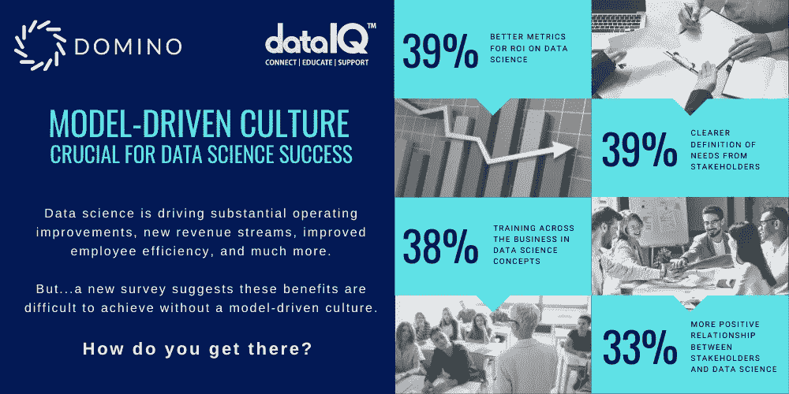

# 调查显示:模型驱动的文化对于数据科学的成功至关重要

> 原文：<https://www.dominodatalab.com/blog/survey-says-a-model-driven-culture-is-crucial-for-data-science-success-1>

在 Domino，我们很幸运能够与世界上最大的数据科学组织的领导者合作。真正突出的一点是，即使是最成熟的组织也难以理解和管理其数据科学投资的深度和广度。当您将“数据科学”扩展到包括组织正在投资的更广泛的大数据、BI 和分析功能时，这种情况会变得更糟。复杂性源于过去五年中新工具、功能和流程的爆炸式增长，许多首席信息官和首席数据官实际上并不知道哪些系统在驱动哪些业务流程，以及哪些团队在交付价值方面遇到了阻碍。

软件有一个健壮的“软件开发生命周期”,在过去的二十年中已经非常成熟。数据科学需要自己的“数据科学生命周期”，今年晚些时候，我们将推出[模型速度评估](/resources/data-science-process-lifecycle-assessment)。有了它，数据科学领导者将能够跨越数据科学生命周期的四个阶段来衡量他们的成熟度。我们发现，即使是最成熟的公司也有可以改进的地方，以帮助使数据科学对其业务更具可扩展性和价值。

这就是为什么我们与 [DataIQ](https://www.dataiq.co.uk/) 和[合作，调查](https://www.dominodatalab.com/resources/dataiq-survey-how-to-scale-data-science)他们的数据和分析专业人员成员，以了解他们的数据科学方法。在可以衡量数据科学的业务优势的企业中，大约四分之一的组织预计数据科学将对顶线收入产生超过 11%的影响。对于这些公司来说，它们在数据科学上的投资以及对使其成为一流企业职能的重视已经产生了显著的效益。

不幸的是，几乎三分之一的受访者(29.1%)不知道他们可以从数据科学中获得什么商业利益，而在可以获得商业利益的受访者中，超过一半的人(57.3%)认为数据科学对年收入的影响不到 5%。深入挖掘数据表明，根本原因在于缺乏一种模型驱动的文化，在这种文化中，业务利益相关者、数据科学从业者和 IT 拥有紧密的联系和共同的目标。

想想调查中的一些数字:

*   五分之二的组织(39.5%)认为“对商业中的数据科学缺乏理解或支持”是他们最大的挑战。
*   八分之一的人(12.8%)认为“用例不引人注目”是他们最大的挑战之一。鉴于上一点中强调的对数据科学的理解薄弱，这一结果并不令人惊讶。
*   三分之一的组织(33.7%)认为“数据科学和 IT 之间的冲突”是他们最大的挑战之一。
*   就数据和分析的采用水平而言，即使是将自己评为“先进”或“即将成熟”的公司也无法避免冲突。对于这两个群体来说，“数据科学和 IT 之间的冲突”是他们最大的挑战(分别为 52.4%和 50%)。

## 模型是一种新型的数字生活

调查中发现的挑战是许多公司进行数据科学的方式的直接结果。例如，部门领导喜欢上了业务分析师(他们缺乏正式的数据科学培训或经验)可以突然使用自动化机器学习工具来创建和部署模型的想法。根据我们的经验，这些工具可以用来解决一些基本的业务挑战，但只有当使用它们的“公民数据科学家”与能够验证其工作的专家(经过适当培训的)数据科学家配对时。走得太远并认为他们可以取代专家数据科学家的公司通常会遇到与缺乏理解和支持有关的问题。

数据科学和 IT 之间的冲突表现在许多方面，它通常是因为它对待数据科学模型就像对待其他软件项目一样。模型需要重新训练，以实验的方式开发，并使用许多不同的软件工具制作。没有必要“再培训”软件代码，但是生产模型需要经常再培训。从数据科学中实现最大价值的公司明白，模型是一种新型的数字生活，需要不同的人、流程和平台。

我们还看到许多冲突源于对可扩展基础架构的访问不足，数据科学团队需要这些基础架构来处理更大的数据集和更复杂的算法，以解决更广泛的用例。数据科学家的解决方案通常是“影子 IT”解决方案，即工作和部署的模型存在于 IT 权限之外的私有服务器或公共云中，代价是可见性、治理和安全性。

## 建立积极的数据科学文化

幸运的是，调查结果还提供了一些关于如何帮助建立数据文化以促进数据科学蓬勃发展的建议。由于许多组织很难衡量其数据科学工作的好处，因此“更好的数据科学 ROI 指标”排在首位(39.5%)也就不足为奇了。但是，接下来的三条建议将有助于为数据科学建立积极的文化。

*   39.5%的人希望“利益相关者对需求状态有更清晰的定义”
*   38.4%的人想要“数据科学概念的跨业务培训”
*   32.6 想要“利益相关者和数据科学之间更积极的关系”

了解阻碍可扩展数据科学发展的障碍是成为本次调查中“先进”企业的第一步。通过合作，业务利益相关方、数据科学团队和支持他们的 IT 社区可以更好地了解每个团队的独特需求，建立清晰的指标，并专注于最有影响力的用例。

您可以在此查看完整的调查结果[。](https://www.dominodatalab.com/resources/dataiq-survey-how-to-scale-data-science)

[Twitter](/#twitter) [Facebook](/#facebook) [Gmail](/#google_gmail) [Share](https://www.addtoany.com/share#url=https%3A%2F%2Fwww.dominodatalab.com%2Fblog%2Fsurvey-says-a-model-driven-culture-is-crucial-for-data-science-success-1%2F&title=Survey%20Says%3A%20A%20Model-driven%20Culture%20is%20Crucial%20for%20Data%20Science%20Success)