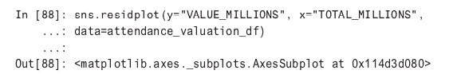
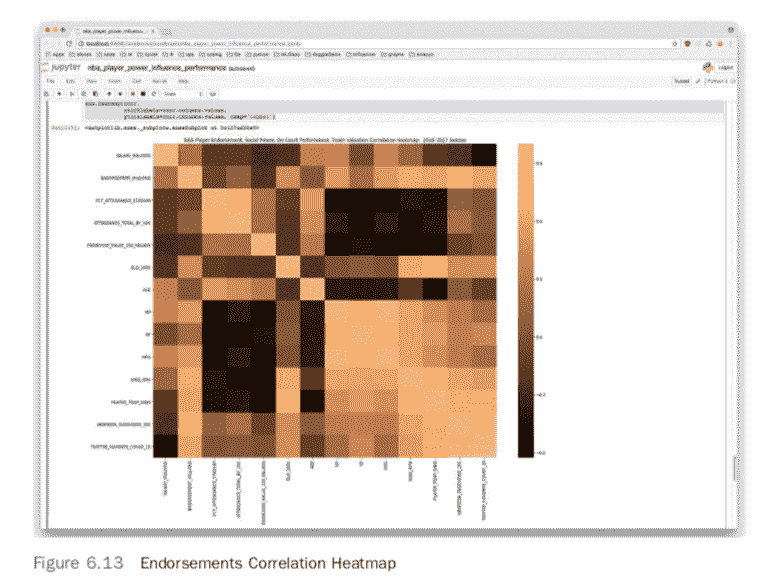

# 收集、准备和绘制数据的技术:预测社交媒体对 NBA 的影响

> 原文：<https://www.dominodatalab.com/blog/techniques-for-collecting-prepping-and-plotting-data-predicting-social-media-influence-in-the-nba>

*这篇文章提供了解决现实世界中的 ML 问题时需要考虑的思维模式、方法和工具。它包括要考虑的问题以及收集、准备和绘制数据。一个[补充多米诺骨牌项目可用](https://try.dominodatalab.com/u/ann_spencer/socialpowernba/overview)。*

## 介绍

收集和准备数据是核心研究任务。虽然最理想的情况是用干净的标记良好的数据开始一个项目，但现实是数据科学家花费无数的时间来获取和准备数据。由于 Domino 致力于支持数据科学家和加速研究，我们联系了 Addison-Wesley Professional(AWP)Pearson，以获得适当的权限，从 Noah Gift 所著的《实用人工智能:基于云的机器学习简介 *[》一书中摘录“预测社交媒体在 NBA 的影响”。摘录深入到收集、准备和绘制数据的技术。非常感谢 AWP·皮尔森提供了摘录作品的许可，并为我们提供了数据和代码，以纳入一个](http://www.informit.com/store/pragmatic-ai-an-introduction-to-cloud-based-machine-9780134863863?utm_source=Referral&utm_medium=DominoLabs&utm_campaign=Pragai)[补充多米诺骨牌项目](https://try.dominodatalab.com/u/ann_spencer/socialpowernba/overview)。*


## 第一章介绍:预测社交媒体在 NBA 的影响力

体育对于数据科学家来说是一个迷人的话题，因为每个数字背后都有一个故事。仅仅因为一名 NBA 球员比另一名球员得分更多，并不一定意味着[他们]为球队增加了更多价值。因此，最近试图衡量球员影响力的个人统计数据激增。ESPN 创造了真正的正负效应，FiveThirtyEight 提出了卡梅罗 NBA 球员预测，NBA 有球员影响估计。社交媒体也不例外；这个故事不仅仅是一个高粉丝数。

本章将使用 ML 探索数字背后的数字，然后创建一个 API 来提供 ML 模型。所有这些都将本着以现实世界的方式解决现实世界问题的精神来完成。这意味着除了在干净的数据上创建模型之外，还要涵盖设置环境、部署和监控等细节。

## 对问题的措辞

从冷眼看待社交媒体和 NBA 开始，有许多有趣的问题要问。这里有一些例子。

*   单个球员的表现会影响团队的胜利吗？
*   球场上的表现与社交媒体的影响力有关联吗？
*   社交媒体上的参与度与维基百科上的受欢迎程度有关联吗？
*   粉丝数量或社交媒体参与度是 Twitter 受欢迎程度的更好预测指标吗？
*   薪水和球场上的表现有关联吗？
*   获胜会给游戏带来更多粉丝吗？
*   什么更能推动球队的估值:上座率还是当地的房地产市场？

为了得到这些问题和其他问题的答案，需要收集数据。如前所述，80/20 法则适用于此。这个问题的百分之八十是收集数据，然后转换数据。另外 20%是 ML 和数据科学相关的任务，比如找到正确的模型、进行 EDA 和特征工程。

## 收集数据

在图 6.1 中，有一个要提取和转换的数据源列表。


收集这些数据是一个不小的软件工程问题。有许多障碍需要克服，例如找到一个好的数据源，编写代码来提取它，遵守 API 的限制，以及最终将数据转换成正确的形状。收集所有数据的第一步是确定首先收集哪个数据源，以及从哪里获取。

我们知道最终目标是比较 NBA 球员的社交媒体影响力和权力，因此从 2016-2017 赛季 NBA 球员的名册开始是一个很好的起点。理论上，这将是一个简单的任务，但收集 NBA 数据有一些陷阱。直观的起点是去 nba.com 的官方网站。然而，出于某种原因，许多体育联盟很难从他们的网站上下载原始数据。NBA 也不例外，从他们的官方网站获取统计数据是可行的，但具有挑战性。

这就引出了一个关于如何收集数据的有趣问题。通常手动收集数据很容易，即从网站下载，并在 Excel、Jupyter Notebook 或 RStudio 中手动清理。这可能是着手解决数据科学问题的一种非常合理的方式。但是，如果收集一个数据源并清理它需要几个小时，那么最好的办法可能是编写代码来解决这个问题。没有硬性的规则，但是有经验的人知道如何在一个问题上不断取得进展而不会受阻。

## 收集第一数据源

我们将从相对容易的东西开始，而不是从棘手的数据源开始，比如 NBA 官方网站，它会主动阻止你下载它的数据。要从篮球中收集第一个数据源，可以直接从本书的 [GitHub 项目](https://github.com/noahgift/pragmaticai)或者从[篮球参考](https://www.basketball-reference.com/leagues/NBA_2017_per_game.html)【或者补充的[多米诺项目](https://try.dominodatalab.com/u/ann_spencer/socialpowernba/overview)下载。

在现实世界中做 ML 不仅仅是为干净的数据找到正确的模型；这也意味着了解如何设置您的本地环境。

要开始运行代码，需要几个步骤。

1.  创建虚拟环境(基于 Python 3.6)。
2.  安装几个我们将在本章使用的包:例如，Pandas，Jupyter。
3.  在 Makefile 中运行这些。

清单 6.1 显示了一个 setup 命令，它为 Python 3.6 创建了一个虚拟环境，并安装了清单 6.2 中 requirements.txt 文件中列出的包。这可以用这个一行程序一次性执行。

```py
make setup && install
```


### 注意

处理 Python 虚拟环境的另一个便利技巧是在您的。巴沙尔或者。zshrc 文件，它可以在一个操作中自动激活环境并进入目录。我通常的做法是添加这个代码片段。

`alias pragai6top="cd ~/src/pragai/chapter6\`


要处理本章的项目，在 shell 中键入 pragai6top，您将进入正确的项目签出并启动您的虚拟环境。这就是使用 shell 别名的强大之处。还有其他工具可以自动为您完成这项工作，比如 pipenv 或许也值得去探索它们。

要检查数据，使用命令:`jupyter notebook`启动 Jupyter 笔记本。运行此操作将启动一个 web 浏览器，允许您浏览现有笔记本或创建新笔记本。如果您已经查看了这本书的 GitHub 项目的源代码，您会看到一个名为 basketball_reference.ipynb 的文件。

这是一个简单的 hello world 类型的笔记本，其中加载了数据。将数据集加载到 Jupyter Notebook 中，或者在 R 的情况下，加载到 RStudio 中，通常是对数据集进行初始验证和探索的最方便的方式。清单 6.3 展示了除了 Jupyter 之外，或者代替 Jupyter，如何从常规的 IPython shell 中探索数据。


### 注意

另一个有用的技巧是养成使用 pytest 的 nbval 插件确保 Jupyter 笔记本可运行的习惯。您可以添加一个 Makefile 命令测试，通过发出来运行您的所有笔记本

`make test`

你可以在下面的代码片段中看到 Makefile 文件的样子。

`test:`


如果 CSV 文件有列名，并且每列的行长度相等，那么将 CSV 文件加载到 Pandas 是很容易的。如果您正在处理准备好的数据集，那么通常情况下(如果不总是这样的话),数据将处于适合加载的状态。在现实世界中，事情从来没有这么简单，正如我们将在本章后面看到的那样，将数据整理成正确的形状是一场战斗。

图 6.2 显示了描述命令在 Jupyter 记事本中的输出。Pandas 数据帧上的 describe 函数提供了描述性统计数据，包括列的数量，在本例中为 27，以及每列的中位数(这是 50%的行)。在这一点上，这可能是一个好主意，玩一玩 Jupyter 笔记本，看看你还能观察到什么。然而，这个数据集没有的一个东西是在一个统计数据中对进攻和防守表现进行排名的单一指标。为了得到这个，我们需要将这个数据集与来自 ESPN 和 NBA 的其他来源结合起来。这将显著提高项目的难度，从简单地使用数据到找到数据，然后转换数据。一种合理的方法是使用 Scrapy 这样的刮擦工具，但是在我们的情况下，我们可以使用一种更特别的方法。通过访问 ESPN 和 NBA 网站，可以剪切和粘贴数据，并将其输入 Excel。然后可以手动清理数据并保存为 CSV 文件。对于小型数据集，这通常比编写脚本来执行相同的任务要快得多。


后来，如果这些数据需要转化为更大的项目，这种方法就成了一个糟糕的主意——但是对于原型来说，这是最强的选择之一。对于混乱的数据科学问题，一个关键的要点是继续前进，而不要陷入太多的细节。很容易花大量时间自动化一个混乱的数据源，后来才意识到这些信号没有帮助。

从 ESPN 获取数据的过程与 FiveThirtyEight 类似，所以我不再描述如何收集数据。要收集的两个其他数据源是工资和背书。ESPN 有薪水信息，福布斯有 8 名球员的一小部分代言数据。表 6.1 描述了数据源的形状，总结了它们的内容，并定义了它们的来源。大部分是通过手工完成的，有一个相当可观的数据源列表。


要获得其余的数据，主要是来自 Twitter 和 Wikipedia 的数据，并将其转换为统一的数据集，还有很多工作要做。几个最初有趣的可能性是探索前八名球员的代言和探索球队本身的估值。

## 探索第一个数据源:团队

首先要做的是使用新的 Jupyter 笔记本。在 GitHub 的资源库中，这个已经为你做好了，它叫做 exploring _ team _ valuation _ nba。接下来，导入一组通常用于在 Jupyter 笔记本中浏览数据的公共库。清单 6.4 显示了这一点。


接下来，为每个数据源创建一个 Pandas 数据帧，如清单 6.5 所示。


在图 6.3 中，创建了一个数据帧链，这是在野外收集数据时的常见做法。


这里是一个出勤数据与估价数据的合并，看看前几行。


在观察这些图时，似乎上座率(无论是平均上座率还是总上座率)与球队的价值之间存在关系。深入研究这种关系的另一种方法是创建一个关联热图，如图 6.5 所示。


配对图中可见的关系现在更加可以量化。热图显示，估值和上座率之间的相关性中等，徘徊在 50%左右。另一张热图显示了 NBA 每支球队的平均上座率和估价。要在 Seaborn 中生成这种类型的热图，首先需要将数据转换成数据透视表。

该图如图 6.5 所示。


在图 6.6 中，热图显示可能有一些有趣的模式需要进一步绘制，也许是在 3D 绘图中。纽约和洛杉矶存在异常值。


## 使用回归探索第一个数据源

图 6.5 显示了一些有趣的异常值，例如，布鲁克林篮网队的市值为 18 亿美元，但他们的上座率却是 NBA 中最低的。这里发生了一些值得关注的事情。进一步研究的一种方法是使用线性回归来试图解释这种关系。如果同时包含 Python 和 r，有几种不同的方法可以做到这一点。在 Python 中，两种更常用的方法是 StatsModels 包和 scikit-learn。让我们探索这两种方法。

有了 StatsModels，关于执行线性回归有一个很好的诊断输出，它有经典线性回归软件的感觉，如 Minitab 和 r。


在查看回归结果时，变量 TOTAL_MILLIONS(以百万计的总出席人数)在预测出席人数的变化方面确实具有统计显著性(以小于. 05 的 *P* 值测量)。0.282(或 28%)的 R 平方值表示“拟合优度”；也就是回归线完美拟合数据的程度。

做更多的绘图和诊断将显示这个模型能够预测得多好。Seaborn 有一个内置的非常有用的 residplot 来绘制残差。这如图 6.7 所示。拥有随机分布的残差是最理想的情况；如果图中有模式，可能表明模型有问题。在这种情况下，似乎没有统一的随机模式。




衡量最大似然或统计预测准确性的一种常用方法是查看均方根误差(RMSE)。下面是如何用 StatsModels 来做这件事。

RMSE 越低，预测越好。为了获得更好的预测精度，我们需要找出降低这个 RMSE 的方法。此外，拥有一个更大的数据集，使模型可以分为测试数据和训练数据，将确保更好的准确性，并减少过度拟合的机会。进一步的诊断步骤是绘制线性回归的预测值与实际值的关系图。在图 6.8 中，显示了预测值和实际值的`lmplot`，很明显，这不是一个很好的预测模型。不过这是一个好的开始，通常 ML 模型就是这样创建的——通过找到相关性和/或统计上显著的关系，然后决定是否值得努力收集更多的数据。


一个初步的结论是，虽然上座率和 NBA 球队的估值之间存在关系，但存在缺失或潜在变量。最初的预感是，该地区的人口，房地产价格的中位数，以及球队有多好(ELO 排名和胜率)都可能在这里发挥作用。


## 无监督机器学习:聚类第一数据源

了解 NBA 球队的下一步是使用[无监督 ML](/supervised-vs-unsupervised-learning) 对数据进行聚类，以找到更多见解。我可以从人口普查中手动找到一个县的[中值房价数据](https://www.zillow.com/research/)和每个县的[人口](https://data.census.gov/cedsci/all?q=county)。

所有这些新数据都可以加载一个新的数据框架。


[k-最近邻(kNN)](/knn-with-examples-in-python) 聚类通过确定点之间的欧几里德距离来工作。需要对要聚类的属性进行缩放，这样一个属性的缩放比例不会与另一个不同，否则会扭曲聚类。此外，聚类更多的是艺术而不是科学，选择正确的聚类数可能是一个反复试验的过程。

下面是缩放在实践中的工作原理。


在本例中，使用了 scikit-learn 中的 MinMaxScaler。它将所有数值转换为 0 到 1 之间的值。接下来，对缩放后的数据执行 sklearn.cluster，然后将分类结果附加到一个新列。


在这一点上，有足够的解决方案为公司提供即时价值，数据管道的开端正在形成。接下来，让我们使用 R 和 ggplot 来绘制集群。为了将这个数据集放入 R 中，我们可以将它写出到一个 CSV 文件中。


## 用 R 绘制三维 kNN 聚类

R 语言的一个亮点是能够用有意义的文本创建高级的情节。用 R 和 Python 编写解决方案的能力为用 ML 编写各种各样的解决方案开辟了道路。在这种特殊的情况下，我们将使用 R 3D 散点图库和 RStudio 来制作一个复杂的关系图，我们已经了解了如何使用 kNN cluster。在本章的 GitHub 项目中，有 R markdown 笔记本，里面有代码和情节；您也可以使用 RStudio for notebooks 中的预览功能来跟进。

要在 RStudio(或 R shell)的控制台中开始，请导入散点图 3d 库并使用以下命令加载数据。


接下来，创建一个函数来将数据类型转换成散点图 3d 库期望的格式。


要在 3D 空间的正确位置绘制文本需要一点工作。


图 6.9 显示了一些不寻常的图形。纽约尼克斯队和洛杉矶湖人队是最差的两支篮球队，但却是最有价值的。此外，你可以看到他们所在的城市房价中值最高，这也是他们高估值的原因之一。所有这一切的结果是，它们处于自己的集群中。

蓝色集群主要是 NBA 最好的球队的集合。他们也往往位于房价中值较高、但实际价值相差很大的城市。这让我怀疑房地产在团队估值中发挥的作用比实际业绩更大(这与之前的线性回归相符)。

红色聚类显示的团队通常表现低于平均水平，估值低于平均水平，房地产价格低于平均水平。布鲁克林篮网是一个例外，它正在成为洛杉矶湖人队和纽约尼克斯队类型的球队:表现不佳，但价值很高。

r 还有一种方法可以在多维度上可视化这些关系。接下来，我们将在 r 中使用 ggplot 创建一个地块。

在绘制新图表中的关系时，要做的第一件事是为集群指定一个逻辑名称。3D 图给了我们一些关于如何命名星团的好主意。集群 0 似乎是低价值/低性能集群，集群 1 是中等价值/高性能集群，集群 2 是高价值/低性能集群。需要补充的一点是，聚类数选择是一个复杂的问题。(有关该主题的更多信息，请参见附录 B。)


接下来，我们可以使用这些聚类名称来分面(在每个图中创建多个图)。此外，ggplot 能够创建许多其他维度，我们将全部使用它们:颜色显示获胜队的百分比和失败队的百分比，大小显示该县中位房价的差异，形状表示 NBA 的东部或西部联盟。

```py
> team_cluster <- read_csv("nba_cluster.csv",

+ col_types = cols(X1 = col_skip())) > library("ggplot2")

>

> #Name Clusters

> team_cluster$cluster_name[team_cluster$cluster == 0] <- "Low" Unknown or uninitialised column: 'cluster_name'. > team_cluster$cluster_name[team_cluster$

       cluster == 1] <- "Medium Valuation/High Performance" > team_cluster$cluster_name[team_cluster$

       cluster == 2] <- "High Valuation/Low Performance"

```

请注意，如果估价超过 1200，geom_text 只打印团队的名称。这使得情节可读性更强，不会被重叠的文本淹没。在最后的代码片段中，图例标题被更改。还要注意，颜色被更改为具有两个值之一的因子，而不是默认值 0.25.50.1。该图的输出如图 6.10 所示。ggplot 的分面特性真实地展示了聚类是如何为数据探索增加价值的。使用 R 进行高级绘图是一个好主意，即使你是另一种 ML 语言如 Python 或 Scala 的专家。结果不言自明。

```py
> p <- ggplot(data = team_cluster) +

+      geom_point(mapping = aes(x = ELO,

+                               y = VALUE_MILLIONS,

+                               color =

factor(WINNING_SEASON, labels=

c("LOSING","WINNING")),

+size = MEDIAN_HOME_PRICE_COUNTY_MILLIONS,

+                              shape = CONF))

+     facet_wrap(~ cluster_name)

+     ggtitle("NBA Teams 2016-2017 Faceted Plot")

+     ylab("Value NBA Team in Millions")

+     xlab("Relative Team Performance (ELO)")

+     geom_text(aes(x = ELO, y = VALUE_MILLIONS,

+ label=ifelse(VALUE_MILLIONS>1200,

+ as.character(TEAM),'')),hjust=.35,vjust=1)

```

请注意，如果估价超过 1200，geom_text 只打印团队的名称。这使得情节可读性更强，不会被重叠的文本淹没。在最后的代码片段中，图例标题被更改。还要注意，颜色被更改为具有两个值之一的因子，而不是默认值 0.25.50.1。该图的输出如图 6.10 所示。ggplot 的分面特性真实地展示了聚类是如何为数据探索增加价值的。使用 R 进行高级绘图是一个好主意，即使你是另一种 ML 语言如 Python 或 Scala 的专家。结果不言自明。

```py
#Change legends

p+

   guides(color = guide_legend(title = "Winning Season")) +

   guides(size = guide_legend(

+ title = "Median Home Price County in Millions" )) +

   guides(shape = guide_legend(title = "NBA Conference"))

```

## 收集具有挑战性的数据源

已经收集了关于团队的一组好的数据，是时候进入更具挑战性的数据源了。这是事情开始变得更加真实的地方。收集随机数据源存在一些巨大的问题:API 限制、未记录的 API、脏数据等等。

### 收集运动员的维基百科浏览量

这里有几个需要解决的问题。

1.  如何对维基百科系统进行逆向工程以获得浏览量(或找到隐藏的 API 文档)
2.  如何找到生成维基百科句柄的方法(它们可能和自己的 NBA 名字不一样)
3.  如何将数据框架与其余数据连接起来

下面是如何在 Python 中实现这一点。这个例子的全部源代码都在本书的 GitHub repo 中，但是将在这些部分中进行分析。下面是维基百科页面浏览量和四个所需模块的示例 URL。请求库将进行 HTTP 调用，Pandas 将把结果转换成数据帧，维基百科库将用于为运动员检测正确的维基百科 URL。

```py
"""Example Route To Construct:

https://wikimedia.org/api/rest_v1/ +

metrics/pageviews/per-article/ +

en.wikipedia/all-access/user/ +

LeBron_James/daily/2015070100/2017070500 + """

import requests

import pandas as pd

import time

import wikipedia

BASE_URL ="https://wikimedia.org/api/rest_v1/metrics/pageviews/per-article/en.wikipedia/all-access/user"
```

接下来，下面的代码构造一个包含数据范围和用户名的 URL。

```py
def construct_url(handle, period, start, end):

    """Constructs a URL based on arguments

    Should construct the following URL:

    /LeBron_James/daily/2015070100/2017070500"""

    urls = [BASE_URL, handle, period, start, end]

    constructed = str.join('/', urls)

    return constructed

def query_wikipedia_pageviews(url):

    res = requests.get(url)

    return res.json()

def wikipedia_pageviews(handle, period, start, end):

    """Returns JSON"""

    constructed_url = construct_url(handle, period, start,end)

    pageviews = query_wikipedia_pageviews(url=constructed_url)

    return pageviews
```

以下函数自动填充 2016 年的查询。这可以在以后变得更抽象，但是现在，这是“黑客”代码，为了速度硬编码可能值得技术债务。还要注意，sleep 被设置为 0，但是如果达到 API 限制，可能需要启用它。这是第一次使用 API 时的常见模式；他们可能会以意想不到的方式行事，所以隔一段时间睡觉通常可以解决这个问题，这也是一种临时的方法。

```py
def wikipedia_2016(handle,sleep=0):

    """Retrieve pageviews for 2016"""

    print("SLEEP: {sleep}".format(sleep=sleep))

    time.sleep(sleep)

    pageviews = wikipedia_pageviews(handle=handle,

                                    period="daily", start="2016010100", end="2016123100")

    if not 'items' in pageviews:

        print("NO PAGEVIEWS: {handle}".format(handle=handle))

        return None

    return pageviews
```

接下来，结果被转换成熊猫数据帧。

```py
def create_wikipedia_df(handles):

    """Creates a Dataframe of Pageviews"""

    pageviews = []

    timestamps = []

    names = []

    wikipedia_handles = []

    for name, handle in handles.items():

        pageviews_record = wikipedia_2016(handle)

        if pageviews_record is None:

            continue

        for record in pageviews_record['items']:

            pageviews.append(record['views'])

            timestamps.append(record['timestamp'])

            names.append(name)

            wikipedia_handles.append(handle)

    data = {

    "names": names,

    "wikipedia_handles": wikipedia_handles,

    "pageviews": pageviews,

    "timestamps": timestamps

    }

    df = pd.DataFrame(data)

    return df
```

代码中更棘手的部分从这里开始，因为猜测正确的句柄需要一些试探法。对于第一遍，猜测大多数句柄都是简单的`first_last`。第二次传递将“(篮球)”附加到名称上，这是维基百科消除歧义的常用策略。

```py
def create_wikipedia_handle(raw_handle):

    """Takes a raw handle and converts it to a wikipedia handle"""

    wikipedia_handle = raw_handle.replace(" ", "_")

    return wikipedia_handle

def create_wikipedia_nba_handle(name):

    """Appends basketball to link"""

    url = " ".join([name, "(basketball)"])

    return url

def wikipedia_current_nba_roster():

    """Gets all links on wikipedia current roster page"""

    links = {}

    nba = wikipedia.page("List_of_current_NBA_team_rosters")

    for link in nba.links:

        links[link] = create_wikipedia_handle(link)

    return links
```

这段代码运行试探法并返回经过验证的句柄和猜测。

```py
def guess_wikipedia_nba_handle(data="data/nba_2017_br.csv"):

    """Attempt to get the correct wikipedia handle"""

    links = wikipedia_current_nba_roster()

    nba = pd.read_csv(data)

    count = 0

    verified = {}

    guesses = {}

    for player in nba["Player"].values:

        if player in links:

            print("Player: {player}, Link: {link} "format(player=player,link=links[player]))

            print(count)

            count += 1

            verified[player] = links[player] #add wikipedia link

        else:

            print("NO MATCH: {player}".format(player=player))

            guesses[player] = create_wikipedia_handle(player)

    return verified, guesses
```

接下来，Wikipedia Python 库用于转换名字和姓氏的失败初始猜测，并在页面摘要中查找“NBA”。这是另一个体面的黑客获得更多的比赛。

```py
def validate_wikipedia_guesses(guesses):

    """Validate guessed wikipedia accounts"""

    verified = {}

    wrong = {}

    for name, link in guesses.items():

        try:

            page = wikipedia.page(link)

        except (wikipedia.DisambiguationError,wikipedia.PageError) as error:

            #try basketball suffix

            nba_handle = create_wikipedia_nba_handle(name)

        try:

            page = wikipedia.page(nba_handle)

            print("Initial wikipedia URL Failed:            {error}".format(error=error))

        except (wikipedia.DisambiguationError, wikipedia.PageError) as error:

            print("Second Match Failure: {error}".format(error=error))

            wrong[name] = link

            continue

    if "NBA" in page.summary:

        verified[name] = link

    else:

        print("NO GUESS MATCH: {name}".format(name=name))

        wrong[name] = link

    return verified, wrong
```

在脚本结束时，一切都运行了，输出用于创建一个新的 CSV 文件。

```py
def clean_wikipedia_handles(data="data/nba_2017_br.csv"):

    """Clean Handles"""

        verified, guesses = guess_wikipedia_nba_handle(data=data)

        verified_cleaned, wrong = validate_wikipedia_guesses(guesses)

        print("WRONG Matches: {wrong}".format(wrong=wrong))

        handles = {**verified, **verified_cleaned}

        return handles

def nba_wikipedia_dataframe(data="data/nba_2017_br.csv"):

    handles = clean_wikipedia_handles(data=data)

    df = create_wikipedia_df(handles)

    return df

def create_wikipedia_csv(data="data/nba_2017_br.csv"):

    df = nba_wikipedia_dataframe(data=data)

    df.to_csv("data/wikipedia_nba.csv")

if __name__ == "__main__":

    create_wikipedia_csv()
```

总之，像这样的事情可能需要几个小时到几天的时间，代表了通过随机数据源解决问题的现实主义。

## 收集运动员的 Twitter 参与度

从 Twitter 收集数据有一些更简单的元素。首先，Python 中有一个很棒的库，名为 twitter。然而，仍然存在一些挑战。它们在这里被展示出来。

1.  使用描述性统计数据总结敬业度
2.  找到正确的 Twitter 句柄(Twitter 上的句柄名称甚至比维基百科上的更难找到)
3.  将数据帧与其余数据连接起来

首先，创建一个配置文件 config.py，并将 Twitter API 的凭证放入其中。然后,`.import config`将创建一个名称空间来使用这些凭证。此外，Twitter 错误处理以及 Pandas 和 NumPy 也被导入。

```py
import time

import twitter

from . import config

import pandas as pd

import numpy as np

from twitter.error import TwitterError
```

下面的代码与 Twitter 对话，获取 200 条推文，并将它们转换成熊猫数据帧。请注意这种模式是如何在与 API 的对话中频繁使用的；这些列被放入一个列表中，然后这个列表被用来创建一个数据帧。

```py
def api_handler():

    """Creates connection to Twitter API"""

    api = twitter.Api(consumer_key=config.CONSUMER_KEY,

    consumer_secret=config.CONSUMER_SECRET,

    access_token_key=config.ACCESS_TOKEN_KEY,

    access_token_secret=config.ACCESS_TOKEN_SECRET)

    return api

def tweets_by_user(api, user, count=200):

    """Grabs the "n" number of tweets. Defaults to 200"""

    tweets = api.GetUserTimeline(screen_name=user, count=count)

    return tweets

def stats_to_df(tweets):

    """Takes twitter stats and converts them to a dataframe"""

    records = []

    for tweet in tweets:

        records.append({"created_at":tweet.created_at,

                        "screen_name":tweet.user.screen_name,

                        "retweet_count":tweet.retweet_count,

                        "favorite_count":tweet.favorite_count})

    df = pd.DataFrame(data=records)

    return df

def stats_df(user):

    """Returns a dataframe of stats"""

    api = api_handler()

    tweets = tweets_by_user(api, user)

    df = stats_to_df(tweets)

    return df
```

最后一个函数 stats_df 现在可以用来交互式地研究 Twitter API 调用的结果。下面是勒布朗·詹姆斯描述性统计的一个例子。


在下面的代码中，调用 Twitter API 时会略微休眠，以避免遇到 API 节流。请注意，Twitter 句柄是从 CSV 文件中提取的。篮球参考还保留了大量的 Twitter 账户。另一种选择是手动找到它们。

```py
def twitter_handles(sleep=.5,data="data/twitter_nba_combined.csv"):

    """yield handles"""

    nba = pd.read_csv(data)

    for handle in nba["twitter_handle"]:

        time.sleep(sleep) #Avoid throttling in twitter api

        try:

            df = stats_df(handle)

        except TwitterError as error: print("Error {handle} and error msg {error}".format(

            handle=handle,error=error))

    df = None

    yield df

def median_engagement(data="data/twitter_nba_combined.csv"):

    """Median engagement on twitter"""

    favorite_count = []

    retweet_count = []

    nba = pd.read_csv(data)

    for record in twitter_handles(data=data):

        print(record)

    #None records stored as Nan value

        if record is None:

            print("NO RECORD: {record}".format(record=record))

            favorite_count.append(np.nan)

            retweet_count.append(np.nan)

            continue

        try:

            favorite_count.append(record['favorite_count'].median())

            retweet_count.append(record["retweet_count"].median())

        except KeyError as error:

            print("No values found to append {error}".format(error=error))

            favorite_count.append(np.nan)

            retweet_count.append(np.nan)

    print("Creating DF")

    nba['twitter_favorite_count'] = favorite_count

    nba['twitter_retweet_count'] = retweet_count

    return nba
```

在这一切结束时，会创建一个新的 CSV 文件。

```py
def create_twitter_csv(data="data/nba_2016_2017_wikipedia.csv"):

    nba = median_engagement(data)

    nba.to_csv("data/nba_2016_2017_wikipedia_twitter.csv")
```

## 探索 NBA 运动员数据

为了研究运动员数据，将创建一个新的 Jupyter 笔记本。这个笔记本叫做`nba_player_power_influence_performance`。首先，导入一些常用的库。

```py
import pandas as pd

import numpy as np

import statsmodels.api as sm

import statsmodels.formula.api as smf

import matplotlib.pyplot as plt

import seaborn as sns

from sklearn.cluster import KMeans

color = sns.color_palette()

from IPython.core.display import display, HTML

display(HTML("<style>.container{width:100% !important; }</style>"))

%matplotlib inline
```

接下来，将数据文件加载到项目中，并重命名这些列。

```py
attendance_valuation_elo_df =pd.read_csv("../data/nba_2017_att_val_elo.csv")

salary_df = pd.read_csv("../data/nba_2017_salary.csv")

pie_df = pd.read_csv("../data/nba_2017_pie.csv")

plus_minus_df=pd.read_csv("../data/nba_2017_real_plus_minus.csv")

br_stats_df = pd.read_csv("../data/nba_2017_br.csv")

plus_minus_df.rename(

columns={"NAMES":"PLAYER", "WINS":"WINS_RPM"}, inplace=True)

    players = []

    for player in plus_minus_df['PLAYER']:

        plyr, _ = player.split(".")

        platers.append(plyr)

    plus_minus_df.drop(["PLAYER"], inplace=True, axis=1)

    plus_minus_df["PLAYER"] = players
```

有一些重复的源，所以这些也可以删除。


111 名 NBA 球员的工资信息丢失，所以当我们做分析时，这些球员也将被删除。


剩下的是一个有 38 列的熊猫数据框架。


接下来，数据框架可以与维基百科数据合并。数据被折叠到一个中间字段中，因此可以表示为一列中的一行。

```py
wiki_df = pd.read_csv(

"../data/nba_2017_player_wikipedia.csv")

wiki_df.rename(columns={"names":"Players", "pageviews":"PAGEVIEWS"}, inplace=True)

median_wiki_df = wiki_df.groupby("PLAYER").median()

median_wiki_df_small = median_wiki_df[["PAGEVIEWS"]]

median_wiki_df_small.reset_index(

level=0, inplace=True)
median_wiki_df_sm.head()
```

```py
PLAYER     PAGEVIEWS

A.J. Hammons     1.0

Aaron Brooks     10.0

Aaron Gordon     666.0

Aaron Harrison   487.0

Adreian Payne    166.0
```

最后要添加的列是来自 Twitter 数据的值。现在总共有 41 个属性可以使用。

```py
twitter_df = pd.read_csv(

"../data/nba_2017_twitter_players.csv")

nba_players_with_salary_wiki_twitter_df=nba_players_with_salary_wiki_df.merge(twitter_df)

len(nba_players_with_salary_wiki_twitter_df.columns)
```

```py
41
```

探索数据的合理的下一步是创建关联热图。

```py
plt.subplot(figsize=(20,15))

ax = plt.axes()

ax.set_title("NBA Player Correlation Heatmap")

corr = nba_players_with_salary_wiki_twitter_df_corr()

sns.heatmap(corr,

           xticklabels=corr.columns.values,

           yticklabels=corr.columns.values)
```

图 6.11 显示了一些有趣的相关性。Twitter 参与度和维基百科浏览量高度相关。归因于玩家的胜利，或 WINS_RPM，也与 Twitter 和 Wikipedia 相关。薪水和积分也高度相关。


## NBA 球员的无监督机器学习

利用多样化的数据集和许多有用的属性，对 NBA 球员进行无监督的 ML 可以证明是非常有用的。第一步是缩放数据并选择要聚类的属性(删除缺少任何值的行)。


接下来，让我们再次集群并写出一个 CSV 文件来在 r 中进行分面绘制。


## NBA 球员的分面聚类分析

首先，导入 CSV 文件并使用 ggplot2 库。

```py
> player_cluster <- read_csv(

+ "nba_2017_players_social_with_clusters.csv",

+                          col_types = cols(X1 = col_skip()))
> library("ggplot2")
```

接下来，给所有四个集群起一个有意义的名字。

```py
> #Name Clusters

> player_cluster$cluster_name[player_cluster$

+ cluster == 0] <- "Low Pay/Low" > player_cluster$cluster_name[player_cluster$

+ cluster == 1] <- "High Pay/Above Average Performance" > player_cluster$cluster_name[player_cluster$

+ cluster == 2] <- "Low Pay/Average Performance" > player_cluster$cluster_name[player_cluster$

+ cluster == 3] <- "High Pay/High Performance" > player_cluster$cluster_name[player_cluster$

+ cluster == 4] <- "Medium Pay/Above Average Performance"
```

使用集群名称创建面。

```py
> #Create faceted plot

> p <- ggplot(data = player_cluster)

+      geom_point(mapping = aes(x = WINS_RPM,

                                y = POINTS,

                                color = SALARY_MILLIONS,

                                size = PAGEVIEWS))+

+       facet_wrap(~ cluster_name) +

+       ggtitle("NBA Players Faceted")

+       ylab("POINTS PER GAME")

+       xlab("WINS ATTRIBUTABLE TO PLAYER (WINS_RPM)")

+       geom_text(aes(x = WINS_RPM, y = POINTS,

```

在每个方面都有一些工作要做，这是通过下面的 R 和/或语句来完成的。薪水中还使用了三种颜色，这样可以更清楚地看到差异

```py
label=ifelse(

+ PAGEVIEWS>10000|TOV>5|AGE>37|WINS_RPM>15|cluster

+ == 2 & WINS_RPM > 3,

+

as.character(PLAYER),'')),hjust=.8, check_overlap = FALSE)

>

> #Change legends

> p +

+    guides(color = guide_legend(title = "Salary Millions")) +

+    guides(size = guide_legend(

+ title = "Wikipedia Daily Pageviews" ))+

+    scale_color_gradientn(colours = rainbow(3))

>    geom_text(aes(x = ELO, y = VALUE_MILLIONS, label=ifelse(

VALUE_MILLIONS>1200,as.character(TEAM),'')),hjust=.35,vjust=1)

```

最终的结果是一个漂亮的，多面的图，如图 6.12 所示。已经发现的主要标签是受欢迎程度、工资和绩效之间的差异。勒布朗·詹姆斯和拉塞尔·维斯特布鲁克的组合拥有“精英中的精英”，但他们也拥有最高的薪水。


## 把所有这些放在一起:团队、球员、权力和支持

收集了所有数据后，有一些有趣的新情节需要测试。通过结合代言、球队和球员的数据，有可能制作出几个引人入胜的情节。首先，背书数据可以显示在图 6.13 中的关联热图中。你可以看到“铜”色给这个情节增加了一个有趣的转折。




接下来，在重点图中，作品的整体展示在图 6.14 中。这方面的代码是


注意，使重音图可读的很大一部分是将颜色转换成对数范数。这允许相对变化成为细胞间边界的催化剂。

## 进一步的实用步骤和学习

这本书存在的主要原因之一是展示如何创建可部署到生产中的完整的工作解决方案。将此解决方案从笔记本中取出的一种方法是探索其他章节中的一些解决方案，这些章节介绍了将项目投入生产的技术，例如，创建一个 NBA 球队估值预测 API，或一个展示 NBA 超级明星社会影响力的 API。Y combinator (YC)的演示文稿可能只需要几行代码。除此之外，[ka ggle 笔记本](https://www.kaggle.com/noahgift/social-power-nba)可以分叉，这可能是更多探索的起点。【还有一个互补的[多米诺项目](https://try.dominodatalab.com/u/ann_spencer/socialpowernba/overview)。]最后，关于这个主题的视频和幻灯片可以在[Strata Data Conference 2018 San Jose 日程表上找到。](https://conferences.oreilly.com/strata/strata-ca/public/schedule/detail/63606)

## 摘要

本章着眼于现实世界的 ML 问题，从问题开始，然后转移到如何从互联网上收集数据的技术。许多较小的数据集是从网站上剪切和粘贴的，这些网站可能对它们的收集友好，也可能不友好。更大的数据源 Wikipedia 和 Twitter 需要一种不同的方法——一种更加以软件工程为中心的方法。接下来，以统计的方式并使用无监督的 ML 和数据可视化来探索数据。在最后一节中，使用云提供商创建了几个解决方案，包括一个可伸缩的 API、一个无服务器应用程序和一个数据可视化框架(Shiny)。