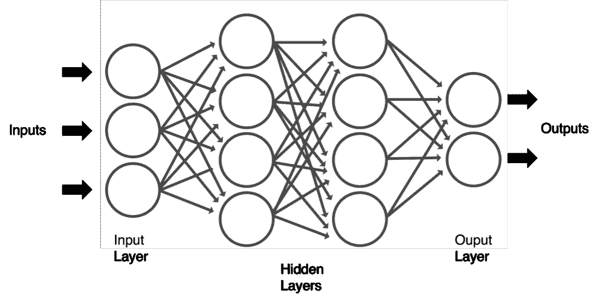

# 深度学习的 Tensorflow、PyTorch 或 Keras

> 原文：<https://www.dominodatalab.com/blog/tensorflow-pytorch-or-keras-for-deep-learning>

机器学习为我们提供了创建数据驱动系统的方法，这些系统可以学习和增强自身，而无需为手头的任务专门编程。就机器学习算法而言，有一类已经抓住了我们许多人的想象力:深度学习。你肯定听说过许多利用深度学习的奇妙应用。例如，以汽车行业为例，其中[自动驾驶汽车由卷积神经网络](https://developer.nvidia.com/blog/deep-learning-self-driving-cars/)驱动，或者看看递归神经网络如何用于[语言翻译和理解](https://ai.googleblog.com/2017/08/transformer-novel-neural-network.html)。同样值得一提的是神经网络在[医学图像识别](https://sciencepublishinggroup.com/journal/paperinfo?journalid=303&doi=10.11648/j.ajcst.20190202.11)中的许多不同应用。

深度学习可以被认为是人工智能的支柱之一，它从神经元如何在大脑中相互交流中获得灵感。人工神经网络(简称神经网络)通常是分层组织的；每一层都由几个相互连接的节点组成，这些节点对它们接收到的输入进行转换。请参见下图。该转换被称为激活函数，并且其输出被直接馈送到相邻神经元的下一层。网络中的第一层称为输入层，最后一层是输出层。夹在输入层和输出层之间的层称为隐藏层，原则上，我们可以有任意数量的隐藏层。在深度学习中使用形容词“深度”是指神经网络架构中的大量隐藏层。在之前的博客文章中，我们谈到了深度神经网络所需的计算任务如何受益于 GPU 的使用。随着我们网络中参数数量的增长，这一点尤其重要，可能达到数百亿个。

您可以编写自己的代码来实现一个神经网络架构，该架构可以使用单个隐藏层来逼近任何函数。随着我们添加更多层，我们能够通过执行自动[特征工程](https://www.dominodatalab.com/data-science-dictionary/feature-engineering)来创建学习复杂表示的系统。我已经在我的书[“用 Python 进行高级数据科学和分析”](https://www.taylorfrancis.com/books/mono/10.1201/9780429446641/advanced-data-science-analytics-python-jesús-rogel-salazar)中介绍了这个主题，作为对神经网络的介绍。除此之外，我强烈推荐阅读[最近在这个博客](https://blog.dominodatalab.com/deep-learning-introduction)上发表的一篇关于深度学习和神经网络的文章。虽然这可能是一个非常有启发性的练习，并且它将使您对神经网络如何工作有一个深入的了解，但是如果您正在寻求为复杂的应用程序构建高效的实现，您还需要熟悉许多框架。这些框架的一些例子包括 TensorFlow、PyTorch、Caffe、Keras 和 MXNet。在这篇文章中，我们关注的是深度学习的三个主要框架，即 TensorFlow、PyTorch 和 Keras。我们将看看它们的起源、优缺点，以及在选择其中一个进行深度学习任务之前，你应该考虑什么。

## 深度学习框架:综述

### TensorFlow

TensorFlow 是最著名的深度学习框架之一。它最初是谷歌大脑的一个内部项目，旨在帮助改善谷歌的一些服务，如 Gmail、照片和无处不在的谷歌搜索引擎。2015 年末公开，但直到 2017 年才发布第一个稳定版(1.0.0)。进一步的改进给了我们 [TensorFlow 2.0](https://medium.com/tensorflow/whats-coming-in-tensorflow-2-0-d3663832e9b8) ，于 2019 年 9 月发布。该框架可作为 Apache License 2.0 下的开源项目获得，根据 [TensorFlow Dev Summit 2020 主题演讲](https://www.youtube.com/watch?v=_lsjCH3fd00&t=90s)，据报道该框架已被下载 76，000，000 次，超过 2，400 人对其开发做出了贡献。这种流行的深度学习框架的名称来自于用于在神经网络中执行操作和操纵的张量。在这种情况下，张量实际上是一个多维数据数组，它“流经”神经网络的各个层。

TensorFlow 最重要的特性之一是开发人员可以用它实现的抽象。这意味着，机器学习开发者不是处理遍历神经网络所需的操作的低级细节，而是专注于应用程序的高级逻辑。这是在数据流图的帮助下实现的，数据流图描述了张量如何通过神经网络中的一系列层和节点移动。平心而论，TensorFlow 提供的 API 不仅是高级的，还允许一些低级的操作。此外，还有支持 Python、JavaScript、C++和 Java 的 API。除此之外，还有一些针对 C#、Haskell、Julia、R、Matlab、Scala 等的第三方语言绑定包。开发人员也能够使用 Keras 来创建自己的机器学习模型。稍后会详细介绍。

使用 TensorFlow 的另一个优势是 Google 提供的张量处理单元或 TPU。这些是专用集成电路，专门为与 TensorFlow 一起用于机器学习而定制。可以想象，Google 是 TensorFlow 的重度用户。例如，看看 [TF-Ranking](https://ai.googleblog.com/2021/07/advances-in-tf-ranking.html) ，这是一个开发学习-排名模型的库。像 [GE Healthcare](https://blog.tensorflow.org/2019/03/intelligent-scanning-using-deep-learning.html) 这样的公司已经在 MRI 扫描中使用 TensorFlow 进行大脑解剖识别； [Spotify](https://engineering.atspotify.com/2019/12/13/the-winding-road-to-better-machine-learning-infrastructure-through-tensorflow-extended-and-kubeflow/) 用它来改善对用户的音乐推荐。其他用例列在 [TensorFlow 主页](https://www.tensorflow.org/about/case-studies)上。

### PyTorch

PyTorch 并没有掩盖 Python 是其开发和设计原则的核心这一事实。PyTorch 也是一个开源项目(BSD 许可证),它建立在几个项目的基础上，主要是现在已经废弃的[Lua Torch](http://torch.ch/)T4、一个现在被 PyTorch 本身取代的科学计算框架，以及自动微分库 [Chainer](https://chainer.org/) 和 [HIPS 亲笔签名](https://github.com/HIPS/autograd)。PyTorch 由 Meta 的研究(以前的脸书)带头，让用户创建计算机视觉、对话式人工智能和个性化的系统。[版本 1.0](https://engineering.fb.com/2018/05/02/ai-research/announcing-pytorch-1-0-for-both-research-and-production/) 于 2018 年发布，[版本 1.10](https://pytorch.org/blog/pytorch-1.10-released/) 于 2021 年 10 月发布，后者支持 CUDA graph APIs 以及其他改进。

鉴于其 Python 证书，PyTorch 使用类似 NumPy 张量的对象进行计算。一些开发人员认为它比其他人更“pythonic 化”。无论如何，PyTorch 是一个非常灵活的框架:尽管它依赖于一个图来定义神经网络架构的逻辑，但我们不需要在计算之前定义它。相反，我们可以以动态的方式向图中添加组件，并且彼此独立。这也为我们代码的测试和调试阶段带来了优势。

与 TensorFlow 相比，PyTorch 成功地建立了大量的支持者，这要归功于它的动态图方法以及调试和测试代码的灵活性。作为回应，TensorFlow 最近引入了一种类似 PyTorch 的“急切执行”模式。一些基于 PyTorch 的流行用例包括为 Tubi 的视频点播需求[提供动力，Lyft](https://medium.com/pytorch/machine-learning-at-tubi-powering-free-movies-tv-and-news-for-all-51499643018e) 的自动驾驶汽车[的培训，或者](https://medium.com/pytorch/how-lyft-uses-pytorch-to-power-machine-learning-for-their-self-driving-cars-80642bc2d0ae)[迪士尼的](https://medium.com/pytorch/how-disney-uses-pytorch-for-animated-character-recognition-a1722a182627)动画角色识别工作。

### Keras

[Keras](https://keras.io/) 是另一个值得考虑的重要深度学习框架。它不仅像 PyTorch 一样基于 Python，而且它还有一个高级神经网络 API，TensorFlow 等公司已经采用它来创建新的架构。它是一个在 MIT 许可下提供的开源框架。它也运行在[Aesara](https://github.com/aesara-devs/aesara)([Theano](https://github.com/Theano/Theano)和 [CNTK](https://github.com/Microsoft/CNTK) 的继任者)之上。我认为 Keras 具有两个世界的优点，这也是我选择这个框架作为[“使用 Python 的高级数据科学和分析”](https://www.taylorfrancis.com/books/mono/10.1201/9780429446641/advanced-data-science-analytics-python-jesús-rogel-salazar)中深度学习章节的主要核心的主要原因。它将 Python 的可读性和用户友好性与快速原型制作和实验相结合，使其成为深度学习领域的真正竞争者。

Keras 最初是作为开放式神经电子智能机器人操作系统(ONEIROS)研究项目的一部分开发的。这个首字母缩略词指的是神话中的希腊原始神，被称为 [Onieiroi](https://www.greekmythology.com/Other_Gods/Oneiroi/oneiroi.html) 。Keras 这个名字来源于希腊语，意为“角”，进一步参考了希腊神话，在这种情况下，暗指由角制成的大门，真正的梦想来自于此。Keras 依赖于一个模型，该模型允许我们在神经网络中添加和删除层，使我们能够通过其顺序 API 以顺序方式构建简单和复杂的架构。如果我们需要具有各种输入和输出的模型，Keras 还提供了一个功能 API。这让我们可以定义复杂的模型，如多输出模型、有向无环图或具有共享层的模型。

Keras 被用于各种任务，从预测肺炎到检测疟疾。它也与 TensorFlow 一起被广泛用于大型强子对撞机中的 [CERN，或者 NASA 内部的](https://blog.tensorflow.org/2021/04/reconstructing-thousands-of-particles-in-one-go-at-cern-lhc.html)[高端计算能力](https://www.nas.nasa.gov/hecc/support/kb/multiple-cpu-nodes-and-training-in-tensorflow_644.html)。

## 选择深度学习的框架

我们已经解决了当[选择机器学习框架](https://www.dominodatalab.com/blog/choosing-the-right-machine-learning-framework)时你需要考虑的一些方面。我们支持帖子中提到的三个方面，即:

1.  评估您的需求
2.  参数优化
3.  扩展、培训和部署

我们强烈建议查看之前的帖子，了解这些方面的更多信息。在这篇文章中，我们集中讨论三种深度学习框架的优缺点。这一点，加上上面的三个方面，应该是在这三个优秀的选项中进行选择的良好开端。

### TensorFlow

#### 赞成的意见

*   对计算图形的强大支持，包括计算和可视化(通过 TensorBoard)
*   支持 Keras
*   谷歌支持的图书馆管理，经常更新和发布
*   具有高度可扩展性的高度并行管道
*   TPU 的可用性
*   能够使用调试方法调试代码

#### 骗局

*   由于低级 API，学习曲线很陡
*   谷歌支持的图书馆管理，经常更新和发布。我们也把它列为专业版，但是有时新版本的文档可能有点过时。
*   代码可能有点混乱
*   TPUs 的使用只允许执行模型，不允许培训
*   仅支持 NVIDIA 的 GPU 加速。它也只支持 Python 用于 GPU 编程
*   Windows 操作系统下的限制

### PyTorch

#### 赞成的意见

*   简单易学
*   支持急切执行的动态图逻辑
*   用 Python 原生开发，使得开发非常“Python 化”
*   支持 GPU 和 CPU
*   支持分布式培训

#### 骗局

*   生产所需的 API 服务器
*   通过 [Visdom](https://github.com/fossasia/visdom) 的培训过程可视化受到限制
*   目前不如 TensorFlow 受欢迎，尽管 PyTorch 仍在继续增长

### Keras

#### 赞成的意见

*   优秀的高级 API
*   与 TensorFlow、Aesara/Theano 和 CNTK 无缝集成
*   通过构建新架构的简单方法轻松学习
*   提供多个预先训练的模型
*   快速实验

#### 骗局

*   最适合处理小型数据集
*   有时被视为“前端”框架，对于后端使用可能更慢(与 TensorFlow 相比)

## 比较深度学习框架

| 元素 | Tensorflow | PyTorch | Keras |
| 连接 | C++，Python，CUDA | Python，C/C++，Julia | 计算机编程语言 |
| 体系结构 | 难以使用 | 简单易用，可读性较差 | 简单易用 |
| 表演 | 高性能，适合大型数据集 | 高性能，适合大型数据集 | 最适合较小的数据集 |
| 学习曲线 | 陡峭的 | 温和的 | 容易的 |
| 许可证 | 阿帕奇 2.0 | 加州大学伯克利分校软件(Berkeley Software Distribution) | 用它 |
| 排除故障 | 调试复杂 | 良好的调试能力 | 简单的架构需要较少的调试 |
| 社区支持和受欢迎程度 | 第一 | 第三 | 第二 |
| 速度 | 快的 | 快的 | 慢的 |
| 形象化 | 优秀的 | 有限的 | 取决于后端 |

## 摘要

深度学习的可用框架数量一直在稳步增长。根据你的需要和愿望，可能有一个最适合你。不可否认，TensorFlow 更成熟，更适合高性能。此外，它的流行意味着有很多支持，不仅来自谷歌，而且来自整个社区。PyTorch 是一个伟大的框架，自豪地佩戴着它的 pythonista 徽章，提供了灵活性和出色的调试能力。最后，Keras 应该更多地被视为 TensorFlow 的同伴，而不是真正的对手。如果你有兴趣迈出深度学习的第一步，我强烈建议从 Keras 开始。它有一个非常简单的学习曲线，一旦你准备好了，你可能想在需要时转移到完整的 TensorFlow 或 PyTorch 来利用它的 pythonic 能力。

#### 额外资源

您可以获得一个  [免费 14 天](https://invite.try.dominodatalab.com/?utm_id=234%20utm_source=DS_Blog%20utm_stage=Blog_Outreach) 试用访问  [企业 Domino MLOps 平台](https://www.dominodatalab.com/product/domino-enterprise-mlops-platform)，在这里您可以

*   运行像 JupyterLab、RStudio 和 VScode 这样的 ide
*   use TensorFlow, PyTorch, and Keras
*   了解如何快速轻松地部署 ML 模型和应用程序。