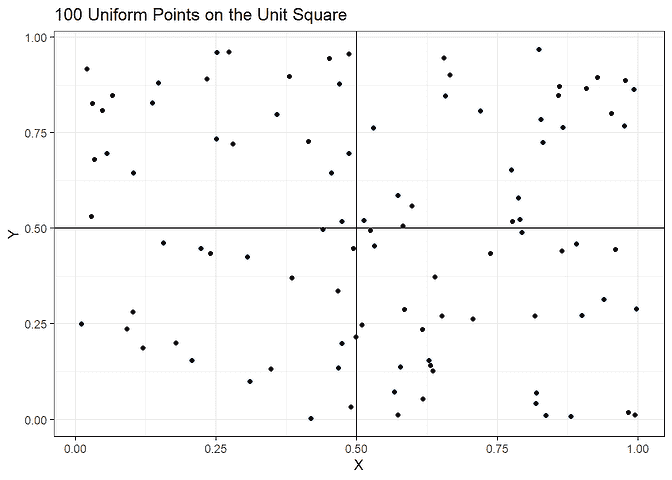
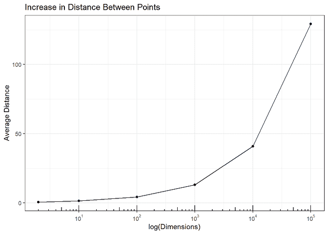
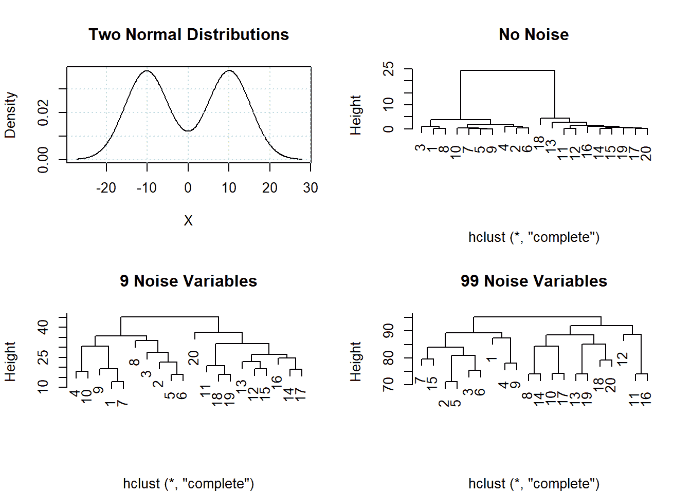
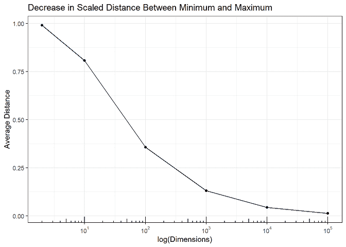
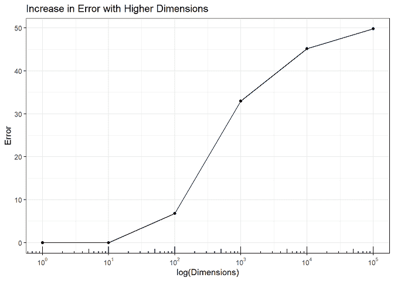
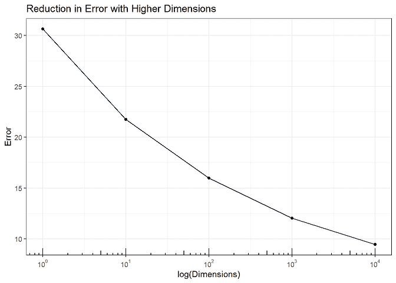

# 维度的诅咒

> 原文：<https://www.dominodatalab.com/blog/the-curse-of-dimensionality>

## 大数据的危险

大数据风靡一时。这可能是许多行(样本)和几个列(变量)，如信用卡交易数据，或者许多列(变量)和几行(样本)，如生命科学研究中的基因组测序。*维数灾难*，或*大 P，小 N， ((P > > N))* 问题适用于后一种情况，即在相对较少数量的样本上测量大量变量。

数据集中的每个变量都是一个维度，变量集定义了样本所在的空间。考虑由小学生的身高和体重定义的二维空间。每个学生被表示为图上的一个点，X 轴(维度)是身高，Y 轴(维度)是体重。一般来说，年纪大的学生更高更重，所以他们在图上的点更可能在空间的右上区域。存在用于分析这种二维数据的统计方法。例如，马诺娃可以测试男孩和女孩的身高和体重是否不同。这个统计检验是正确的，因为数据(大概)是双变量正态的。

当有许多变量时,*维数灾难*会改变数据的行为，标准的统计方法会给出错误的答案。这导致了通过昂贵且及时的实验来跟踪错误结果的成本增加，并减缓了产品开发的速度。在这篇博客中，我们展示了数据在高维空间中的*行为变化。在我们的下一篇博客中，我们将讨论如何在高维数据的应用数据分析中避免这些问题。*

## 数据有属性

上个世纪发展起来的统计学是基于概率模型(分布)的。这种方法提供了一种**自动和客观的策略，用于在关于数据**的已定义假设下进行决策。这种数据分析模型在基础生物医学研究和临床试验中被证明非常成功。

不幸的是，当变量的数量远大于样本的数量时(即 \(P > > N\) )，这种方法就失效了。在高维中，不满足统计检验所需的数据假设。下面我们将展示当 \(P > > N\) 时数据会发生什么，以及它如何导致不正确的结果。

高维数据有四个*属性*:

*   在高维空间中，点彼此远离。
*   在高维空间中，点远离中心。
*   所有点对之间的距离变得相同。
*   任何预测模型的准确率都接近 100%。

下面用代码讨论了每个属性，这样读者可以自己测试。

### 性质 1:高维空间中的点彼此远离。这意味着局部邻域中的数据密度过于稀疏，不符合分布。

考虑上面讨论的身高/体重数据。将每个学生表示为一个长度为二的向量， \(s_i = (x_{i，1}，x_{i，2})\) ，其中 \(x_{i1}\) 为身高， \(x_{i2}\) 为学生的体重 \(i\) 。两个学生 \(i，j\) 在二维上的欧氏距离 \(p = 2\) 为 \[d_{p = 2}(s_{i}，s_{j}) = \sqrt{(x_{i，1} - x_{j,1})^2 + (x_{i，2} - x_{j,2})^2}.\] 增加变量时距离非递减， \[d_{p = 3}(s_{i}，s_{j}) = \sqrt{(x_{i，1} - x_{j,1})^2 + (x_{i，2} - x_{j,2})^2 + (x_{i，3 }-x_{j,3})^2} \ geq d _ { p = 2 }(s _ { I }，s_{j})，\] 当增加的变量有不同值时严格递增(例如，这个结果延伸到高维度，\(d _ { p = 1 } \ leq d _ { p = 2 } \ leq d _ { p = 3 } \ leq \ ldots \)。

随着维数增加到无穷大，其中样本之间的值是不同的，点对之间的距离变到无穷大，即\(\ lim _ { P \ to \ infty } d _ { P = P }(s _ { I }，s_{j}) \rightarrow \infty\) 。但是在*极限*的这个结果对我们看到的现代大数据的维度有影响吗？模拟显示确实如此。

模拟数据集 100 个样本(行)和 2 个协变量 \(X，Y\) (列)由单位正方形上的均匀分布生成，如下图所示。

```py
### This code generates 100 uniformly distributed data

### points over the unit cube used throughout this report

###

set.seed(864729)
simData = cbind(X = runif(100), Y = runif(100))

p1 <- ggplot(as.data.frame(simData), aes(x = X, y = Y)) +

      geom_point() + geom_vline(xintercept = .5) +

      geom_hline(yintercept = 0.5) +

      ggtitle('100 Uniform Points on the Unit Square') +

      xlab("X") + ylab("Y") +

      theme_bw()

p1
```



这些点之间的平均成对距离是 \(0.53\) 。要查看添加维度对 pints 对之间的平均距离的影响，运行以下代码。该图显示，随着维数的增加，平均值稳步增加，表明这些点使得统计分析变得困难。

```py
### This code adds U(0,1) random variable additional dimensions to

### the simulated data and measures the average pairwise distance

###

simData.average.dist = c('Noise' = 0, 'Iter' = 1, 'Distance' = 0.53)
noise = c(8, 98, 998, 9998, 99998)

for(iter in 1:10) {

  for(addedNoise in noise) {

    simData.noise = cbind(simData,

                          matrix(runif(dim(simData)[1]*addedNoise),

                          nrow=dim(simData)[1]))

    simData.dist = dist(simData.noise)

    simData.average.dist = rbind(simData.average.dist,

                                 c('Noise' = addedNoise,

                                   'Iter' = iter,

                                   'Distance' = mean(dist(simData.noise))))

  }

}

simData.dist.agg = aggregate(simData.average.dist[,3],

                             by = list('Dimensions' = simData.average.dist[,1]),

                             mean)

simData.dist.agg$Dimensions = simData.dist.agg$Dimensions + 2

p2 <- ggplot(simData.dist.agg,

             aes(x = Dimensions, y = x)) +

      geom_point() + geom_line() +

      ggtitle('Increase in Distance Between Points') +

      xlab("log(Dimensions)") + ylab("Average Distance") +

      scale_x_log10(breaks =

                    trans_breaks("log10",

                                 function(x) 10^x),

                    labels = trans_format("log10",

                                          math_format(10^.x))) +

      theme_bw()

p2 + annotation_logticks(sides = 'b')
```



**对分析的影响:**分析师经常聚类 \( P > > N \) 数据。然而，稀疏性掩盖了[聚类](https://www.dominodatalab.com/blog/topology-and-density-based-clustering)，并且存在于低维中的数据聚类在高维中消失。从 \(N(-10，1)\中模拟 10 个随机样本，从 \(N(10，1)\) 分布中模拟 10 个随机样本。该图显示了这些数据和原始数据的三个聚类分析(两组样本 \(1-10\) 和样本 \(11-20\) 的清晰分离)，添加了 9 个额外的噪声变量(增加的*高度*发生了一些区分损失)，添加了 99 个额外的噪声变量(完全损失了聚类)。

当 \(P > > N\) 是一个虚假的树状图，其聚类是样本的随机分组时的聚类结果。

```py
### this code generates 2 groups of samples from N(-10,1) and N(10,1)

### and runs cluster analysis with and without added noise

###

par(mfrow=c(2,2))

simDataNorm = c(rnorm(10, -10, 1), rnorm(10, 10, 1))

plot(density(simDataNorm), xlab = 'X', main = 'Two Normal Distributions')

grid()

plot(hclust(dist(simDataNorm)), main = 'No Noise', xlab='')

plot(hclust(dist(cbind(simDataNorm,

                       matrix(runif(20*9, -10, 10), ncol=9)))),

     main = '9 Noise Variables', xlab='')

plot(hclust(dist(cbind(simDataNorm,

                       matrix(runif(20*99, -10, 10), ncol=99)))),

     main = '99 Noise Variables', xlab='')
```



## 性质 2:点在高维度中远离中心移动。这意味着数据正在远离中心，向空间的外部边缘移动。

高维空间中的点位于分布的外部边缘或外壳上。考虑独立的 \(X_i \sim U(0，10)\) 随机变量或维数 \(P\) 被添加到数据中， \(Pr( d(min(x_1，x_2，\ldots，0)\ le \ epsilon)\ right arrow 1 \)和 \(Pr( d(max(x_1，x_2，\ldots)，1)\ le \ epsilon)\ right arrow 1 \)。换句话说，随着更多维度的增加，至少有一个 get 在 0 的\(\ε\)内，至少有一个 get 在 1 的\(\ε\)内。

该表显示了随着维度的增加，1)低于 0.001，2)高于 0.999，以及 3)低于 0.001 **或**高于 0.999 的概率。正如所料，落在边界上的概率随着维度的增加而增加 \(P\) 。

第二个结果是观察到的数据中心离真正的中心越来越远。对于多元的 \(U(0，1)\) 分布，每个维度的*期望*中心位于 \(0.5\) 。在下面的模拟中，估计了*观察到的*中心(即平均值),并计算了其到*预期*中心的距离。随着维度的增加， \(O-E\) 增加，表明估计的平均值离真实平均值更远。

**对分析的影响:**需要精确的参数估计来拟合分布、执行假设检验、确定实验的功效和样本大小、计算置信区间以及许多其他统计计算。因为 \(O-E\) 随着维度的增加，精确拟合分布、执行假设检验等的能力也增加了。会恶化导致错误的结论。

```py
### This code calculates the probabilities of being with 0.001 units away from

### the data distribution boundaries, and calculates the difference between the

### observed and expected mean parameter for different dimensions

###

boundaryProb = function(data) {

                                x = t(apply(data, 1, function(a) {c(min(a) <= 0.001, max(a) >= 0.999)}))

                                y = cbind(x, apply(x, 1, max))

                                apply(y, 2, mean)

                              }

nnoise = c(seq(2, 32, by = 4), 100, 1000) - 2

noise = c(0, 8, 98, 998, 9998, 99998)

boundaryProb.results = NULL

for(iter in 1:10) {

  for(addedNoise in noise) {

    simData.noise = cbind(simData,

                          matrix(runif(dim(simData)[1]*addedNoise),

                                 nrow=dim(simData)[1]))

    simData.mean = apply(simData.noise, 2, mean)

    simData.dist.ctr = sqrt(sum((simData.mean -

                                 rep(0.5, length(simData.mean)))^2))

    boundaryProb.results = rbind(boundaryProb.results,

                                 c(2+addedNoise,

                                 boundaryProb(simData.noise),

                                 simData.dist.ctr))

  }

}

colnames(boundaryProb.results) = c('Dimensions', 'Pr(Min. <= 0.001)',

                                   'Pr(Max. >= 0.999)', 'Pr(Either)',

                                   'O - E Dist.')

boundaryProb.results = as.data.frame(boundaryProb.results)

round(aggregate(boundaryProb.results[,2:5],

                by=list('Dimensions' = boundaryProb.results$Dimensions), 'mean'),

      3)
```

```py
##   Dimensions Pr(Min. <= 0.001) Pr(Max. >= 0.999) Pr(Either) O - E Dist.

## 1      2e+00             0.000             0.000      0.000       0.040

## 2      1e+01             0.007             0.008      0.015       0.091

## 3      1e+02             0.091             0.094      0.177       0.290

## 4      1e+03             0.625             0.647      0.868       0.915

## 5      1e+04             0.999             1.000      1.000       2.893

## 6      1e+05             1.000             1.000      1.000       9.134
```

### 性质 3:所有点对之间的距离变得相同。这意味着最近的两点*与最远的两点*的距离相同！

这是 \(P > > N\) 数据最令人费解的结果。几何上，2 维中的 3 个点 \((i，j，k)\) 当它们是等边三角形的顶点时是等距的。添加一个 \(4^{th}\) 点， \((i，j，k，l)\) ，当这些点是三维正四面体的顶点时，等距出现。超过 4 个点，我的直觉就失效了，我只能凭经验思考这个问题，以证明高维空间中所有点的等距性

所有成对距离都在最小和最大(范围)成对距离之间。如果最大值和最小值之间的差变得小于所有成对距离变得更加相似，那么对于所有成对距离 \((i，j)\， \(d(s_i，s _ j)\约 d _ { max } \约 d_{min}\) ，以及 as\(d _ { max }-d _ { min } \右箭头 0\) ，那么对于 \((i，j)\) ，\换句话说，所有成对的距离变得相等。下图显示了在模拟中\(d _ { max }-d _ { min } \ right arrow 0 \)随着维数的增加，因此必然 \(d(s_i，s _ j)\ right arrow d _ { max } \ right arrow d _ { min } \)。

```py
### This codes added U(0,1) random variable dimensions to the sample data

### and calculates the scaled difference between the max and min.

###

noise = c(2, 10, 100, 1000, 10000, 100000) - 2

simData.average.dist = NULL

for(iter in 1:10) {

  for(addedNoise in noise) {

    simData.noise = cbind(simData,

                          matrix(runif(dim(simData)[1]*addedNoise),

                                 nrow=dim(simData)[1]))

    simData.dist = dist(simData.noise)

    simData.average.dist = rbind(simData.average.dist,

                                 c('Noise' = addedNoise, 'Iter' = iter, summary(simData.dist)))

  }

}

simData.average.agg = aggregate(simData.average.dist[,3:8],

by=list('Noise' = simData.average.dist[,1]), mean)

simData.pairwise.dists = data.frame('Dimensions' = simData.average.agg[,1]+2,

                                    'Dist' = (simData.average.agg[,7] -

                                              simData.average.agg[,2]) /

                                    simData.average.agg[,7])

p3 <- ggplot(simData.pairwise.dists,

      aes(x = Dimensions, y = Dist)) +

      geom_point() + geom_line() +

      ggtitle('Decrease in Scaled Distance Between Minimum and Maximum') +

      xlab("log(Dimensions)") + ylab("Average Distance") +

      scale_x_log10(breaks=trans_breaks("log10",

                                        function(x) 10^x),

                    labels = trans_format("log10",

                                          math_format(10^.x))) +

      theme_bw()

p3 + annotation_logticks(sides = 'b')
```



**对分析的影响:**最近邻算法根据最近点的大部分类别对点进行分类。在该模拟中，模拟了 100 个 \(N(-5，1)\) 和 100 个 \(N(5，1)\) 数据，并且添加了 \(U(-5，5)\) 噪声维度。1 个维度(原始 2 组数据)和 10 个维度的误差为 0，但随着维度的增加而增加。在 100，000 维的情况下——不是不合理的维数 \(P\) 对于\(P>>【N \)数据——最近邻在 50%的情况下是错误的。

```py
### This codes measures misclassification (error) rate in k = 5 nearest

### neighbor analysis with 100 samples from N(-5, 1) and 100 from N(5, 1)

###

simDataNorm = as.matrix(c(rnorm(100, -5, 1), rnorm(100, 5, 1)))

simDataNorm.train = simDataNorm

simDataNorm.nn = kNN(simDataNorm.train, k=5)

a = apply(simDataNorm.nn$id[1:100,], 1,

          function(a) ifelse(sum(a<101) > 2, 1, 0))

b = apply(simDataNorm.nn$id[101:200,], 1,

          function(a) ifelse(sum(a>100) > 2, 1, 0))

simDataNorm.results = c('Dimension' = 0, 'Iter' = 1,
'Error' = 100 - (100*(sum(c(a,b)) / 200)))
for(noise in c(9, 99, 999, 9999, 99999)) {

  for(i in 1:10) {

    simDataNorm.train = as.matrix(cbind(simDataNorm,

                                        matrix(runif(noise*200, -5, 5), ncol=noise)))

    simDataNorm.nn = kNN(simDataNorm.train, k=5)

    a = apply(simDataNorm.nn$id[1:100,], 1,

              function(a) ifelse(sum(a<101) > 2, 1, 0))

    b = apply(simDataNorm.nn$id[101:200,], 1,

              function(a) ifelse(sum(a>100) > 2, 1, 0))

    simDataNorm.results = rbind(simDataNorm.results,

                                c('Dimension' = noise,

                                  'Iter' = i,

                                  'Error' = 100 - (100*(sum(c(a,b)) / 200))))

  }

}

simDataNorm.agg = aggregate(simDataNorm.results[,3],

                            by=list('Dimensions' = simDataNorm.results[,1]),

                            mean)

simDataNorm.agg$Dimensions = simDataNorm.agg$Dimensions + 1

p4 <- ggplot(simDataNorm.agg,

      aes(x = Dimensions, y = x)) +

      geom_point() + geom_line() +

      ggtitle('Increase in Error with Higher Dimensions') +

      xlab("log(Dimensions)") + ylab("Error") +

      scale_x_log10(breaks = trans_breaks("log10",

                                          function(x) 10^x),

                    labels = trans_format("log10",

                                          math_format(10^.x))) +

      theme_bw()

p4 + annotation_logticks(sides = 'b') 
```



## 特性 4:任何预测模型的准确率都接近 100%。这意味着总是可以找到以高精度预测群体特征的模型。

在 \(P > \(P\) 维中的*超平面*是通过将空间分成两边的空间的 \(P-1\) 边界。这些用于根据点落在超平面的哪一侧来将点分类成组。

**对分析的影响:中的**\(P>>【N \)数据超平面可以用来对样本的任何特征进行分类，即使所有的变量都是噪声。该模拟拟合分类树以预测具有不同维度的多元 \(X \sim U(0，1)\) 超立方体的偶数和奇数行 \((Y)\) 。应该没有模型可以用随机数据准确预测偶数行和奇数行。

但是，该图显示，准确预测偶数行和奇数行的能力随着维度的增加而增加。因此，任何适合高维数据的预测模型都可能是纯随机数据的结果。虽然这些模型可以用测试数据来验证，但有两件事应该记住。首先，分离数据方法(其中一些数据被保留用于测试)仍然有许多共同的超平面，因此测试数据准确性可能仍然非常高。 \(P > > N\) 数据中的样本有限，这就很难做到。其次，后续实验的验证费用昂贵，而且会减缓产品开发。确认研究可能会显示模型是错误的，但最好不要一开始就进行这些研究。

```py
### this code runs recursive partitioning on purely random U(0,1)

### data and calculates how many correctly classified as coming

### from an even or odd row in the data

###

y = rep(c(1,2), 50)

simData.rpart.predict = NULL
for(noise in c(1, 10, 100, 1000, 10000)) {

  for(i in 1:50) {

    simData.y = as.data.frame(cbind(y, matrix(runif(noise*100), ncol=noise)))

    simData.rpart = rpart(as.factor(y) ~ ., data = simData.y)

    simData.rpart.class = table(y, predict(simData.rpart, type='class'))

    simData.rpart.predict = rbind(simData.rpart.predict,

                                  c('Dimension' = noise, 'Iter' = i,

                                    'Error' = (100 - sum(diag(simData.rpart.class)))))

  }

}
simData.rpart.agg = aggregate(simData.rpart.predict[,3],

                              by=list('Dimensions' = simData.rpart.predict[,1]),

                              mean)

p5 <- ggplot(simData.rpart.agg,

      aes(x = Dimensions, y = x)) +

      geom_point() + geom_line() +

      ggtitle('Reduction in Error with Higher Dimensions') +

      xlab("log(Dimensions)") + ylab("Error") +

      scale_x_log10(breaks=trans_breaks("log10",

                                        function(x) 10^x),

                    labels = trans_format("log10",

                                          math_format(10^.x))) +

      theme_bw()

p5 + annotation_logticks(sides = 'b')
```



## 摘要

在这篇博客中，描述了 \(P > > N\) 数据的 4 个属性，并使用模拟来显示它们对数据分析的影响:随着点彼此远离，聚类被破坏，树状图给出不正确的结果；随着点远离中心，估计平均向量不太准确；随着所有点对之间的距离收敛到相同的值，最近邻分析变得不太准确；随着超平面的出现，预测噪音以预测随机结果的能力变得非常准确。

最令人不安的是，分析会产生结果，但由于*维数灾难*，不可能知道它们是有效的还是完全虚假的。在我们的下一篇博客中，[分析大 P 小 N 数据-微生物组的例子](https://www.dominodatalab.com/blog/analyzing-large-p-small-n-data-examples-from-microbiome)我们将讨论我们在分析 \(P > > N\) 数据时使用的方法。

#### 关于生物排名

BioRankings 利用我们创新的统计分析师和研究人员的才能，使最具挑战性的数据分析问题变得清晰。虽然有时这是通过应用现成的工具来完成的，但这通常需要融合紧密的**协作**、**统计研究**和**知识转移**来交付定制的解决方案和定制的**统计软件**。

我们的团队专注于**协作**并与客户合作，以深入了解需要解决的数据问题以及它们将如何影响该领域。我们的客户包括财富 20 强公司、小型生物技术公司、大学和政府实验室。

**统计研究**确定当前使用的方法，当这些方法不适用时，开发基于高等数学和概率的新方法。通过与顶级医学院和学术实验室的合作，BioRankings 研究人员撰写了超过 180 篇出版物，并获得了 SBIR 国立卫生研究院(小型企业创新研究)超过 300 万美元的资助。

我们强调教育，通过有计划的、有目的的**知识传授**，让我们的客户能够进行未来的分析。研究人员建立了理解最适合其数据类型的分析方法的基础，分析人员在新领域的工作得到了支持。

最后，我们的分析师在客户端管道和 Domino 环境中部署开发的定制 [**统计计算软件**](/solutions/life-sciences-sce) 。

验证、再现性和清晰度是生物排名研究人员带给我们的交互和软件的价值。自 2014 年以来，BioRankings 一直在为医药、农业和商业领域的客户提供定制解决方案。

[](https://cta-redirect.hubspot.com/cta/redirect/6816846/2fb84ca0-cce4-4d2c-b8b6-a2ccc3343d26)