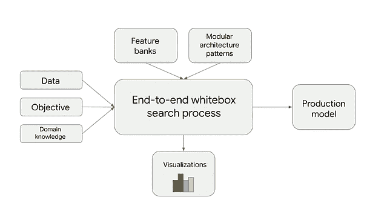
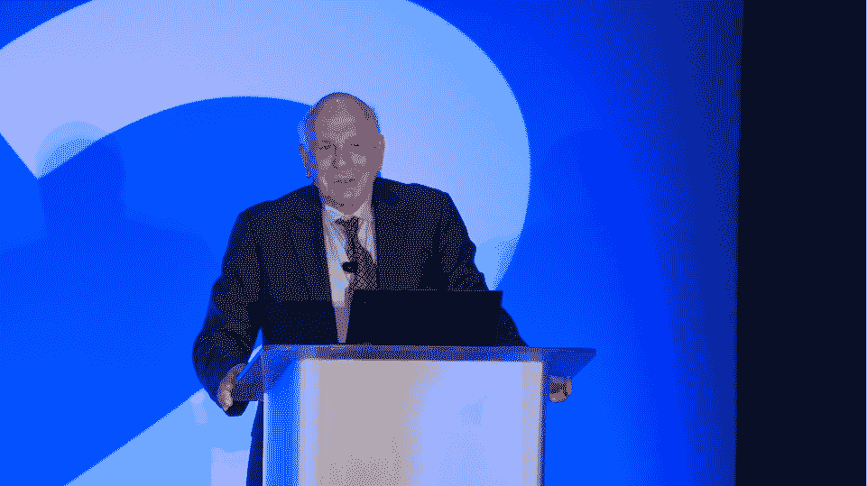
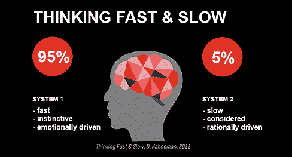
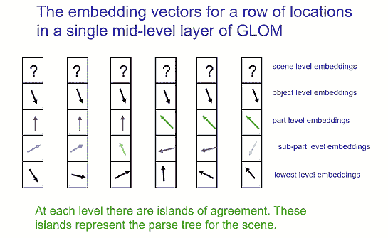
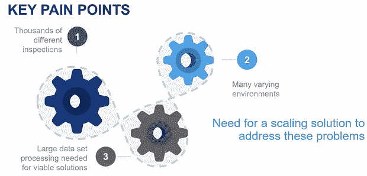
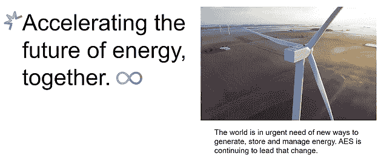

# 数据科学的未来——挖掘 GTC 2021 的趋势

> 原文：<https://www.dominodatalab.com/blog/the-future-of-data-science-mining-gtc-2021-for-trends>

深度学习爱好者越来越多地将[英伟达的 GTC](https://www.nvidia.com/en-us/gtc/) 放在他们必须出席的会议名单的首位。我喜欢从今年的谈话中挖掘预示我们行业发展方向的趋势。其中三个特别引人注目，启发了我对 [*转移学习*](https://www.dominodatalab.com/blog/guide-to-transfer-learning-for-deep-learning) 的新观点，我认为这对分析从业者和领导者理解很重要。让我们从主题开始。

### 期待深度学习 API 变得更加智能

> 摘要:API 在将模型组件从一个应用程序转移到另一个应用程序以及将管道转移到生产环境方面会变得更好。

### 一场深度网络架构竞赛正在进行，这可能会导致深度网络在 10 年后看起来有很大不同

> 下面回顾的两个新颖的深度网络架构的例子都大量借用了变压器和类似 BERT 的模型的概念，这些模型非常适合转移学习，但是，它们这样做的方式可以推广到其他应用，如[计算机视觉](https://www.dominodatalab.com/blog/what-is-computer-vision)。我看到了深度学习的未来，其中迁移学习在很大程度上是王，因为大型模型架构将非常擅长捕捉大量关于语言和视觉等领域的信息。

### 人工智能应用的数量真的开始起飞，保持同步是一个好主意

> 如果我们能够破解让更广泛的劳动力建立人工智能解决方案的难题，我们就可以开始实现数据科学的承诺。数据科学家和数据专家之间的知识转移(双向)至关重要，并可能很快促成公民数据科学的新观点。

在我们开始之前，我想做一个观察，它贯穿了每一个主题。迁移学习不仅仅是分享预先训练好的模型。将训练有素的模型管道转移到生产中至关重要，而在分析和数据专家之间转移知识是实现规模化的先决条件。领导者尤其可以从理解迁移学习的广义定义的每个方面中受益。

## 来自 GTC21 的深度学习趋势

### 深度学习 API 的演变

从业者鼓起勇气。由于您最喜欢的深度学习 API，迁移学习、功能共享和模型部署可能很快会变得更容易。

**演讲摘要** -弗朗索瓦·乔莱- [Keras 和 TensorFlow:未来五年](https://www.nvidia.com/en-us/on-demand/session/gtcspring21-s31925/)

谷歌的工程师 Franç ois Chollet 是 Keras 的主要作者和维护者，Keras 是一种流行的深度学习语言，它是 TensorFlow 的高级 API，他认为我们正处于深度学习时代的早期。“深度学习到目前为止只实现了其潜力的一小部分。深度学习的完全实现将是一个数十年的转变。”弗朗索瓦认为深度学习应用变得像今天的 web 开发一样普遍。他接着谈到了 Keras 的现状以及他对其未来的看法。

他认为 Keras 的使命是成为加快迭代速度的 UX——尽可能快地从想法到实验。Keras 针对创意表达进行了优化。Keras 实施的关键设计原则是，“复杂性的渐进揭示”这使得它能够在各种不同的情况下实现良好的生产力，如“一年级研究生和一个 Kaggle 大师”。

未来 5 年，Keras 会是什么样子？为了回答这个问题，Keras 团队正在追踪数据科学的趋势。弗朗索瓦认为四个趋势很重要，并且已经在推动 Keras 路线图。首先是可重复使用部件生态系统的出现。例如，预训练模型和特征重用。其次，他看到了自动化程度更高、工作流程层次更高的趋势。这是在手工调整模型时形成的，但应该是自动化的。第三个趋势是面向高性能计算的更快的专用芯片，是的，这一趋势正在云中发生。最后一个趋势是深度学习应用表面积的增加。弗朗索瓦觉得深度学习只解决了它最终将解决的大约 10% - 15%的问题。

## 弗朗索瓦的趋势和 Keras 路线图

可重用的特定领域功能 → KerasCV、KerasNLP(为计算机视觉和 NLP 管道提供可重用构建模块的导入库)和 Keras 应用程序(更大的预训练模型库)正在积极开发中。

**增加自动化** →超参数调整、架构搜索、特征库&终身学习和 [AutoML](https://www.brighttalk.com/webcast/17563/371418) 是自动化人类 5 年后不会做的事情的关键。下图捕捉到了这一愿景。该算法本身将是白盒，并将与用户进行对话，使搜索过程中的问题更容易解决。这是一个雄心勃勃的目标，不会在一个版本中实现，而是一层一层的实现。这些基础层的一个重要部分是 Keras 调谐器和 AutoKeras。

Image from the GTC [presentation](https://www.nvidia.com/en-us/on-demand/session/gtcspring21-s31925/)

**规模&云** →未来，在数百个 GPU 上进行训练，就像在管理工作区的 [Jupyter 笔记本上进行训练一样简单](https://www.dominodatalab.com/solutions/jupyter/)。Keras 有一个名为 TensorFlow Cloud 的新 API，但这个 API 是专门针对 GCP 的。

**走进现实世界** →我们将看到更多的移动、浏览器和嵌入式设备采用资源高效型模式，并在设备上进行隐私和安全培训。这在一定程度上是由 Keras 预处理层促成的。应该在模型中进行预处理。我们需要避免在 JavaScript 和训练服务队列中重新创建管道。您的 Keras 模型现在将是“原始数据输入和预测输出”,这使得它们完全可以移植。

## 神经网络架构竞赛

所以你终于掌握了 CNN，rnn，LSTMs 和 Transformers。恭喜，你正式落伍了。玩笑归玩笑，考虑到创新的速度，我们都知道这些令人惊叹的、最近策划的架构只是冰山一角。我回顾了两次深入浅出的谈话。

* * *

**演讲摘要** - Yoshua Bengio，蒙特利尔大学正教授，Mila -魁北克人工智能研究所科学主任- [人类启发的因果推理和非分布概括的归纳偏差](https://www.nvidia.com/en-us/on-demand/session/gtcspring21-s32760/)

* * *

这位图灵奖获得者让我们看到了解决我们所有人都面临的问题的一种有前途的新方法——如何让我们的模型在野外也能很好地推广。他将这项工作描述为，“我设想在未来几年内将深度学习扩展到一个领域的研究方向，在这个领域中，它需要处理鲁棒性和非分布泛化的问题，结合我们对人类状况的观察所启发的因果关系的思想。”

当我们部署一个深度网络时，数据分布不可避免地会与我们在实验室中设计的不同，这意味着我们的模型不能很好地概括。本吉奥博士认为，理解这些变化意味着什么非常重要，他正在寻求一种新的理论和算法来应对这些变化。人类可以在新的环境中重复使用知识进行归纳，因此本吉奥博士转向人类思维寻求灵感，即丹尼尔·卡内曼对人类决策的双系统解释。Kahneman 的想法启发了我们在今天的分析系统中看到的许多东西，因此这一最新应用令人兴奋。

> 查看 Kahneman 博士在数据科学大会第 2 版上的主题演讲，了解他对人类思维系统如何影响现代分析的第一手见解。

本吉奥博士在一个深网中模仿卡尼曼的系统 2，它有一个包括先验的新架构。这些先验代表了对世界的假设，允许人类快速概括。他表明，在因果关系的意义上，它们可以被认为是反事实，并且用他的团队几年前引入的注意机制来表示。这些是变形金刚的基础，变形金刚是一些世界顶级语言模型的核心。这些新架构是通过在变化的条件下进行优化，以监督的方式学习的。

Image from [https://manceppo.com/](https://manceppo.com/)

**演讲摘要** - Geoffrey Hinton，多伦多大学名誉教授，谷歌副总裁兼工程研究员，Vector Institute 首席科学顾问，与 Bengio - [博士共同获得图灵奖，如何在神经网络中表示部分-整体层次](https://www.nvidia.com/en-us/on-demand/session/gtcspring21-s33159/)。

* * *

辛顿博士的新视觉系统被称为 GLOM。它从 NLP 转换器、通过协议的视觉表示的无监督学习和生成图像模型中窃取。他认为，用多种不同的方式描述同一个形状(多个参照系)在人类思维中很常见，但在传统的 CNN 中却没有。如果你熟悉辛顿博士在胶囊方面的工作(我最近在博客上发表了关于胶囊的文章)，有趣的是，GLOM 正在寻求完成同样的任务，即从概念的角度找到一种分类/理解图像的方法——超越 CNN 的暴力性质。CapsNet 采取的方法是提前创建嵌入类，并查看图像激活了哪一个。GLOM 动态地构建它们，以便图像中的每个位置都知道它正在处理哪个部分/对象。(辛顿说 CapsNet“笨拙”,暗示他已经向前看了。而这，就在我开始掌握这种方法的时候。在数据科学中很难跟上。)就像变形金刚使用句子中的单词通过它们与另一个单词的接近程度来给出另一个单词含义的线索一样，对象感知图像中的部分-整体组件可以给网络提供对图像整体中正在发生的事情的关键洞察力。它也可能有助于模型的可解释性。

Image from the GTC [presentation](https://www.nvidia.com/en-us/on-demand/session/gtcspring21-s33159/) 

GLOM 的训练感觉很像训练 BERT，希望它能产生更好地转移计算机视觉学习的模型。

## 新的人工智能应用的爆发

从欺诈和异常检测到机器人技术，GTC21 上的例子比比皆是。在所有行业中，人工智能在生产中的例子比比皆是。我特别喜欢两次申请讲座。坦白地说，我密切关注了它们，因为它们是由 Dominio 客户提供的，但这些收获是有价值的，并且与供应商无关。

* * *

**演讲摘要** - Andrew Modjeski -洛克希德·马丁质量技术公司人工智能应用负责人- [保持 F-35 飞行-人工智能管道以支持质量 4.0](https://www.nvidia.com/en-us/on-demand/session/gtcspring21-ss33119/)

* * *

最近，我们听到了很多关于公民数据科学家的消息。我们被告知，它们是在整个企业内联合数据科学的关键。这一点对我来说从来都不合适，因为我无法想象企业会把他们的业务押在由缺乏训练的个人使用拖放工具创建的模型上。在他的演讲中，Andrew Modjeski 分享了他和洛克希德·马丁公司对公民数据科学家的看法。他们解释的方式对我来说很有意义，弥补了我头脑中的空白。

Image from the GTC [presentation](https://www.nvidia.com/en-us/on-demand/session/gtcspring21-ss33119/)

安德鲁解释说:“在洛克希德·马丁公司，公民数据科学家是我们的质量工程师。这是我们的制造工程师或维护工程师。这些人能够接触到数据知识……所以我们的目标是让这些工程师能够开发人工智能解决方案。这样做的主要限制是许多工程师没有计算机科学背景……然而，他们来到洛克希德公司时确实对 Matlab 有相当深入的了解...这就是为什么我们的重点是将 Matlab 放入 Domino 数据实验室…我们需要 Domino 数据实验室高性能计算将这项工作卸载到云上。此外，...我们需要一个简单的共享数据的能力，系统化的存储，项目启动，或者种子项目，一个公民数据科学家可以在此基础上建立一个新的解决方案。因此，举例来说，如果我们创建一个人工智能来检查 F-35 上的紧固件，然后我们转到 C-130 甚至旋翼机，西科斯基直升机，他们想对紧固件进行人工智能检查，他们可以使用我们的 Domino 解决方案作为基线，因为最终他们都是紧固件，一个类似的架构可能适用于两个项目，无需太多更改。这种 Domino 实例化允许我们在洛克希德·马丁公司范围内扩展这些模型，并让公民数据科学家与其他公民数据科学家共享。”

因此，在洛克希德，公民数据科学看起来像是很好的老式转移学习，结合了协作工具，抽象出云中开发运维的复杂性。与专业数据科学家一起构建原型，然后让数据专家参与并实现协作，以便他们获得 Jr .数据科学家的技能。这是我可以信任的公民数据科学方法。

* * *

**演讲摘要**-AES 分析总监 Sean Otto-[AES 如何在两年内从零增加到 50 个部署模型](https://www.dominodatalab.com/resources/how-aes-went-from-zero-to-50-deployed-models/)

* * *

在他的演讲中，Sean Otto 分享了一个故事，这个故事抓住了我在整个行业中看到的情况——人工智能和人工智能应用的爆炸式增长。Sean 解释说:“AES 是全球第五大可再生能源生产商，仅次于中国。我们生产的 70%以上是可再生能源。”AES 的应用非常多样化，这表明 AI & ML 正在模型驱动的公司中获得跨组织的牵引力。

Image from the GTC [presentation](https://www.dominodatalab.com/resources/how-aes-went-from-zero-to-50-deployed-models/)

为了强调这一点，我们来看看 AES 的各种应用。

### 发电中的预测性维护

AES 在一个每天更新的仪表板 GUI 中显示了其风电场的健康可靠性指数。可靠性工程师用它来知道从哪里开始更有效。当你有 75 个涡轮机要处理时，一个指针真的很有用。除了风力发电厂，AES 还有 200 多家太阳能发电厂。有些在雪域。一种称为“雪检测模型”的模型用于确定能量输出变化是否可能是由于面板上的雪造成的。

### 水力发电优化

AES 使用 AI & ML 来回答围绕电力生产的关键业务问题。预计流入会带来什么，与类似工厂相比如何？我们如何有效地实时调度和提前一天计划？

### 电网基础设施威胁

当你有 100 万个智能电表时，你必须每天更换一些，就像你在大型数据中心更换硬件一样。断电预测成为必备工具。恢复服务的时间也是用 AI & ML 评估的一个重要指标。

### 物流

AES 利用优化和预测模型。他们部署了一个随机模型来确定全年燃料应该何时到达，以及这将如何影响预测的供应和需求。

## 摘要

分析领导者应该意识到模型生产的步伐正在加快。他们可以观看这里提到的关于这是如何发生的棒球内幕的两个演讲。他们还可以访问 [Domino 客户故事](https://www.dominodatalab.com/customers/)页面，寻找更多灵感和竞争焦虑的来源。领导者的一个重要收获是，实现员工和组织之间的知识转移是扩展数据科学计划的关键。对于 Jr 数据科学家来说，公民数据科学应该看起来更像是提升数据专家的技能，而不是给他们黑盒、拖放式的人工智能工具。

Keras 和其他深度学习 API 正朝着模型和管道组件的自动化和抽象方向发展，这将使迁移学习和模型部署在未来变得更加容易。这也将促进[构建人工智能解决方案的人类之间的协作和知识共享](https://www.dominodatalab.com/product/knowledge-center/)。

每个人都应该，而且可能已经痛苦地意识到，在数据科学中，除了变化，没有什么是不变的。在过去 5 年中创建/修改的新的深网架构已经打开了一个解决方案的新世界。所有迹象表明，建筑创作的趋势将继续。这里回顾的两个有趣的演讲指向了一个未来的世界，在这个世界里，大而广的模型捕捉到了关于我们试图解决的问题的大量信息。这意味着将有大量的迁移学习和深度网络最后几层的训练，这些预先训练的巨型模型是引擎盖下的引擎。

所有这三个主题都有一条贯穿其中的迁移学习的线索，这让我怀疑获取和分享知识将是个人、团队和企业在这十年中成功分析的关键。